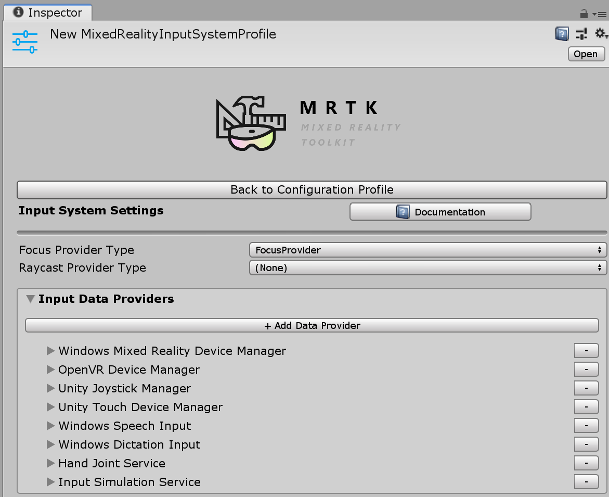

# Input providers

Input providers are registered in the **Registered Service Providers Profile**, found in the Mixed Reality Toolkit component:

These are the input providers available out of the box, together with their corresponding controllers:

| Input Provider | Controllers |
| --- | --- |
| [`Input Simulation Service`](xref:Microsoft.MixedReality.Toolkit.Input.InputSimulationService) | Simulated Hand |
| [`Mouse Device Manager`](xref:Microsoft.MixedReality.Toolkit.Input.UnityInput.MouseDeviceManager) | Mouse  |
| [`OpenVR Device Manager`](xref:Microsoft.MixedReality.Toolkit.OpenVR.Input.OpenVRDeviceManager) | Generic OpenVR, Vive Wand, Vive Knuckles, Oculus Touch, Oculus Remote, Windows Mixed Reality OpenVR  |
| [`Unity Joystick Manager`](xref:Microsoft.MixedReality.Toolkit.Input.UnityInput.UnityJoystickManager) | Generic Joystick  |
| [`Unity Touch Device Manager`](xref:Microsoft.MixedReality.Toolkit.Input.UnityInput.UnityTouchDeviceManager) | Unity Touch Controller  |
| [`Windows Dictation Input Provider`](xref:Microsoft.MixedReality.Toolkit.Windows.Input.WindowsDictationInputProvider) | *None*  |
| [`Windows Mixed Reality Device Manager`](xref:Microsoft.MixedReality.Toolkit.WindowsMixedReality.Input.WindowsMixedRealityDeviceManager) | WMR Articulated Hand, WMR Controller, WMR GGV (Gaze, Gesture, and Voice) Hand |
| [`Windows Speech Input Provider`](xref:Microsoft.MixedReality.Toolkit.Windows.Input.WindowsSpeechInputProvider) | *None* |

Dictation and Speech providers don't create any controllers, they raise their own specialized input events directly.

Custom input providers can be created by implementing the [`IMixedRealityInputDeviceManager`](xref:Microsoft.MixedReality.Toolkit.Input.IMixedRealityInputDeviceManager) interface.

For more information, please see [creating an input system data provider](CreateDataProvider.md).
