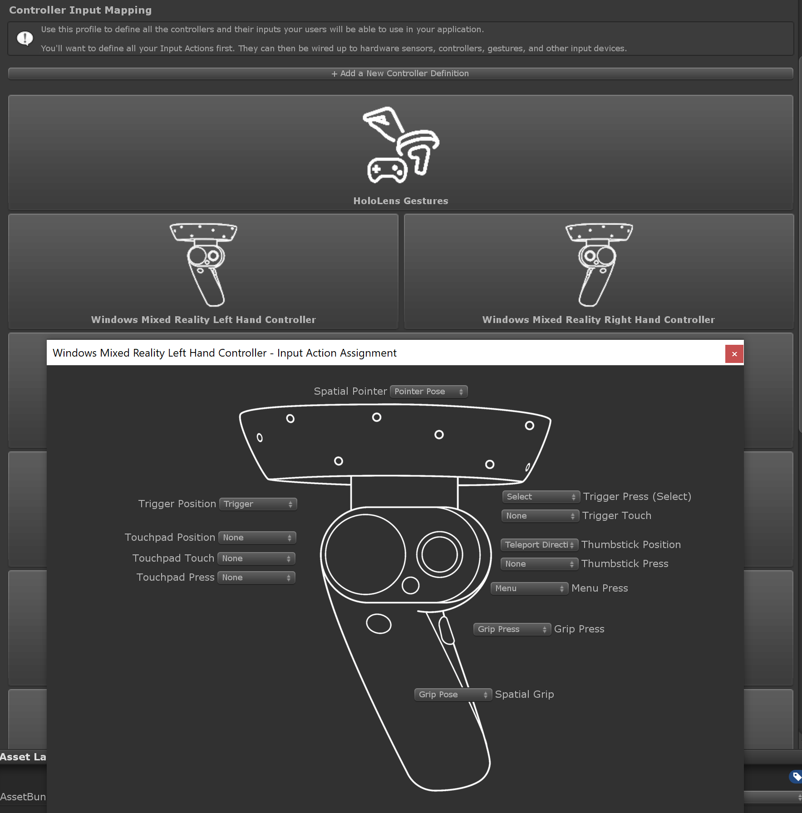
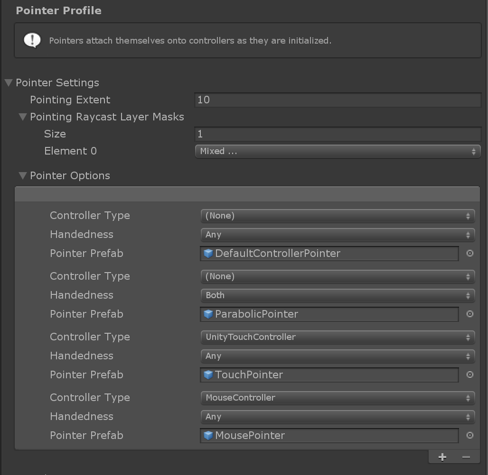

**TODO**

    Do a terminology pass to make sure we're using the standard terms.

# Input System

MRTK's input system allows you to:
- Consume inputs from a variety of input devices in your scripts.
- Define abstract actions like "press" and associate them to different inputs.
- Setup pointers attached to input devices that apply focus to game objects and drive application logic via events.

We will now go over the main concepts and then finish with the list of input events that can be used to consume input.

## Controllers and Input Actions

A controller in MRTK is an input device. Some of the controller types supported are:

- Hololens Gestures
- WMR Controller
- Xbox Controller
- Oculus Remote/Touch
- Vive Knuckles/Wand
- Generic Open VR Controller
- Mouse and touch screen

Each controller type has a number of *physical inputs*. Each of these is defined by an *Axis Type*, telling us the data type of the input value (Digital, Single Axis, Dual Axis, Six Dof, ...), and an *Input Type* (Button Press, Trigger, Thumb Stick, Spatial Pointer, ...) describing the origin of the input. Physical inputs are mapped to *input actions* via *interaction mappings* in *Controller Input Mapping Profile*.



*Input actions* are user abstractions over physical device inputs used to map application actions like "select" to different controller inputs (e.g. mouse click, controller button, finger tap, ...). They can be configured in the *Input Actions Profile* specifying a name for the action and the *Axis Type* of the physical inputs it can be mapped to. The input action mapped to a physical input, if any, is stored in *input events*.


Controller inputs can be read either by subscribing to input events (see section below) or obtaining a controller reference via MixedRealityToolkit.InputSystem.DetectedControllers and accessing the controller interactions, which hold the current value of each input.

## Pointers

A pointer is basically a ray attached to a controller that gives *focus* to the game object it is pointing to. For a game object to be able to receive focus it must have a collider, so it can be hit by physics raycasts, and belong to one of the layers defined in the *Pointer Raycast Layer Masks* in the *Pointer Profile*.

Pointers are instanced automatically at runtime when a new controller is detected. The pointers that are created for each controller type are defined in the *Pointer Options* in the *Pointer Profile*. You can have more than one pointer attached to a controller; for example, with the default pointer profile, WMR controllers get both a line and a parabolic pointer for normal selection and teleportation respectively. Pointers communicate with each other to decide which one is active.

MRTK provides a set of pointer prefabs in *Assets/MixedRealityToolkit.SDK/Features/UX/Prefabs/Pointers*. You can use your own prefabs as long as they contain one of the pointer scripts in *Assets/MixedRealityToolkit.SDK/Features/UX/Scripts/Pointers* or any other script implementing *IMixedRealityPointer*.



## Gestures

Gestures are input events based on human hands. There are two types of devices that raise gesture input events in MRTK:
- Windows Mixed Reality devices such as Hololens. This describes pinching motions ("Air Tap") and tap-and-hold gestures.

  For more information on Hololens gestures see the [Windows Mixed Reality Gestures documentation](https://docs.microsoft.com/en-us/windows/mixed-reality/gestures).

  ```WindowsMixedRealityDeviceManager``` wraps the [Unity XR.WSA.Input.GestureRecognizer](https://docs.unity3d.com/ScriptReference/XR.WSA.Input.GestureRecognizer.html) to consume Unity's gesture events from Hololens devices. 

- Touch screen devices.

  ```UnityTouchController``` wraps the [Unity Touch class](https://docs.unity3d.com/ScriptReference/Touch.html) that supports physical touch screens.

Both of these input sources use the _Gesture Settings_ profile to translate Unity's Touch and Gesture events respectively into MRTK's [Input Actions](#Controllers and Input Actions). This profile can be found under the _Input System Settings_ profile.


## Speech

**TODO**

## Input Events

To receive input events in your script you must implement one of the *event handler interfaces*. By default you will only receive events when the script's game object or any of its children are focused by a pointer. If you want to receive events always, regardless of focus, register your game object as a *global listener* via *MixedRealityToolkit.InputSystem.Register*.

Next, we'll go over the different event types and their corresponding interfaces.

### Input Source Events

These events refer to the general state of a controller as opossed to its specific inputs. The following information is available:
- *Source detected or lost*: raised a new controller is detected or lost. Received via the *IMixedRealitySourceStateHandler* interface.
- *Source pose changed*: reports the general pose of the controller. Received via the *IMixedRealitySourcePoseHandler* interface.

### Generic Input Events

These events notify changes in specific controller inputs. Check the *controller mappings* for a list of inputs per controller type.
- *Input down and up*: raised for button and trigger like inputs. Received via the *IMixedRealityInputHandler* interface.
- *Input changed*: raised on changes to inputs that have a value other than just down or up, like analog triggers, thumb sticks or 6 DOF poses. Received via the *IMixedRealityInputHandler\<T\>* interface, where *T* stands for the type of input value (float, Vector2, MixedRealityPose, ...).

### Pointer and Focus Events

- *Pointer down, clicked and up*: received via *IMixedRealityPointerHandler*.
- *Before focus change and on focus change*: raised immediately before and when the game object focused by a pointer changes. Received via *IMixedRealityFocusChangedHandler*.
- *On focus enter and exit*: raised when focus enters or leaves a game object. Received via *IMixedRealityFocusHandler*.

### Gesture Events

```IMixedRealityGestureHandler``` defines the events that are raised by the input system:
- *OnGestureStarted*: A new gesture has been started.
- *OnGestureCompleted*: An active gesture successfully completed.
- *OnGestureCanceled*: An active gesture has been cancelled.
- *OnGestureUpdated*: An active gesture's state has been updated.

The *OnGestureCompleted* and *OnGestureUpdated* events can receive typed data by implementing the generic ```IMixedRealityGestureHandler<TYPE>``` handler class. ```TYPE``` can be one of the following:
- ```Vector2```
  2D position gesture. Currently supported sources:
  - [```deltaPosition```](https://docs.unity3d.com/ScriptReference/Touch-deltaPosition.html) on a touch screen
- ```Vector3```
  3D position gesture. Currently supported sources:
  - [```cumulativeDelta```](https://docs.unity3d.com/ScriptReference/XR.WSA.Input.ManipulationUpdatedEventArgs-cumulativeDelta.html) of a Hololens manipulation event
  - [```normalizedOffset```](https://docs.unity3d.com/ScriptReference/XR.WSA.Input.NavigationUpdatedEventArgs-normalizedOffset.html) of a Hololens navigation event
- ```Quaternion```
  3D rotation gesture. No currently supported sources.
- ```MixedRealityPose```
  Combined 3D position/rotation gesture. No currently supported sources.

### Speech and Dictation Events

**TODO**
