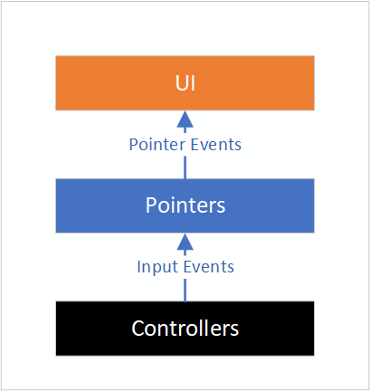

# Input System

## Introduction

The Input System in MRTK allows you to:
- Consume inputs from a variety of input sources, like 6 DOF controllers, articulated hands or speech, via input events.
- Define abstract actions, like *Select* or *Menu*, and associate them to different inputs.
- Setup pointers attached to controllers to drive UI components via focus and pointer events.

In this section we will introduce the main MRTK concepts the you neeed to understand to make use of this functionality.

Inputs are produced by [**Input Providers**](#input-providers). Each provider corresponds to a particular source of input: Open VR, Windows Mixed Reality (WMR), Unity Joystick, Windows Speech, etc. Providers are added to your project via the **Registered Service Providers Profile** in the *Mixed Reality Toolkit* component and will produce [**Input Events**](#input-events) automatically when the corresponding input sources are available, e.g. when a WMR controller is detected or a gamepad connected.

[**Input Actions**](#input-actions) are abstractions over raw inputs meant to help isolating application logic from the specific input sources producing an input. For example, it can be useful to define a *Select* action and map it to the left mouse button, a button in a gamepad and a trigger in a 6 DOF controller. You can then have your application logic listen for input events mapped to that action instead of having to be aware of all the different inputs that can produce it. Input Actions are defined in the **Input Actions Profile**, found within the *Input System Profile* in the *Mixed Reality Toolkit* component.

[**Controllers**](#controllers) are created by *input providers* as input devices are detected and destroyed when they're lost or disconnected. The WMR input provider, for example, will create *WMR controllers* for 6 DOF devices and *WMR articulated hand controllers* for articulated hands. Controller inputs can be mapped to input actions via the **Controller Mapping Profile**, inside the *Input System Profile*. Inputs events raised by the controller will include the associated input action, if any.

Controllers can have [**Pointers**](#pointers) attached to them that query the scene to determine the game object with focus and raise [**Pointer Events**](#pointer-events) on it. As an example, our *line pointer* performs a raycast against the scene using the controller pose to compute the origin and direction of the ray. The pointers created for each controller are set up in the **Pointer Profile**, under the *Input System Profile*.



Additional forms of input are available through [**Gestures**](#gestures), [**Speech**](#speech) and [**Dictation**](#dictation). See the correspoding sections below for more information.

**Advanced Topics** : Controller Visualization, Gaze Provider, Focus Provider, Action Rules, Input System

## Input Providers

We currently support the following input providers with their corresponding controllers:

Input Provider | Controllers
--- | ---
Input Simulation Service | Simulated Hand
Mouse Device Manager | Mouse
OpenVR Device Manager | Generic OpenVR, Vive Wand, Vive Knuckles, Oculus Touch, Oculus Remote, Windows Mixed Reality OpenVR
Unity Joystick Manager | Generic Joystick
Unity Touch Device Manager | Unity Touch Controller
Windows Dictation Input Provider | *
Windows Mixed Reality Device Manager | WMR Articulated Hand, WMR Controller, WMR GGV Hand
Windows Speech Input Provider | *

\* Dictation and Speech providers don't create any controllers, they raise their own specialized input events directly.


<sup>Registered Service Providers Profile. Found in the Mixed Reality Toolkit component, is the place to go to add or remove input providers.</sup>

## Input Events

At the script level you consume input events by implementing one of the event handler interfaces:

Handler | Events | Description
--- | --- | ---
[`IMixedRealitySourceStateHandler`](xref:Microsoft.MixedReality.Toolkit.Input.IMixedRealitySourceStateHandler) | Source Detected / Lost | Raised when an input source is detected/lost, like when an articulated hand is detected or lost track of.
[`IMixedRealitySourcePoseHandler`](xref:Microsoft.MixedReality.Toolkit.Input.IMixedRealitySourcePoseHandler) | Source Pose Changed | Raised on source pose changes. The source pose represents the general pose of the input source. Specific poses, like the grip or pointer pose in a six DOF controller, can be obtained via `IMixedRealityInputHandler<MixedRealityPose>`.
[`IMixedRealityInputHandler`](xref:Microsoft.MixedReality.Toolkit.Input.IMixedRealityInputHandler) | Input Up / Down | Raised on changes to on/off inputs like buttons.
[`IMixedRealityInputHandler<T>`](xref:Microsoft.MixedReality.Toolkit.Input.IMixedRealityInputHandler`1) | Input Changed | Raised on changes to inputs of the given type. **T** can take the following values: `float` (e.g. analog trigger), `Vector2` (e.g. gamepad thumbstick), `Vector3` (e.g. position-only tracked device), `Quaternion` (e.g. orientation-only tracked device) and [`MixedRealityPose`](xref:Microsoft.MixedReality.Toolkit.Utilities.MixedRealityPose) (e.g. fully tracked device).
[`IMixedRealitySpeechHandler`](xref:Microsoft.MixedReality.Toolkit.Input.IMixedRealitySpeechHandler) | Speech Keyword Recognized | Raised on recognition of one of the keywords configured in the *Speech Commands Profile*.
[`IMixedRealityDictationHandler`](xref:Microsoft.MixedReality.Toolkit.Input.IMixedRealityDictationHandler) | Dictation Hypothesis / Result / Complete / Error | Raised by dictation systems to report the results of a dictation session.
[`IMixedRealityGestureHandler`](xref:Microsoft.MixedReality.Toolkit.Input.IMixedRealityGestureHandler) | Gesture Started / Updated / Completed / Canceled | Raised on gesture detection.
[`IMixedRealityGestureHandler<T>`](xref:Microsoft.MixedReality.Toolkit.Input.IMixedRealityGestureHandler`1) | Gesture Updated / Completed | Raised on detection of gestures containing additional data of the given type. See the [**Gestures**](#gestures) section for details on possible values for **T**.

By default a script will receive events only while in focus by a pointer. To receive events while out of focus, register the script's game object as a global listener via [`MixedRealityToolkit.InputSystem.Register`](xref:Microsoft.MixedReality.Toolkit.IMixedRealityEventSystem) or derive the script from [`InputSystemGlobalListener`](xref:Microsoft.MixedReality.Toolkit.Input.InputSystemGlobalListener).

## Input Actions

Input actions can be configured in the *Input Actions Profile* specifying a name for the action and the *Axis Type* of the physical inputs it can be mapped to. The input action mapped to a physical input, if any, is stored in *input events*.


## Controllers

Each controller type has a number of *physical inputs*. Each of these is defined by an *Axis Type*, telling us the data type of the input value (Digital, Single Axis, Dual Axis, Six Dof, ...), and an *Input Type* (Button Press, Trigger, Thumb Stick, Spatial Pointer, ...) describing the origin of the input. Physical inputs are mapped to *input actions* via *interaction mappings* in *Controller Input Mapping Profile*.


## Pointers

Pointers are instanced automatically at runtime when a new controller is detected. You can have more than one pointer attached to a controller; for example, with the default pointer profile, WMR controllers get both a line and a parabolic pointer for normal selection and teleportation respectively. Pointers communicate with each other to decide which one is active.

MRTK provides a set of pointer prefabs in *Assets/MixedRealityToolkit.SDK/Features/UX/Prefabs/Pointers*. You can use your own prefabs as long as they contain one of the pointer scripts in *Assets/MixedRealityToolkit.SDK/Features/UX/Scripts/Pointers* or any other script implementing [`IMixedRealityPointer`](xref:Microsoft.MixedReality.Toolkit.Input.IMixedRealityPointer).


### Pointer Events

To receive pointer events, implement one of the following interfaces in your script:

Handler | Events | Description
--- | --- | ---
[`IMixedRealityFocusChangedHandler`](xref:Microsoft.MixedReality.Toolkit.Input.IMixedRealityFocusChangedHandler) | Before Focus Changed / Focus Changed | Raised on both the game object losing focus and the one gaining it every time a pointer changes focus.
[`IMixedRealityFocusHandler`](xref:Microsoft.MixedReality.Toolkit.Input.IMixedRealityFocusHandler) | Focus Enter / Exit | Raised on the game object gaining focus when the first pointer enters it and on the one losing focus when the last pointer leaves it.
[`IMixedRealityPointerHandler`](xref:Microsoft.MixedReality.Toolkit.Input.IMixedRealityPointerHandler) | Pointer Down / Up / Clicked | Raised to report pointer input.

## Gestures

Gestures are input events based on human hands. There are two types of devices that raise gesture input events in MRTK:
- Windows Mixed Reality devices such as Hololens. This describes pinching motions ("Air Tap") and tap-and-hold gestures.

  For more information on Hololens gestures see the [Windows Mixed Reality Gestures documentation](https://docs.microsoft.com/en-us/windows/mixed-reality/gestures).

  [`WindowsMixedRealityDeviceManager`](xref:Microsoft.MixedReality.Toolkit.WindowsMixedReality.Input.WindowsMixedRealityDeviceManager) wraps the [Unity XR.WSA.Input.GestureRecognizer](https://docs.unity3d.com/ScriptReference/XR.WSA.Input.GestureRecognizer.html) to consume Unity's gesture events from Hololens devices.

- Touch screen devices.

  [`UnityTouchController`](xref:Microsoft.MixedReality.Toolkit.Input.UnityInput) wraps the [Unity Touch class](https://docs.unity3d.com/ScriptReference/Touch.html) that supports physical touch screens.

Both of these input sources use the _Gesture Settings_ profile to translate Unity's Touch and Gesture events respectively into MRTK's [Input Actions](#input-actions). This profile can be found under the _Input System Settings_ profile.


Gesture events are received by implementing one of the gesture handler interfaces: [`IMixedRealityGestureHandler`](xref:Microsoft.MixedReality.Toolkit.Input.IMixedRealityGestureHandler)  and [`IMixedRealityGestureHandler<TYPE>`](xref:Microsoft.MixedReality.Toolkit.Input.IMixedRealityGestureHandler`1) (see table of [event handlers](#input-events)).
When implementing the generic version, the *OnGestureCompleted* and *OnGestureUpdated* events can receive typed data of the following types:
- ```Vector2```
  2D position gesture. Currently supported sources:
  - [```deltaPosition```](https://docs.unity3d.com/ScriptReference/Touch-deltaPosition.html) on a touch screen
- ```Vector3```
  3D position gesture. Currently supported sources:
  - [```cumulativeDelta```](https://docs.unity3d.com/ScriptReference/XR.WSA.Input.ManipulationUpdatedEventArgs-cumulativeDelta.html) of a Hololens manipulation event
  - [```normalizedOffset```](https://docs.unity3d.com/ScriptReference/XR.WSA.Input.NavigationUpdatedEventArgs-normalizedOffset.html) of a Hololens navigation event
- ```Quaternion```
  3D rotation gesture. No currently supported sources.
- ```MixedRealityPose```
  Combined 3D position/rotation gesture. No currently supported sources.

## Speech

Speech input providers, like *Windows Speech Input*, don't create any controllers but instead allow you to define keywords that will raise speech input events when recognized. The **Speech Commands Profile** in the *Input System Profile* is where you configure the keywords to recognize. For each command you can also:

- Select an **input action** to map it to. This way you can for example use the keyword *Select* to have the same effect as a left mouse click, by mapping both to the same action.
- Specify a **key code** that will produce the same speech event when pressed.
- Add a **localization key** that will be used in UWP apps to obtain the localized keyword from the app resources.


You can use the [**`Speech Input Handler`**](xref:Microsoft.MixedReality.Toolkit.Input.SpeechInputHandler) script to handle speech commands using [**UnityEvents**](https://docs.unity3d.com/Manual/UnityEvents.html). The *Speech* demo, in `MixedRealityToolkit.Examples\Demos\Input\Scenes\Speech`, shows how to do this. You can also listen to speech command events directly in your own script by implementing [`IMixedRealitySpeechHandler`](xref:Microsoft.MixedReality.Toolkit.Input.IMixedRealitySpeechHandler) (see table of [event handlers](#input-events)).

## Dictation

The dication service allows users to record audio clips and, via Windows Speech services, obtain a transcription of the audio.