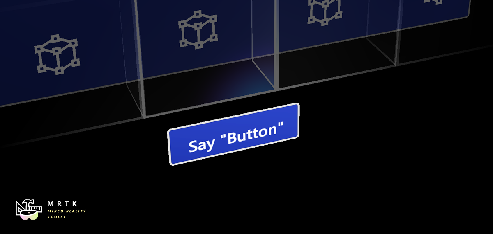
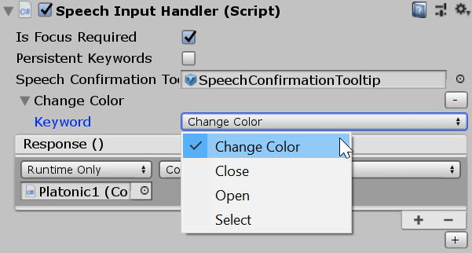

# Speech

Speech input providers, like *Windows Speech Input*, don't create any controllers but instead allow you to define keywords that will raise speech input events when recognized. The **Speech Commands Profile** in the *Input System Profile* is where you configure the keywords to recognize. For each command you can also:

- Select an **input action** to map it to. This way you can for example use the keyword *Select* to have the same effect as a left mouse click, by mapping both to the same action.
- Specify a **key code** that will produce the same speech event when pressed.
- Add a **localization key** that will be used in UWP apps to obtain the localized keyword from the app resources.

## Handling speech input

The [**`Speech Input Handler`**](xref:Microsoft.MixedReality.Toolkit.Input.SpeechInputHandler) script can be added to a GameObject to handle speech commands using [**UnityEvents**](https://docs.unity3d.com/Manual/UnityEvents.html). It automatically shows the list of the defined keywords from the **Speech Commands Profile**.

Assign optional **SpeechConfirmationTooltip.prefab** to display animated confirmation tooltip label on recognition.

Alternatively, developers can implement the [`IMixedRealitySpeechHandler`](xref:Microsoft.MixedReality.Toolkit.Input.IMixedRealitySpeechHandler) interface in a custom script component to [handle speech input events](InputEvents.md#input-event-interface-example).

## Example scene

The **SpeechInputExample** scene, in `MRTK/Examples/Demos/Input/Scenes/Speech`, shows how to use speech. You can also listen to speech command events directly in your own script by implementing [`IMixedRealitySpeechHandler`](xref:Microsoft.MixedReality.Toolkit.Input.IMixedRealitySpeechHandler) (see table of [event handlers](InputEvents.md)).

