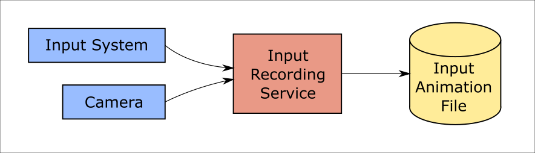
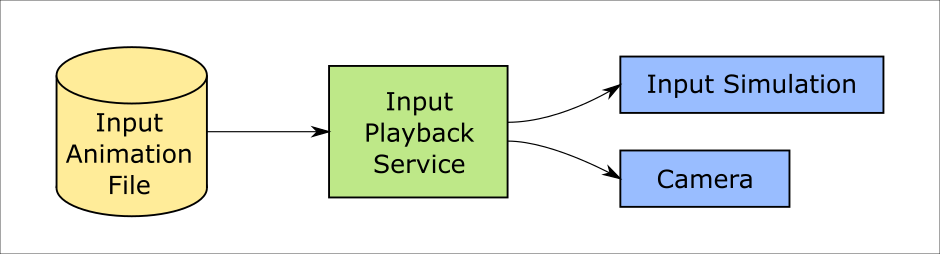

# Input animation recording

MRTK features an recording system by which head movement and hand tracking data can be stored in animation files. The recorded data can then be played back using the [input simulation system](InputSimulationService.md).

Recording input is a useful tool in a variety of situations:

* Creating automated tests for interaction, manipulations, solvers, etc.
  Creating the movement of controllers and hands for these tests can be time consuming. Recording input directly can speed up the process and provide real-world data.
* Teaching the use of UX elements through animations.
  Showing users how to interact with buttons and other objects can smooth the learning curve.
* Debugging unexpected behavior that may be encountered during regular use.
  The recording system supports a "rolling buffer" concept that allows recording recent input in the background.
  See [Input Recording Service](#input-recording-service).

## Recording and playback services

Two input system services are provided to record and play back input respectively.

### Input recording service

[`InputRecordingService`](xref:Microsoft.MixedReality.Toolkit.Input.InputRecordingService) takes data from the main camera transform and active hand controllers and stores it in an internal buffer. When requested this data is then serialized into binary files for storage and later replay.

To start recording input call the [`StartRecording`](xref:Microsoft.MixedReality.Toolkit.Input.IMixedRealityInputRecordingService.StartRecording) function. [`StopRecording`](xref:Microsoft.MixedReality.Toolkit.Input.IMixedRealityInputRecordingService.StopRecording) will pause recording (but not discard the data recorded so far, use [`DiscardRecordedInput`](xref:Microsoft.MixedReality.Toolkit.Input.IMixedRealityInputRecordingService.DiscardRecordedInput) to do this if needed).

By default the size of the recording buffer is limited to 30 seconds. This allows the recording service to keep recording in the background without accumulating too much data, and then save the last 30 seconds when required. The time interval can be changed using the [`RecordingBufferTimeLimit`](xref:Microsoft.MixedReality.Toolkit.Input.IMixedRealityInputRecordingService.RecordingBufferTimeLimit) property, or recording can be unlimited using the [`UseBufferTimeLimit`](xref:Microsoft.MixedReality.Toolkit.Input.IMixedRealityInputRecordingService.UseBufferTimeLimit) option.

The data in the recording buffer can be saved in a binary file using the [SaveInputAnimation](xref:Microsoft.MixedReality.Toolkit.Input.IMixedRealityInputRecordingService.SaveInputAnimation*) function.

For details on the binary file format see [Input Animation File Format Specification](InputAnimationFileFormat.md).

### Input playback service

[`InputPlaybackService`](xref:Microsoft.MixedReality.Toolkit.Input.InputPlaybackService) reads a binary file with input animation data and then applies this data through the [InputSimulationService](xref:Microsoft.MixedReality.Toolkit.Input.InputSimulationService) to recreate the recorded movements.

To start playing back input animation it should be loaded from a file using the [LoadInputAnimation](xref:Microsoft.MixedReality.Toolkit.Input.IMixedRealityInputPlaybackService.LoadInputAnimation*) function.

Call [Play](xref:Microsoft.MixedReality.Toolkit.Input.IMixedRealityInputPlaybackService.Play), [Pause](xref:Microsoft.MixedReality.Toolkit.Input.IMixedRealityInputPlaybackService.Play), or [Stop](xref:Microsoft.MixedReality.Toolkit.Input.IMixedRealityInputPlaybackService.Stop) to control the animation playback.

The current animation time can also be controlled directly with the [LocalTime](xref:Microsoft.MixedReality.Toolkit.Input.IMixedRealityInputPlaybackService.LocalTime) property.

> [!WARNING]
> Looping or resetting input animation or setting [`LocalTime`](xref:Microsoft.MixedReality.Toolkit.Input.IMixedRealityInputPlaybackService.LocalTime) directly by scrubbing the timeline may yield unexpected results when manipulating the scene! Only the input movements are recorded, any additional changes such as moving objects or flipping switches will not be reset. Make sure to reload the scene if irreversible changes have been made.

### Editor tools for recording and playing input animation

A number of tools exist in the Unity editor for recording and examining input animation. These tools can be accessed in the [input simulation tools window](InputSimulationService.md#input-simulation-tools-window), which can be opened from the _Mixed Reality Toolkit > Utilities > Input Simulation_ menu.

> [!NOTE]
> Input recording and playback only works during play mode.

The input recording window has two modes:

* _Recording_ for recording input during play mode and saving it to animation files.

  When toggling on the recording button the [`InputRecordingService`](xref:Microsoft.MixedReality.Toolkit.Input.InputRecordingService) is enabled to record input.
  When toggling off the recording button a file save selection is shown and the recorded input animation is saved to the selected destination.

  The buffer time limit can also be changed in this mode.

* _Playback_ for loading animation files and then recreating input through the input simulation system.

  An animation must be loaded in this mode first. After recording input in recording mode the resulting animation is automatically loaded. Alternatively click the "Load" button to select an existing animation file.

  The time control buttons from left to right are:

  - _Reset_ the playback time to the start of the animation.
  - _Play_ animation continuously over time.
  - _Step_ forward one time step.

  The slider can also be used to scrub through the animation timeline.

> [!WARNING]
> Looping or resetting input animation or scrubbing the timeline may yield unexpected results when manipulating the scene! Only the input movements are recorded, any additional changes such as moving objects or flipping switches will not be reset. Make sure to reload the scene if irreversible changes have been made.
