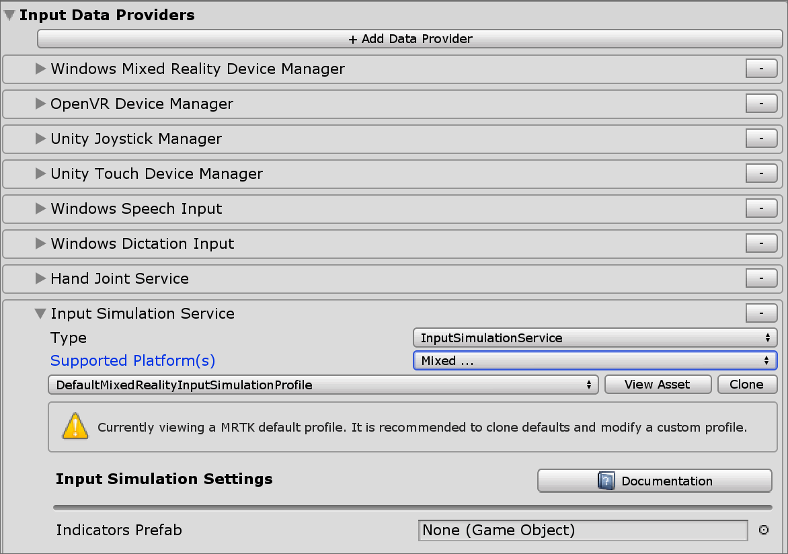

# Input simulation service

The Input Simulation Service emulates the behaviour of devices and platforms that may not be available in the Unity editor. Examples include:

* HoloLens or VR device head tracking
* HoloLens hand gestures
* HoloLens 2 articulated hand tracking
* HoloLens 2 eye tracking

Users can use a conventional keyboard and mouse combination to control simulated devices at runtime. This approach allows testing of interactions in the Unity editor without first deploying to a device.

> [!WARNING]
> This does not work when using Unity's XR Holographic Emulation > Emulation Mode = "Simulate in Editor". Unity's in-editor simulation will take control away from MRTK's input simulation. In order to use the MRTK input simulation service, you will need to set XR Holographic Emulation to Emulation Mode = *"None"*

## Enabling the input simulation service

Input simulation is enabled by default in the profiles that ship with MRTK. 

Input simulation is an optional [Mixed Reality service](../MixedRealityServices.md) though and can be removed as a data provider in the [Input System profile](../Input/InputProviders.md).

Under the Input System Data provider configuration, the Input Simulation service can be configured with the following.

* **Type** must be *Microsoft.MixedReality.Toolkit.Input > InputSimulationService*.
* **Supported Platform(s)** by default includes all *Editor* platforms, since the service uses keyboard and mouse input.

> [!NOTE]
> The Input Simulation service can be used on other platform endpoints such as standalone by changing the **Supported Platform(s)** property to include the desired targets.
> 

## Input simulation tools window

Enable the input simulation tools window from the  **Mixed Reality Toolkit** > **Utilities** > **Input Simulation** menu. This window provides access to the state of input simulation during play mode.

## Viewport buttons

A prefab for in-editor buttons to control basic hand placement can be specified in the input simulation profile under **Indicators Prefab**. This is an optional utility, the same features can be accessed in the [input simulation tools window](#input-simulation-tools-window).

> [!NOTE]
> The viewport indicators are disabled by default, as they currently can sometimes interfere with Unity UI interactions. See issue [#6106](https://github.com/microsoft/MixedRealityToolkit-Unity/issues/6106). To enable, add the InputSimulationIndicators prefab to **Indicators Prefab**.

Hand icons show the state of the simulated hands:

*  The hand is not tracking. Click to enable the hand.
*  The hand is tracked, but not controlled by the user. Click to hide the hand.
*  The hand is tracked and controlled by the user. Click to hide the hand.
*  Click to reset the hand to default position.

## In editor input simulation cheat sheet

Press Left Ctrl + H in the HandInteractionExamples scene to bring up a cheat sheet with Input simulation controls.

## Camera control

Head movement can be emulated by the Input Simulation Service.

### Rotating the camera

1. Hover over the viewport editor window.
    *You may need to click the window to give it input focus if button presses don't work.*
1. Press and hold the **Mouse Look Button** (default: Right mouse button).
1. Move the mouse in the viewport window to rotate the camera.
1. Use the scroll wheel to roll the camera around the view direction.

Camera rotation speed can be configured by changing the **Mouse Look Speed** setting in the input simulation profile.

Alternatively, use the **Look Horizontal**/**Look Vertical** axes to rotate the camera (default: game controller right thumbstick).

### Moving the camera

Use the **Move Horizontal**/**Move Vertical** axes to move the camera (default: WASD keys or game controller left thumbstick).

Camera position and rotation angles can be set explicitly in the tools window, as well. The camera can be reset to its default using the **Reset** button.

<iframe width="560" height="315" src="https://www.youtube.com/embed/Z7L4I1ET7GU" class="center" frameborder="0" allow="accelerometer; encrypted-media; gyroscope; picture-in-picture" allowfullscreen />

## Hand simulation

The input simulation supports emulated hand devices. These virtual hands can interact with any object that supports regular hand devices, such as buttons or grabbable objects.

### Hand simulation mode

In the [input simulation tools window](#input-simulation-tools-window) the **Hand Simulation Mode** setting switches between two distinct input models. The default mode can also be set in the input simulation profile.

* *Articulated Hands*: Simulates a fully articulated hand device with joint position data.

   Emulates HoloLens 2 interaction model.

   Interactions that are based on the precise positioning of the hand or use touching can be simulated in this mode.

* *Gestures*: Simulates a simplified hand model with air tap and basic gestures.

   Emulates [HoloLens interaction model](https://docs.microsoft.com/windows/mixed-reality/gestures).

   Focus is controlled using the Gaze pointer. The *Air Tap* gesture is used to interact with buttons.

### Controlling hand movement

Press and hold the **Left/Right Hand Control Key** (default: *Left Shift* for left hand and *Space* for right hand) to gain control of either hand. While the manipulation key is pressed, the hand will appear in the viewport. Once the manipulation key is released, the hands will disappear after a short **Hand Hide Timeout**.

Hands can be toggled on and frozen relative to the camera in the [input simulation tools window](#input-simulation-tools-window) or by pressing the **Toggle Left/Right Hand Key** (default: *T* for left and *Y* for right). Press the toggle key again to hide the hands again. To manipulate the hands, the **Left/Right Hand Control Key** needs to be held. Double tapping the **Left/Right Hand Control Key** can also toggle the hands on/off.

Mouse movement will move the hand in the view plane. Hands can be moved further or closer to the camera using the **mouse wheel**.

To rotate hands using the mouse, hold both the **Left/Right Hand Control Key** (*Left Shift* or *Space*) *and* the **Hand Rotate Button** (default: *ctrl* button) and then move the mouse to rotate the hand. Hand rotation speed can be configured by changing the **Mouse Hand Rotation Speed** setting in the input simulation profile.

All hand placement can also changed in the [input simulation tools window](#input-simulation-tools-window), including resetting hands to default.

### Additional profile settings

* **Hand Depth Multiplier** controls the sensitivity of the mouse scroll wheel depth movement. A larger number will speed up hand zoom.
* **Default Hand Distance** is the initial distance of hands from the camera. Clicking the **Reset** button hands will also place hands at this distance.
* **Hand Jitter Amount** adds random motion to hands. This feature can be used to simulate inaccurate hand tracking on the device, and ensure that interactions work well with noisy input.

<iframe width="560" height="315" src="https://www.youtube.com/embed/uRYfwuqsjBQ" class="center" frameborder="0" allow="accelerometer; encrypted-media; gyroscope; picture-in-picture" allowfullscreen />

### Hand gestures

Hand gestures such as pinching, grabbing, poking, etc. can also be simulated.

1. Enable hand control using the **Left/Right Hand Control Key** (*Left Shift* or *Space*)

2. While manipulating, press and hold a mouse button to perform a hand gesture.

Each of the mouse buttons can be mapped to transform the hand shape into a different gesture using the *Left/Middle/Right Mouse Hand Gesture* settings. The *Default Hand Gesture* is the shape of the hand when no button is pressed.

> [!NOTE]
> The *Pinch* gesture is the only gesture that performs the "Select" action at this point.

### One-hand manipulation

1. Press and hold **Left/Right Hand Control Key** (*Left Shift* or *Space*)
2. Point at object
3. Hold mouse button to pinch
4. Use your mouse to move the object
5. Release the mouse button to stop interaction

<iframe width="560" height="315" src="https://www.youtube.com/embed/rM0xaHam6wM" class="center" frameborder="0" allow="accelerometer; encrypted-media; gyroscope; picture-in-picture" allowfullscreen />

### Two-hand manipulation

For manipulating objects with two hands at the same time, the persistent hand mode is recommended.

1. Toggle on both hands by pressing the toggle keys (*T/Y*).
1. Manipulate one hand at a time:
    1. Hold **Space** to control the right hand
    1. Move the hand to where you want to grab the object
    1. Press the **left mouse button** to activate the *Pinch* gesture. 
    1. Release **Space** to stop controlling the right hand. The hand will be frozen in place and be locked into the *Pinch* gesture since it is no longer being manipulated.
1. Repeat the process with the other hand, grabbing the same object in a second spot.
1. Now that both hands are grabbing the same object, you can move either of them to perform two-handed manipulation.

<iframe width="560" height="315" src="https://www.youtube.com/embed/Qol5OFNfN14" class="center" frameborder="0" allow="accelerometer; encrypted-media; gyroscope; picture-in-picture" allowfullscreen />

### GGV (Gaze, Gesture, and Voice) interaction

By default, GGV interaction is enabled in-editor while there are no articulated hands present in the scene.

1. Rotate the camera to point the gaze cursor at the interactable object (right mouse button)
1. Click and hold **left mouse button** to interact
1. Rotate the camera again to manipulate the object

You can turn this off by toggling the *Is Hand Free Input Enabled* option inside the Input Simulation Profile.

In addition, you can use simulated hands for GGV interaction

1. Enable GGV simulation by switching **Hand Simulation Mode** to *Gestures* in the [Input Simulation Profile](#enabling-the-input-simulation-service)
1. Rotate the camera to point the gaze cursor at the interactable object (right mouse button)
1. Hold **Space** to control the right hand
1. Click and hold **left mouse button** to interact
1. Use your mouse to move the object
1. Release the mouse button to stop interaction

<iframe width="560" height="315" src="https://www.youtube.com/embed/6841rRMdqWw" class="center" frameborder="0" allow="accelerometer; encrypted-media; gyroscope; picture-in-picture" allowfullscreen />

### Eye tracking

[Eye tracking simulation](../EyeTracking/EyeTracking_BasicSetup.md#simulating-eye-tracking-in-the-unity-editor) can be enabled by checking the **Simulate Eye Position** option in the
[Input Simulation Profile](#enabling-the-input-simulation-service). This should not be used with GGV
style interactions (so ensure that **Hand Simulation Mode** is set to *Articulated*).

## See also

- [Input System profile](../Input/InputProviders.md).
