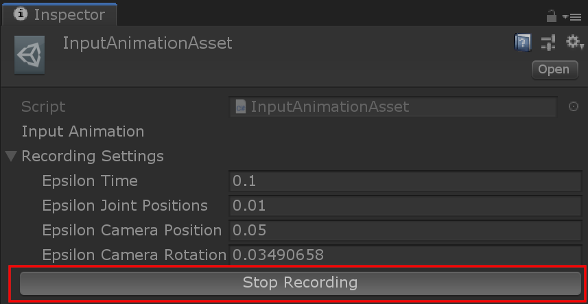
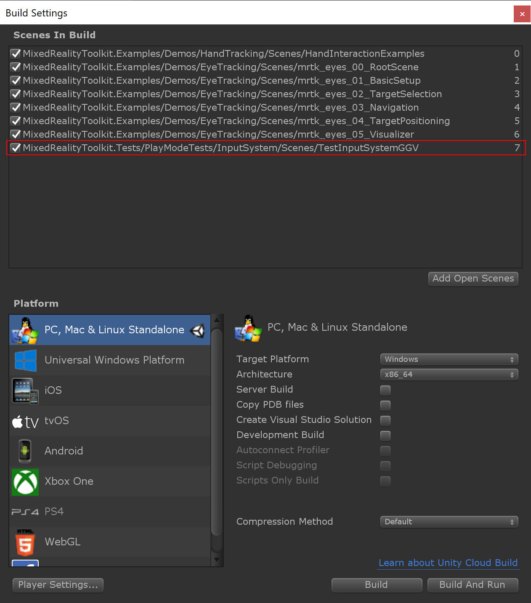
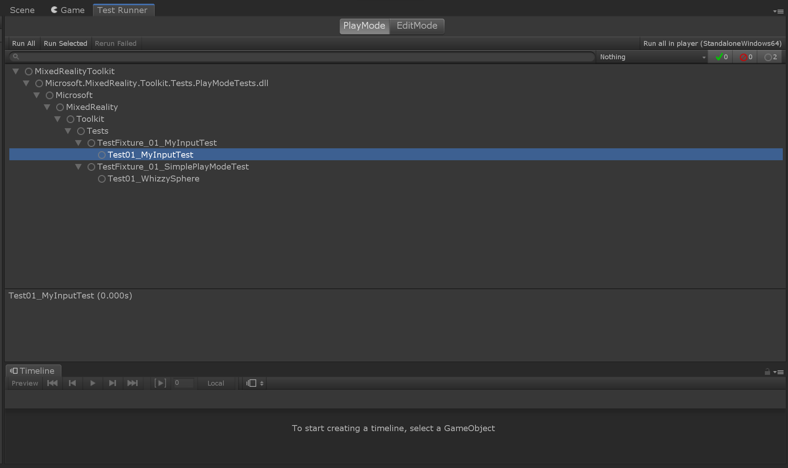

# Recording hand animations

1. Prepare your scene

    Include all objects that should be tested. An easy way to do this is to start from MRTK demo scenes, and disable or remove all objects that are not required.
    Preferably save this scene and associated assets in the `Assets\MixedRealityToolkit.Tests\PlayModeTests` folder.

<a target="_blank" href="../../External/Documentation/Images/MRTK_InputTestRecording_TestScenePrep.png">
  
</a>

2. Open a _Timeline_ window (_Window > Sequencing > Timeline_).

    This is where the input animation can be recorded and played back.

<a target="_blank" href="../../External/Documentation/Images/MRTK_InputTestRecording_TimelineWindow.png">
  
</a>

3. Select a game object (e.g. the _MixedRealityToolkit_ object) and click "Create" in the Timeline window. This automatically sets up the timeline:
    * A timeline asset is created.
    * A _Playable Director_ component is added to the selected game object. This manages the playable graph to evaluate the animation at play time.
      The director is linked to the timeline asset.
    * An _Animator_ component is also added to the selected game object. This is not needed for input animation and can be safely deleted again.
    * A default _Animation Track_ is added in the timeline. This is not needed for input animation and can be safely deleted again.

4. Create an _input track_ in the timeline.

    This is a special track type that allows recording of input data into _input animation clips_.

<a target="_blank" href="../../External/Documentation/Images/MRTK_InputTestRecording_CreateInputTrack.png">
  
</a>

5. Enter _play mode_ to enable input recording.

<a target="_blank" href="../../External/Documentation/Images/MRTK_InputTestRecording_EnterPlaymodeButton.png">
  
</a>

6. Select the _input track_ in the timeline

<a target="_blank" href="../../External/Documentation/Images/MRTK_InputTestRecording_SelectInputTrack.png">
  
</a>

7. Click the _Start Recording_ button in the inspector.

    This will start recording input from camera position and hand devices, including simulated devices.

<a target="_blank" href="../../External/Documentation/Images/MRTK_InputTestRecording_StartRecordingButton.png">
  
</a>

8. Perform input actions such as pushing buttons or manipulation objects.

9. Click the _Stop Recording_ button once finished.

    This creates an _Input Animation_ clip on the timeline with the recorded data.

<a target="_blank" href="../../External/Documentation/Images/MRTK_InputTestRecording_StopRecordingButton.png">
  
</a>

10. Click the play button on the timeline to play back recorded input animation clips.

<a target="_blank" href="../../External/Documentation/Images/MRTK_InputTestRecording_InputPlayback.png">
  
</a>

11. Save the project.

<iframe width="560" height="315" src="https://www.youtube.com/embed/FMFI4eJ4kKM" class="center" frameborder="0" allow="accelerometer; encrypted-media; gyroscope; picture-in-picture" allowfullscreen></iframe>

# Create a test using the recorded input animation

Create a test script in `Assets\MixedRealityToolkit.Tests\PlayModeTests`. The PlayModeTests assembly supports playmode tests, which can be stepped over multiple frames.

Make sure that the scene is included in the build settings, otherwise the PlayMode tests won't be able to load it.

<a target="_blank" href="../../External/Documentation/Images/MRTK_InputTestRecording_BuildSettingsTestScene.png">
  
</a>

A typical input animation test is shown below. It loads a scene by name and then runs for the full duration of the timeline.

_Note: If there are multiple timelines in the scene, make sure to pick the correct PlayableDirector instead of a simple `FindObjectOfType`_.

```csharp
public class TestFixture_01_MyInputTest
{
  [UnityTest]
  public IEnumerator Test01_MyInputTest()
  {
    var loadOp = TestUtilities.LoadTestSceneAsync("MyTestScene");
    while (loadOp.MoveNext())
    {
      yield return new WaitForFixedUpdate();
    }

    var director = Object.FindObjectOfType<PlayableDirector>();
    var playOp = TestUtilities.RunPlayableGraphAsync(director);

    // INSERT TEST CONDITIONS HERE

    yield return playOp;
  }
}
```

Tests can be run in the Unity editor directly from the _Test Runner_ window (_Window > General > Test Runner_). Switch the test runner to _PlayMode_ to see the input tests.

<a target="_blank" href="../../External/Documentation/Images/MRTK_InputTestRecording_TestRunner.png">
  
</a>

Alternatively they can be executed from the command line (_replace paths as needed!_):

```bash
"C:\Program Files\Unity\Editor\Unity.exe" -runTests -testPlatform playmode -projectPath "D:\mrtk" -batchmode -logFile "D:\mrtk_tests.log" -editorTestsResultFile "D:\mrtk_test_results.xml"
```

# Define test conditions

Test conditions can be checked at specific points during the input animations. Typical checks include:

* Correct button state
* Events being fired when expected and in correct order

In order to examine the interaction at known time values, the input animation should be played and paused at critical points before and after changes occur. Time values are displayed in the timeline window.

1. Switch the timeline window from _frames_ to _seconds_.

    Time is generally measured in seconds in the tests, so test conditions should be noted wrt. seconds on the timeline as well.

<a target="_blank" href="../../External/Documentation/Images/MRTK_InputTestRecording_TimelineInSeconds.png">
  
</a>

2. (_Optional_) Pin the timeline window in order to keep the timeline visible when selecting other objects.

<a target="_blank" href="../../External/Documentation/Images/MRTK_InputTestRecording_PinTimeline.png">
  
</a>

3. (_Optional_) Disable _Play On Awake_ on the _Playable Director_ component.

    This prevents the timeline from playing back immediately when going into play mode. For noting down test points during the animation it is more convenient to manually start and stop playback.

<a target="_blank" href="../../External/Documentation/Images/MRTK_InputTestRecording_DisablePlayOnAwake.png">
  
</a>

4. Play back the input and pause when relevant state changes.

    In the example case there are a few points of interest that can be examined.

    _Note: Time values on the timeline are given as Seconds:Frame. With the default framerate of 60 fps the sub-second fraction can be computed by dividing the frame part by 60._

    | Seconds:Frame    | Time in seconds  | State                                                            |
    | ----------------:| ----------------:| ---------------------------------------------------------------- |
    | 2:15             | 2.25             | Just before focusing on the cheese                               |
    | 2:26             | 2.43             | Just after focusing on the cheese                                |
    | 4:25             | 4.42             | Just before grabbing the cheese                                  |
    | 4:40             | 4.67             | Just after grabbing the cheese                                   |

    | Warning: Playing back input can cause irreversible changes, such as moving an object. While it is possible to jump or rewind on the timeline, other scene changes will not generally be reverted! To ensure consistent state, play mode will have to be restarted after such changes.
    | --- |

5. The example test should examine the "Cheese" object, specifically the [ManipulationHandler](xref:Microsoft.MixedReality.Toolkit.UI.ManipulationHandler) component. The state of the component isn't exposed directly. However, it does provide events when the state changes, so the test can keep track of the `Hover` and `Manipulation` states:

    ```csharp
      var cheese = GameObject.Find("Cheese");
      var manipHandler = cheese.GetComponent<ManipulationHandler>();

      bool isHovered = false;
      manipHandler.OnHoverEntered.AddListener((ManipulationEventData) => { isHovered = true; });
      manipHandler.OnHoverExited.AddListener((ManipulationEventData) => { isHovered = false; });

      bool isManipulating = false;
      manipHandler.OnManipulationStarted.AddListener((ManipulationEventData) => { isManipulating = true; });
      manipHandler.OnManipulationEnded.AddListener((ManipulationEventData) => { isManipulating = false; });
    ```

6. The two state variables must be tested at the specific times determined previously. For this purpose there is a utility class [WaitForPlayableTime](xref:Microsoft.MixedReality.Toolkit.Tests.WaitForPlayableTime) which waits until the playback reaches a specified time. After waiting for each stage the two conditions are asserted:

    ```csharp
      var director = Object.FindObjectOfType<PlayableDirector>();

      var playOp = TestUtilities.RunPlayableGraphAsync(director);
      Assert.IsFalse(isHovered);
      Assert.IsFalse(isManipulating);

      // Just before focusing on the cheese
      yield return new WaitForPlayableTime(director, 2.25);
      Assert.IsFalse(isHovered);
      Assert.IsFalse(isManipulating);

      // Just after focusing on the cheese
      yield return new WaitForPlayableTime(director, 2.43);
      Assert.IsTrue(isHovered);
      Assert.IsFalse(isManipulating);

      // Just before grabbing the cheese
      yield return new WaitForPlayableTime(director, 4.42);
      Assert.IsTrue(isHovered);
      Assert.IsFalse(isManipulating);

      // Just after grabbing the cheese
      yield return new WaitForPlayableTime(director, 4.67);
      Assert.IsTrue(isHovered);
      Assert.IsTrue(isManipulating);

      yield return playOp;
    ```

The full test code:

```csharp
  [UnityTest]
  public IEnumerator Test01_MyInputTest()
  {
    var loadOp = TestUtilities.LoadTestSceneAsync("MyTestScene");
    while (loadOp.MoveNext())
    {
      yield return new WaitForFixedUpdate();
    }

    var cheese = GameObject.Find("Cheese");
    var manipHandler = cheese.GetComponent<ManipulationHandler>();

    bool isHovered = false;
    manipHandler.OnHoverEntered.AddListener((ManipulationEventData) => { isHovered = true; });
    manipHandler.OnHoverExited.AddListener((ManipulationEventData) => { isHovered = false; });

    bool isManipulating = false;
    manipHandler.OnManipulationStarted.AddListener((ManipulationEventData) => { isManipulating = true; });
    manipHandler.OnManipulationEnded.AddListener((ManipulationEventData) => { isManipulating = false; });

    var director = Object.FindObjectOfType<PlayableDirector>();

    var playOp = TestUtilities.RunPlayableGraphAsync(director);
    Assert.IsFalse(isHovered);
    Assert.IsFalse(isManipulating);

    // Just before focusing on the cheese
    yield return new WaitForPlayableTime(director, 2.25);
    Assert.IsFalse(isHovered);
    Assert.IsFalse(isManipulating);

    // Just after focusing on the cheese
    yield return new WaitForPlayableTime(director, 2.43);
    Assert.IsTrue(isHovered);
    Assert.IsFalse(isManipulating);

    // Just before grabbing the cheese
    yield return new WaitForPlayableTime(director, 4.42);
    Assert.IsTrue(isHovered);
    Assert.IsFalse(isManipulating);

    // Just after grabbing the cheese
    yield return new WaitForPlayableTime(director, 4.67);
    Assert.IsTrue(isHovered);
    Assert.IsTrue(isManipulating);

    yield return playOp;
  }
```

<iframe width="560" height="315" src="https://www.youtube.com/embed/TSGf9CpmHyI" class="center" frameborder="0" allow="accelerometer; encrypted-media; gyroscope; picture-in-picture" allowfullscreen></iframe>