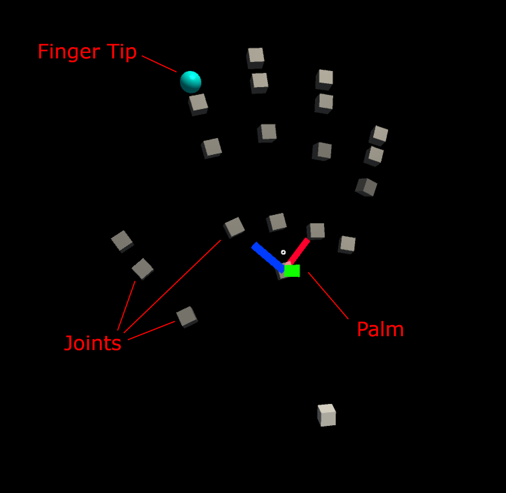

# Hand Tracking Profile

The _Hand Tracking profile_ is found under the _Input System profile_. It contains settings for customizing hand representation.

<a target="_blank" href="../../External/Documentation/Images/MRTK_Core_Input_Hands_HandTrackingProfile.png">
  
</a>

## Joint Prefabs

Joint prefabs are visualized using simple prefabs. The _Palm_ and _Index Finger_ joints are of special importance and have their own prefab, while all other joints share the same prefab.

By default the hand joint prefabs are simple geometric primitives. These can be replaced if desired. If no prefab is specified at all, empty [GameObjects](href:https://docs.unity3d.com/ScriptReference/GameObject.html) are created instead.

| Warning: Avoid using complex scripts or expensive rendering in joint prefabs, since joint objects are transformed on every frame and can have significant performance cost! |
| --- |

<a target="_blank" href="../../External/Documentation/Images/MRTK_Core_Input_Hands_JointVisualizerPrefabs.png">
  
</a>

## Hand Mesh Prefab

The hand mesh is used if fully defined mesh data is provided by the hand tracking device. The mesh renderable in the prefab is replaced by data from the device, so a dummy mesh such as a cube is sufficient. The material of the prefab is used for the hand mesh.

<a target="_blank" href="../../External/Documentation/Images/MRTK_Core_Input_Hands_ArticulatedHandMesh.png">
  
</a>

Hand mesh display can have a noticeable performance impact, for this reason it can be disabled entirely using the _Enable Hand Mesh Updates_ option.

# Scripting

Position and rotation can be requested from the input system for each individual hand joint as a [MixedRealityPose](xref:Microsoft.MixedReality.Toolkit.Utilities.MixedRealityPose).

Alternatively we also have access to [GameObjects](https://docs.unity3d.com/ScriptReference/GameObject.html) that follow the joints. This can be useful if another GameObject should track a joint continuously.

| Note: Joint object are destroyed when hand tracking is lost! Make sure that any scripts using the joint object handle the `null` case gracefully to avoid errors! |
| --- |

Available joints are listed in the [TrackedHandJoint](xref:Microsoft.MixedReality.Toolkit.Utilities.TrackedHandJoint) enum.

## Accessing a given Hand Controller

A specific hand controller is often available, e.g. when handling input events. In this case the joint data can be requested directly from the device, using the [IMixedRealityHand](xref:Microsoft.MixedReality.Toolkit.Input.IMixedRealityHand) interface.

### Polling Joint Pose from Controller

<!-- [TryGetJoint](xref:Microsoft.MixedReality.Toolkit.Input.IMixedRealityHand.TryGetJoint(TrackedHandJoint, MixedRealityPose)) -->
The [TryGetJoint](xref:Microsoft.MixedReality.Toolkit.Input.IMixedRealityHand.TryGetJoint*) function returns `false` if the requested joint is not available for some reason. In that case the resulting pose will be [MixedRealityPose.ZeroIdentity](xref:Microsoft.MixedReality.Toolkit.Utilities.MixedRealityPose.ZeroIdentity).

```csharp
public void OnSourceDetected(SourceStateEventData eventData)
{
  var hand = eventData.Controller as IMixedRealityHand;
  if (hand != null)
  {
    if (hand.TryGetJoint(TrackedHandJoint.IndexTip, out MixedRealityPose jointPose)
    {
      // ...
    }
  }
}
```

### Joint Transform from Hand Visualizer

Joint objects can be requested from the [controller visualizer](xref:Microsoft.MixedReality.Toolkit.Input.IMixedRealityController.Visualizer).

```csharp
public void OnSourceDetected(SourceStateEventData eventData)
{
  var handVisualizer = eventData.Controller.Visualizer as IMixedRealityHandVisualizer;
  if (handVisualizer != null)
  {
    if (handVisualizer.TryGetJointTransform(TrackedHandJoint.IndexTip, out Transform jointTransform)
    {
      // ...
    }
  }
}
```

## Simplified joint data access

If no specific controller is given then utility classes are provided for convenient access to hand joint data. These functions request joint data from the first available hand device currently tracked.

### Polling Joint Pose from HandJointUtils

[HandJointUtils](xref:Microsoft.MixedReality.Toolkit.Input.HandJointUtils) is a static class that queries the first active hand device.

```csharp
  if (HandJointUtils.TryGetJointPose(TrackedHandJoint.IndexTip, Handedness.Right, out MixedRealityPose pose))
  {
    // ...
  }
```

### Joint Transform from Hand Joint Service

[IMixedRealityHandJointService](xref:Microsoft.MixedReality.Toolkit.Input.IMixedRealityHandJointService) keeps a persistent set of [GameObjects](https://docs.unity3d.com/ScriptReference/GameObject.html) for tracking joints.

```csharp
  var handJointService = MixedRealityToolkit.Instance.GetService<IMixedRealityHandJointService>();
  if (handJointService != null)
  {
    Transform jointTransform = handJointService.RequestJointTransform(TrackedHandJoint.IndexTip, Handedness.Right);
    // ...
  }
}
```

## Hand Tracking Events

<!-- The Input Simulation Service emulates the behaviour of devices and platforms that may not be available in the Unity editor. Examples include:
* Hololens or VR device head tracking
* Hololens version 1 hand gestures
* Hololens version 2 articulated hand tracking

Users can use a conventional keyboard and mouse combination to control simulated devices at runtime. This allows testing of interactions in the Unity editor without first deploying to a device.

## Enabling the Input Simulation Service

Input simulation is enabled by default in MRTK.

Input simulation is an optional [Mixed Reality service](../../External/Documentation/MixedRealityServices.md). It can be added as a data provider in the [Input System profile](../TODO.md).
* __Type__ must be _Microsoft.MixedReality.Toolkit.Input > InputSimulationService_.
* __Platform(s)__ should always be _Windows Editor_ since the service depends on keyboard and mouse input.
* __Profile__ has all settings for input simulation.

  | __Warning__: Any type of profile can be assigned to services at the time of this writing. If you assign a different profile to the service, make sure to use a profile of type _Input Simulation_ or it will not work! |
  | --- |


Open the linked profile to access settings for input simulation.


# Camera Control

Head movement can be emulated by the Input Simulation Service.


## Rotating the camera

1. Hover over the viewport editor window.

   _You may need to click the window to give it input focus if button presses don't work._

2. Press and hold the __Mouse Look Button__ (default: Right mouse button).
3. Move the mouse in the viewport window to rotate the camera.

## Moving the camera

Press and hold the movement keys (W/A/S/D for forward/left/back/right).

---

<video width="600" controls="controls">
  <source type="video/mp4" src="../../External/Documentation/Videos/MRTK_InputSimulation_CameraControl.mp4"></source>
</video>

# Hand Simulation

The input simulation supports emulated hand devices. These virtual hands can interact with any object that supports regular hand devices, such as buttons or grabable objects.


The __Hand Simulation Mode__ switches between two distinct input models.

* _Articulated Hands_: Simulates a fully articulated hand device with joint position data.

   Emulates Hololens version 2 interaction model.

   Interactions that are based precise positioning of the hand or use touching can be simulated in this mode.

* _Gestures_: Simulates a simplified hand model with air tap and basic gestures.

   Emulates [Hololens version 1 interaction model](https://docs.microsoft.com/en-us/windows/mixed-reality/gestures).

   Focus is controlled using the Gaze pointer. The _Air Tap_ gesture is used to interact with buttons.

## Controlling hand movement


Press and hold the _Left/Right Hand Manipulation Key_ (default: Left Shift/Space for left/right respectively) to gain control of either hand. While the manipulation key is pressed, the hand will appear in the viewport. Mouse movement will move the hand in the view plane.

Once the manipulation key is released the hands will disappear after a short _Hand Hide Timeout_. To toggle hands on permanently, press the _Toggle Left/Right Hand Key_ (default: T/Y for left/right respectively). Press the toggle key again to hide the hands again.


Hands can be moved further or closer to the camera using the _mouse wheel_.


Hands can be rotated when precise direction is required.
* Yaw rotates around the Y axis (default: E/Q keys for clockwise/counter-clockwise rotation)
* Pitch rotates around the X axis (default: F/R keys for clockwise/counter-clockwise rotation)
* Roll rotates around the Z axis (default: X/Z keys for clockwise/counter-clockwise rotation)

---

<video width="600" controls="controls">
  <source type="video/mp4" src="../../External/Documentation/Videos/MRTK_InputSimulation_HandMovement.mp4"></source>
</video>

## Hand Gestures

Hand gestures such as pinching, grabbing, poking, etc. can also be simulated.


1. First enable hand control using the manipulation keys (Left Shift/Space)

   Alternatively toggle the hands on/off using the toggle keys (T/Y).

2. While manipulating, press and hold a mouse button to perform a hand gesture.

Each of the mouse buttons can be mapped to transform the hand shape into a different gesture using the _Left/Middle/Right Mouse Hand Gesture_ settings. The _Default Hand Gesture_ is the shape of the hand when no button is pressed.

| Note: The _Pinch_ gesture is the only gesture that performs the "Select" action at this point. |
| --- |

## One-Hand Manipulation

1. Press and hold hand control key (Space/Left Shift)
2. Point at object
3. Hold mouse button to pinch
4. Use mouse to move the object
5. Release mouse button to stop interaction

---

<video width="600" controls="controls">
  <source type="video/mp4" src="../../External/Documentation/Videos/MRTK_InputSimulation_OneHandManipulation.mp4"></source>
</video>

## Two-Hand Manipulation

For manipulating objects with two hands at the same time the persistent hand mode is recommended.

1. Toggle on both hands by pressing the toggle keys (T/Y).
2. Manipulate one hand at a time:
  1. Hold _Space_ to control the right hand
  2. Move the hand to where you want to grab the object
  3. Press mouse button to activate the _Pinch_ gesture. In persistent mode the gesture will remain active when you release the mouse button.
3. Repeat the process with the other hand, grabbing the same object in a second spot.
4. Now that both hands are grabbing the same object, you can move either of them to perform two-handed manipulation.

---

<video width="600" controls="controls">
  <source type="video/mp4" src="../../External/Documentation/Videos/MRTK_InputSimulation_TwoHandManipulation.mp4"></source>
</video>

## GGV Interaction

1. Enable GGV simulation by switching __Hand Simulation Mode__ to _Gestures_ in the [Input Simulation Profile](#enabling-the-input-simulation-service)
   
2. Rotate the camera to point the gaze cursor at the interactable object (right mouse button)
3. Hold _Space_ to control the right hand
4. Click and hold _left mouse button_ to interact
5. Rotate the camera again to manipulate the object

---

<video width="600" controls="controls">
  <source type="video/mp4" src="../../External/Documentation/Videos/MRTK_InputSimulation_GGVManipulation.mp4"></source>
</video> -->
