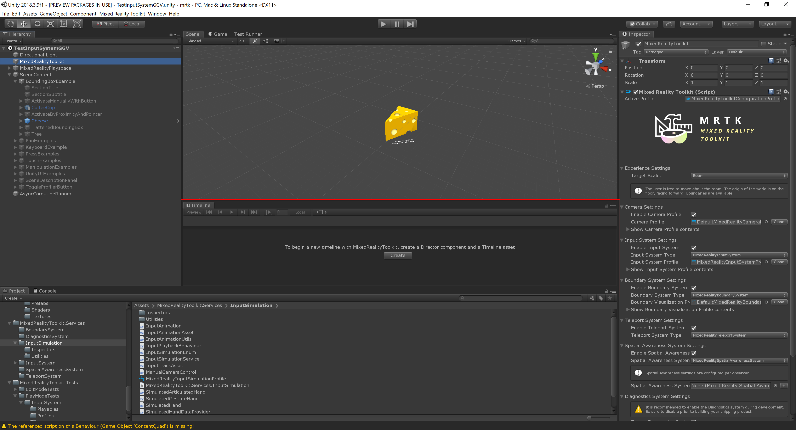
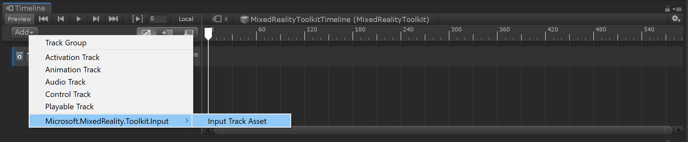
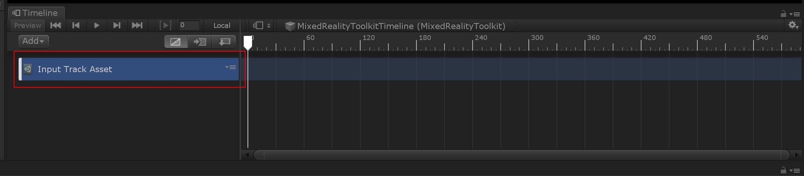
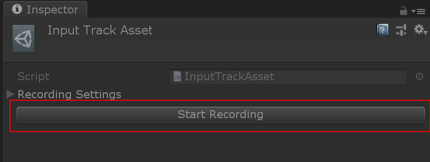
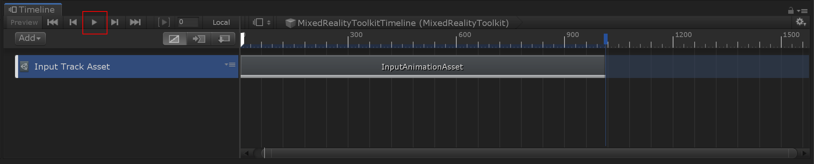

# Recording hand animations

1. Prepare your scene
   Include all objects that should be tested. An easy way to do this is to start from MRTK demo scenes, and disable or remove all objects that are not required.
   Preferably save this scene and associated assets in the `Assets\MixedRealityToolkit.Tests\PlayModeTests` folder.

2. Open a _Timeline_ window (_Window > Sequencing > Timeline_).
   This is where the input animation can be recorded and played back.

3. Select a game object (e.g. the _MixedRealityToolkit_ object) and click "Create" in the Timeline window. This automatically sets up the timeline:
  * A timeline asset is created.
  * A _Playable Director_ component is added to the selected game object. This manages the playable graph to evaluate the animation at play time.
    The director is linked to the timeline asset.
  * An _Animator_ component is also added to the selected game object. This is not needed for input animation and can be safely deleted again.
  * A default _Animation Track_ is added in the timeline. This is not needed for input animation and can be safely deleted again.

4. Create an _input track_ in the timeline.
   This is a special track type that allows recording of input data into _input animation clips_.

5. Enter _play mode_ to enable input recording.

6. Select the _input track_ in the timeline

7. Click the _Start Recording_ button in the inspector.
   This will start recording input from camera position and hand devices, including simulated devices.

8. Click the _Stop Recording_ button once finished.
   This creates an _Input Animation_ clip on the timeline with the recorded data.

9. Click the play button on the timeline to play back recorded input animation clips.

