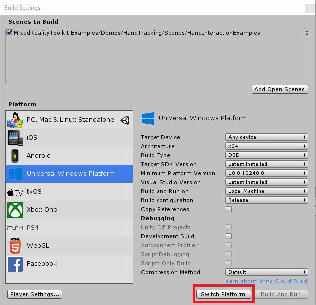

# Installation Guide

## Prerequisites

Before getting started with the Mixed Reality Toolkit, make sure that you have [installed the required tools](https://docs.microsoft.com/windows/mixed-reality/install-the-tools?tabs=unity).

> [!IMPORTANT]
> MRTK supports both IL2CPP and .NET scripting backends on Unity 2018.4.x. We recommend using the latest **[Unity 2019 LTS](https://unity3d.com/get-unity/download/archive)** (long-term support) version if you don't specifically need a later Unity version.
>
> You only need to download **[Download Windows SDK 18362+](https://developer.microsoft.com/windows/downloads/windows-10-sdk)** if you're building a UWP (Universal Windows Platform) app for WMR (Windows Mixed Reality), HoloLens (1st gen), or HoloLens 2. This isn't required if you're building for OpenVR.

## Importing MRTK

> [!Note]
> Users of Unity 2019.4, and newer, can use the Unity Package Manager to import MRTK. Please see **[Using the Unity Package Manager](usingupm.md)** for more information.

### Objectives

1. [Get the latest MRTK Unity packages](#get-the-latest-mrtk-unity-packages)
2. [Import MRTK packages into your Unity project](#import-mrtk-packages-into-your-unity-project)
3. [Switch your Unity project to the target platform](#switch-your-unity-project-to-the-target-platform)
4. [Add MRTK to a new scene or new project](#add-mrtk-to-a-new-scene-or-new-project)

### Getting the latest MRTK Unity packages

Go to the <a href="https://github.com/Microsoft/MixedRealityToolkit-Unity/releases" target="_blank">MRTK release page</a>, scroll down to the Assets section of the newest release and download:    

* **Microsoft.MixedRealityToolkit.Unity.Foundation.unitypackage**
* (**_Optional_**) Microsoft.MixedRealityToolkit.Unity.Extensions.unitypackage
* (**_Optional_**) Microsoft.MixedRealityToolkit.Unity.Examples.unitypackage
* (**_Optional_**) Microsoft.MixedRealityToolkit.Unity.TestUtilities.unitypackage
* (**_Required for version-to-version upgrades, Optional otherwise_**) Microsoft.MixedRealityToolkit.Unity.Tools.unitypackage

> [!NOTE]
> For details on the packages and their contents, take a look at the **[MRTK Packages](Packaging/MRTK_Packages.md)** documentation.

### Importing MRTK packages into your Unity project

1. Create a new or existing Unity project and select **3D** as the template type.
2. Select **Asset -> Import Package -> Custom Package** from the Unity menu and select the **.unitypackage** file from the **Microsoft.MixedRealityToolkit.Unity.Extensions.unitypackage** you just downloaded. Make sure that all items to import are checked and select **Import**.

#### Optional 

* Import the **Microsoft.MixedRealityToolkit.Unity.Extensions.unitypackage** following the instructions in step 2. The extensions package provides a set of useful optional components for the MRTK.
* Import the **Microsoft.MixedRealityToolkit.Unity.Examples.unitypackage** following the instructions in step 2. The examples package is optional and contains useful demonstration scenes for current MRTK features. **Note that the Examples package requires the Extensions package.**

#### Version to version upgrades

* Import the **Microsoft.MixedRealityToolkit.Unity.Tools.unitypackage** following the instructions in step 2. The tools package is optional and contains useful tools, such as the ExtensionServiceCreator, that enhance the MRTK developer experience.

> [!Note]
> Android and iOS development require additional package installations. For more information, see **[How to configure MRTK for iOS and Android](CrossPlatform/UsingARFoundation.md)**.

After importing the Foundation package, you may see a prompt similar to the following:

MRTK is attempting to set up your project for building Mixed Reality solutions by:

* Enabling XR Settings for your current platform (enabling the XR checkbox).
* Forcing Text Serialization / Visible Meta files (recommended for Unity projects using source control).

Accepting these options is completely optional, but highly recommended.

Some prefabs and assets require TextMesh Pro, meaning you need the TextMesh Pro package installed and the assets in your project. You can install TextMeshPro by selecting **Window -> TextMeshPro -> Import TMP Essential Resources**. 

> [!IMPORTANT]
> After you import TMP Essentials Resources, **you need to restart Unity to see changes**.

### Switching your Unity project to the target platform

With the packages imported, your next step is to select the correct platform for the application.

To create a **HoloLens application**, switch to the Universal Windows Platform:

1. Select **File > Build Settings** from the Unity menu
2. Select **Universal Windows Platform** in the **Platform** list
3. Click **Switch Platform** 

>[!NOTE]
> The Mixed Reality Toolkit will prompt to apply recommended changes to the project when the platform is selected. Whenever the platform is switched, the appropriate settings will be checked and prompted, if necessary.

## Adding MRTK to a new scene or new project

1. Create a new Unity project, or start a new scene in your current project.

2. Make sure you have imported the MRTK packages (we recommend both Foundation and Examples, though Examples is not required) following [the steps above](#import-mrtk-packages-into-your-unity-project).

3. From the menu bar, select Mixed Reality Toolkit -> Add to Scene and Configure

    

    The inspector will now show the currently active MRTK configuration profile and the profile selection dropdown, where the default profile is already preselected.
    Profiles configure the behavior of MRTK core components and are described in more detail in the [profiles](Profiles/Profiles.md) article.

    > [!NOTE]
    >
    > * If you're using Unity's XR SDK in Unity 2019.3 or later, you should choose the "DefaultXRSDKConfigurationProfile". This profile is set up with MRTK's XR SDK systems and providers, where needed.  
    > * If you're getting started on the HoloLens or HoloLens 2, you should choose the "DefaultHoloLens1ConfigurationProfile" or DefaultHoloLens2ConfigurationProfile" instead.  
    > * See the [profiles](Profiles/Profiles.md#hololens-2-profile) for more information on the differences between DefaultMixedRealityToolkitConfigurationProfile and DefaultHoloLens2ConfigurationProfile.

    You will then see the following in your Scene hierarchy:

    

    Which contains the following:

    * **Mixed Reality Toolkit** - The toolkit itself, providing the central configuration entry point for the entire framework.
    * **MixedRealityPlayspace** - The parent object for the headset, which ensures the headset / controllers and other required systems are managed correctly in the scene.
    * The Main Camera is moved as a child to the Playspace - Which allows the playspace to manage the camera in conjunction with the SDKs.

    >[!NOTE]
    > While working in your scene, **DO NOT move the Main Camera** or the **MixedRealityPlayspace**. These are controlled by the active SDK and the MRTK respectively. Any settings you make to the Main Camera or MixedRealityPlayspace transforms will at best be overwritten, and at worst result in undefined behavior. 
    >
    > The entire rig, Camera and Playspace, can be moved by adding another GameObject to the scene, and making it the parent of the MixedRealityPlayspace. When that object is moved, the Playspace and Camera will follow loosely behind, subject to the additional local transform changes made by the active SDK and the MRTK.
    >
    > Another option is to move the scene contents relative to the camera, although this can become problematic in advanced scenarios incorporating content such as Nav Meshes, terrains, or particle systems.
    >
    > Further discussion of AR/VR camera rigs can be found in [Unity's documentation](https://docs.unity3d.com/Packages/com.unity.xr.legacyinputhelpers@2.1/manual/index.html#xr-rig-explanation) and elsewhere.

4. Press Play and test out hand simulation by pressing the **spacebar**.

You're ready to build and deploy to device! Follow the steps instructions at [Build and Deploy MRTK](BuildAndDeploy.md).

### Run the HandInteractionExamples scene in the Unity Editor

The [hand interaction examples scene](README_HandInteractionExamples.md) article is a great place to learn more about the UX controls and interactions in MRTK.

To try the hand interaction scene, do the following steps.

1. Open the **HandInteractionExamples** scene under `Assets/MRTK/Examples/Demos/HandTracking/Scenes/HandInteractionExamples`

1. You may get a prompt asking you to import "TMP Essentials".

    

    If you get such a prompt, select the "Import TMP essentials" button. "TMP Essentials" refers to Text Mesh Pro plugin, which some of the MRTK examples use for improved text rendering. (See [Text in Unity](https://docs.microsoft.com/windows/mixed-reality/text-in-unity) for more detailed information)

1. Close the TMP dialog. After this you need to reload the scene. You can do this by double-clicking the scene in the Project tab.

1. Uncheck or shrink the size of the 3d icons under the Gizmos tab in the Scene view to reduce scene clutter

     

1. Press the Play button.

## Using the in-editor hand input simulation to test a scene

The in-editor input simulation allows you to test virtual object behavior given a specific type of input such as [hands](InputSimulation/InputSimulationService.md#hand-simulation) or [eyes](EyeTracking/EyeTracking_BasicSetup.md#simulating-eye-tracking-in-the-unity-editor).

How to move around in the scene:

* Use **W/A/S/D** keys to move the camera forward/left/back/right.
* Use **Q/E** to move the camera vertically.
* Press and hold the **right mouse button** to rotate the camera.

How to simulate hand input:

* Press and hold the **spacebar** to enable the right hand.
* While holding the space bar, move your mouse to move the hand.
* Use the mouse **scroll wheel** to adjust the depth of the hand.
* Click the **left mouse button** to simulate pinch gesture.
* Use **T/Y** keys to make the hand persistent in the view.
* Hold **CTRL** key and move the mouse to rotate the hand.

Have fun exploring the scene! You can learn more about the UI controls [in the hand interaction examples guide](README_HandInteractionExamples.md). Also, read through [input simulation docs](InputSimulation/InputSimulationService.md) to learn more about in-editor hand input simulation in MRTK.

Congratulations, you just used your first MRTK scene! Now onto creating your own experiences.

## Getting help

If you run into issues caused by MRTK or otherwise have questions about how to do something, there are a few resources that can help:

* For bug reports, please [file an issue](https://github.com/microsoft/MixedRealityToolkit-Unity/issues/new/choose) on the GitHub repo.
* For questions, please reach out on either [StackOverflow](https://stackoverflow.com/questions/tagged/mrtk) or the [mixed-reality-toolkit channel](https://holodevelopers.slack.com/messages/C2H4HT858) on Slack. You can join the Slack community via the [automatic invitation sender](https://holodevelopersslack.azurewebsites.net/).

## Upgrading from the HoloToolkit (HTK/MRTK v1)

There is no direct upgrade path from the HoloToolkit to Mixed Reality Toolkit v2 due to the rebuilt framework. However, it's possible to import MRTK into your HoloToolkit project and migrate your implementation. For more information, see the [HoloToolkit to Mixed Reality Toolkit Porting Guide](HTKToMRTKPortingGuide.md)

## Next steps

Here are some suggested next steps:

* Complete the [Unity development journey](https://docs.microsoft.com/en-us/windows/mixed-reality/unity-development-overview?tabs=mrtk%2Chl2).
* Try out the [MRTK Examples Hub](README_ExampleHub.md) (pre-built app packages are included in the release page for your convenience)
* Learn how to work with the MRTK Configuration profile in the [mixed reality configuration guide](MixedRealityConfigurationGuide.md).
* Learn about the [MRTK's Architecture](../Documentation/Architecture/Overview.md)
* Learn about the [MRTK's Input System](../Documentation/Input/Overview.md)
* Learn about the [MRTK's Tools](../README.md#tools) that will empower your mixed reality design and development.
* Read through [input simulation guide](InputSimulation/InputSimulationService.md) to learn how to simulate hand input in editor.

