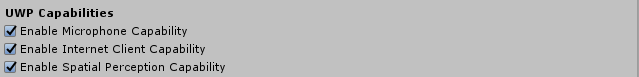
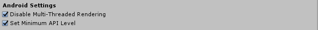
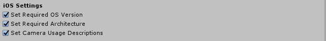

# MRTK project configuration dialog

The MRTK configuration dialog is displayed when Unity loads a project and it is determined that one or more configuration options needs the attention of the developer.

To apply the changes, click the **Apply** button. The **Later** button will defer the changes until the project is reloaded at a future time.

> [!NOTE]
> The configuration dialog will reappear if one or more of the recommended settings is left unchecked. To prevent this from occurring, apply the desired options, then relaunch the dialog via  **Mixed Reality Toolkit** > **Utilities** > **Configure Unity Project** and click **Ignore**. This will prevent the configuration dialog from reappearing automatically.

## Common settings

All build targets share a collection of common options.

### Force text asset serialization and Enable visible meta files

These settings help simplify working with Unity projects and source control systems (ex: Git).

### Enable VR supported

**Unity 2018**

Configures the Virtual Reality Supported and Virtual Reality SDK options in **Player Settings** > **XR Settings**.

### Set Single Pass Instanced rendering path

Configures the **Player Settings** > **XR Settings** > **Stereo Rendering Mode** to **Single Pass Instanced**.

### Set default Spatial Awareness layer

Registers Spatial Awareness as layer 31 to enable easy and consistent configuration of raycast and physics options.

### Audio spatializer

Audio spatializers are the components that unlock the power of Spatial Sound and positional audio to make mixed reality experiences truly immersive.

> [!NOTE]
> Setting the audio spatializer to None will disable positional audio features.

#### Common spatializers

- Microsoft Spatializer

Microsoft provided spatializer that supports utilization of hardware acceleration on HoloLens 2.

This spatializer is available via [NuGet](https://www.nuget.org/packages/Microsoft.SpatialAudio.Spatializer.Unity/) and [GitHub](https://github.com/microsoft/spatialaudio-unity).

More details on Microsoft Spatializer can be found in the [Spatial Sound documentation](https://docs.microsoft.com/windows/mixed-reality/spatial-sound-in-unity).

- MS HRTF Spatializer

Microsoft Windows spatializer that is provided by Unity as part of the Windows Mixed Reality and Windows XR Platform packages.

- Resonance Audio

A cross platform spatializer from Google that is provided by Unity.

More information can be found on the [Resonance Audio documentation](https://resonance-audio.github.io/resonance-audio/develop/unity/getting-started) site.

## Universal Windows Platform settings

### Enable MSBuild for Unity

**Unity 2019.2 and earlier**

MSBuild for Unity is a component that enables automatic restoring of specific NuGet packages. In this version, the **Microsoft.Windows.MixedReality.DotNetWinRT** package will be installed after enabling MSBuild for Unity.

### UWP Capabilities

Enables specific application capabilities for Universal Windows Platform application. These capabilities enable the platform to inform and request permission to enable specific functionality.

- Microphone

  Enables capturing sound via the microphone.

- Internet Client

  Enables support for accessing resources on the internet.

- Spatial Perception

  Enables support for using the real-world environment.

- Eye Gaze

  **Unity 2019.3 and newer**

  Enables support for tracking the user's eye gaze.

### Avoid Unity 'PlayerSettings.graphicsJob' crash

**Unity 2019.3 and newer**

In the latest version of Unity 2019, when "Graphics Jobs" is enabled, the app will crash when deployed to a HoloLens 2.
This setting is enabled by default in Unity - while this bug exists (see [Unity bug]
(https://issuetracker.unity3d.com/issues/enabling-graphics-jobs-in-2019-dot-3-x-results-in-a-crash-or-nothing-rendering-on-hololens-2)),
the configurator will default to setting Graphics Jobs to 'false' (thus allowing apps deployed to HoloLens 2 not to crash).

## Android settings

Configuration settings to support AR applications on Android powered devices.

### Disable Multi-Threaded Rendering

Disables **Player Settings** > **Other Settings** > **Multithreaded Rendering** as required by Android's AR support.

### Set Minimum API Level

Sets the value of **Player Settings** > **Other Settings** > **Minimum API Level** to enforce operating system requirements for AR applications.

## iOS settings

Configuration settings to support AR applications on iOS powered devices.

### Set Required OS Version

Sets the value of **Player Settings** > **Other Settings** > **Target minimum iOS Version** to enforce operating system requirements for AR applications.

### Set Required Architecture

Sets the value of **Player Settings** > **Other Settings** > **Architecture** to enforce platform requirements for AR applications.

### Set Camera Usage Descriptions

Sets the value of **Player Settings** > **Other Settings** > **Camera Usage Description** used to request permission to use the device's camera.
