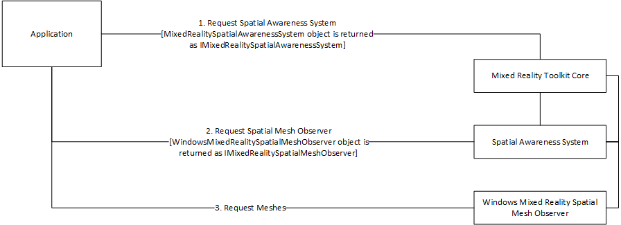

# Mixed Reality Toolkit componentization

One of the great new features of Mixed Reality Toolkit v2 is improved componentization. Wherever possible, individual components are isolated from all but the core layer of the foundation.

## Minimized dependencies

MRTK v2 was intentionally developed to be modular and to minimize dependencies between system services
(ex: spatial awareness).

Due to the nature of some system services (ex: input and teleportation), a small number of dependencies exist.

While it is expected that services will need one or more data provider components, there are no direct links
between them. The same is true for SDK features (ex: User Interface components).

## Component communication

To ensure that there are no direct links between components, MRTK v2 utilizes interfaces to communicate between
services, data providers and application code. These interfaces are defined in and all communication is routed
through the Mixed Reality Toolkit core component.

## Minimizing MRTK import footprint

At this moment, the MRTK is imported as a single foundation package (ignoring for a moment the existence of the examples package, which is a completely optional package). It is possible to make this footprint smaller by manually cutting down on the files imported, though this is a highly manual process which doesn't have a well-defined guide.

It is possible to uncheck arbitrary items during the import of the Foundation package. However, it's not recommended to do this at an early stage in development as it might break functionality. After having figured out the final feature set of an app, pruning unneeded providers and services can be done on the following folders:

- MRTK/Services
- MRTK/Providers
- MRTK/SDK/Features

> [!NOTE]
> MRTK v2.x **_requires_** the contents of the Assets/MRTK/Core folder.

## Upcoming features

### Application architecture

The MRTK will have support to enable applications to be built with a variety of architectures, including:

- [MixedRealityToolkit service locator](#mixedrealitytoolkit-service-locator)
- [Individual services](#individual-service-components)
- [Custom service locator](#custom-service-locator)
- [Hybrid architecture](#hybrid-architecture)

When selecting an application architecture, it is important to consider design flexibility and application performance. The architectures described here are not expected to be suitable for every application.

#### MixedRealityToolkit service locator

The MRTK enables (and automatically configures) application scenes to use the default [`MixedRealityToolkit`](xref:Microsoft.MixedReality.Toolkit.MixedRealityToolkit) service locator component. This component includes support for configuring MRTK systems and data providers via configuration inspectors and manages component lifespans and core behaviors (ex: when to update).

All systems are represented in the core configuration inspector, regardless of whether or not they are present or enabled in the project. Please see the [Mixed Reality Configuration Guide](../MixedRealityConfigurationGuide.md) for more
information.

#### Individual service components

Some developers have expressed a desire to include individual service components into the application scene hierarchy. To enable this usage, services will either need to be encapsulated in a custom registrar or be self-registering / self-managing.

A self-registering service would implement the [`IMixedRealityServiceRegistrar`](xref:Microsoft.MixedReality.Toolkit.IMixedRealityServiceRegistrar) and register itself so that application code could discover the service instance via a registry.

A self-managing service could be implemented as a singleton object in the scene hierarchy. This object would provide
and instance property which application code could use to directly access service functionality.

#### Custom service locator

Some developers have requested the ability to create a custom service locator component. Custom service locators would implement the [`IMixedRealityServiceRegistrar`](xref:Microsoft.MixedReality.Toolkit.IMixedRealityServiceRegistrar) interface and manage the life cycle and core behaviors of active services.

#### Hybrid architecture

The MRTK will support a hybrid architecture in which developers can combine the previous approaches as needed or desired. For example, a developer could start with the [`MixedRealityToolkit`](xref:Microsoft.MixedReality.Toolkit.MixedRealityToolkit) service locator and add a self-registering
service.

> [!NOTE]
> When opting for a hybrid architecture, it is important to be mindful of any duplication of work (ex: acquiring controller data from multiple components).
