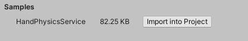

# Mixed Reality Toolkit packages

The Mixed Reality Toolkit (MRTK) is a collection of packages that enable cross platform Mixed Reality application development by providing support for Mixed Reality hardware and platforms.

MRTK is available as [asset](#asset-packages) (.unitypackage) packages and via the [Unity Package Manager](#unity-package-manager).

## Asset packages

The MRTK asset (.unitypackage) can be downloaded from [GitHub](https://github.com/microsoft/MixedRealityToolkit-Unity/releases). 

Some of the benefits of using asset packages include:

- Available for Unity 2018.4 and newer
- Can configure which files are imported
  - Package import allows for omitting one or more files
- Easy to make changes to MRTK
  - MRTK is in the Assets folder

Some of the challenges are:

- MRTK is part of the project's Assets folder, leading to
  - Larger projects
  - Slower compilation times
- No dependency management
  - Customers are required to resolve package dependencies manually
- Manual update process
  - Multiple steps
  - Large (3000+ file) source control updates
  - Risk of losing changes made to MRTK 
- Importing the examples package typically means including all examples

The available packages are:

- [Foundation](#foundation-package)
- [Extensions](#extensions-package)
- [Tools](#tools-package)
- [Test utilities](#test-utilities-package)
- [Examples](#examples-package)

These packages are released and supported by Microsoft from source code in the [mrtk_release](https://github.com/Microsoft/MixedRealityToolkit-Unity/tree/mrtk_release) branch on GitHub.

> [!Note]
> For a detailed listing of the contents of each package, please see << link to package contents page (make a reference to asset packages) >>

### Foundation package

The Mixed Reality Toolkit Foundation is the set of code that enables your application to leverage common functionality across Mixed Reality Platforms.

  
MRTK Foundation Package

The MRTK Foundation is comprised of:

**Core**

The core is comprised of the definitions for all of the common interfaces, classes and data types that are used by all other components. It is highly recommended that applications access MRTK components exclusively through the defined interfaces to enable the highest level of compatibility across platforms.

**Platform providers**

The platform providers are the components that enable the Mixed Reality Toolkit to target Mixed Reality hardware and platform functionality.

Supported platforms include:

- Windows Mixed Reality
- Oculus
- OpenVR
- Mobile AR
- Leap Motion

**Services**

The services folder contains the core systems that provide the default implementations for the system service interfaces.

The MRTK foundation includes the following system services:

- [Boundary System](../Boundary/BoundarySystemGettingStarted.md)
- [Camera System](../CameraSystem/CameraSystemOverview.md)
- [Diagnostic System](../Diagnostics/DiagnosticsSystemGettingStarted.md)
- [Input System](..//OverviewInput.md)
- [Spatial Awareness System](../SpatialAwareness/SpatialAwarenessGettingStarted.md)
- [Teleport System](../TeleportSystem/Overview.md)

**Standard Assets**

The MRTK standard assets is a collection of components that are recommended for all mixed reality experiences, including:

- MRTK Standard shader
- Basic materials using the MRTK Standard shader 

### Extensions package

The extensions package contains additional services and components that extend the functionality of the MRTK.

- [Hand Physics Service](../Extensions/HandPhysicsService/HandPhysicsServiceOverview)
- Lost Tracking Service
- [Scene Transition Service](../Extensions/SceneTransitionService/SceneTransitionServiceOverview.md)

### Tools package

The tools package contains tools that are useful for creating mixed reality experiences. In general, these tools are editor components and their code does not ship as part of an application.

Some of the tools in this package include:

- [Dependency Window](../Tools/DependencyWindow.md)
- [Extension Service Creation Wizard](../Tools/ExtensionServiceCreationWizard.md)
- [Optimize Window](../Tools/OptimizeWindow.md)
- [Screenshot Utility](../Tools/ScreenshotUtility.md)

### Test utlities package

The test utilities package contains a collection of helper scripts that enable developers to easily create play mode tests. These utilities are especially useful for developers creating MRTK components.

### Examples package

The examples package contains demos, sample scripts, and sample scenes that exercise functionality in the foundation package. This package contains the [HandInteractionExample scene](../README_HandInteractionExamples.md) (pictured below) which contains sample objects
that respond to various types of hand input (articulated and non-articulated).

This package also contains eye tracking demos, which are [documented here](../EyeTracking/EyeTracking_ExamplesOverview.md)

More generally, any new feature in the MRTK should contain a corresponding example in the examples package, roughly following
the same folder structure and location.

## Unity Package Manager

For experiences being created using Unity 2019.4 and newer, the MRTK is available via the [Unity Package Manager](https://docs.unity3d.com/Manual/Packages.html).

Some of the benefits of using asset packages include:

- Smaller projects
  - Cleaner Visual Studio solutions
  - Fewer files to check in (MRTK is a simple reference in the `Packages/manifest.json` file)
- Faster compilation
  - Unity does not need to recompile MRTK during building
- Dependency resolution
  - Required MRTK packages are automatically installed when specifying packages with dependencies
- Easy update to new MRTK versions
  - Change the version in the `Packages/manifest.json` file

Some of the challenges are:

- MRTK is immutable
  - Cannot make changes without them being removed during package resolution
- MRTK does not support UPM packages with Unity 2018.4

> [!Note]
> For a detailed listing of the contents of each package, please see << link to package contents page (make a reference to upm packages) >>

### Foundation package

The foundation package (`com.microsoft.mixedreality.toolkit.foundation`) forms the basis of the Mixed Reality Toolkit. It contains the code defining interfaces, datatypes and utility functions upon which all MRTK components rely. It also contains the platform providers and core system implementations providing
the default MRTK functionality.

The package contains:

- [Hand Physics Service](../Extensions/HandPhysicsService/HandPhysicsServiceOverview)
- Lost Tracking Service
- [Scene Transition Service](../Extensions/SceneTransitionService/SceneTransitionServiceOverview.md)

Dependencies:

- Standard Assets (`com.microsoft.mixedreality.toolkit.standardassets`)

### Standard Assets

The standard assets package (`com.microsoft.mixedreality.toolkit.standardassets)` is a collection of components that are recommended for all mixed reality experiences, including:

- MRTK Standard shader
- Basic materials using the MRTK Standard shader 
- Audio files
- Fonts
- Textures
- Icons

>[!Note]
> To avoid breaking changes, based on assembly definitions, the scripts used to control some features of the MRTK Standard shader are not included in the standard assets package. These scripts can be found in the foundation package in the `MRTK/Core/Utilities/StandardShader` folder.

Dependencies: none

### Extension pacakges

The extensions package (`com.microsoft.mixedreality.toolkit.extensions)` contains additional components that expand the functionality of the MRTK. 

<< >>

Dependencies:

- Foundation (`com.microsoft.mixedreality.toolkit.foundation`)

### Tools package

The tools package (`com.microsoft.mixedreality.toolkit.tools)` contains tools that are useful for creating mixed reality experiences. In general, these tools are editor components and their code does not ship as part of an application.

Dependencies:

- Foundation (`com.microsoft.mixedreality.toolkit.foundation`)

### Test utilities package

The test utilities package (`com.microsoft.mixedreality.toolkit.testutilities`) contains a collection of helper scripts that enable developers to easily create play mode tests. These utilities are especially useful for developers creating MRTK components.

Dependencies:
- Foundation (`com.microsoft.mixedreality.toolkit.foundation`)

### Examples package

The examples package (`com.microsoft.mixedreality.toolkit.examples`), is structured to allow developers to import only the examples of interest.

More details on the process of using packages containing example projects can be found in the [Mixed Reality Toolkit and Unity Package Manager](usingupm.md#using-mixed-reality-toolkit-examples) article.

Dependencies:

- Foundation (`com.microsoft.mixedreality.toolkit.foundation`)

## See also

- [Architecture Overview](../Architecture/Overview.md)
- [Systems, Extension Services and Data Providers](../Architecture/SystemsExtensionsProviders.md)
- [Mixed Reality Toolkit and Unity Package Manager](usingupm.md)
- [MRTK Package Contents](../MRTK_PackageContents.md)
