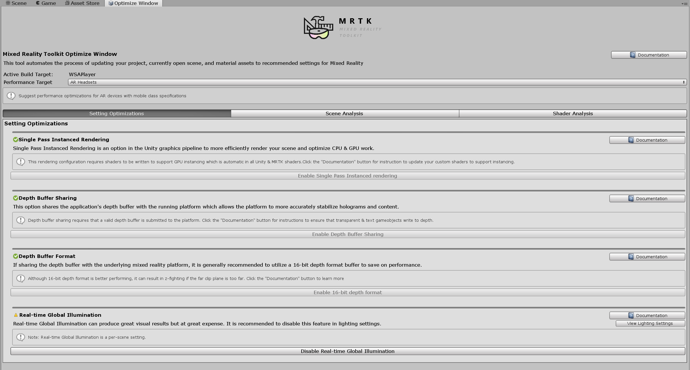

# Performance

## Getting started

The easiest way to rationalize performance is via framerate or how many times your application can render an image per second. It is important to meet the target framerate, as outlined by the platform being targeted (i.e [Windows Mixed Reality](https://docs.microsoft.com/windows/mixed-reality/understanding-performance-for-mixed-reality), [Oculus](https://developer.oculus.com/documentation/pcsdk/latest/concepts/dg-performance-guidelines/), etc). For example, on HoloLens, the target framerate is 60 FPS. Low framerate applications can result in deteriorated user experiences such as worsened [hologram stabilization](../hologram-Stabilization.md), world tracking, hand tracking, and more. To help developers track and achieve quality framerate, the Mixed Reality Toolkit provides a variety of tools and scripts.

### Visual profiler

To continuously track performance over the lifetime of development, it is highly recommended to always show a framerate visual while running & debugging an application. The Mixed Reality Toolkit provides the [Visual Profiler](../Diagnostics/UsingVisualProfiler.md) diagnostic tool which gives real-time information about the current FPS and memory usage in application view. The Visual Profiler can be configured via the [Diagnostics System Settings](../Diagnostics/DiagnosticsSystemGettingStarted.md) under the [MRTK Profiles Inspector](../MixedRealityConfigurationGuide.md).

Furthermore, it is particularly important to utilize the Visual Profiler to track framerate when running on the device as opposed to running in Unity editor or an emulator. The most accurate performance results will be depicted when running on the device with [Release configuration builds](https://docs.microsoft.com/visualstudio/debugger/how-to-set-debug-and-release-configurations?view=vs-2019).

> [!NOTE]
> If building for Windows Mixed Reality, deploy with [MASTER configuration builds](https://docs.microsoft.com/windows/mixed-reality/exporting-and-building-a-unity-visual-studio-solution#building_and_deploying_a_unity_visual_studio_solution)


### Optimize window

The [MRTK Optimize Window](../Tools/OptimizeWindow.md) offers information and automation tools to help mixed reality developers set up their environment for the best performing results and identify potential bottlenecks in their scene & assets. Certain key configurations in Unity can help deliver substantially more optimized results for mixed reality projects.

Generally, these settings involve rendering configurations that are ideal for mixed reality. Mixed reality applications are unique compared to traditional 3D graphics development in that there are two screens (i.e two eyes) to render for the entire scene.

The recommended settings referenced below can be auto-configured in a Unity project by leveraging the MRTK Optimize Window.



### Unity Profiler

The [Unity Profiler](https://docs.unity3d.com/Manual/ProfilerWindow.html) is a useful tool to investigate details of application performance at a frame-by-frame level.

#### Time spent on the CPU


To maintain comfortable frame rates (typically 60 frames per second), applications need to achieve a maximum frame time of 16.6 milliseconds of CPU time. To help identify the cost of MRTK functionality, the Microsoft Mixed Reality Toolkit contains a markers for inner loop (per frame) code paths. These markers use the following format, to assist in understanding the specific functionality being utilized:

```
[MRTK] className.methodName
```

> [!Note]
> There may be additional data following the method name. This is used to identify conditionally executed, potentially expensive functionality that may be avoided by small changes to application code.


In this example, the hierarchy has been expanded to show that the UpdateHandData method of WindowsMixedRealityArticulatedHand class is consuming 0.44 ms of CPU time during the frame being analyzed. This data can be used to help determine if a performance issue is related to application code or from elsewhere in the system.

It is highly recommended that developers instrument application code in a similar fashion. Primary areas of focus for application code instrumentation is within event handlers as these methods are charged to the MRTK update loop as events are raised. High frame times within the MRTK update loop can be indicative of expensive code in event handler methods.

## Recommended settings for Unity

### Single-Pass Instanced rendering

The default rendering configuration for XR in Unity is [Multi-pass](https://docs.unity3d.com/ScriptReference/StereoRenderingPath.MultiPass.html). This setting instructs Unity to execute the entire render pipeline twice, once for each eye. This can be optimized by selecting [Single Pass Instanced rendering](https://docs.unity3d.com/Manual/SinglePassInstancing.html) instead. This configuration leverages [render target arrays](https://en.wikipedia.org/wiki/Multiple_Render_Targets) to be able to perform a single draw call that instances into the appropriate [render target](https://en.wikipedia.org/wiki/Render_Target) for each eye. Furthermore, this mode allows all rendering to be done in a single execution of the rendering pipeline. Thus, selecting Single Pass Instanced rendering as the rendering path for a mixed reality application can [save substantial time on both the CPU & GPU](https://blogs.unity3d.com/2017/11/21/how-to-maximize-ar-and-vr-performance-with-advanced-stereo-rendering/) and is the recommended rendering configuration.

However, in order to issue a single draw call for each mesh to each eye, [GPU instancing](https://docs.unity3d.com/Manual/GPUInstancing.html) must be supported by all shaders. Instancing allows the GPU to multiplex draw calls across both eyes. Unity built-in shaders as well as the [MRTK Standard shader](../README_MRTKStandardShader.md) by default contain the necessary instancing instructions in shader code. If writing custom shaders though for Unity, these shaders may need to be updated to support Single Pass Instanced rendering.

#### [Example Code for Custom Shader](https://docs.unity3d.com/Manual/SinglePassInstancing.html)

```
struct appdata
{
    float4 vertex : POSITION;
    float2 uv : TEXCOORD0;

    UNITY_VERTEX_INPUT_INSTANCE_ID //Insert
};

struct v2f
{
    float2 uv : TEXCOORD0;
    float4 vertex : SV_POSITION;

    UNITY_VERTEX_OUTPUT_STEREO //Insert
};

v2f vert (appdata v)
{
    v2f o;

    UNITY_SETUP_INSTANCE_ID(v); //Insert
    UNITY_INITIALIZE_OUTPUT(v2f, o); //Insert
    UNITY_INITIALIZE_VERTEX_OUTPUT_STEREO(o); //Insert

    o.vertex = UnityObjectToClipPos(v.vertex);

    o.uv = v.uv;

    return o;
}
```

### Quality settings

Unity provides [presets to control quality](https://docs.unity3d.com/Manual/class-QualitySettings.html) of rendering for each platform endpoint. These presets control what graphical features can be enabled such as shadows, anti-aliasing, global illumination, and more. It is recommended to lower these settings and optimize the number of calculations performed during rendering.

*Step 1:* Update mixed reality Unity projects to use the *Low Quality* level setting  
**Edit** > **Project Settings**, then select the **Quality** category >  Select *Low Quality* for the UWP Platform

*Step 2:* For every Unity scene file, disable [real-time Global Illumination](https://docs.unity3d.com/Manual/LightMode-Realtime.html)  
**Window** > **Rendering** > **Lighting Settings** > [Uncheck *Real-time Global Illumination*](https://docs.unity3d.com/Manual/GlobalIllumination.html)

### Depth buffer sharing (HoloLens)

If developing for the Windows Mixed Reality platform and in particular HoloLens, enabling *Depth Buffer Sharing* under *XR Settings* can help with [hologram stabilization](../Hologram-Stabilization.md). However, processing of the depth buffer can incur a performance cost, particularly if using [24-bit depth format](https://docs.unity3d.com/ScriptReference/PlayerSettings.VRWindowsMixedReality-depthBufferFormat.html). Thus, it is *highly recommended* to configure the depth buffer to 16-bit precision.

If [z-fighting](https://en.wikipedia.org/wiki/Z-fighting) occurs due to the lower bit format, confirm the [far clip plane](https://docs.unity3d.com/Manual/class-Camera.html) of all cameras is set to the lowest possible value for the application. Unity by default sets a far clip plane of 1000m. On HoloLens, a far clip plane of 50m is generally more than enough for most application scenarios.

> [!NOTE]
> If using *16-bit depth format*, stencil buffer required effects will not work because [Unity does not create a stencil buffer](https://docs.unity3d.com/ScriptReference/RenderTexture-depth.html) in this setting. Selecting *24-bit depth format* conversely will generally create an 8-bit stencil buffer, if applicable on the endpoint graphics platform.
>
> If using a [Mask component](https://docs.unity3d.com/Manual/script-Mask.html) which requires the stencil buffer, consider using [RectMask2D](https://docs.unity3d.com/Manual/script-RectMask2D.html) instead, which does not require the stencil buffer and thus can be used in conjunction with a *16-bit depth format*.

> [!NOTE]
> To quickly determine which objects in a scene do not write to the depth buffer visually, one can use the [*Render Depth Buffer* utility](../MixedRealityConfigurationGuide.md#editor-utilities) under the *Editor Settings* in the MRTK Configuration profile.

### Optimize Mesh Data

The [Optimize Mesh Data](https://docs.unity3d.com/ScriptReference/PlayerSettings-stripUnusedMeshComponents.html) settings tries to remove unused vertex attributes within your application. The setting performs this by running over every shader pass in every material that is on every mesh in the build. This is good for game data size and runtime performance but can drastically hinder build times.

It is recommended to disable this setting during development and re-enable during "Master" build creation. The setting can be found under **Edit** > **Project Settings** > **Player** > **Other Settings** > **Optimize Mesh Data**.

## General recommendations

Performance can be an ambiguous and constantly changing challenge for mixed reality developers and the spectrum of knowledge to rationalize performance is vast. There are some general recommendations for understanding how to approach performance for an application though.

It is useful to simplify the execution of an application into the pieces that run on the *CPU* or the *GPU* and thus identify whether an app is bounded by either component.  There can be bottlenecks that span both processing units and some unique scenarios that have to be carefully investigated. However, for getting started, it is good to grasp where an application is executing for the most amount of time.

### GPU bounded

Since most platforms for mixed reality applications are utilizing [stereoscopic rendering](https://en.wikipedia.org/wiki/Stereoscopy), it is very common to be GPU-bounded due to the nature of rendering a "double-wide" screen. Futhermore, mobile mixed reality platforms such as HoloLens or Oculus Quest will be limited by mobile-class CPU & GPU processing power.

When focusing on the GPU, there are generally two important stages that an application must complete every frame.

1. Execute the [vertex shader](https://en.wikipedia.org/wiki/Shader#Vertex_shaders)
2. Execute the [pixel shader](https://en.wikipedia.org/wiki/Shader#Pixel_shaders) (also known as the fragment shader)

Without deep diving into the complex field of computer graphics & [rendering pipelines](https://en.wikipedia.org/wiki/Graphics_pipeline), each shader stage is a program that runs on the GPU to produce the following.

1. Vertex shaders transform mesh vertices to coordinates in screen-space (i.e code executed per vertex)
2. Pixel shaders calculate the color to draw for a given pixel and mesh fragment (i.e code execute per pixel)

In regards to performance tuning, it is usually more fruitful to focus on optimizing the operations in the pixel shader. An application may only need to draw a cube which will just be 8 vertices. However, the screen space that cube occupies is likely on the order of millions of pixels. Thus, reducing shader code by say 10 operations can save significantly more work if reduced on the pixel shader than the vertex shader.

This is one of the primary reasons for leveraging the [MRTK Standard shader](../README_MRTKStandardShader.md) as this shader generally executes many less instructions per pixel & vertex than the Unity Standard shader while achieving comparable aesthetic results.

|    CPU Optimizations      |             GPU Optimizations              |
|---------------------------|--------------------------------------------|
| App simulation logic      | Rendering operations |
| Simplify Physics          | Reduce lighting calculations |
| Simplify Animations       | Reduce polygon count & # of drawable objects |
| Manage Garbage Collection | Reduce # of transparent objects |
| Cache References          | Avoid post-processing/full-screen effects  |

### Draw call instancing

One of the most common mistakes in Unity that reduces performance is cloning materials at runtime. If GameObjects share the same material and/or are the same mesh, they can be optimized into single draw calls via techniques such as *[static batching](https://docs.unity3d.com/Manual/DrawCallBatching.html)*, *[dynamic batching](https://docs.unity3d.com/Manual/DrawCallBatching.html)*, and *[GPU Instancing](https://docs.unity3d.com/Manual/GPUInstancing.html)*. However, if developer's modify properties of a [Renderer's material](https://docs.unity3d.com/ScriptReference/Renderer-material.html) at runtime, Unity will create a clone copy of the assigned material.

For example, if there are a 100 cubes in a scene, a developer may want to assign a unique color to each at runtime. The access of [*renderer.material.color*](https://docs.unity3d.com/ScriptReference/Material-color.html) in C# will make Unity create a new material in memory for this particular renderer/GameObject. Each of the 100 cubes will have its own material and thus they cannot be merged together into one draw call, but instead will become 100 draw call requests from the CPU to the GPU.

To overcome this obstacle and still assign a unique color per cube, developers should leverage [MaterialPropertyBlock](https://docs.unity3d.com/ScriptReference/MaterialPropertyBlock.html).

```c#
private PropertyBlock m_PropertyBlock ;
private Renderer myRenderer;

private void Start()
{
     myRenderer = GetComponent<Renderer>();
     m_PropertyBlock = new MaterialPropertyBlock();
}

private void ChangeColor()
{
    // Creates a copy of the material once for this renderer
    myRenderer.material.color = Color.red;

    // vs.

    // Retains instancing capability for renderer
    m_PropertyBlock.SetColor("_Color", Color.red);
    myRenderer.SetPropertyBlock(m_PropertyBlock);
}
```

## Unity performance tools

Unity provides great performance tools that are built into the editor.

- [Unity Profiler](https://docs.unity3d.com/Manual//Profiler.html)
- [Unity Frame Debugger](https://docs.unity3d.com/Manual/FrameDebugger.html)

If estimating the rough performance tradeoff between one shader and another, it is useful to compile each shader and view the number of operations per shader stage. This can be done by selecting a [shader asset](https://docs.unity3d.com/Manual/class-Shader.html) and clicking the *Compile and show code* button. This will compile all the shader variants and open visual studio with the results. Note: The statistic results produced may vary depending on what features have been enabled on materials utilizing the given shader. Unity will only compile the shader variants being directly used in the current project.

Unity Standard shader statistics example


MRTK Standard shader statistics example


## See also

### Unity

- [Unity Performance Optimization for Beginners](https://www.youtube.com/watch?v=1e5WY2qf600)
- [Unity Performance Optimization Tutorials](https://unity3d.com/learn/tutorials/topics/performance-optimization)
- [Unity Optimization Best Practices](https://docs.unity3d.com/2019.1/Documentation/Manual/BestPracticeUnderstandingPerformanceInUnity.html)
- [Optimizing graphics performance](https://docs.unity3d.com/Manual/OptimizingGraphicsPerformance.html)
- [Mobile Optimization Practical Guide](https://docs.unity3d.com/Manual/MobileOptimizationPracticalGuide.html)

### Windows Mixed Reality

- [Recommended Settings for Unity](https://docs.microsoft.com/windows/mixed-reality/recommended-settings-for-unity)
- [Understanding Performance for Mixed Reality](https://docs.microsoft.com/windows/mixed-reality/understanding-performance-for-mixed-reality)
- [Performance recommendations for Unity](https://docs.microsoft.com/windows/mixed-reality/performance-recommendations-for-unity)
- [Event Tracing for Windows Unity Guide](https://docs.unity3d.com/uploads/ExpertGuides/Analyzing_your_game_performance_using_Event_Tracing_for_Windows.pdf)

### Oculus

- [Performance Guidelines](https://developer.oculus.com/documentation/pcsdk/latest/concepts/dg-performance-guidelines/)
- [Performance Tools](https://developer.oculus.com/documentation/pcsdk/latest/concepts/dg-performance-tools/)

### Mesh optimization

- [Optimize 3D models](https://docs.microsoft.com/en-us/dynamics365/mixed-reality/import-tool/optimize-models#performance-targets)
- [Best practices for converting and optimizing real-time 3D models](https://docs.microsoft.com/en-us/dynamics365/mixed-reality/import-tool/best-practices)
