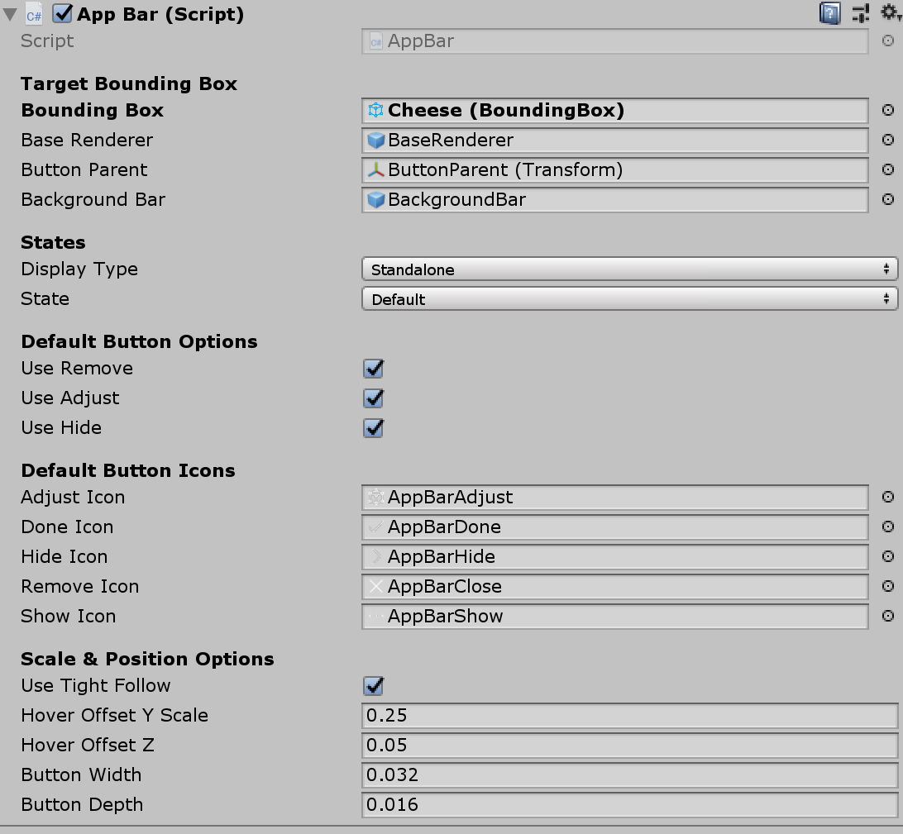

# App bar

App bar is a UI component that is used together with the [bounding box](README_BoundingBox.md) script. It adds button controls to an object with the intent to manipulate it. Using the 'Adjust' button, the bounding box interface for an object can be de- / activated. The "Remove" button should remove the object from the scene.

## How to use app bar

Drag and drop `AppBar` (Assets/MRTK/SDK/Features/UX/Prefabs/AppBar/AppBar.prefab) into the scene hierarchy. In the inspector panel of the component, assign any object with a bounding box as the *Target Bounding Box* to add the app bar to it.

**Important:** The bounding box activation option for the target object should be 'Activate Manually'.

