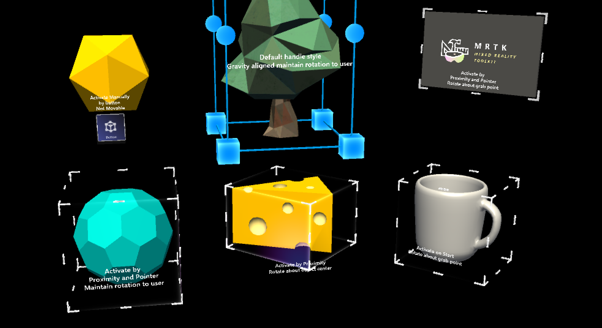

# Bounding box


The [`BoundingBox.cs`](xref:Microsoft.MixedReality.Toolkit.UI.BoundingBox) script provides basic functionality for transforming objects in mixed reality. A bounding box will show a cube around the hologram to indicate that it can be interacted with. Handles on the corners and edges of the cube allow scaling or rotating the object. The bounding box also reacts to user input. On HoloLens 2, for example, the bounding box responds to finger proximity, providing visual feedback to help perceive the distance from the object. All interactions and visuals can be easily customized.

For more information, see [Bounding box and App bar](https://docs.microsoft.com/windows/mixed-reality/app-bar-and-bounding-box) in the Windows Dev Center.

## Example scene

You can find examples of bounding box configurations in the `BoundingBoxExamples` scene.



## How to add and configure a bounding box using Unity Inspector

1. Add Box Collider to an object
2. Assign `BoundingBox` script to an object
3. Configure options, such as 'Activation' methods (see [Inspector properties](#inspector-properties) section below)
4. (Optional) Assign prefabs and materials for a HoloLens 2 style bounding box (see [Handle styles](#handle-styles) section below)

> [!NOTE]
> Use *Target Object* and *Bounds Override* field in the inspector to assign specific object and collider in the object with multiple child components.


## How to add and configure a bounding box in the code

1. Instantiate cube GameObject

    ```c#
    GameObject cube = GameObject.CreatePrimitive(PrimitiveType.Cube);
    ```

1. Assign `BoundingBox` script to an object with collider, using AddComponent<>()

    ```c#
    private BoundingBox bbox;
    bbox = cube.AddComponent<BoundingBox>();
    ```

1. Configure options (see [Inspector properties](#inspector-properties) section below)

    ```c#
    // Make the scale handles large
    bbox.ScaleHandleSize = 0.1f;
    // Hide rotation handles
    bbox.ShowRotationHandleForX = false;
    bbox.ShowRotationHandleForY = false;
    bbox.ShowRotationHandleForZ = false;
    ```

1. (Optional) Assign prefabs and materials for a HoloLens 2 style bounding box. This still requires assignments through the inspector since the materials and prefabs should be dynamically loaded.

> [!NOTE]
> Using Unity's 'Resources' folder or [Shader.Find]( https://docs.unity3d.com/ScriptReference/Shader.Find.html) for dynamically loading shaders is not recommended since shader permutations may be missing at runtime.

```c#
bbox.BoxMaterial = [Assign BoundingBox.mat]
bbox.BoxGrabbedMaterial = [Assign BoundingBoxGrabbed.mat]
bbox.HandleMaterial = [Assign BoundingBoxHandleWhite.mat]
bbox.HandleGrabbedMaterial = [Assign BoundingBoxHandleBlueGrabbed.mat]
bbox.ScaleHandlePrefab = [Assign MRTK_BoundingBox_ScaleHandle.prefab]
bbox.ScaleHandleSlatePrefab = [Assign MRTK_BoundingBox_ScaleHandle_Slate.prefab]
bbox.ScaleHandleSize = 0.016f;
bbox.ScaleHandleColliderPadding = 0.016f;
bbox.RotationHandleSlatePrefab = [Assign MRTK_BoundingBox_RotateHandle.prefab]
bbox.RotationHandleSize = 0.016f;
bbox.RotateHandleColliderPadding = 0.016f;
```

### Example: Set minimum, maximum bounding box scale using MinMaxScaleConstraint

To set the minimum and maximum scale, use the [`MinMaxScaleConstraint`](xref:Microsoft.MixedReality.Toolkit.UI.MinMaxScaleConstraint). You can also use MinMaxScaleConstraint to set minimum and maximum scale for [`ManipulationHandler`](xref:Microsoft.MixedReality.Toolkit.UI.ManipulationHandler).

```c#
GameObject cube = GameObject.CreatePrimitive(PrimitiveType.Cube);
bbox = cube.AddComponent<BoundingBox>();
// Important: BoundingBox creates a scale handler on start if one does not exist
// do not use AddComponent, as that will create a  duplicate handler that will not be used
MinMaxScaleConstraint scaleConstraint = bbox.gameObject.GetComponent<MinMaxScaleConstraint>();
scaleConstraint.ScaleMinimum = 1f;
scaleConstraint.ScaleMaximum = 2f;
```

## Example: Add bounding box around a game object

To add a bounding box around an object, simply add a `BoundingBox` component to it:

```c#
private void PutABoxAroundIt(GameObject target)
{
   target.AddComponent<BoundingBox>();
}
```

## Inspector properties

### Target object

This property specifies which object will get transformed by the bounding box manipulation. If no object is set, the bounding box defaults to the owner object.

### Bounds override

Sets a box collider from the object for bounds computation.

### Activation behavior

There are several options to activate the bounding box interface.

* *Activate On Start*: Bounding box becomes visible once the scene is started.
* *Activate By Proximity*: Bounding box becomes visible when an articulated hand is close to the object.
* *Activate By Pointer*: Bounding box becomes visible when it is targeted by a hand-ray pointer.
* *Activate Manually*: Bounding box does not become visible automatically. You can manually activate it through a script by accessing the boundingBox.Active property.

### Scale minimum

The minimum allowed scale. This property is deprecated and it is preferable to add a [`MinMaxScaleConstraint`](xref:Microsoft.MixedReality.Toolkit.UI.MinMaxScaleConstraint) script. If this script is added, the minimum scale will be taken from it instead of from the bounding box.

### Scale maximum

The maximum allowed scale. This property is deprecated and it is preferable to add a [`MinMaxScaleConstraint`](xref:Microsoft.MixedReality.Toolkit.UI.MinMaxScaleConstraint) script. If this script is added, the maximum scale will be taken from it instead of from the bounding box.

### Box display

Various bounding box visualization options.

If Flatten Axis is set to *Flatten Auto*, the script will disallow manipulation along the axis with the smallest extent. This results in a 2D bounding box, which is usually used for thin objects.

### Handles

You can assign the material and prefab to override the handle style. If no handles are assigned, they will be displayed in the default style.

## Events

Bounding box provides the following events. This example uses these events to play audio feedback.

* **Rotate Started**: Fired when rotation starts.
* **Rotate Ended**: Fired when rotation ends.
* **Scale Started**: Fires when scaling starts.
* **Scale Ended**: Fires when scaling ends.


## Handle styles

By default, when you just assign the [`BoundingBox.cs`](xref:Microsoft.MixedReality.Toolkit.UI.BoundingBox) script, it will show the handle of the HoloLens 1st gen style. To use HoloLens 2 style handles, you need to assign proper handle prefabs and materials.


Below are the prefabs, materials, and the scaling values for the HoloLens 2 style bounding box handles. You can find this example in the `BoundingBoxExamples` scene.


### Handles (Setup for HoloLens 2 style)

* **Handle Material**: BoundingBoxHandleWhite.mat
* **Handle Grabbed Material**: BoundingBoxHandleBlueGrabbed.mat
* **Scale Handle Prefab**: MRTK_BoundingBox_ScaleHandle.prefab
* **Scale Handle Slate Prefab**: MRTK_BoundingBox_ScaleHandle_Slate.prefab
* **Scale Handle Size**: 0.016 (1.6cm)
* **Scale Handle Collider Padding**: 0.016 (makes the grabbable collider slightly bigger than handle visual)
* **Rotation Handle Prefab**: MRTK_BoundingBox_RotateHandle.prefab
* **Rotation Handle Size**: 0.016
* **Rotation Handle Collider Padding**: 0.016 (makes the grabbable collider slightly bigger than handle visual)

### Proximity (Setup for HoloLens 2 style)

Show and hide the handles with animation based on the distance to the hands. It has two-step scaling animation.


* **Proximity Effect Active**: Enable proximity-based handle activation
* **Handle Medium Proximity**: Distance for the 1st step scaling
* **Handle Close Proximity**: Distance for the 2nd step scaling
* **Far Scale**: Default scale value of the handle asset when the hands are out of range of the bounding box interaction (distance defined above by 'Handle Medium Proximity'. Use 0 to hide handle by default)
* **Medium Scale**: Scale value of the handle asset when the hands are within range of the bounding box interaction (distance defined above by 'Handle Close Proximity'. Use 1 to show normal size)
* **Close Scale**: Scale value of the handle asset when the hands are within range of the grab interaction (distance defined above by 'Handle Close Proximity'. Use 1.x to show bigger size)

## Making an object movable with manipulation handler

A bounding box can be combined with [`ManipulationHandler.cs`](README_ManipulationHandler.md) to make the object movable using far interaction. The manipulation handler supports both one and two-handed interactions. [Hand tracking](Input/HandTracking.md) can be used to interact with an object up close.


In order for the bounding box edges to behave the same way when moving it using [`ManipulationHandler`](README_ManipulationHandler.md)'s far interaction, it is advised to connect its events for *On Manipulation Started* / *On Manipulation Ended* to `BoundingBox.HighlightWires` / `BoundingBox.UnhighlightWires` respectively, as shown in the screenshot above.
