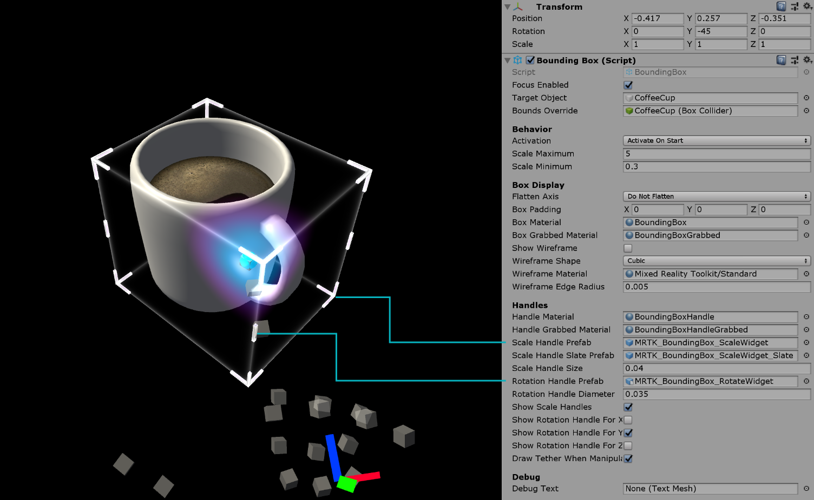

# Bounding box #

The [`BoundingBox.cs`](https://github.com/Microsoft/MixedRealityToolkit-Unity/blob/mrtk_release/Assets/MixedRealityToolkit.SDK/Features/UX/Scripts/BoundingBox/BoundingBox.cs) script provides basic functionality for transforming objects in Windows Mixed Reality. A bounding box will show a cube around the hologramm to indicate that it can be interacted with. Handles on the corners and edges of the cube allow scaling or rotating the object. The bounding box also reacts to user input. On HoloLens 2 for example the bounding box responds to finger proximity, providing visual feedback to help perceive the distance from the object. All interactions and visuals can be easily customized. 

For more information please see [App Bar and Bounding Box](https://docs.microsoft.com/en-us/windows/mixed-reality/app-bar-and-bounding-box) on Windows Dev Center.

## How to use a bounding box ##
To enable a bounding box around an object, simply assign the `BoundingBox` script to any GameObject. Note that the object will need a box collider, added in the *Bounds Override* field in the inspector.

## Making an object movable with manipulation handler ##
A bounding box can be combined with [`ManipulationHandler.cs`](README_ManipulationHandler.md) to make the object movable using far interaction. The manipulation handler supports both one and two-handed interactions. [Hand tracking](InputSystem/HandTracking.md) can be used to interact with an object up close.

In order for the bounding box edges to behave the same way when moving it using [`ManipulationHandler`](README_ManipulationHandler.md)'s far interaction, it is advised to connect its events for *On Manipulation Started* / *On Manipulation Ended* to `BoundingBox.HighlightWires` / `BoundingBox.UnhighlightWires` respectively, as shown in the screenshot above.

## Example scene ##
You can find examples using bounding box in the [HandInteractionExample scene](README_HandInteractionExamples.md).

## Inspector properties ##

**Target Object**
This property specifies which object will get transformed by the bounding box manipulation. If no object is set, the bounding box defaults to the owner object.

**Bounds Override**
Sets a box collider from the object for bounds computation.

**Activation Behavior**
There are several options to activate the bounding box interface.
 
* *Activate On Start*: Bounding Box becomes visible once the scene is started.
* *Activate By Proximity*: Bounding Box becomes visible when an articulated hand is close to the object.
* *Activate By Pointer*: Bounding Box becomes visible when it is targeted by a hand-ray pointer.
* *Activate Manually*: Bounding Box does not become visible automatically. You can manually activate it through a script by accessing the boundingBox.Active property.

**Scale Minimum**
The minimum allowed scale.

**Scale Maximum**
The maximum allowed scale.
 
**Box Display**
Various bounding box visualization options.

If Flatten Axis is set to *Flatten Auto*, the script will disallow manipulation along the axis with the smallest extent. This results in a 2D bounding box, which is usually used for thin objects.
 
**Handles**
You can assign the material and prefab to override the handle style. If no handles are assigned, they will be displayed in the default style.
 
## Events ##
Bounding box provides the following events. The example uses these events to play audio feedback.

- **Rotate Started**: Fired when rotation starts.
- **Rotate Ended**: Fired when rotation ends.
- **Scale Started**: Fires when scaling ends.
- **Scale Ended**: Fires when scaling ends.

