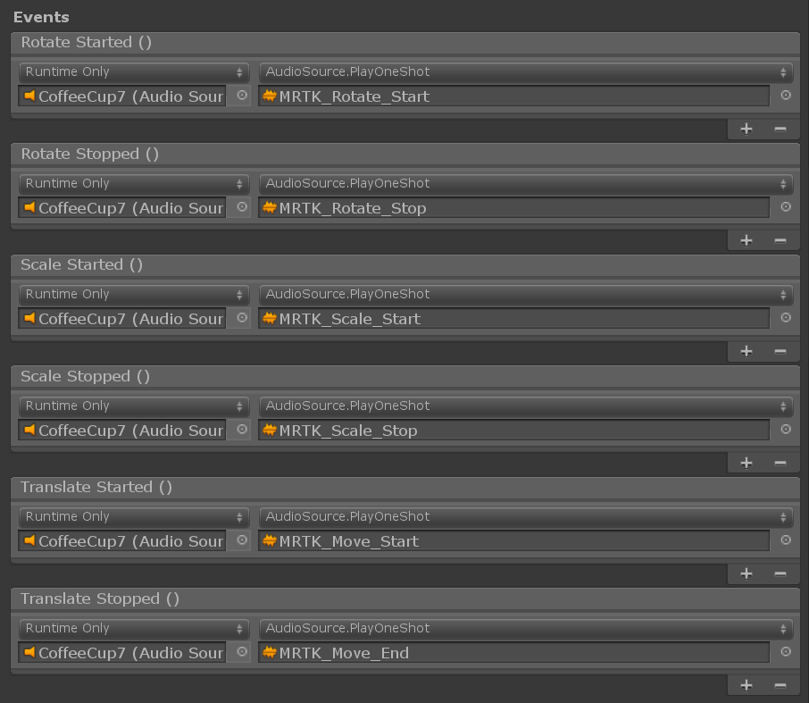

# Bounds control


*BoundsControl* is the new component for manipulation behaviour, previously found in *BoundingBox*. Bounds control makes a number of improvements and simplifications in setup and adds new features. This component is a replacement for the bounding box, which will be deprecated.

The [`BoundsControl.cs`](xref:Microsoft.MixedReality.Toolkit.UI.BoundsControl) script provides basic functionality for transforming objects in mixed reality. A bounds control will show a box around the hologram to indicate that it can be interacted with. Handles on the corners and edges of the box allow scaling, rotating or translating the object. The bounds control also reacts to user input. On HoloLens 2, for example, the bounds control responds to finger proximity, providing visual feedback to help perceive the distance from the object. All interactions and visuals can be easily customized.

## Example scene

You can find examples of bounds control configurations in the `BoundsControlExamples` scene.


## Inspector properties

### Target object

This property specifies which object will get transformed by the bounds control manipulation. If no object is setit defaults to the owner object.

### Activation behavior

There are several options to activate the bounds control interface.

* *Activate On Start*: Bounds control becomes visible once the scene is started.
* *Activate By Proximity*: Bounds control becomes visible when an articulated hand is close to the object.
* *Activate By Pointer*: Bounds control becomes visible when it is targeted by a hand-ray pointer.
* *Activate By Proximity and Pointer*: Bounds control becomes visible when it is targeted by a hand-ray pointer or an articulated hand is close to the object.
* *Activate Manually*: Bounds control does not become visible automatically. You can manually activate it through a script by accessing the boundsControl.Active property.

### Bounds override

Sets a box collider from the object for bounds computation.

### Box padding

Adds a padding to the collider bounds used to calculate the extents of the control. This will influence not only interaction but also impact the visuals. 

### Flatten axis
Indicates whether the control is flattened in one of the axes, making it 2 dimensional and disallowing manipulation along that axis. This feature can be used for thin objects like slates.
If flatten axis is set to *Flatten Auto* the script will automatically pick the axis with the smallest extent as flatten axis.

### Smoothing
The smoothing section allows to configure smoothing behavior for scale and rotate of the control.

### Visuals
The appearance of bounds control can be configured by modifying one of the corresponding visuals configurations. 
Visual configurations are either linked or inlined scriptable objects and are described in more detail in the [configuration object section](#configuration-objects).

## Configuration Objects
The control comes with a set of configuration objects that can be stored as scriptable objects and shared between different instances or prefabs. Configurations can be shared and linked either as individual scriptable asset files or nested scriptable assets inside of prefabs. Further configurations can also be defined directly on the instance without linking to an external or nested scriptable asset. 

The bounds control inspector will indicate whether a configuration is shared or inlined as part of the current instance by showing a message in the property inspector. In addition shared instances won't be editable directly in the bounds control property window itself, but instead the asset it's linking to has to be directly modfied to avoid any accidental changes on shared configurations.

Currently bounds control offers configuration objects options for the following features:
- Handles
  - [Scale handles](#scale-handles-configuration)
  - [Rotation handles](#rotation-handles-configuration)
  - [Translation handles](#translation-handles-configuration)
- [Links / Wireframe](#links-configuration)
- [Box display](#box-configuration)
- [Proximity effect](#proximity-effect-configuration)

### Box configuration
The box configuration is responsible for rendering a solid box with bounds defined via collider size and box padding. The following properties can be set up:

- **Box material**: defines the material applied to the rendered box when no interaction takes place. A box will only be rendered if this material is set.
- **Box grabbed material**: material for the box when the user interacts with the control by grabbing via near or far interaction.
- **Flatten axis display scale**: a scale that is applied to the box display if one of the axes is [flattened](#flatten-axis).

### Scale handles configuration
This property drawer allows to modify behavior and visualization of scale handles of bounds control.

- **Handle material**: material applied to the handles.
- **Handle grabbed material**: material applied to the grabbed handle.
- **Handle prefab**: optional prefab for the scale handle. If non is set MRTK will use a cube as default.
- **Handle size**: size of the scale handle.
- **Collider padding**: padding to add to the handle collider.
- **Draw tether when manipulating**: when active will draw a tether line from point of start of interaction to current hand or pointer position.
- **Handles ignore collider**: if a collider gets linked here, handles will ignore any collision with this collider.
- **Handle slate prefab**: prefab to use for the handle when the control is flattened.
- **Show scale handles**: controls visibility of the handle.
- **Scale behavior**: can be set to uniform or non-uniform scaling.

### Rotation handles configuration
This configuration defines the rotation handle behavior.

- **Handle material**: material applied to the handles.
- **Handle grabbed material**: material applied to the grabbed handle.
- **Handle prefab**: optional prefab for the handle. If non is set MRTK will use a sphere as default.
- **Handle size**: size of the handle.
- **Collider padding**: padding to add to the handle collider.
- **Draw tether when manipulating**: when active will draw a tether line from point of start of interaction to current hand or pointer position.
- **Handles ignore collider**: if a collider gets linked here, handles will ignore any collision with this collider.
- **Handle prefab collider type**: collider type to be used with the created handle.
- **Show handle for X**: controls visibility of the handle for X axis.
- **Show handle for Y**: controls visibility of the handle for Y axis.
- **Show handle for Z**: controls visibility of the handle for Z axis.

### Translation handles configuration
Allows enabling and configuring translation handles for bounds control. Note that translation handles are disabled per default.

- **Handle material**: material applied to the handles.
- **Handle grabbed material**: material applied to the grabbed handle.
- **Handle prefab**: optional prefab for the handle. If non is set MRTK will use a sphere as default.
- **Handle size**: size of the handle.
- **Collider padding**: padding to add to the handle collider.
- **Draw tether when manipulating**: when active will draw a tether line from point of start of interaction to current hand or pointer position.
- **Handles ignore collider**: if a collider gets linked here, handles will ignore any collision with this collider.
- **Handle prefab collider type**: collider type to be used with the created handle.
- **Show handle for X**: controls visibility of the handle for X axis.
- **Show handle for Y**: controls visibility of the handle for Y axis.
- **Show handle for Z**: controls visibility of the handle for Z axis.

### <a name="links-configuration">Links configuration (wireframe)</a>
The links configuration enables the wireframe feature of bounds control. The following properties can be configured:

- **Wireframe material**: the material applied to the wireframe mesh.
- **Wireframe edge radius**: the thickness of the wireframe.
- **Wireframe shape**: shape of the wireframe can by either cubic or cylindrical.
- **Show wireframe**: controls visibility of the wireframe.

### Proximity effect configuration
Show and hide the handles with animation based on the distance to the hands. It has two-step scaling animation. Defaults are set to Hololens 2 style behavior.


- **Proximity Effect Active**: Enable proximity-based handle activation
- **Object Medium Proximity**: Distance for the 1st step scaling
- **Object Close Proximity**: Distance for the 2nd step scaling
- **Far Scale**: Default scale value of the handle asset when the hands are out of range of the bounds control interaction (distance defined above by 'Handle Medium Proximity'. Use 0 to hide handle by default)
- **Medium Scale**: Scale value of the handle asset when the hands are within range of the bounds control interaction (distance defined above by 'Handle Close Proximity'. Use 1 to show normal size)
- **Close Scale**: Scale value of the handle asset when the hands are within range of the grab interaction (distance defined above by 'Handle Close Proximity'. Use 1.x to show bigger size)
- **Far Grow Rate**: Rate a proximity scaled object scales when the hand moves from medium to far proximity.
- **Medium Grow Rate**: Rate a proximity scaled object scales when the hand moves from medium to close proximity.
- **Close Grow Rate**: Rate a proximity scaled object scales when the hand moves from close proximity to object center.


## Constraint System
Bounds control supports using the [constraint manager](README_ConstraintManager.md) to limit or modify translation, rotation or scaling behavior while using bounds control handles.

The property inspector will show all available constraint managers attached to the same game object in a dropwdown with an option to scroll and highlight the selected constraint manager.


## Events

Bounds control provides the following events. This example uses these events to play audio feedback.

* **Rotate Started**: Fired when rotation starts.
* **Rotate Stopped**: Fired when rotation stops.
* **Scale Started**: Fires when scaling starts.
* **Scale Stopped**: Fires when scaling stops.
* **Translate Started**: Fires when translation starts.
* **Translate Stopped**: Fires when translation stops.



## Elastics (Experimental)
Elastics can be used when manipulating objects via bounds control. Note that the [elastics system](Elastics/ElasticSystem.md) is still in experimental state. To enable elastics either link an existing elastics manager component or create and link a new elastics manager via the `Add Elastics Manager` button.


## Handle styles

By default, when you just assign the [`BoundsControl.cs`](xref:Microsoft.MixedReality.Toolkit.UI.BoundsControl) script, it will show the handle of the HoloLens 1st gen style. To use HoloLens 2 style handles, you need to assign proper handle prefabs and materials.


Below are the prefabs, materials, and the scaling values for the HoloLens 2 style bounds control handles. You can find this example in the `BoundsControlExamples` scene.


### Handles (Setup for HoloLens 2 style)

* **Handle Material**: BoundingBoxHandleWhite.mat
* **Handle Grabbed Material**: BoundingBoxHandleBlueGrabbed.mat
* **Scale Handle Prefab**: MRTK_BoundingBox_ScaleHandle.prefab
* **Scale Handle Slate Prefab**: MRTK_BoundingBox_ScaleHandle_Slate.prefab
* **Scale Handle Size**: 0.016 (1.6cm)
* **Scale Handle Collider Padding**: 0.016 (makes the grabbable collider slightly bigger than handle visual)
* **Rotation Handle Prefab**: MRTK_BoundingBox_RotateHandle.prefab
* **Rotation Handle Size**: 0.016
* **Rotation Handle Collider Padding**: 0.016 (makes the grabbable collider slightly bigger than handle visual)


## Transformation changes with object manipulator

A bounds control can be used in combination with [`ObjectManipulator.cs`](README_ObjectManipulator.md) to allow for certain types of manipulation (eg. moving the object) without using handles. The manipulation handler supports both one and two-handed interactions. [Hand tracking](Input/HandTracking.md) can be used to interact with an object up close.


In order for the bounds control edges to behave the same way when moving it using [`ObjectManipulator`](README_ObjectManipulator.md)'s far interaction, it is advised to connect its events for *On Manipulation Started* / *On Manipulation Ended* to `BoundsControl.HighlightWires` / `BoundsControl.UnhighlightWires` respectively, as shown in the screenshot above.


## How to add and configure a bounds control using Unity Inspector

1. Add Box Collider to an object
2. Assign `BoundsControl` script to an object
3. Configure options, such as 'Activation' methods (see [Inspector properties](#inspector-properties) section below)
4. (Optional) Assign prefabs and materials for a HoloLens 2 style bounds control (see [Handle styles](#handle-styles) section below)

> [!NOTE]
> Use *Target Object* and *Bounds Override* field in the inspector to assign specific object and collider in the object with multiple child components.


## How to add and configure a bounds control in the code

1. Instantiate cube GameObject

    ```c#
    GameObject cube = GameObject.CreatePrimitive(PrimitiveType.Cube);
    ```

1. Assign `BoundsControl` script to an object with collider, using AddComponent<>()

    ```c#
    private BoundsControl boundsControl;
    boundsControl = cube.AddComponent<BoundsControl>();
    ```

1. Configure options either directly on the control or via one of the scriptable configurations (see [Inspector properties](#inspector-properties) and [Configurations](#configuration-objects) section below)

    ```c#
	// Change activation method
	boundsControl.BoundsControlActivation = BoundsControlActivationType.ActivateByProximityAndPointer;
    // Make the scale handles large
    boundsControl.ScaleHandlesConfig.HandleSize = 0.1f;
    // Hide rotation handles for x axis
    boundsControl.RotationHandlesConfig.ShowRotationHandleForX = false;
    ```

1. (Optional) Assign prefabs and materials for a HoloLens 2 style bounds control. This still requires assignments through the inspector since the materials and prefabs should be dynamically loaded.

> [!NOTE]
> Using Unity's 'Resources' folder or [Shader.Find]( https://docs.unity3d.com/ScriptReference/Shader.Find.html) for dynamically loading shaders is not recommended since shader permutations may be missing at runtime.

```c#
BoxDisplayConfiguration boxConfiguration = boundsControl.BoxDisplayConfig;
boxConfiguration.BoxMaterial = [Assign BoundingBox.mat]
boxConfiguration.BoxGrabbedMaterial = [Assign BoundingBoxGrabbed.mat]
ScaleHandlesConfiguration scaleHandleConfiguration = boundsControl.ScaleHandlesConfig;
scaleHandleConfiguration.HandleMaterial = [Assign BoundingBoxHandleWhite.mat]
scaleHandleConfiguration.HandleGrabbedMaterial = [Assign BoundingBoxHandleBlueGrabbed.mat]
scaleHandleConfiguration.HandlePrefab = [Assign MRTK_BoundingBox_ScaleHandle.prefab]
scaleHandleConfiguration.HandleSlatePrefab = [Assign MRTK_BoundingBox_ScaleHandle_Slate.prefab]
scaleHandleConfiguration.HandleSize = 0.016f;
scaleHandleConfiguration.ColliderPadding = 0.016f;
RotationHandlesConfiguration rotationHandleConfiguration = boundsControl.RotationHandlesConfig;
rotationHandleConfiguration.HandleMaterial = [Assign BoundingBoxHandleWhite.mat]
rotationHandleConfiguration.HandleGrabbedMaterial = [Assign BoundingBoxHandleBlueGrabbed.mat]
rotationHandleConfiguration.HandlePrefab = [Assign MRTK_BoundingBox_RotateHandle.prefab]
rotationHandleConfiguration.HandleSize = 0.016f;
rotationHandleConfiguration.ColliderPadding = 0.016f;
```

### Example: Set minimum, maximum bounds control scale using MinMaxScaleConstraint

To set the minimum and maximum scale, attach a [`MinMaxScaleConstraint`](xref:Microsoft.MixedReality.Toolkit.UI.MinMaxScaleConstraint) to your constrol. As bounds control automatically attaches and activates constraint manager the MinMaxScaleConstraint will be automatically applied to the transformation changes once it's attached and configured. 

You can also use MinMaxScaleConstraint to set minimum and maximum scale for [`ObjectManipulator`](xref:Microsoft.MixedReality.Toolkit.UI.ObjectManipulator).

```c#
GameObject cube = GameObject.CreatePrimitive(PrimitiveType.Cube);
bcontrol = cube.AddComponent<BoundsControl>();
// Important: BoundsControl creates a constraint manager on start if one does not exist.
// There's no need to manually attach a constraint manager.
MinMaxScaleConstraint scaleConstraint = bcontrol.gameObject.AddComponent<MinMaxScaleConstraint>();
scaleConstraint.ScaleMinimum = 1f;
scaleConstraint.ScaleMaximum = 2f;
```

## Example: Add bounds control around a game object

To add a bounds control around an object, simply add a `BoundsControl` component to it:

```c#
private void PutABoundsControlAroundIt(GameObject target)
{
   target.AddComponent<BoundsControl>();
}
```

## Migrating from Bounding Box
Existing prefabs and instances using [bounding box](README_BoundingBox.md) can be upgraded to the new bounds control via the [migration window](Tools/MigrationWindow.md) which is part of the MRTK tools package.

For upgrading individual instances of bounding box there's also an a migration option inside the property inspector of the component.


## See also

- [Object manipulator](README_ObjectManipulator.md)
- [Constraint manager](README_ConstraintManager.md)
- [Migration window](Tools/MigrationWindow.md)
- [Elastics system (Experimental)](Elastics/ElasticSystem.md)