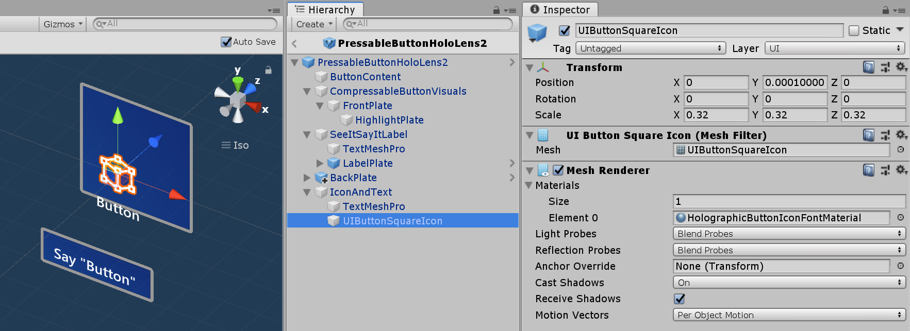
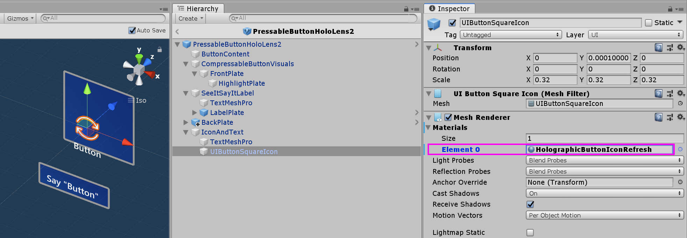

# Button

A button gives the user a way to trigger an immediate action. It is one of the most foundational components in mixed reality. MRTK provides various types of button prefabs.

## Button prefabs in MRTK

Examples of the button prefabs under ``MixedRealityToolkit.SDK/Features/UX/Interactable/Prefabs`` folder

### Unity UI Image/Graphic based buttons

* [`UnityUIInteractableButton.prefab`](https://github.com/Microsoft/MixedRealityToolkit-Unity/blob/mrtk_release/Assets/MixedRealityToolkit.SDK/Features/UX/Interactable/Prefabs/UnityUIInteractableButton.prefab)
* [`PressableButtonUnityUI.prefab`](https://github.com/Microsoft/MixedRealityToolkit-Unity/blob/mrtk_release/Assets/MixedRealityToolkit.SDK/Features/UX/Interactable/Prefabs/PressableButtonUnityUI.prefab)
* [`PressableButtonUnityUICircular.prefab`](https://github.com/Microsoft/MixedRealityToolkit-Unity/blob/mrtk_release/Assets/MixedRealityToolkit.SDK/Features/UX/Interactable/Prefabs/PressableButtonUnityUICircular.prefab)
* [`PressableButtonHoloLens2UnityUI.prefab`](https://github.com/Microsoft/MixedRealityToolkit-Unity/blob/mrtk_release/Assets/MixedRealityToolkit.SDK/Features/UX/Interactable/Prefabs/PressableButtonHoloLens2UnityUI.prefab)

### Collider based buttons

|   PressableButtonHoloLens2 |  PressableButtonHoloLens2Unplated |  PressableButtonHoloLens2Circular |
|:--- | :--- | :--- |
| HoloLens 2's shell-style button with backplate which supports various visual feedback such as border light, proximity light, and compressed front plate | HoloLens 2's shell-style button without backplate  | HoloLens 2's shell-style button with circular shape  |
|   **PressableButtonHoloLens2_32x96** |  **PressableButtonHoloLens2Bar3H** |  **PressableButtonHoloLens2Bar3V** |
| Wide HoloLens 2's shell-style button 32x96mm | Horizontal HoloLens 2 button bar with shared backplate | Vertical HoloLens 2 button bar with shared backplate |
|   **Radial** |  **Checkbox** |  **ToggleSwitch** |
| Radial button | Checkbox  | Toggle switch |
|   **ButtonHoloLens1** |  **PressableRoundButton** |  **Button** |
| HoloLens 1st gen's shell style button | Round shape push button | Basic button |

The [`Button.prefab`](https://github.com/Microsoft/MixedRealityToolkit-Unity/blob/mrtk_release/Assets/MixedRealityToolkit.SDK/Features/UX/Interactable/Prefabs/Button.prefab) is based on the [Interactable](README_Interactable.md) concept to provide easy UI controls for buttons or other types of interactive surfaces. The baseline button supports all available input methods, including articulated hand input for the near interactions as well as gaze + air-tap for the far interactions. You can also use voice command to trigger the button.

[`PressableButtonHoloLens2.prefab`](https://github.com/Microsoft/MixedRealityToolkit-Unity/blob/mrtk_release/Assets/MixedRealityToolkit.SDK/Features/UX/Interactable/Prefabs/PressableButtonHoloLens2.prefab) is HoloLens 2's shell style button that supports the precise movement of the button for the direct hand tracking input. It combines `Interactable` script with `PressableButton` script.

## How to use pressable buttons

### Unity UI based buttons

Create a Canvas with

* Render Mode set to World Space
* A scale of 0.001
* CanvasUtility component

Then drag [`PressableButtonUnityUI.prefab`](https://github.com/Microsoft/MixedRealityToolkit-Unity/blob/mrtk_release/Assets/MixedRealityToolkit.SDK/Features/UX/Interactable/Prefabs/PressableButtonUnityUI.prefab), [`PressableButtonUnityUICircular.prefab`](https://github.com/Microsoft/MixedRealityToolkit-Unity/blob/mrtk_release/Assets/MixedRealityToolkit.SDK/Features/UX/Interactable/Prefabs/PressableButtonUnityUICircular.prefab), or [`PressableButtonHoloLens2UnityUI.prefab`](https://github.com/Microsoft/MixedRealityToolkit-Unity/blob/mrtk_release/Assets/MixedRealityToolkit.SDK/Features/UX/Interactable/Prefabs/PressableButtonHoloLens2UnityUI.prefab) onto the canvas.

### Collider based buttons

Simply drag [`PressableButtonHoloLens2.prefab`](https://github.com/Microsoft/MixedRealityToolkit-Unity/blob/mrtk_release/Assets/MixedRealityToolkit.SDK/Features/UX/Interactable/Prefabs/PressableButtonHoloLens2.prefab), , or [`PressableButtonHoloLens2Unplated.prefab`](https://github.com/Microsoft/MixedRealityToolkit-Unity/blob/mrtk_release/Assets/MixedRealityToolkit.SDK/Features/UX/Interactable/Prefabs/PressableButtonHoloLens2Unplated.prefab) into the scene. These button prefabs are already configured to have audio-visual feedback for the various types of inputs, including articulated hand input and gaze.

The events exposed in the prefab itself as well as the [Interactable](README_Interactable.md) component can be used to trigger additional actions. The pressable buttons in the [HandInteractionExample scene](README_HandInteractionExamples.md) use Interactable's *OnClick* event to trigger a change in the color of a cube. This event gets triggered for different types of input methods such as gaze, air-tap, hand-ray, as well as physical button presses through the pressable button script.

You can configure when the pressable button fires the *OnClick* event via the `PhysicalPressEventRouter` on the button. For example, you can set *OnClick* to fire when the button is first pressed, as opposed to be pressed and released, by setting *Interactable On Click* to *Event On Press*.

To leverage specific articulated hand input state information, you can use pressable buttons events - *Touch Begin*, *Touch End*, *Button Pressed*, *Button Released*. These events will not fire in response to air-tap, hand-ray, or eye inputs, however.

## Interaction States

In the idle state, the button's front plate is not visible. As a finger approaches or a cursor from gaze input targets the surface, the front plate's glowing border becomes visible. There is additional highlighting of the fingertip position on the front plate surface. When pushed with a finger, the front plate moves with the fingertip. When the fingertip touches the surface of the front plate, it shows a subtle pulse effect to give visual feedback of the touch point.

The subtle pulse effect is triggered by the pressable button, which looks for *ProximityLight(s)* that live on the currently interacting pointer. If any proximity lights are found, the `ProximityLight.Pulse` method is called, which automatically animates shader parameters to display a pulse.

## Inspector properties

**Box Collider**
`Box Collider` for the button's front plate.

**Pressable Button**
The logic for the button movement with hand press interaction.

**Physical Press Event Router**
This script sends events from hand press interaction to [Interactable](README_Interactable.md).

**Interactable**
[Interactable](README_Interactable.md) handles various types of interaction states and events. HoloLens gaze, gesture, and voice input and immersive headset motion controller input are directly handled by this script.

**Audio Source**
Unity audio source for the audio feedback clips.

*NearInteractionTouchable.cs*
Required to make any object touchable with articulated hand input.

## Prefab Layout

The *ButtonContent* object contains front plate, text label and icon. The *FrontPlate* responds to the proximity of the index fingertip using the *Button_Box* shader. It shows glowing borders, proximity light, and a pulse effect on touch. The text label is made with TextMesh Pro. *SeeItSayItLabel*'s visibility is controlled by [Interactable](README_Interactable.md)'s theme.

## How to change the icon and text

To change the text of the button, update the *Text* component of the *TextMeshPro* object under *IconAndText*. Changing the icon can be done by replacing the material that is assigned to *UIButtonSquareIcon* object. By default, *HolographicButtonIconFontMaterial* is assigned. 

To create a new icon material, duplicate one of the existing icon materials. These can be found under ``MixedRealityToolkit.SDK/Features/UX/Interactable/Materials`` folder. 

Create a new PNG texture and import into Unity. Use existing icon PNG file examples as reference. ``MixedRealityToolkit.SDK/Features/UX/Interactable/Textures`` 

Drag and drop newly created PNG texture onto the *Albedo* property in the material.

Assgin the material to the *UIButtonSquareIcon* object.

## Voice command ('See-it, Say-it')

**Speech Input Handler**
The [Interactable](README_Interactable.md) script in Pressable Button already implements `IMixedRealitySpeechHandler`. A voice command keyword can be set here.

**Speech Input Profile**
Additionally, you need to register the voice command keyword in the global *Speech Commands Profile*.

**See-it, Say-it label**
The pressable button prefab has a placeholder TextMesh Pro label under the *SeeItSayItLabel* object. You can use this label to communicate the voice command keyword for the button to the user.

## How to make a button from scratch

You can find the examples of these buttons in the **PressableButtonExample** scene.

### 1. Creating a Pressable Button with Cube (Near interaction only)

1. Create a Unity Cube (GameObject > 3D Object > Cube)
2. Add `PressableButton.cs` script
3. Add `NearInteractionTouchable.cs` script

In the `PressableButton`'s Inspector panel, assign the cube object to the **Moving Button Visuals**.

When you select the cube, you will see multiple colored layers on the object. This visualizes the distance values under **Press Settings**. Using the handles, you can configure when to start press (move the object) and when to trigger event.

When you press the button, it will move and generate proper events exposed in the `PressableButton.cs` script such as TouchBegin(), TouchEnd(), ButtonPressed(), ButtonReleased().

### 2. Adding visual feedback to the basic cube button

MRTK Standard Shader provides various features that makes it easy to add visual feedback. Create an material and select shader `Mixed Reality Toolkit/Standard`. Or you can use or duplicate one of the existing materials under `/SDK/StandardAssets/Materials/` that uses MRTK Standard Shader.

Check `Hover Light` and `Proximity Light` under **Fluent Options**. This enables visual feedback for both near hand(Proximity Light) and far pointer(Hover Light) interactions.

### 3. Adding audio feedback to the basic cube button

Since `PressableButton.cs` script exposes events such as TouchBegin(), TouchEnd(), ButtonPressed(), ButtonReleased(), we can easily assign audio feedback. Simply add Unity's `Audio Source` to the cube object then assign audio clips by selecting AudioSource.PlayOneShot(). You can use MRTK_Select_Main and MRTK_Select_Secondary audio clips under `/SDK/StandardAssets/Audio/` folder.

### 4. Adding visual states and handle far interaction events

[Interactable](README_Interactable.md) is a script that makes it easy to create a visual states for the various types of input interactions. It also handles far interaction events. Add `Interactable.cs` and drag and drop the cube object onto the **Target** field under **Profiles**. Then, create a new Theme with a type **ScaleOffsetColorTheme**. Under this theme, you can specify the color of the object for the specific interaction states such as **Focus** and **Pressed**. You can also control Scale and Offset as well. Check **Easing** and set duration to make the visual transition smooth.

You will see the object responds to both far(hand ray or gaze cursor) and near(hand) interactions.

## Custom Button Examples ##

In the [HandInteractionExample scene](README_HandInteractionExamples.md), you can take a look at the piano and round button examples which are both using `PressableButton`. 

Each piano key has a `PressableButton` and a `NearInteractionTouchable` script assigned. It is important to verify that the *Local Forward* direction of `NearInteractionTouchable` is correct. It is represented by a white arrow in the editor. Make sure the arrow points away from the button's front face:

## See also

* [Interactable](README_Interactable.md)
* [Visual Themes](VisualThemes.md)
