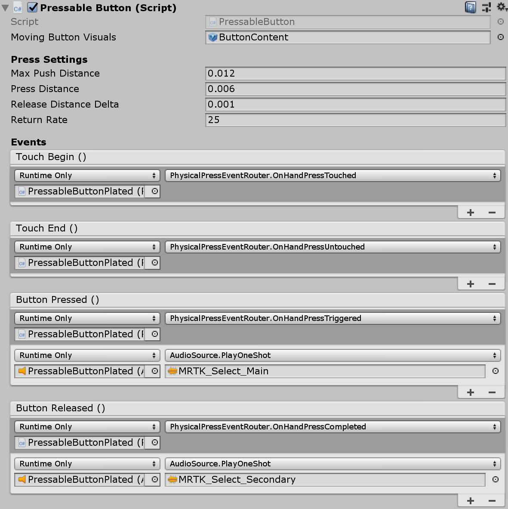
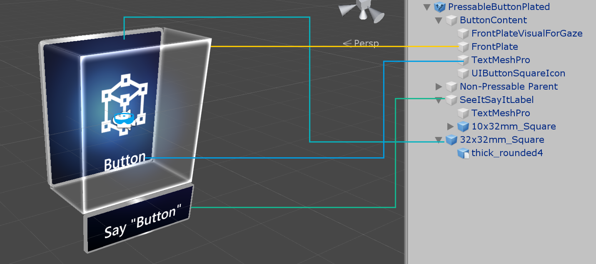

# Button #

The button supports all available input methods including articulated hand input for the near interactions and gaze + air-tap for the far interactions. You can also use voice command to trigger the button.

## How to use the Pressable Button prefab
Simply drag [PressableButton.prefab](https://github.com/Microsoft/MixedRealityToolkit-Unity/blob/mrtk_release/Assets/MixedRealityToolkit.SDK/Features/UX/Interactable/Prefabs/PressableButton.prefab) or [PressableButtonPlated.prefab](https://github.com/Microsoft/MixedRealityToolkit-Unity/blob/mrtk_release/Assets/MixedRealityToolkit.SDK/Features/UX/Interactable/Prefabs/PressableButtonPlated.prefab) into the scene. These button prefabs are already configured to have audio-visual feedback for the various types of inputs, including articulated hand input and gaze. The events exposed in the `PressableButton` and the [`Interactable`](README_Interactable.md) component can be used to trigger additional actions. 

The Pressable Buttons in the HandInteractionExamples scene use [`Interactable`](README_Interactable.md)'s *OnClick* event to trigger a change in the color of a cube. This event gets triggered for different types of input methods such as gaze, air-tap, hand-ray, as well as physical button presses through the `PressableButton` script.

You can configure when the `PressableButton` fires the [`Interactable`](README_Interactable.md)'s *OnClick* event via the `PhysicalPressEventRouter` on the button. For example, you can set *OnClick* to fire when the button is first pressed, as opposed to be pressed, and then released, by setting *Interactable On Click* to *Event On Press*.

To leverage specific articulated hand input state information, you can use `PressableButton`'s events - *Touch Begin*, *Touch End*, *Button Pressed*, *Button Released*. These events will not fire in response to air-tap, hand-ray, or eye inputs, however.

## Interaction States
In the idle state, the button's front plate is not visible. As a finger approaches or a cursor from gaze input targets the surface, the front plate's glowing border becomes visible. There is additional highlighting of the fingertip position on the front plate surface. When pushed with a finger, the front plate moves with the fingertip. When the fingertip touches the surface of the front plate, it shows a subtle pulse effect to give visual feedback of the touch point.

The subtle pulse effect is triggered by the `PressableButton.` The `PressableButton` looks for `ProximityLight(s)` that live on the currently interacting pointer. If any `ProximityLight(s)` are found, the ProximityLight.Pulse method is called which automatically animates shader parameters to display a pulse.

## Property Inspector of PressableButton 

The Pressable Button prefab is consists of the following elements:

#### Box Collider
`Box Collider` for the button's front plate.

#### Pressable Button
The logic for the button movement with hand press interaction.

#### Physical Press Event Router
This script sends events from hand press interaction to [`Interactable`](README_Interactable.md).

#### Interactable
[`Interactable`](README_Interactable.md) handles various types of interaction states and events. HoloLens gaze, gesture, and voice input and immersive headset motion controller input are directly handled by this script.

#### Audio Source
Unity `Audio Source` for the audio feedback clips

#### NearInteractionTouchable.cs
Required to make any object touchable with articulated hand input.

### Prefab Layout

The *ButtonContent* object contains front plate, text label and icon. The *FrontPlate* responds to the proximity of the index fingertip using the *Button_Box* shader. It shows glowing borders, proximity light, and a pulse effect on touch. The text label is made with TextMesh Pro. *SeeItSayItLabel*'s visibility is controlled by [`Interactable`](README_Interactable.md)'s theme.

## Voice command ('See-it, Say-it')

#### Speech Input Handler
The [`Interactable`](README_Interactable.md) script in Pressable Button already implements IMixedRealitySpeechHandler. A voice command keyword can be set here. 

#### Speech Input Profile
Additionally, you need to register the voice command keyword in the global `Speech Commands Profile`. 

#### See-it, Say-it label
The Pressable Button prefab has a placeholder TextMesh Pro label under the *SeeItSayItLabel* object. You can use this label to communicate the voice command keyword for the button to the user.

## Using PressableButton on other types of objects

You can use the `PressableButton`s script to configure an object to react to finger pushes.

In the HandInteractionExamples scene, you can take a look at the piano and round button examples which are both using `PressableButton`. 

Each piano key has a `PressableButton` and a `NearInteractionTouchable` script assigned. It is important to verify that the *Local Forward* direction of `NearInteractionTouchable` is correct. It is represented by a white arrow in the editor. Make sure the arrow points away from the button's front face:

