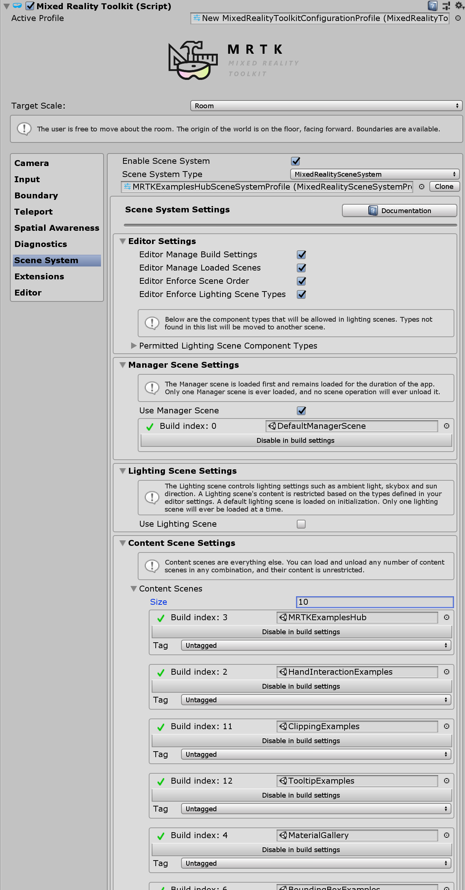
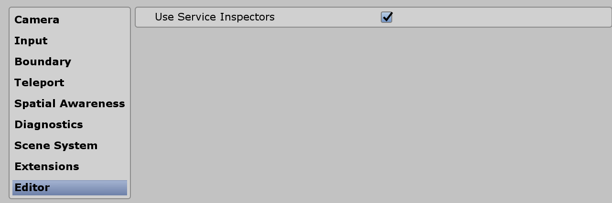

# MRTK Examples Hub #


MRTK Examples Hub is a Unity scene that makes it easy to experience multiple scenes. It uses MRTK's Scene System to load & unload the scenes. 

## Scene System Setup ##
1. In the MRTK Profile, enable **Scene System** and select **MRTKExamplesHubSceneSystemProfile** which is located at ``MixedRealityToolkit.Examples/Demos/ExamplesHub/Profiles/`` folder. This Scene System Profile contains the list of the scenes that are defined in the Hub's cube buttons. <br/><br/>

2. Check **Use Service Inspectors** in the **Editor** menu. This allows us to select Scene System service in the Unity's Hierarchy.
<br/><br/>

3. Open **DefaultManagerScene** and select **MixedRealitySceneSystem** in the Hiearchy. It will display Scene System's information in the Inspector panel. On the bottom of the Inspector, it displays the list of the scenes defined in the Scene System Profile. You can click the scene names to load/unload them. 
<br/><br/>Example of loading MRTKExamplesHub scene by clicking the scene name in the list.
<br/><br/>Examples of loading HandInteractionExamples scene.
<br/><br/>You can load multiple scenes.

4. To build and deploy, simply build **DefaultManagerScene** with other scenes that are included in the Scene System's list. The inspector also makes it easy to add scenes to the Build Settings.

## How MRTKExamplesHub loads a scene ##
In the MRTKExamplesHub scene, you can find the ``ExamplesHubButton`` prefab. There is **FrontPlate** object in the prefab which contains ``Interactable``. Using Interactable's ``OnClick()`` and ``OnTouch()`` event, it triggers **LoadContentScene** script's **LoadContent()** function. In the **LoadContentScene** script's Inspector, you can define the scene name to load.
<br/><br/>
<br/><br/>
<br/><br/>

The script uses Scene System's LoadContent() function to load the scene. Please refer to the [Scene System](SceneSystem/SceneSystemGetingStarted.md) page for more details.
```csharp
MixedRealityToolkit.SceneSystem.LoadContent(contentName, loadSceneMode);
```
 
## Adding additional buttons ##
In the **CubeCollection** object, duplicate(or add) ExampleHubButton prefabs and click **Update Collection** in the ``GridObjectCollection``. This will update the cylinder layout based on the new total number of the buttons. Please refer to the [Object Collection](README_ObjectCollection.md) page for more details.
<br/><br/>
<br/><br/>

After adding the buttons, update the scene name in the **LoadContentScene** script(explained above). Add additional scene to the Scene System's profile.

