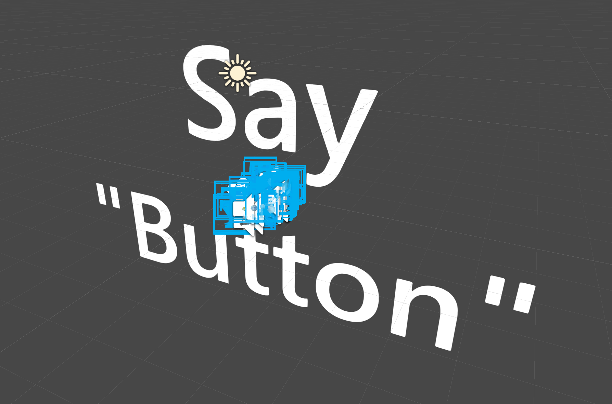

# Hand Interaction Examples scene

In this example scene, you can find various types of interactions and UI controls that supports HoloLens2's articulated hand input.
You can find the **HandInteractionExamples.unity** scene under **Assets\MixedRealityToolkit.Examples\Demos\HandTracking\Scenes**

*This example scene uses **TextMesh Pro**. Please click **'Import TMP Essentials'** button when you see this prompt. Unity will import TextMesh Pro packages*

*If you see big text after TextMesh Pro import, please open other Unity scene and open this scene again.*

## Pressable Button
See [Button](README_Button.md) page for the details.

## Bounding Box
See [Bounding Box](README_BoundingBox.md) page for the details.

## Manipulation Handler
See [Manipulation Handler](README_ManipulationHandler.md) page for the details.

## Slate
See [Slate](README_Slate.md) page for the details.

## System Keyboard
See [System Keyboard](README_SystemKeyboard.md) page for the details.

