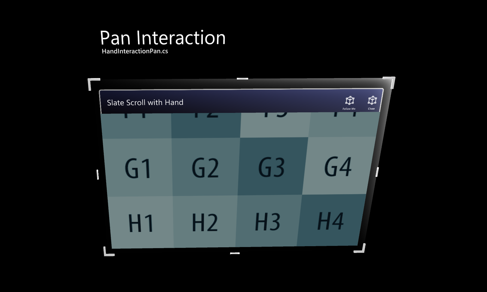

# Hand interaction examples scene

The `HandInteractionExamples` (Assets/MRTK/Examples/Demos/HandTracking/Scenes/HandInteractionExamples.unity) example scene contains various types of interactions and UI controls that highlight articulated hand input.

> [!NOTE]
> This example scene uses *TextMesh Pro*. To open the scene, click *'Import TMP Essentials'* when the respective prompt is shown during the import of the scene. Unity will then import TextMesh Pro packages.

If you see large text after the TextMesh Pro import, open another Unity scene and then open the example scene again.

## Pressable button

See [button](README_Button.md) page for the details.

## Bounding box

See [bounding box](README_BoundingBox.md) page for the details.

## Manipulation handler

See [manipulation handler](README_ManipulationHandler.md) page for the details.

## Slate

See [slate](README_Slate.md) page for the details.

## System keyboard

See [system keyboard](README_SystemKeyboard.md) page for the details.

