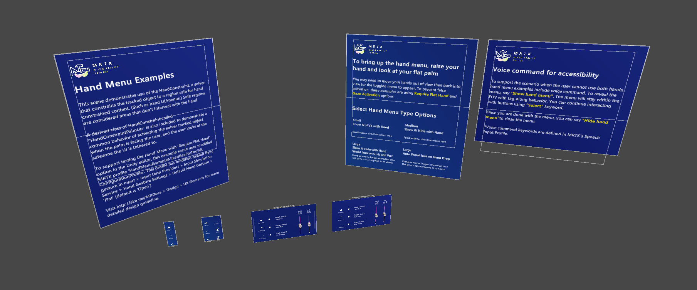
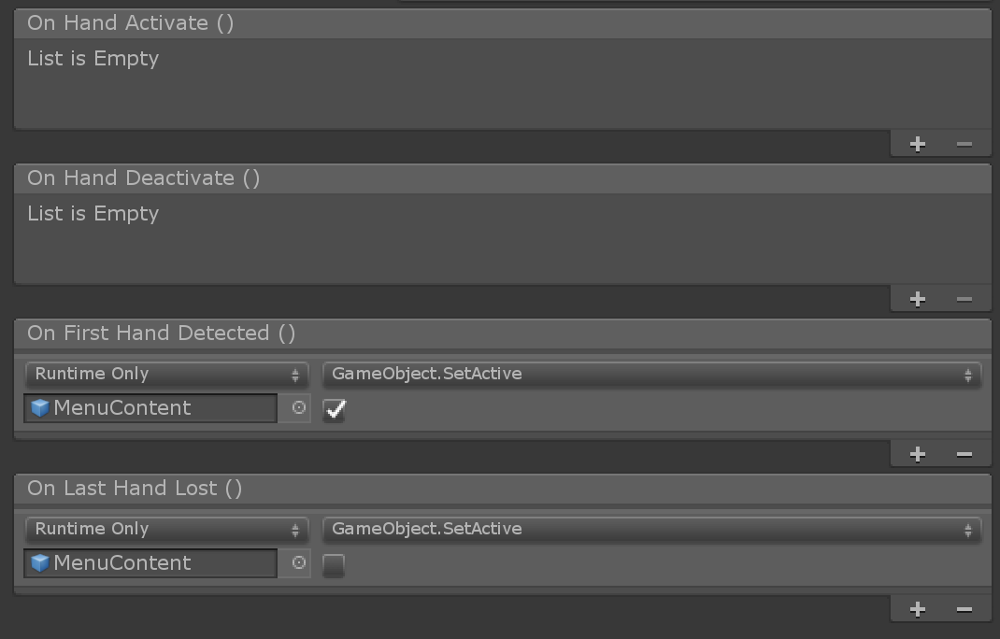
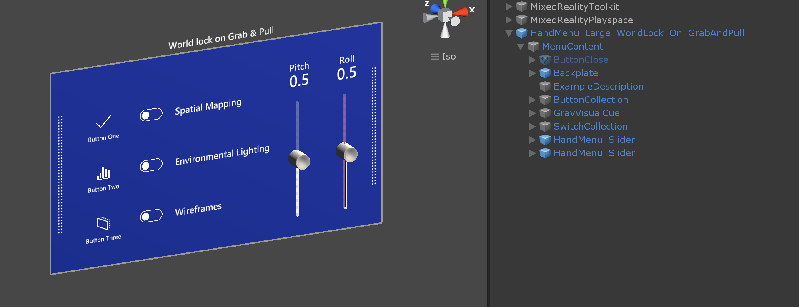
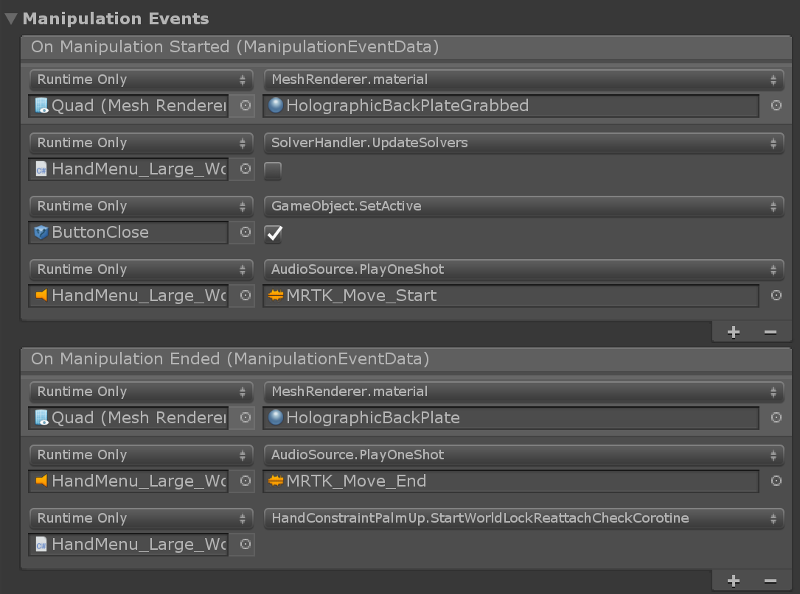
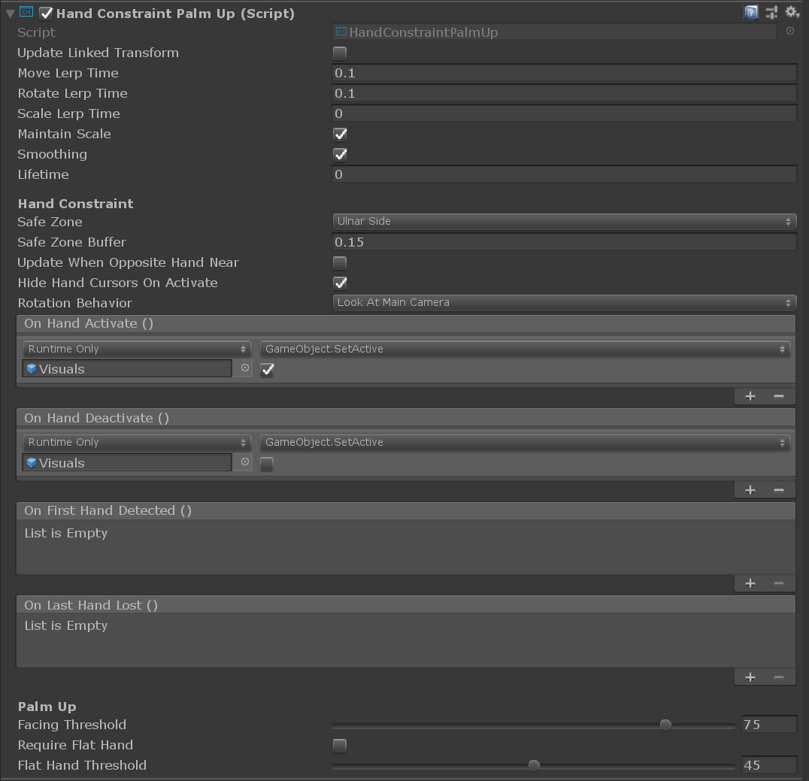

# Hand menu

Hand menus allow users to quickly bring up hand-attached UI for frequently used functions. To prevent false activation while interacting with other objects, hand menu provides options such as 'Require Flat Hand' and 'Use Gaze Activation'. It is recommended to use these options to prevent unwanted activation.

## Hand menu examples

**HandMenuExamples.unity** scene is under ``MRTK/Examples/Demos/HandTracking/Scenes`` folder. When it is running, the scene will only activate currently selected menu type.
 

You can find these hand menu prefabs under ``MRTK/Examples/Demos/HandTracking/Prefabs`` folder.

### HandMenu_Small_HideOnHandDrop and HandMenu_Medium_HideOnHandDrop

These two examples simply activate and deactivate the MenuContent object to show and hide menu on **OnFirstHandDetected()** and **OnLastHandLost()** event.
 
 

### HandMenu_Large_WorldLock_On_GrabAndPull

For more complex menus that require longer interaction time, it is recommended to world-lock the menu. In this example, the user can grab and pull to world-lock the menu, in addition to activating and deactivating the MenuContent on **OnFirstHandDetected()** and **OnLastHandLost()** events.
 

Backplate's `ManipulationHandler` makes it grabbable and movable. **On Manipulation Started** event, **SolverHandler.UpdateSolvers** is deactivated to world-lock the menu. Additionally, it shows the **Close button** to allow the user to close the menu when the task is finished. **On Manipulation Ended** event, it calls **HandConstraintPalmUp.StartWorldLockReattachCheckCoroutine** to allow the user bring the menu back to hand by raising and looking at the palm.
 

**Close** button reactivates **SolverHandler.UpdateSolvers** and hide the **MenuContent**.
 

### HandMenu_Large_AutoWorldLock_On_HandDrop

This example is similar to HandMenu_Large_WorldLock_On_GrabAndPull. The only difference is that the menu will be automatically world-locked on hand drop. This is done by simply not hiding the MenuContent on **OnLastHandLost()** event. Grab & pull behavior is same as HandMenu_Large_WorldLock_On_GrabAndPull example.

## Scripts

The [`HandConstraint`](xref:Microsoft.MixedReality.Toolkit.Utilities.Solvers.HandConstraint) behavior provides a solver that constrains the tracked object to a region safe for hand constrained content (such as hand UI, menus, etc). Safe regions are considered areas that don't intersect with the hand. A derived class of [`HandConstraint`](xref:Microsoft.MixedReality.Toolkit.Utilities.Solvers.HandConstraint) called [`HandConstraintPalmUp`](xref:Microsoft.MixedReality.Toolkit.Utilities.Solvers.HandConstraintPalmUp) is also included to demonstrate a common behavior of activating the solver tracked object when the palm is facing the user.

Please see the tool tips available for each [`HandConstraint`](xref:Microsoft.MixedReality.Toolkit.Utilities.Solvers.HandConstraint) property for additional documentation. A few properties are defined in more detail below.

* **Safe Zone**: The safe zone specifies where on the hand to constrain content. It is recommended that content be placed on the Ulnar Side to avoid overlap with the hand and improved interaction quality. Safe zones are calculated by taking the hands orientation projected into a plane orthogonal to the camera's view and raycasting against a bounding box around the hands. Safe zones are defined to work with [`IMixedRealityHand`](xref:Microsoft.MixedReality.Toolkit.Input.IMixedRealityHand) but also works with other controller types. It is recommended to explore what each safe zone represents on different controller types.

* **Follow Hand Until Facing Camera** With this active, solver will follow hand rotation until the menu is sufficiently aligned with the gaze, at which point it faces the camera. This works by changing the SolverRotationBehavior in the HandConstraintSolver, from LookAtTrackedObject to LookAtMainCamera as the GazeAlignment angle with the solver varies.

* **Activation Events**: Currently the [`HandConstraint`](xref:Microsoft.MixedReality.Toolkit.Utilities.Solvers.HandConstraint) triggers four activation events. These events can be used in many different combinations to create unique [`HandConstraint`](xref:Microsoft.MixedReality.Toolkit.Utilities.Solvers.HandConstraint) behaviors, please see the HandBasedMenuExample scene under `MRTK/Examples/Demos/HandTracking/Scenes/` for examples of these behaviors.

  * *OnHandActivate*: triggers when a hand satisfies the IsHandActive method.
  * *OnHandDeactivate*: triggers when the IsHandActive method is no longer satisfied.
  * *OnFirstHandDetected*: occurs when the hand tracking state changes from no hands in view, to the first hand in view.
  * *OnLastHandLost*: occurs when the hand tracking state changes from at least one hand in view, to no hands in view.

* **Solver Activation/Deactivation Logic**: Currently the recommendation for activating and deactivating [`HandConstraintPalmUp`](xref:Microsoft.MixedReality.Toolkit.Utilities.Solvers.HandConstraintPalmUp) logic is to do so through the use of the SolverHandler's UpdateSolver value, rather than by disabling/enabling the object. This can be seen in the example scene through the editor-based hooks triggered after the attached menu's ManipulationHandler "OnManipulationStarted/Ended" events.

  * *Stopping the hand-constraint logic*: When trying to set the hand constrained object to stop (as well as not run the activation/deactivation logic), set UpdateSolver to False rather than disabling HandConstraintPalmUp.
    * If you want to enable the gaze-based (or even non-gaze-based) Reattach logic, this is then followed by calling the HandConstraintPalmUp.StartWorldLockReattachCheckCoroutine() function. This will trigger a coroutine that then continues to check if the "IsValidController" criteria is met and will set UpdateSolver to True once it is (or the object is disabled)
  * *Starting the hand-constraint logic*: When trying to set the hand constrained object to start following your hand again (based on whether it meets the activation criteria), set the SolverHandler's UpdateSolver to true.

* **Reattach Logic**: Currently the [`HandConstraintPalmUp`](xref:Microsoft.MixedReality.Toolkit.Utilities.Solvers.HandConstraintPalmUp) is able to automatically reattach the target object to the tracked point, regardless of whether the SolverHandler's UpdateSolver is True or not. This is done through calling the HandConstraintPalmUp's StartWorldLockReattachCheckCoroutine() function, after it's been world-locked (which in this case, is effectively setting the SolverHandler's UpdateSolver to False).

## See also

* [Button](README_Button.md)
* [Near Menu](README_NearMenu.md)
