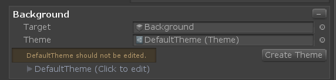
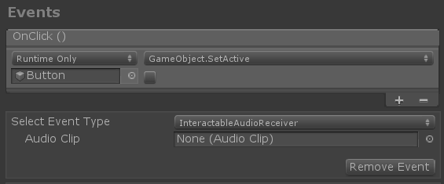

# Interactable


## How to use Interactable
Add the Interactable Component to a GameObject


1. A Collider must exist on the GameObject with the Interactable or the child of the Interactable for it to receive input.
2. Use the OnClick event to make something happen.
3. Add visual feedback by linking a Target to a Profile and assigning a Theme.


## Input Settings
The basic features allow for button style interactions, such as pointer focus and clicks, that maps to interaction states to drive themes which are setup through the Interactable profile. Controller or hand focus, down, up and click (both near and far) are handled. Functionality can be extended using external scripts that can set state manually.


### Input Actions
Select the action, from the input configuration or controller mapping profile, that the Interactable should react to.
See the InputProfile or the DefaultMixedRealityInputActionsProfile for more on how Input Actions are setup and intended to be used in the application.
 
### Enabled
Sets the Interactable's enabled state, which will disable some input handling and update the themes to reflect the current state which is disabled.
This is different from disabling input all together (using Enable Input) This means we have a button that would normally be interactive, but at this moment it is disabled (could be like a submit button waiting for all the required fields to be completed) and has a visual look and feel to denote it's disabled state.
 
### IsGlobal
Focus is not required to detect input actions, default behavior is false.
 
### Voice Commands
A voice command to trigger an OnClick event. This will also trigger a quick state change to drive any themes visuals.
 
Note: Make sure there is a unique voice command on each button. The Voice Recognizer is global (even if the Interactable isn't) and will not register the same voice command twice; in this case an error will be thrown.
 
### Requires Gaze (Only available when the Voice Command field has a value)
The voice command requires the Interactable to have focus to listen for the voice command.
- There are several ways to use voice commands to trigger an interactable, be careful not to have multiple objects with the same voice command or there will be conflicts.
- Using the MRTK voice recognition profile or online speech service are other ways to enable voice commands.

**Dev Tip**: Interactable Features can be extended using external components like PhysicalPressEventRouter which enables press events to drive some state changes in Interactable.

## Example Scene
See demonstrations of Interactable in the InteractableExamples scene.
More examples can also be found in the HandInteractionExamples scene.

## Profiles and Themes

The profile will define how button content will be linked to and manipulated by themes, based on state changes.


Themes work a lot like Materials, they are ScriptableObjects that contain a list of data that will be assigned to an object based on the current state. Like Materials, they can be edited individually in the Project panel or through the Interactable profile. Editing a Theme through an Interactable will update its settings for all other Interactables using that theme. Themes can be extended to control any aspect of a GameObject with a few basic themes provided that can change color, scale, position or an combination of the three.




### Default Themes
A default theme will be provided whenever an target object is added to a profile. It is not advised to edit the default theme, like in the case MRTK is updated, the theme could get overridden. A create Theme button is provided whenever the default theme is used to make it easier to create a new themes. 


Example of the Default Theme.


Example of a Color Theme

The best way to save a profile of a button, with all the themes and targets setup, is to create a prefab of your button.
_Note: Themes that effect mesh objects (Color or Shader Themes) are able to detect the shader properties in the material assigned to the target object. A drop down list of shader properties will define how the values of the theme are applied and is a convenience of this ability. Conflicts can arise if the same theme is used on objects that do not share the same material shader setting. Best practice is to create a separate theme for objects with different shaders; this is not an issue when using the same Color Theme on a text object and a mesh object, because all the shader properties are ignored on text objects._

### Creating Toggles
Toggle or multi-step buttons can be created in the Profile using the Dimensions field. The idea is that each set of states can have multiple dimensions and in this case, when the Dimensions value is increased, slots for additional themes are provided for each item in the Profile. This allows for a Normal Theme and a Toggled Theme to be used depending if the Interactable is toggled or not. 


With Dimensions being a numeric value, the options for adding themes or steps is endless. An example of a multi-step button with 3 dimensions is one that controls speed. We may only want to have the option for 3 values, Fast (1x), Faster (2x) or Fastest (3x). Using Dimensions we could control the text or texture of the button for each step using 3 different themes. **Developers can assess the DimensionIndex to determine which dimension is currently active.**


## Events
You can use Interactable to detect input events other than just OnClick. The Events feature provides a way to enable functionality to extend a button, but not really visual or needed to provide feedback based on state changes.


At the bottom of the Interactable component, click the Add Event button to reveal additional event options. A drop down menu contains the current list of supported events like toggle, hold or double tap. The idea of these events is to monitor Interactable state changes and define patterns to detect. When a pattern is detected, we can make something happen through the inspector or directly in code.



Example of audio clip to play on click. There is an Audio Theme for playing audio clips for each state change, like focus.


Example of Toggle events


Example of a hold event

Events can be placed on an object to monitor a separate Interactable. Use InteractableReceiver for a single event (from the list) or InteractableReceiverList for a list of events similar to the Interactable event list.


Example of InteractableReceiver existing on a separate gameObject from the Interactable, referencing the Interactable for event and state updates.
Search Scope provides a preferred path to search for an Interactable if one is not explicitly assigned.

## States
States are a list of terms that can be used to define interactions phases, like press or observed.


Interactable States provides two major roles.
- Establish a list of states that we care about. This list will be displayed in the themes and can also be referenced by the events.
- Controls how different interaction phases are ranked into states. For instance, a press state is also in a focused state, but the InteractableStates class will define it is a press state based on the ranking preferences setup in the State ScriptableObject.


The InteractableStates State Model will handle any state list with a layered ranking system, starting with the most isolated state and ending with the state that could contain all other states.

The DefaultInteractableStates list contains 4 states
- Default - nothing is happening, this is the most isolated base state. If anything does happen, it should over rule this state.
- Focus - the object is being pointed at. This is a single state, no other states are currently set, but it will out rank Default.
- Press - the object is being pointed at and a button or hand is pressing. The Press state out ranks Default and Focus.
- Disabled - the button should not be interactive and visual feedback will let the user know for some reason this button is not usable at this time. In theory, the disabled state could contain all other states, but when Enabled is turned off, the Disabled state trumps all other states.

A bit value (#) is assigned to the state depending on the order in the list.


## Extending Themes
Extend InteractableThemeBase to create a new theme that will show up in the Theme Property drop-down list. Themes can be created to control anything based on state changes. We could have a custom component on a GameObject that is driven by a custom theme with the values for each state being set in the inspector.

Setup the configuration of the theme settings in the constructor.

```
public NewCustomTheme()
{
    Types = new Type[] { typeof(Transform) };
    Name = "Custom Theme Scale";
    ThemeProperties.Add(
        new InteractableThemeProperty()
        {
            Name = "Scale",
            Type = InteractableThemePropertyValueTypes.Vector3,
            Values = new List<InteractableThemePropertyValue>(),
            Default = new InteractableThemePropertyValue() { Vector3 = Vector3.one}
        });
}
```

- Name -  the display name of the property, this will display next to the property field under each state title
- Types - allow filtering based on components on the object. In this case, this theme will show up in the list when assigned to an object with a Transform
- Name - the name that will show up in the inspector
- ThemeProperties - a list of properties that theme will store to be used when the state changes.

Each Theme Property has a name, type (so we know what type of fields we want to display for each state), a set of values for each state and a default value for the fields.
We can also choose to hide the state fields in the inspector, if the theme does not need them.

Override Init to run any startup code, that needs references to the Host GameObject.

```
public override InteractableThemePropertyValue GetProperty(InteractableThemeProperty property)
{
    InteractableThemePropertyValue start = new InteractableThemePropertyValue();
    start.Vector3 = Host.transform.localScale;
    return start;
}
```

GetProperty should grab the current property of the Host. This will be used for animation later.
Property is provided in case the current value depends on a cached property value. In this case we are grabbing the current scale.

```
public override void SetValue(InteractableThemeProperty property, int index, float percentage)
{
    Host.transform.localScale = Vector3.Lerp(property.StartValue.Vector3, property.Values[index].Vector3, percentage);
}
```

The SetValue function is used to set the property value based on the current state.
- Property - a list of property values per state, set through the theme inspector.
- Index - correlates to the current state.
- Percentage - a float value between 0 and 1. It will be the eased value if an Animation curve is used.

Custom Settings added to the new class will also be displayed in the inspector. If there are properties that need to be exposed in the inspector but do not need to be based on states, they should be added to the Custom Settings list.


# Extending Events
Like Themes, events can be extended to detect any state pattern or to expose functionality. 

Custom events can be created and used in two main ways
- Extend ReceiverBase to create a custom event that will show up in the dropdown list of event types. A Unity Event is provided by default, but additional Unity Events can be added or the event can be set to hide UnityEvents.
This functionality allows a designer to work with an engineer on a project to create a custom event that the designer or implementer to setup in the editor.
- Extend ReceiverBaseMonoBehavior to create a completely custom event component that can reside on the Interactable or another object. The ReceiverBaseMonoBehavior will reference the Interactable to detect state changes.
This approach is the most direct for engineers that do not want to work through the inspector.

### Option 1: Extend ReceiverBase
MixedRealityToolkit.Examples contains an example extension of ReceiverBase to display status information about the Interactable.

```
public CustomInteractablesReceiver(UnityEvent ev) : base(ev)
{
    Name = "CustomEvent";
    HideUnityEvents = true; // hides Unity events in the receiver - meant to be code only
}
```

**OnUpdate** is an abstract method that can be used to detect patterns. Here is an example of accessing all the states of the Interactable.
Though there is a definite state that is defined with state.CurrentState(), the state object has a reference to all other states and their values.

```
public override void OnUpdate(InteractableStates state, Interactable source)
{
    if (state.CurrentState() != lastState)
    {
        // the state has changed, do something new
        /*
            bool hasDown = state.GetState(InteractableStates.InteractableStateEnum.Pressed).Value > 0;
            bool focused = state.GetState(InteractableStates.InteractableStateEnum.Focus).Value > 0;
            bool isDisabled = state.GetState(InteractableStates.InteractableStateEnum.Disabled).Value > 0;
            bool hasInteractive = state.GetState(InteractableStates.InteractableStateEnum.Interactive).Value > 0;
            bool hasObservation = state.GetState(InteractableStates.InteractableStateEnum.Observation).Value > 0;
            bool hasObservationTargeted = state.GetState(InteractableStates.InteractableStateEnum.ObservationTargeted).Value > 0;
            bool isTargeted = state.GetState(InteractableStates.InteractableStateEnum.Targeted).Value > 0;
            bool isToggled = state.GetState(InteractableStates.InteractableStateEnum.Toggled).Value > 0;
            bool isVisited = state.GetState(InteractableStates.InteractableStateEnum.Visited).Value > 0;
            bool isDefault = state.GetState(InteractableStates.InteractableStateEnum.Default).Value > 0;
            bool hasGesture = state.GetState(InteractableStates.InteractableStateEnum.Gesture).Value > 0;
            bool hasGestureMax = state.GetState(InteractableStates.InteractableStateEnum.GestureMax).Value > 0;
            bool hasCollision = state.GetState(InteractableStates.InteractableStateEnum.Collision).Value > 0;
            bool hasPhysicalTouch = state.GetState(InteractableStates.InteractableStateEnum.PhysicalTouch).Value > 0;
            bool hasCustom = state.GetState(InteractableStates.InteractableStateEnum.Custom).Value > 0;
            or:
            bool hasFocus = source.HasFocus;
            bool hasPress = source.HasPress;
        */
        lastState = state.CurrentState();
        SetOutput();
    }
}
```

Two Interactable event methods are also available if driving functionality from OnClick or OnVoiceCommand is needed.

```
public virtual void OnVoiceCommand(InteractableStates state, Interactable source, string command, int index = 0, int length = 1)
{
    // voice command called
}  
public virtual void OnClick(InteractableStates state, Interactable source, IMixedRealityPointer pointer = null)
{
    // click called
}
```

## Extending States
The functionality of how states are ranked can be overridden by extending InteractableStates class.

Override the CompareStates method to manually control the ranking.

```
public override State CompareStates()
{
    int bit = GetBit();
    currentState = stateList[0];
    for (int i = stateList.Count - 1; i > -1; i--)
    {
        if (bit >= stateList[i].Bit)
        {
            currentState = stateList[i];
            break;
        }
    }
    return currentState;
}
```


