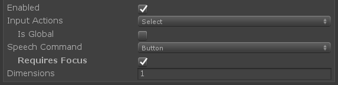
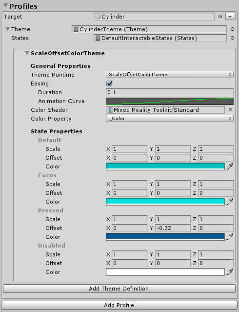
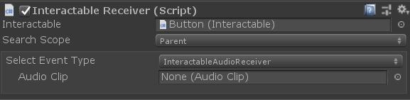
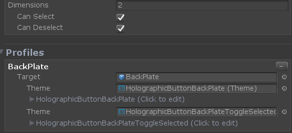

# Interactable


The [`Interactable`](xref:Microsoft.MixedReality.Toolkit.UI.Interactable) component is an all-in-one container to make any object easily *interactable* and responsive to input. Interactable acts as a catch-all for all types of input including touch, hand rays, speech etc and funnel these interactions into [events](#events) and [visual theme](visualthemes.md) responses. This component provides an easy way to make buttons, change color on objects with focus, and more.

## How to configure Interactable

The component allows for three primary sections of configuration:

1) [General input configuration](#general-input-settings)
1) [Visual Themes](VisualThemes.md) targeted against multiple GameObjects
1) [Event handlers](#events)

### General input settings



**States**

*States* is a [ScriptableObject](https://docs.unity3d.com/Manual/class-ScriptableObject.html) parameter that defines the interactions phases, like press or observed, for [Interactable Profiles](#interactable-profiles) and [Visual Themes](VisualThemes.md).

The **DefaultInteractableStates** (Assets/MRTK/SDK/Features/UX/Interactable/States/DefaultInteractableStates.asset) ships with MRTK out-of-box and is the default parameter for *Interactable* components.


The *DefaultInteractableStates* asset contains four states and utilizes the [`InteractableStates`](xref:Microsoft.MixedReality.Toolkit.UI.InteractableStates) state model implementation.

* **Default**: Nothing is happening, this is the most isolated base state.

* **Focus**: The object is being pointed at. This is a single state, no other states are currently set, but it will out rank Default.

* **Press**: The object is being pointed at and a button or hand is pressing. The Press state out ranks Default and Focus. This state will also get set as a fallback to Physical Press.

* **Disabled**: The button should not be interactive and visual feedback will let the user know if for some reason this button is not usable at this time. In theory, the disabled state could contain all other states, but when Enabled is turned off, the Disabled state trumps all other states.

A bit value (#) is assigned to the state depending on the order in the list.

> [!NOTE]
> It is generally recommended to utilize the **DefaultInteractableStates** (Assets/MRTK/SDK/Features/UX/Interactable/States/DefaultInteractableStates.asset) when creating *Interactable* components.
>
> However, there are 17 Interactable states available that can be used to drive themes, though some are meant to be driven by other components. Here is a list of those with built-in functionality.
>
> * Visited: the Interactable has been clicked.
> * Toggled: The button is in a toggled state or Dimension index is an odd number.
> * Gesture: The hand or controller was pressed and has moved from the original position.
> * VoiceCommand: A speech command was used to trigger the Interactable.
> * PhysicalTouch: A touch input is currently detected, use [`NearInteractionTouchable`](xref:Microsoft.MixedReality.Toolkit.Input.NearInteractionTouchable) to enable.
> * Grab: A hand is currently grabbing in the bounds of the object, use [`NearInteractionGrabbable`](xref:Microsoft.MixedReality.Toolkit.Input.NearInteractionGrabbable) to enable

**Enabled**

Toggles whether an Interactable will start enabled or not. This corresponds to the [`Interactable.IsEnabled`](xref:Microsoft.MixedReality.Toolkit.UI.Interactable.IsEnabled) in code.

An *Interactable's* enabled property is different than the enabled property configured via GameObject/Component (i.e SetActive etc). Disabling the GameObject or *Interactable* MonoBehaviour will disable everything in the class from running including input, visual themes, events, etc. Disabling via [`Interactable.IsEnabled`](xref:Microsoft.MixedReality.Toolkit.UI.Interactable.IsEnabled) will disable most input handling, resetting related input states. However, the class will still run every frame and receive input events which will be ignored. This is useful for displaying the Interactable in a disabled state which can be done via Visual Themes. A typical example of this would be a submit button waiting for all the required input fields to be completed.

**Input Actions**

Select the [input action](./Input/InputActions.md) from the input configuration or controller mapping profile that the *Interactable* component should react to.

This property can be configured at runtime in code via [`Interactable.InputAction`](xref:Microsoft.MixedReality.Toolkit.UI.Interactable.InputAction).

**IsGlobal**

If true, this will mark the component as a global input listener for the selected [input action](./Input/InputActions.md). Default behavior is false which will restrict input to only this *Interactable* collider/GameObject.

This property can be configured at runtime in code via [`Interactable.IsGlobal`](xref:Microsoft.MixedReality.Toolkit.UI.Interactable.IsGlobal).

**Speech Command**

[Speech command](./Input/Speech.md), from the MRTK Speech Commands Profile, to trigger an OnClick event for voice interaction.

This property can be configured at runtime in code via [`Interactable.VoiceCommand`](xref:Microsoft.MixedReality.Toolkit.UI.Interactable.VoiceCommand).

**Requires Focus**

If true, the voice command will only activate the *Interactable* if and only if it already has focus from a pointer. If false, then the *Interactable* will act as a global listener for the selected voice command. The default behavior is true, as multiple global speech listeners can be difficult to organize in a scene.

This property can be configured at runtime in code via [`Interactable.VoiceRequiresFocus`](xref:Microsoft.MixedReality.Toolkit.UI.Interactable.VoiceRequiresFocus).

**Selection Mode**

This property defines the selection logic. When an *Interactable* is clicked, it iterates into a next *Dimension* level. *Dimensions* is similar to rank and defines a state outside of inputs (i.e focus, press etc). They are useful for defining Toggle states or other multi-rank states associated with a button. The current Dimension level is tracked by `Interactable.DimensionIndex`.

The selection modes available are:

* **Button** - *Dimensions* = 1, simple clickable *Interactable*
* **Toggle** - *Dimensions* = 2, *Interactable* alternates between *on*/*off* state
* **Multi-dimension** - *Dimensions* >= 3, every click increases the current dimension level + 1. Useful for defining a button state to a list, etc.

*Interactable* also allows for multiple Themes to be defined per *Dimension*. For example when *SelectionMode=Toggle*, one theme may be applied when the *Interactable* is *deselected* and another theme applied when the component is *selected*.

The current Selection Mode can be queried at runtime via [`Interactable.ButtonMode`](xref:Microsoft.MixedReality.Toolkit.UI.Interactable.ButtonMode). Updating the mode at runtime can be achieved by setting the  [`Interactable.Dimensions`](xref:Microsoft.MixedReality.Toolkit.UI.Interactable.Dimensions) property to match the desired functionality. Furthermore, the current dimension, useful for *Toggle* and *Multi-Dimension* modes, can be accessed via [`Interactable.CurrentDimension`](xref:Microsoft.MixedReality.Toolkit.UI.Interactable.CurrentDimension).

### Interactable profiles

*Profiles* are items that create a relationship between a GameObject and a [Visual Theme](VisualThemes.md). The profile defines what content will be manipulated by a theme when a [state change occurs](#general-input-settings).

Themes work a lot like materials. They are scriptable objects that contain a list of properties that will be assigned to an object based on the current state. Themes are also re-usable and can be assigned across multiple *Interactable* UX objects.

**Reset On Destroy**

Visual themes modify various properties on a targeted GameObject, dependent on the class and type of theme engine selected. If *Reset On Destroy* is true when the Interactable component is destroyed, the component will reset all modified properties from active themes to their original values. Otherwise, when destroyed, the Interactable component will leave any modified properties as-is. In this latter case, the last state of values will persist unless altered by another external component. The default is false.



## Events

Every *Interactable* component has an *OnClick* event that fires when the component is simply selected. However, *Interactable* can be used to detect input events other than just *OnClick*.

Click the *Add Event* button to add a new type of Event Receiver definition. Once added, select the type of Event desired.

)

There are different types of event receivers to respond to different types of input. MRTK ships with the following set of receivers out-of-box.

* [`InteractableAudioReceiver`](xref:Microsoft.MixedReality.Toolkit.UI.InteractableAudioReceiver)
* [`InteractableOnClickReceiver`](xref:Microsoft.MixedReality.Toolkit.UI.InteractableOnClickReceiver)
* [`InteractableOnFocusReceiver`](xref:Microsoft.MixedReality.Toolkit.UI.InteractableOnFocusReceiver)
* [`InteractableOnGrabReceiver`](xref:Microsoft.MixedReality.Toolkit.UI.InteractableOnGrabReceiver)
* [`InteractableOnHoldReceiver`](xref:Microsoft.MixedReality.Toolkit.UI.InteractableOnHoldReceiver)
* [`InteractableOnPressReceiver`](xref:Microsoft.MixedReality.Toolkit.UI.InteractableOnPressReceiver)
* [`InteractableOnToggleReceiver`](xref:Microsoft.MixedReality.Toolkit.UI.InteractableOnToggleReceiver)
* [`InteractableOnTouchReceiver`](xref:Microsoft.MixedReality.Toolkit.UI.InteractableOnTouchReceiver)

A custom receiver can be created by making a new class that extends [`ReceiverBase`](xref:Microsoft.MixedReality.Toolkit.UI.ReceiverBase).


*Example of a Toggle Event Receiver*

### Interactable receivers

 The [`InteractableReceiver`](xref:Microsoft.MixedReality.Toolkit.UI.InteractableReceiver) component allows for events to be defined outside of the source *Interactable* component. The *InteractableReceiver* will listen for a filtered event type fired by another *Interactable*. If the *Interactable* property is not directly assigned, then the *Search Scope* property defines the direction the *InteractableReceiver* listens for events which is either on itself, in a parent, or in a child GameObject.

[`InteractableReceiverList`](xref:Microsoft.MixedReality.Toolkit.UI.InteractableReceiverList) acts in a similar fashion but for a list of matching events.



### Create custom events

Like [Visual Themes](VisualThemes.md#custom-theme-engines), events can be extended to detect any state pattern or to expose functionality.

Custom events can be created in two main ways:

1) Extend the [`ReceiverBase`](xref:Microsoft.MixedReality.Toolkit.UI.ReceiverBase) class to create a custom event that will show up in the dropdown list of event types. A Unity event is provided by default, but additional Unity events can be added or the event can be set to hide Unity events. This functionality allows a designer to work with an engineer on a project to create a custom event that the designer can setup in the editor.

1) Extend the [`ReceiverBaseMonoBehavior`](xref:Microsoft.MixedReality.Toolkit.UI.ReceiverBaseMonoBehavior) class to create a completely custom event component that can reside on the *Interactable* or another object. The [`ReceiverBaseMonoBehavior`](xref:Microsoft.MixedReality.Toolkit.UI.ReceiverBaseMonoBehavior) will reference the *Interactable* to detect state changes.

#### Example of extending `ReceiverBase`

The [`CustomInteractablesReceiver`](xref:Microsoft.MixedReality.Toolkit.UI) class displays status information about an *Interactable* and is an example of how to create a custom Event Receiver.

```c#
public CustomInteractablesReceiver(UnityEvent ev) : base(ev, "CustomEvent")
{
    HideUnityEvents = true; // hides Unity events in the receiver - meant to be code only
}
```

The following methods are useful to override/implement when creating a custom Event Receiver. [`ReceiverBase.OnUpdate()`](xref:Microsoft.MixedReality.Toolkit.UI.ReceiverBase) is an abstract method that can be used to detect state patterns/transitions. Furthermore, the [`ReceiverBase.OnVoiceCommand()`](xref:Microsoft.MixedReality.Toolkit.UI.ReceiverBase) and [`ReceiverBase.OnClick()`](xref:Microsoft.MixedReality.Toolkit.UI.ReceiverBase) methods are useful for creating custom event logic when the *Interactable* is selected.

```c#
public override void OnUpdate(InteractableStates state, Interactable source)
{
    if (state.CurrentState() != lastState)
    {
        // the state has changed, do something new
        lastState = state.CurrentState();
        ...
    }
}

public virtual void OnVoiceCommand(InteractableStates state, Interactable source,
                                    string command, int index = 0, int length = 1)
{
    base.OnVoiceCommand(state, source, command, index, length);
    // voice command called, perform some action
}  

public virtual void OnClick(InteractableStates state,
                            Interactable source,
                            IMixedRealityPointer pointer = null)
{
    base.OnClick(state, source);
    // click called, perform some action
}
```

##### Displaying custom event receiver fields in the inspector

*ReceiverBase* scripts use [`InspectorField`](xref:Microsoft.MixedReality.Toolkit.Utilities.Editor.InspectorField) attributes to expose custom properties in the inspector. Here's an example of Vector3, a custom property with tooltip and label information. This property will show up as configurable in the inspector when an *Interactable* GameObject is selected and has the associated *Event Receiver* type added.

```c#
[InspectorField(Label = "<Property label>",Tooltip = "<Insert tooltip info>",Type = InspectorField.FieldTypes.Vector3)]
public Vector3 EffectOffset = Vector3.zero;
```

## How to use Interactable

### Building a simple button

One can create a simple button by adding the *Interactable* component to a GameObject that is configured to receive input events. It can have a collider on it or on a child to receive input. If using *Interactable* with a Unity UI based GameObjects, it should be under the Canvas GameObject.

Take the button one step further, by creating a new profile, assigning the GameObject itself and creating a new theme. Furthermore, use the *OnClick* event to make something happen.

> [!NOTE]
> Making a [button pressable](README_Button.md) requires the [`PressableButton`](xref:Microsoft.MixedReality.Toolkit.UI.PressableButton) component. Additionally, the [`PhysicalPressEventRouter`](xref:Microsoft.MixedReality.Toolkit.PhysicalPressEventRouter) component is needed to funnel press events to the *Interactable* component.

### Creating toggle and multi-dimension buttons

#### Toggle button

To make a button Toggle-able, change the the [`Selection Mode`](xref:Microsoft.MixedReality.Toolkit.UI.SelectionModes) field to type `Toggle`. In the *Profiles* section, a new toggled theme is added for each profile that is used when the *Interactable* is toggled on.

While the [`SelectionMode`](xref:Microsoft.MixedReality.Toolkit.UI.SelectionModes) is set to Toggle, the *IsToggled* check box can be used to set the default value of the control at runtime initialization.

*CanSelect* means the *Interactable* can go from *off* to *on* while the *CanDeselect* means the inverse.



Developers can utilize the [`SetToggled`](xref:Microsoft.MixedReality.Toolkit.UI.Interactable) and [`IsToggled`](xref:Microsoft.MixedReality.Toolkit.UI.Interactable) interfaces to get/set the toggle state of an *Interactable* via code.

```c#
// If using SelectionMode = Toggle (i.e Dimensions == 2)

// Make the Interactable selected and toggled on
myInteractable.IsToggled = true;

// Get whether the Interactable is selected or not
bool isSelected = myInteractable.IsToggled;
```

##### Toggle button collection

It is common to have a list of toggle buttons where only one can be active at any given time, also known as a radial set or radio buttons etc.

Use the [`InteractableToggleCollection`](xref:Microsoft.MixedReality.Toolkit.UI.InteractableToggleCollection) component to enable this functionality. This control ensures only one *Interactable* is toggled on at any given time. The *RadialSet* (Assets/MRTK/SDK/Features/UX/Interactable/Prefabs/RadialSet.prefab) is also a great starting point out-of-box.

To create a custom radial button group:

1) Create multiple *Interactable* GameObjects/buttons
1) Set each *Interactable* with *SelectionMode* = Toggle, *CanSelect* = true, and *CanDeselect* = false
1) Create an empty parent GameObject over all the *Interactables* and add the *InteractableToggleCollection* component
1) Add all *Interactables* to the *ToggleList* on the *InteractableToggleCollection*
1) Set the *InteractableToggleCollection.CurrentIndex* property to determine which button is selected by default at start


#### Multi-dimensional button

Multi-Dimension selection mode is used to create sequential buttons, or a button that has more than two steps, like controlling speed with three values, Fast (1x), Faster (2x) or Fastest (3x).

With dimensions being a numeric value, up to 9 themes can be added to control the text label or texture of the button for each speed setting, using a different theme for each of step.

Every click event will advance the `DimensionIndex` by 1 at runtime until the `Dimensions` value is reached. Then the cycle will reset to 0.


Developers can assess the [`DimensionIndex`](xref:Microsoft.MixedReality.Toolkit.UI.Interactable) to determine which dimension is currently active.

```c#
// If using SelectionMode = Multi-dimension (i.e Dimensions >= 3)

//Access the current DimensionIndex
int currentDimension = myInteractable.CurrentDimension;

//Set the current DimensionIndex to 2
myInteractable.CurrentDimension = 2;

// Promote Dimension to next level
myInteractable.IncreaseDimension();
```

### Create Interactable at runtime

*Interactable* can be easily added to any GameObject at runtime. The following example demonstrates how to assign a profile with a [visual theme](visualthemes.md).

```c#
var interactableObject = GameObject.CreatePrimitive(PrimitiveType.Cylinder);
var interactable = interactableObject.AddComponent<Interactable>();

// Get the default configuration for the Theme engine InteractableColorTheme
var newThemeType = ThemeDefinition.GetDefaultThemeDefinition<InteractableColorTheme>().Value;

// Define a color for every state in our Default Interactable States
newThemeType.StateProperties[0].Values = new List<ThemePropertyValue>()
{
    new ThemePropertyValue() { Color = Color.black},  // Default
    new ThemePropertyValue() { Color = Color.black}, // Focus
    new ThemePropertyValue() { Color = Random.ColorHSV()},   // Pressed
    new ThemePropertyValue() { Color = Color.black},   // Disabled
};

interactable.Profiles = new List<InteractableProfileItem>()
{
    new InteractableProfileItem()
    {
        Themes = new List<Theme>()
        {
            Interactable.GetDefaultThemeAsset(new List<ThemeDefinition>() { newThemeType })
        },
        Target = interactableObject,
    },
};

// Force the Interactable to be clicked
interactable.TriggerOnClick()
```

### Interactable events via code

One can add an action to the base [`Interactable.OnClick`](xref:Microsoft.MixedReality.Toolkit.UI.Interactable.OnClick) event via code with the following example.

```c#
public static void AddOnClick(Interactable interactable)
{
    interactable.OnClick.AddListener(() => Debug.Log("Interactable clicked"));
}
```

Use the [`Interactable.AddReceiver<T>()`](xref:Microsoft.MixedReality.Toolkit.UI.Interactable) function to add event receivers dynamically at runtime.

The example code below demonstrates how to add an [InteractableOnFocusReceiver](xref:Microsoft.MixedReality.Toolkit.UI.InteractableOnFocusReceiver), which listens for focus enter/exit, and furthermore define action code to perform when the event instances fire.

```c#
public static void AddFocusEvents(Interactable interactable)
{
    var onFocusReceiver = interactable.AddReceiver<InteractableOnFocusReceiver>();

    onFocusReceiver.OnFocusOn.AddListener(() => Debug.Log("Focus on"));
    onFocusReceiver.OnFocusOff.AddListener(() => Debug.Log("Focus off"));
}
```

The example code below demonstrates how to add an [InteractableOnToggleReceiver](xref:Microsoft.MixedReality.Toolkit.UI.InteractableOnFocusReceiver), which listens for selected/deselected state transitions on toggle-able *Interactables*, and furthermore defines action code to perform when the event instances fire.

```c#
public static void AddToggleEvents(Interactable interactable)
{
    var toggleReceiver = interactable.AddReceiver<InteractableOnToggleReceiver>();

    // Make the interactable have toggle capability, from code.
    // In the gui editor it's much easier
    interactable.Dimensions = 2;
    interactable.CanSelect = true;
    interactable.CanDeselect  = true;

    toggleReceiver.OnSelect.AddListener(() => Debug.Log("Toggle selected"));
    toggleReceiver.OnDeselect.AddListener(() => Debug.Log("Toggle un-selected"));
}
```

## See also

* [Visual Themes](VisualThemes.md)
* [Input Actions](./Input/InputActions.md)
* [Speech Commands](./Input/Speech.md)
* [Buttons](README_Button.md)
* [MRTK Standard Shader](README_MRTKStandardShader.md)
