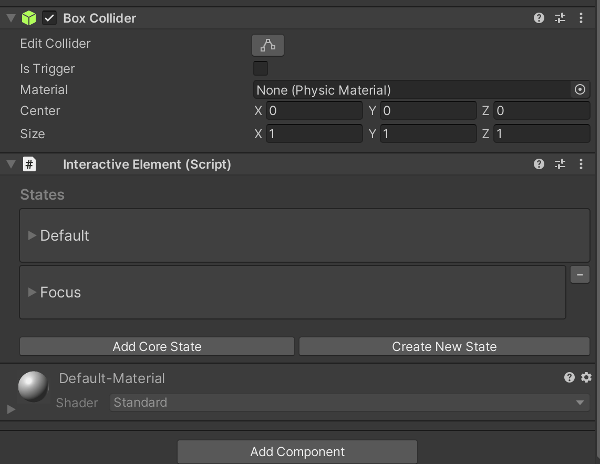

# Interactive Element 

Interactive Element is the next generation of MRTK's Interactable. This component serves as an easy customizable entry point to MRTK's Input System events. Interactive Element supports the addition of already defined MRTK input states and user defined states.   

## Adding a Core State

A CoreInteractionState is a state that has its state setting logic already defined. For example, in BaseInteractiveElement, the Focus state is set to on when the IMixedRealityFocusHandler's OnFocusOn is called.  

### How to Add a Core State

#### In-Editor


#### Script

```c#
    void Start()
    {
        InteractiveElement interactiveElement = gameObject.AddComponent<InteractiveElement>();

        InteractionState focusState = interactiveElement.GetState("Focus");

        // Get the event configuration for the Focus state
        var focusEventConfiguration = interactiveElement.GetStateEvents<FocusEvents>("Focus");

        focusEventConfiguration.OnFocusOn.AddListener((focusEventData) =>
        {
            Debug.Log("New Focused Object: " + focusEventData.NewFocusedObject.name);
        });

        focusEventConfiguration.OnFocusOff.AddListener((focusEventData) =>
        {
            Debug.Log("Old Focused Object: " + focusEventData.OldFocusedObject.name);
        });
    }
```

## Adding New (User Defined) States

### How to Add a New State

#### In-Editor




#### Script

```c#
    private InteractiveElement interactiveElement;

    void Start()
    {
        interactiveElement = gameObject.AddComponent<InteractiveElement>();

        InteractionState keyboardState = interactiveElement.AddNewState("Keyboard");

        // Get the events attached to the Keyboard state
        var keyboardStateEvents = interactiveElement.GetStateEvents<StateEvents>("Keyboard");

        keyboardStateEvents.OnStateOn.AddListener(() =>
        {
            Debug.Log("The Keyboard state has been set to on");
        });

        keyboardStateEvents.OnStateOff.AddListener(() =>
        {
            Debug.Log("The Keyboard state has been set to off");
        });
    }

    void Update()
    {
        if (Input.GetKeyDown(KeyCode.U))
        {
            interactiveElement.SetStateOn("Keyboard");
        }

        if (Input.GetKeyDown(KeyCode.I))
        {
            interactiveElement.SetStateOff("Keyboard");
        }
    }
```

    