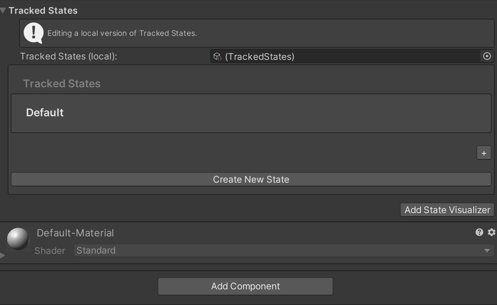
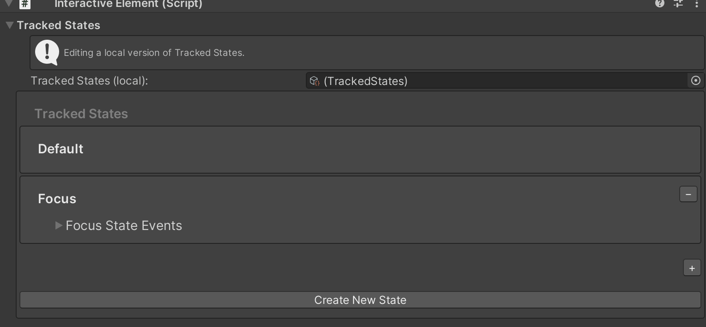

# Interactive Element 

An Interactive Element is the next generation of MRTK's Interactable. An Interactive Element is an object that receives input and fires events depending on the type of input.  The type of input supported is defined in the form of states. 

## Adding a Core State

A CoreInteractionState is a state where the setting logic is already defined. For example, in BaseInteractiveElement, the Focus state is set to on when the IMixedRealityFocusHandler's OnFocusOn is called, making the state setting logic already defined.

Currently, Focus is the only core state supported but the following core states will be added in the future:


All Core Interaction States will have an associated custom event configuration.

### How to Add a Core State

#### In-Editor



#### Script

```c#
    void Start()
    {
        InteractiveElement interactiveElement = gameObject.AddComponent<InteractiveElement>();

        InteractionState focusState = interactiveElement.GetState(CoreInteractionState.Focus);

        // Get the event configuration for the Focus state
        var focusEventConfiguration = focusState.EventConfiguration as FocusInteractionEventConfiguration;

        focusEventConfiguration.OnFocusOn.AddListener((focusEventData) =>
        {
            Debug.Log("New Focused Object: " + focusEventData.NewFocusedObject.name);
        });

        focusEventConfiguration.OnFocusOff.AddListener((focusEventData) =>
        {
            Debug.Log("Old Focused Object: " + focusEventData.OldFocusedObject.name);
        });
    }
```

## Adding New States

### How to Add a New State

#### In-Editor



A new state can be added in the editor and set from another event configuration in the editor. 


#### Script

```c#
    private InteractiveElement interactiveElement;

    void Start()
    {
        interactiveElement = gameObject.AddComponent<InteractiveElement>();

        interactiveElement.AddNewState("Keyboard");

        interactiveElement.StateManager.OnStateActivated.AddListener((state) => 
        { 
            if (state.Name == "Keyboard")
            {
                Debug.Log("The Keyboard state was set on");
            }
        });
    }

    private void Update()
    {
        if (Input.GetKeyDown(KeyCode.U))
        {
            interactiveElement.SetStateOn("Keyboard");
        }

        if (Input.GetKeyDown(KeyCode.I))
        {
            interactiveElement.SetStateOff("Keyboard");
        }
    }
```

    