# Interactive Element [Experimental]

A simplified centralized entry point to the MRTK input system. Contains state management methods, event management and the state setting logic for Core Interaction States.

Interactive Element is an experimental Unity 2019.3 and up feature as it utilizes a feature new to Unity 2019.3: [Serialize Reference](https://docs.unity3d.com/ScriptReference/SerializeReference.html).

### Interactive Element Inspector

During play mode, the Interactive Element inspector provides visual feedback that indicates whether or not the current state is active. If a state is active, it will be highlighted with a cyan color.  If the state is not active, the color is not changed. The numbers next to the states in the inspector are the state values, if the state is active then the value is 1, if the state is not active the value is 0.


## Core States

Interactive Element contains core states and supports the addition of [custom states](#custom-states).  A core state is one that already has the state setting logic defined in `BaseInteractiveElement`. The following is a list of the current input-driven core states: 

### Current Core States

- [Default](#default-state) 

Near and Far Interaction Core States:
- [Focus](#focus-state) 

Near Interaction Core States:

- [Focus Near](#focus-near-state)
- [Touch](#touch-state)

Far Interaction Core States:
- [Focus Far](#focus-far-state)
- [Select Far](#select-far-state)

Other Core States:
- [Clicked](#clicked-state)
- [Toggle On and Toggle Off](#toggle-on-and-toggle-off-state)
- [Speech Keyword](#speech-keyword-state)

### How to Add a Core State via Inspector

1. Navigate to **Add Core State** in the inspector for Interactive Element.

    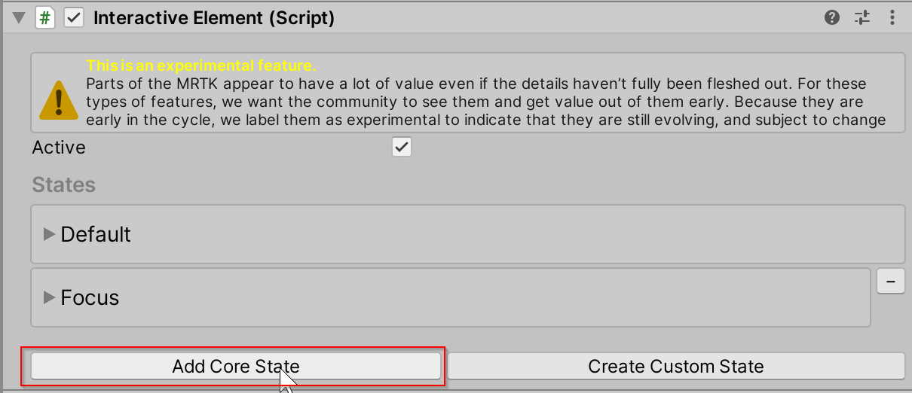


1. Select the **Select State** button to choose the core state to add. The states in the menu are sorted by interaction type.

    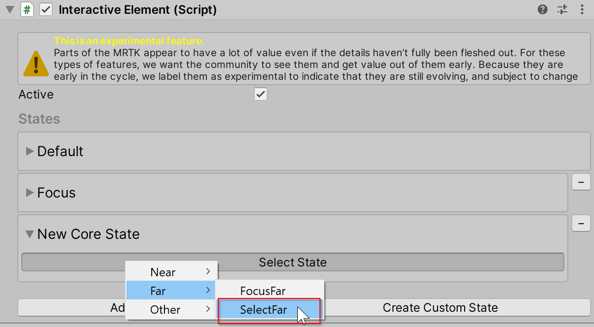

1. Open the Event Configuration foldout to view the events and properties associated with the state.

    


### How to Add a Core State via Script

Use the `AddNewState(stateName)` method to add a core state. For a list of the available core state names, use the `CoreInteractionState` enum.

```c#
// Add by name or add by CoreInteractionState enum to string

interactiveElement.AddNewState("SelectFar");

interactiveElement.AddNewState(CoreInteractionState.SelectFar.ToString());
```

### States Internal Structure 

The states in Interactive Element are of type `InteractionState`.  An `InteractionState` contains the following properties:

- **Name**: The name of the state.
- **Value**: The state value.  If the state is on, the state value is 1. If the state is off, the state value is 0.
- **Active**: Whether or not the state is currently active. The value for the Active property is true when the state is on, false if the state is off. 
- **Interaction Type**: The Interaction Type of a state is the type of interaction a state is intended for. 
  - `None`: Does not support any form of input interaction.
  - `Near`: Near interaction support. Input is considered near interaction when an articulated hand has direct contact with another game object, i.e. the position the articulated hand is close to the position of the game object in world space.
  - `Far`: Far interaction support. Input is considered far interaction when direct contact with the game object is not required. For example, input via controller ray or gaze is considered far interaction input.
  - `NearAndFar`: Encompasses both near and far interaction support. 
  - `Other`: Pointer independent interaction support.
- **Event Configuration**: The event configuration for a state is the serialized events profile entry point. 

All of these properties are set internally in the `State Manager` contained in Interactive Element. For modification of states use the following helper methods:

**State Setting Helper Methods**

```c# 
// Get the InteractionState
interactiveElement.GetState("StateName");

// Set a state value to 1/on
interactiveElement.SetStateOn("StateName");

// Set a state value to 0/off
interactiveElement.SetStateOff("StateName");

// Check if a state is present in the state list
interactiveElement.IsStatePresent("StateName");

// Check whether or not a state is active
interactiveElement.IsStateActive("StateName");

// Add a new state to the state list
interactiveElement.AddNewState("StateName");

// Remove a state from the state list
interactiveElement.RemoveState("StateName");
```

Getting the event configuration of a state is specific to the state itself. Each core state has a specific event configuration type which is outlined below under the sections describing each core state.

Here is a generalized example of getting a state's event configuration:

```c#
// T varies depending on the core state - the specific T's are specified under each of the core state sections
T stateNameEvents = interactiveElement.GetStateEvents<T>("StateName");
```

### Default State

The Default state is always present on an Interactive Element.  This state will be active only when all other states are not active.  If any other state becomes active, then the Default state will be set to off internally. 

An Interactive Element is initialized with the Default and Focus states present in the state list. The Default state always needs to be present in the state list. 

#### Getting Default State Events

Event configuration type for the Default State: `StateEvents`

```c#
StateEvents defaultEvents = interactiveElement.GetStateEvents<StateEvents>("Default");

defaultEvents.OnStateOn.AddListener(() =>
{
    Debug.Log($"{gameObject.name} Default State On");
});

defaultEvents.OnStateOff.AddListener(() =>
{
    Debug.Log($"{gameObject.name} Default State Off");
});
```

### Focus State

The Focus state is a near and far interaction state that can be thought of as the mixed reality equivalent to hover. The distinguishing factor between near and far interaction for the Focus state is the current active pointer type.  If the pointer type for the Focus state is the Poke Pointer, then the interaction is considered near interaction.  If the primary pointer is not the Poke Pointer, then the interaction is considered far interaction. The Focus state is present in Interactive Element by default.

|Focus State Behavior| Focus State Inspector|
|---|--|
|| |

#### Getting Focus State Events

Event configuration type for the Focus State: `FocusEvents`

```c#
FocusEvents focusEvents = interactiveElement.GetStateEvents<FocusEvents>("Focus");

focusEvents.OnFocusOn.AddListener((pointerEventData) =>
{
    Debug.Log($"{gameObject.name} Focus On");
});

focusEvents.OnFocusOff.AddListener((pointerEventData) =>
{
    Debug.Log($"{gameObject.name} Focus Off");
});
```

#### Focus Near vs Focus Far Behavior 


### Focus Near State

The Focus Near state is set when a focus event is raised and the primary pointer is the Poke pointer, an indication of near interaction. 

|Focus Near State Behavior| Focus Near State Inspector|
|---|--|
|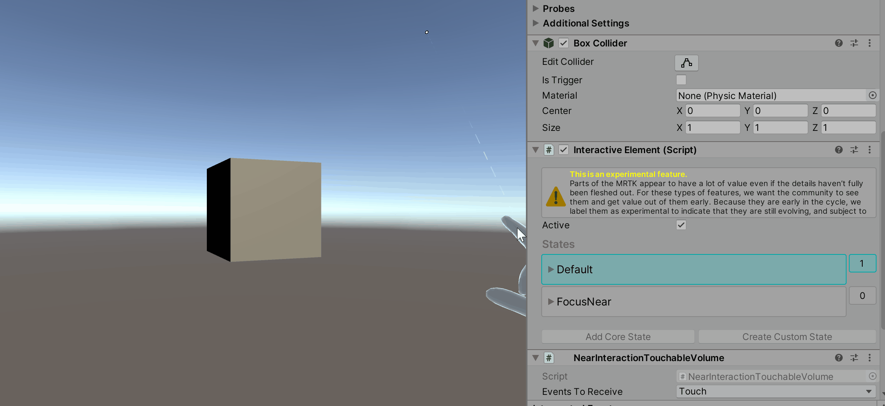| 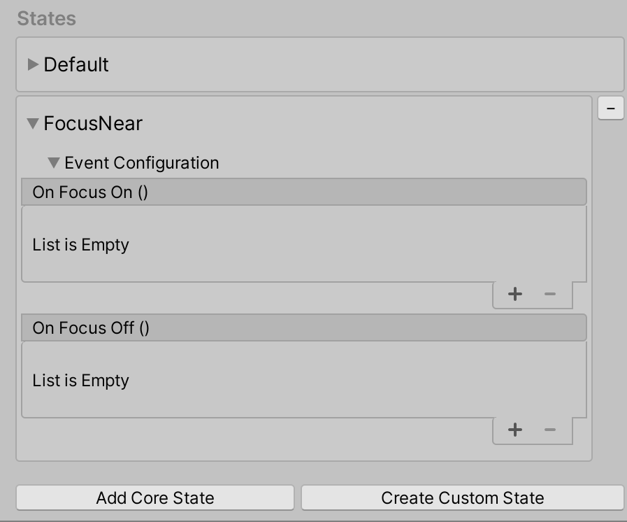|

#### Getting FocusNear State Events

Event configuration type for the FocusNear State: `FocusEvents`

```c#
FocusEvents focusNearEvents = interactiveElement.GetStateEvents<FocusEvents>("FocusNear");

focusNearEvents.OnFocusOn.AddListener((pointerEventData) =>
{
    Debug.Log($"{gameObject.name} Near Interaction Focus On");
});

focusNearEvents.OnFocusOff.AddListener((pointerEventData) =>
{
    Debug.Log($"{gameObject.name} Near Interaction Focus Off");
});
```

### Focus Far State

The Focus Far state is set when the primary pointer is not the Poke pointer.  For example, the default controller ray pointer and the GGV (Gaze, Gesture, Voice) pointer are considered far interaction pointers.

|Focus Far State Behavior| Focus Far State Inspector|
|---|--|
|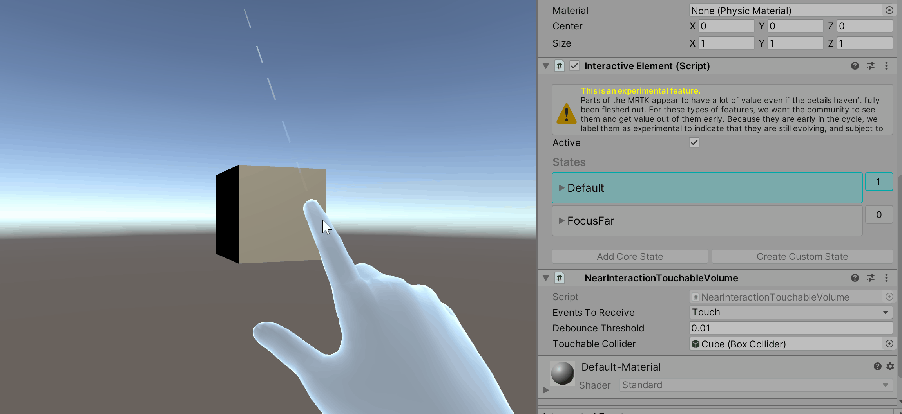| |


#### Getting Focus Far State Events

Event configuration type for the FocusFar State: `FocusEvents`

```c#
FocusEvents focusFarEvents = interactiveElement.GetStateEvents<FocusEvents>("FocusFar");

focusFarEvents.OnFocusOn.AddListener((pointerEventData) =>
{
    Debug.Log($"{gameObject.name} Far Interaction Focus On");
});

focusFarEvents.OnFocusOff.AddListener((pointerEventData) =>
{
    Debug.Log($"{gameObject.name} Far Interaction Focus Off");
});
```

### Touch State

The Touch state is a near interaction state that is set when an articulated hand touches the object directly.  A direct touch means that the articulated hand's index finger is very close to the world position of the object. By default, a `NearInteractionTouchableVolume` component is attached to the object if the Touch state is added to the the state list.  The presence of a  `NearInteractionTouchableVolume` or `NearInteractionTouchable` component is required for detecting Touch events.  The difference between `NearInteractionTouchableVolume` and `NearInteractionTouchable` is that `NearInteractionTouchableVolume` detects a touch based on the collider of the object and `NearInteractionTouchable`detects touch within a defined area of a plane.

|Touch State Behavior| Touch State Inspector|
|---|--|
|| |


#### Getting Touch State Events

Event configuration type for the Touch State: `TouchEvents`

```c#
TouchEvents touchEvents = interactiveElement.GetStateEvents<TouchEvents>("Touch");

touchEvents.OnTouchStarted.AddListener((touchData) =>
{
    Debug.Log($"{gameObject.name} Touch Started");
});

touchEvents.OnTouchCompleted.AddListener((touchData) =>
{
    Debug.Log($"{gameObject.name} Touch Completed");
});

touchEvents.OnTouchUpdated.AddListener((touchData) =>
{
    Debug.Log($"{gameObject.name} Touch Updated");
});
```

### Select Far State

The Select Far state is the `IMixedRealityPointerHandler` surfaced.  This state is a far interaction state that detects far interaction click (air-tap) and holds through the use of far interaction pointers such as the default controller ray pointer or the GGV pointer.  The Select Far state has an option under the event configuration foldout named `Global`. If `Global` is true, then the `IMixedRealityPointerHandler` is registered as a global input handler.  Focus on an object is not required to trigger input system events if a handler is registered as global.  For example, if a user wants to know anytime the air-tap/select gesture is performed regardless of the object in focus, set `Global` to true. 

|Select Far State Behavior| Select Far State Inspector|
|---|--|
|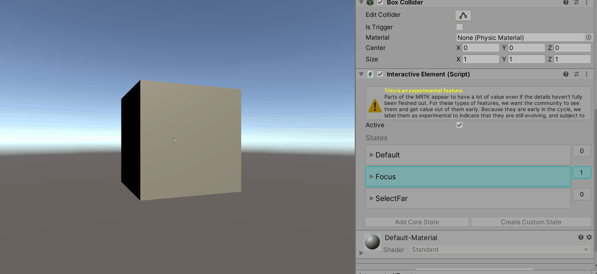| 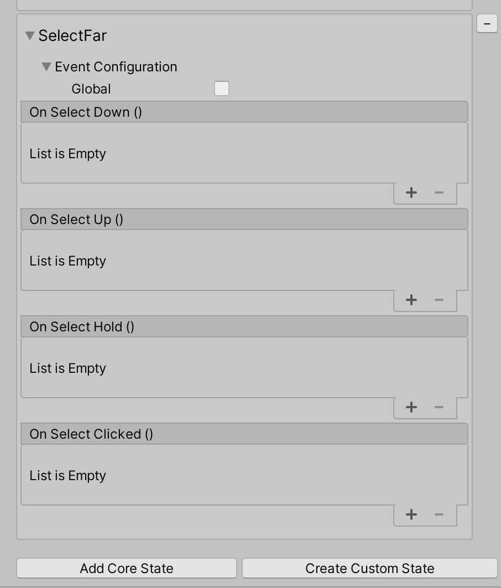|

#### Getting Select Far State Events

Event configuration type for the SelectFar State: `SelectFarEvents`

```c#
SelectFarEvents selectFarEvents = interactiveElement.GetStateEvents<SelectFarEvents>("SelectFar");

selectFarEvents.OnSelectUp.AddListener((pointerEventData) =>
{
    Debug.Log($"{gameObject.name} Far Interaction Pointer Up");
});

selectFarEvents.OnSelectDown.AddListener((pointerEventData) =>
{
    Debug.Log($"{gameObject.name} Far Interaction Pointer Down");
});

selectFarEvents.OnSelectHold.AddListener((pointerEventData) =>
{
    Debug.Log($"{gameObject.name} Far Interaction Pointer Hold");
});

selectFarEvents.OnSelectClicked.AddListener((pointerEventData) =>
{
    Debug.Log($"{gameObject.name} Far Interaction Pointer Clicked");
});
```

### Clicked State

The Clicked state is triggered by a far interaction click (Select Far state) by default.  This state is internally switched to on, invokes the OnClicked event and then is immediately switched to off. 

> [!NOTE]
> The visual feedback in the inspector based on state activity is not present for the Clicked state because it is switched on and then off immediately. 

|Clicked State Behavior| Clicked State Inspector|
|---|--|
|| |

**Near and Far Clicked State Example**  
The clicked state can be triggered through additional entry points using the `interactiveElement.TriggerClickedState()` method.  For example, if a user wants a near interaction touch to trigger a click on an object as well, then they would add the `TriggerClickedState()` method as a listener in the touch state.   

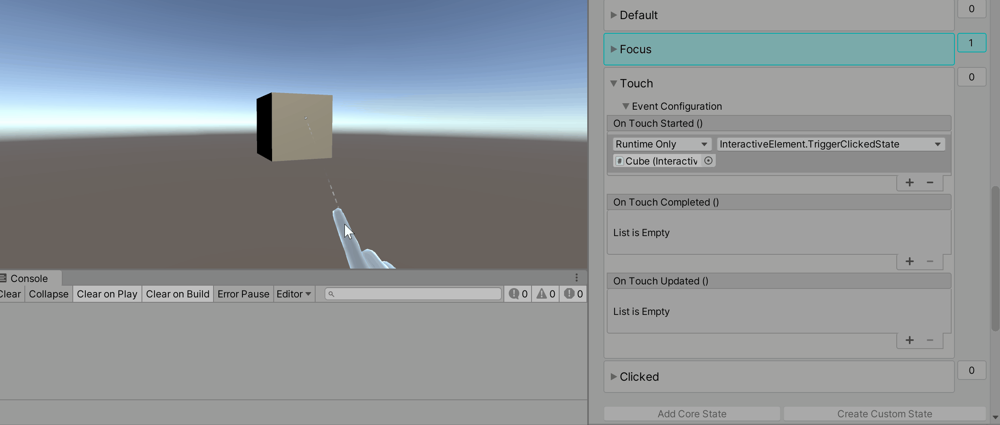

#### Getting Clicked State Events

Event configuration type for the Clicked State: `ClickedEvents`

```c#
ClickedEvents clickedEvent = interactiveElement.GetStateEvents<ClickedEvents>("Clicked");

clickedEvent.OnClicked.AddListener(() =>
{
    Debug.Log($"{gameObject.name} Clicked");
});
```

### Toggle On and Toggle Off state

The Toggle On and Toggle Off states are a pair and both need to be present for toggle behavior.  By default, the Toggle On and Toggle Off states are triggered through a far interaction click (Select Far state).  By default, the Toggle Off state is active on start, meaning that the toggle will be initialized to off.  If a user wants the Toggle On state to be active on start, then in the Toggle On state set `IsSelectedOnStart` to true.

|ToggleOn and Toggle Off State Behavior|ToggleOn and Toggle Off State Inspector|
|---|--|
|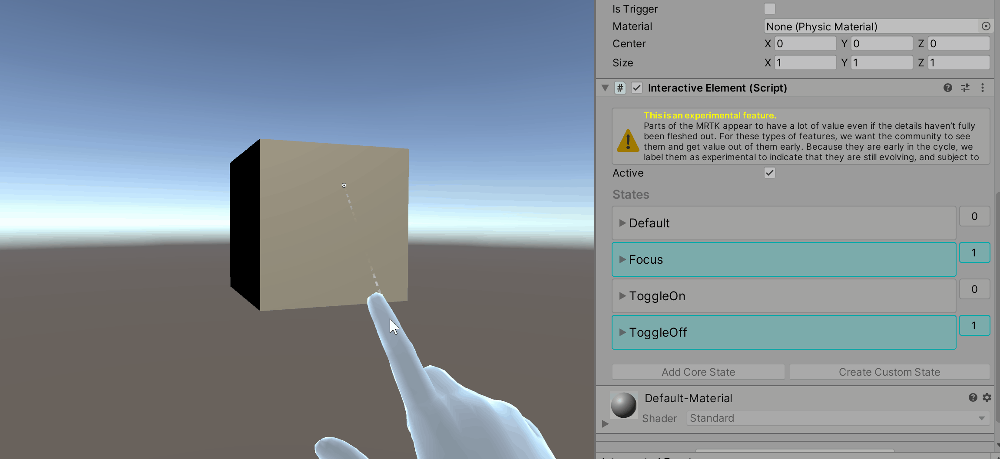| 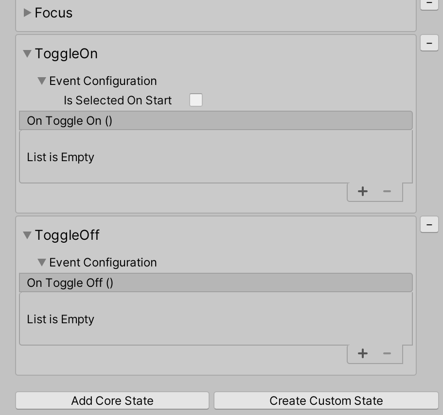|


**Near and Far Toggle States Example**  
Similar to the Clicked state, toggle state setting can have multiple entry points using the `interactiveElement.SetToggleStates()` method. For example, if a user wants touch as an additional entry point to set the toggle states, then they add the `SetToggleStates()` method to one of the events in the Touch state. 


#### Getting Toggle On and Toggle Off State Events

Event configuration type for the ToggleOn State: `ToggleOnEvents`  
Event configuration type for the ToggleOff State: `ToggleOffEvents`

```c#
// Toggle On Events
ToggleOnEvents toggleOnEvent = interactiveElement.GetStateEvents<ToggleOnEvents>("ToggleOn");

toggleOnEvent.OnToggleOn.AddListener(() =>
{
    Debug.Log($"{gameObject.name} Toggled On");
});

// Toggle Off Events
ToggleOffEvents toggleOffEvent = interactiveElement.GetStateEvents<ToggleOffEvents>("ToggleOff");

toggleOffEvent.OnToggleOff.AddListener(() =>
{
    Debug.Log($"{gameObject.name} Toggled Off");
});
```

### Speech Keyword State

The Speech Keyword state listens for the keywords defined in the Mixed Reality Speech Profile. Any new keyword MUST be registered in the speech command profile prior to runtime (steps below). 

|Speech Keyword State Behavior|Speech Keyword State Inspector|
|---|--|
|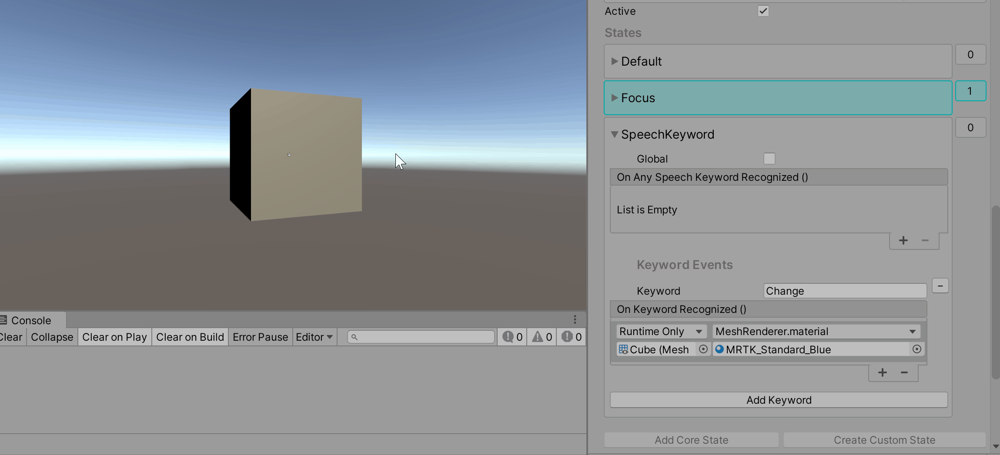| |

> [!NOTE]
> The Speech Keyword state was triggered in editor by pressing the F5 key in the gif above. Setting up in editor testing for speech is outlined the steps below. 

#### How to Register a Speech Command/Keyword

1. Select the **MixedRealityToolkit** game object

1. Select **Copy and Customize** the current profile

1. Navigate to the Input section and select **Clone** to enable modification of the Input profile

1. Scroll down to the Speech section in the Input profile and clone the Speech Profile

    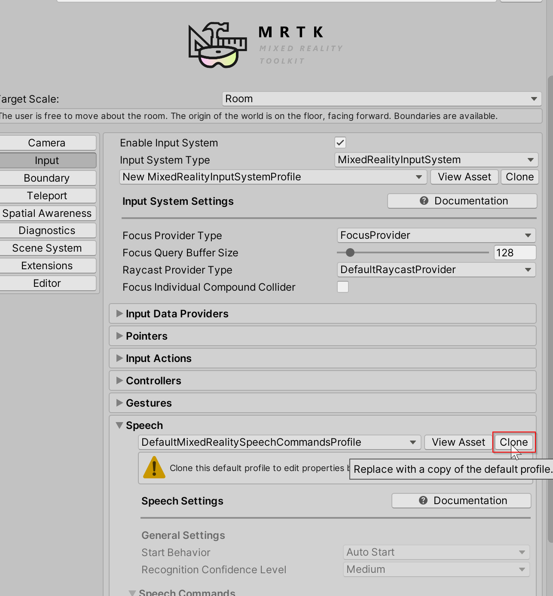 

1. Select Add a New Speech Command

    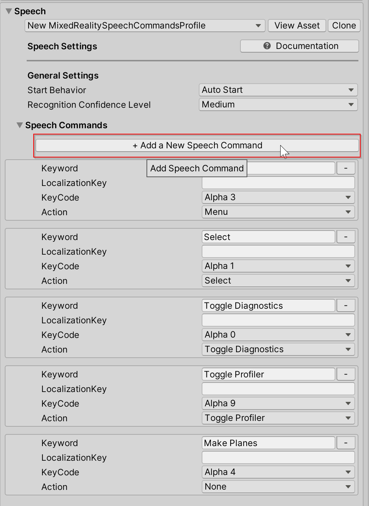 

1. Enter the new keyword. Optional: Change the KeyCode to F5 (or another KeyCode) to allow for testing in editor. 

    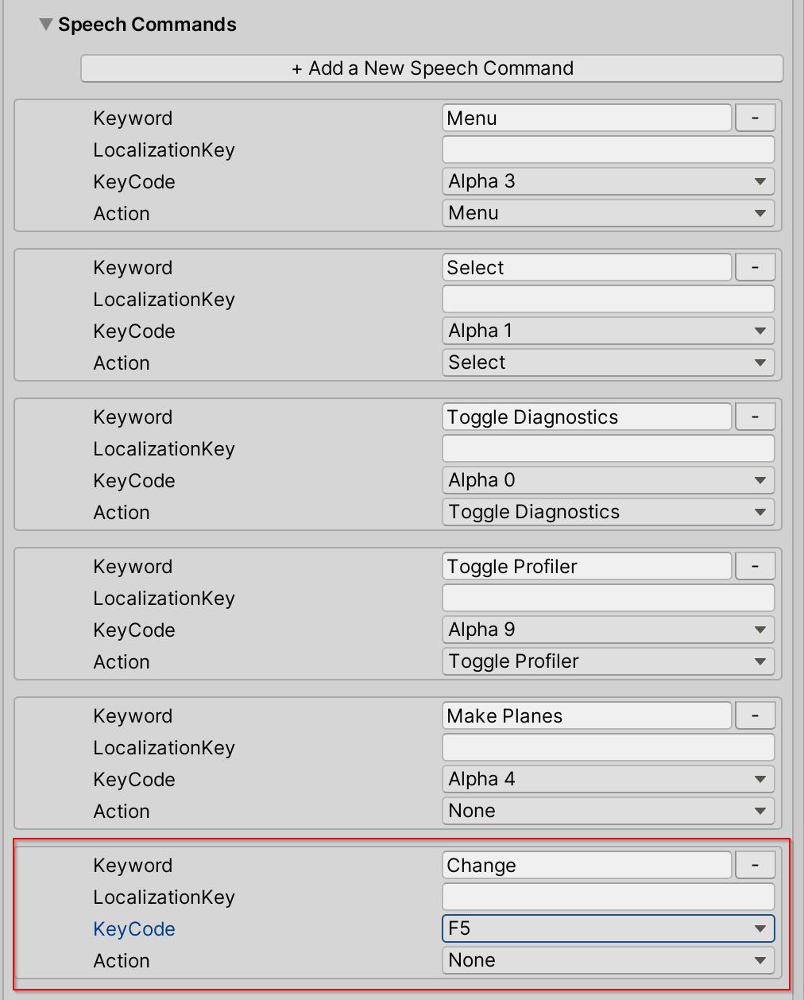 

1. Go back to the Interactive Element Speech Keyword state inspector and select **Add Keyword** 

    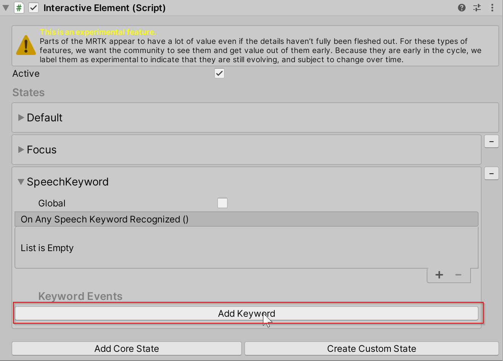 

    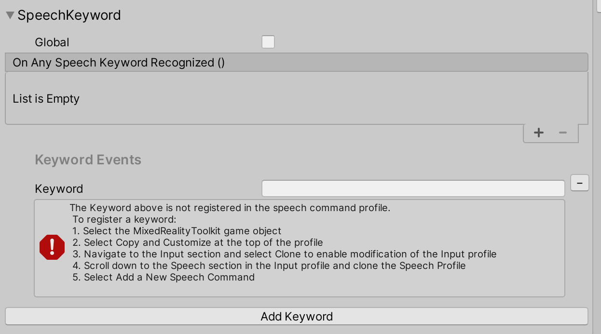 

1. Enter the new keyword that was just registered in the Speech Profile

    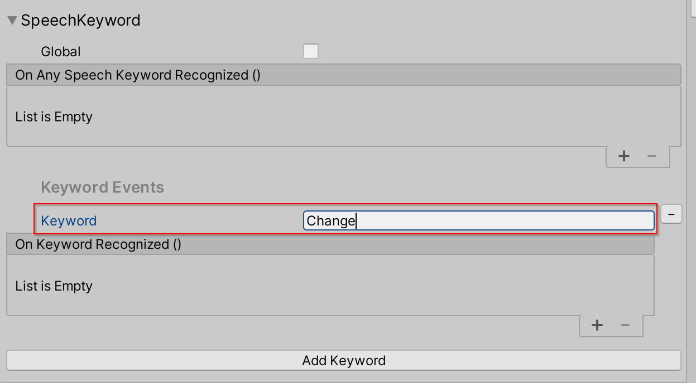 


To test the Speech Keyword state in editor, press the KeyCode that was defined in step 6 (F5) to simulate the speech keyword recognized event.

#### Getting Speech Keyword State Events

Event configuration type for the SpeechKeyword State: `SpeechKeywordEvents`

```c#
SpeechKeywordEvents speechKeywordEvents = interactiveElement.GetStateEvents<SpeechKeywordEvents>("SpeechKeyword");

speechKeywordEvents.OnAnySpeechKeywordRecognized.AddListener((speechEventData) =>
{
    Debug.Log($"{speechEventData.Command.Keyword} recognized");
});

// Get the "Change" Keyword event specifically
KeywordEvent keywordEvent = speechKeywordEvents.Keywords.Find((keyword) => keyword.Keyword == "Change");

keywordEvent.OnKeywordRecognized.AddListener(() =>
{ 
    Debug.Log("Change Keyword Recognized"); 
});
```

## Custom States

### How to Create a Custom State via Inspector 

The custom state created via inspector will be initialized with the default state event configuration. The default event configuration for a custom state is of type `StateEvents` and contains the OnStateOn and OnStateOff events.

1. Navigate to **Create Custom State** in the inspector for Interactive Element.
    
    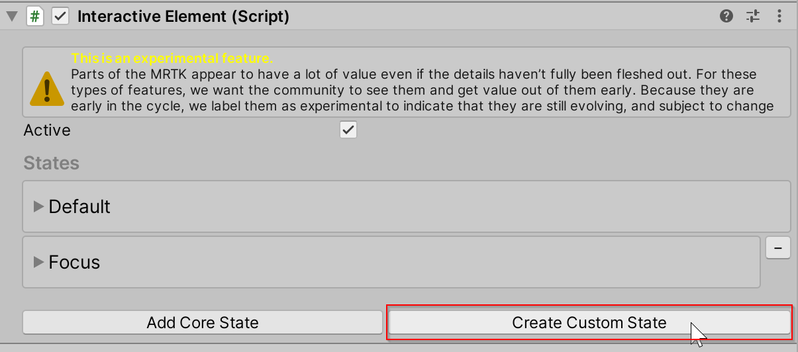

1. Enter the name of the new state. This name must be unique and cannot be the same as the existing core states. 
    
    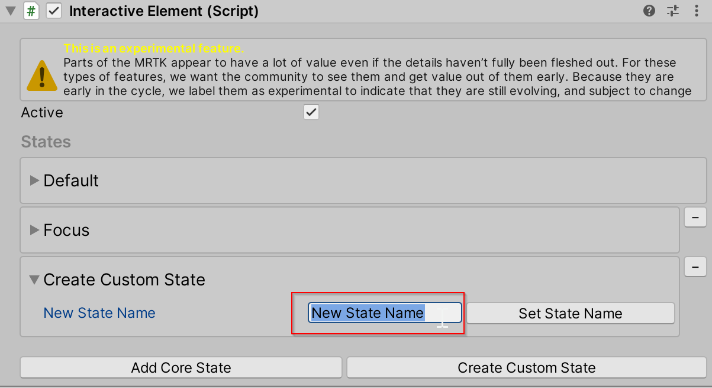

1. Select **Set State Name** to add to the state list.
    
    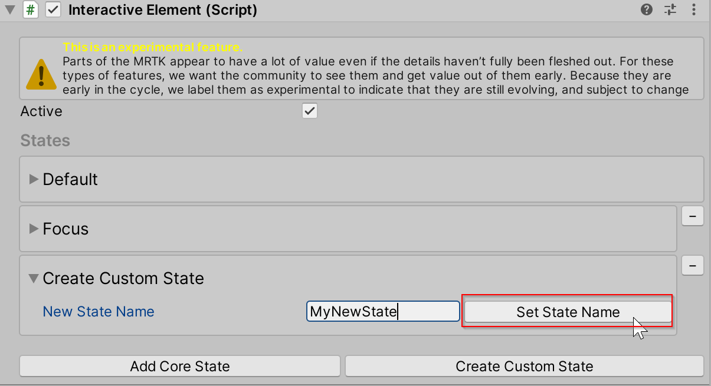

   This custom state is initialized with the default `StateEvents` event configuration which contains the `OnStateOn` and `OnStateOff` events. To create a custom event configuration for a new state see: [Creating a Custom State with a Custom Event Configuration](#creating-a-custom-state-with-a-custom-event-configuration).
    
    


### How to Create a Custom State via Script

```c#
interactiveElement.AddNewState("MyNewState");

// A new state by default is initialized with a the default StateEvents configuration which contains the 
// OnStateOn and OnStateOff events

StateEvents myNewStateEvents = interactiveElement.GetStateEvents<StateEvents>("MyNewState");

myNewStateEvents.OnStateOn.AddListener(() =>
{
    Debug.Log($"MyNewState is On");
});

```

### Creating a Custom State with a Custom Event Configuration 

Example files for a custom state named **Keyboard** are located here: MRTK\SDK\Experimental\InteractiveElement\Examples\Scripts\CustomStateExample

The following steps walk through an existing example of creating a custom state event configuration and receiver files.

1. Think of a state name.  This name must be unique and cannot be the same as the existing core states. For the purposes of this example, the state name is going to be **Keyboard**.

1. Create two .cs files named state name + "Receiver" and state name + "Events". The naming of these files are taken into consideration internally and must follow the state name + Event/Receiver convention. 

    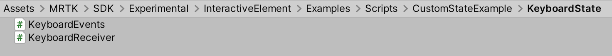

1. See the KeyboardEvents.cs and KeyboardReceiver.cs files for more details on file contents. New event configuration classes must inherit from `BaseInteractionEventConfiguration` and new event receiver classes must inherit from `BaseEventReceiver`.  Examples on state setting for the Keyboard state are located in the `CustomStateSettingExample.cs` file. 

1. Add the state to Interactive Element using the state name, the state name will be recognized if event configuration and event receiver files exist.  The properties in the custom event configuration file should appear in the inspector.

    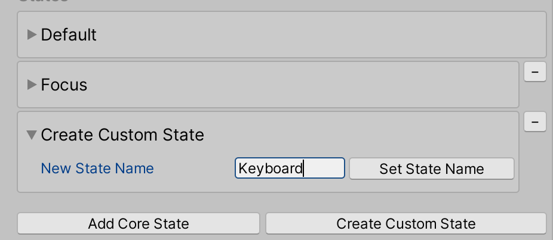
    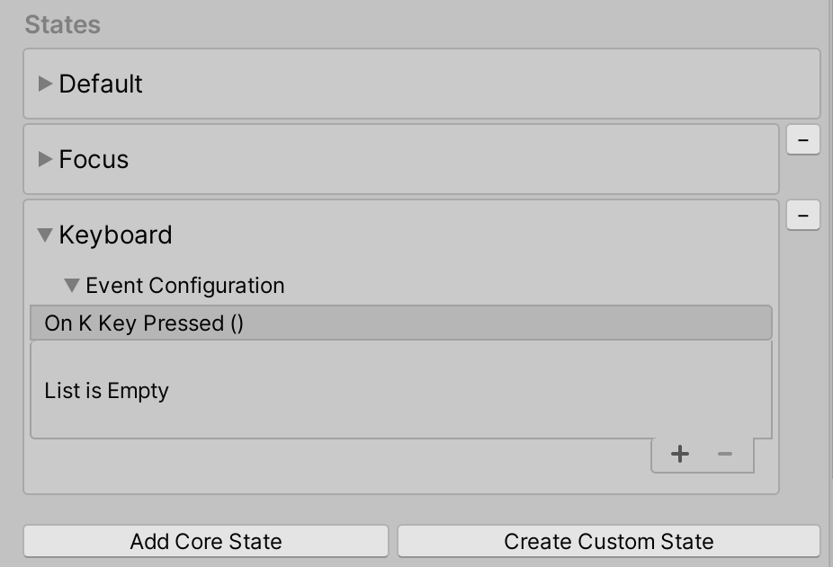


1. For more examples of event configuration and event receiver files see the files at these paths:    
- MRTK\SDK\Experimental\InteractiveElement\InteractiveElement\Events\EventConfigurations
- MRTK\SDK\Experimental\InteractiveElement\InteractiveElement\Events\EventReceivers

## Example Scene 

The example scene for Interactive Element + State Visualizer is located here: MRTK\SDK\Experimental\InteractiveElement\Examples\InteractiveElementExampleScene.unity

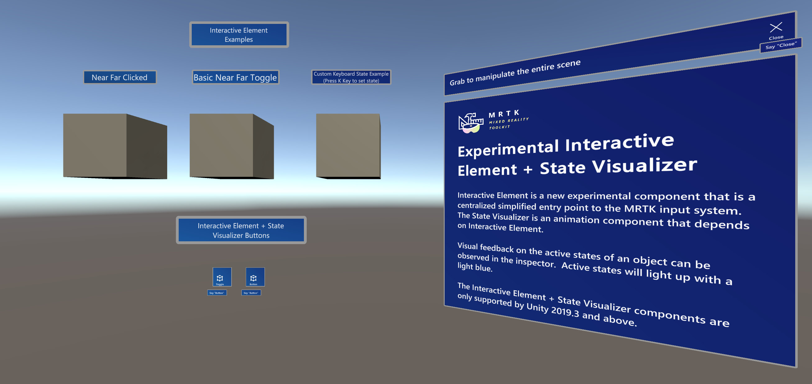

### Compressable Button

The example scene contains prefabs named `CompressableButton` and `CompressableButtonToggle`, these prefabs mirror the behavior of the `PressableButtonHoloLens2` buttons, that are constructed using Interactive Element and the State Visualizer. 
The `CompressableButton` component is currently a combination of `PressableButton` + `PressableButtonHoloLens2` with `BaseInteractiveElement`as a base class. 

# State Visualizer [Experimental]

The State Visualizer component adds animations to an object based on the states defined in a linked Interactive Element component. This component creates animation assets, places them in the MixedRealityToolkit.Generated folder and enables simplified animation keyframe setting through adding Animatable properties to a target game object. To enable animation transitions between states, an Animator Controller asset is created and a default state machine is generated with associated parameters and any state transitions.  The state machine can be viewed in Unity's Animator window.

## State Visualizer and Unity Animation System

The State Visualizer currently leverages the Unity Animation System. 

When the **Generate New Animation Clips** button in the State Visualizer is pressed, new animation clip assets are generated based on the state names in Interactive Element and are placed in the MixedRealityToolkit.Generated folder. The Animation Clip property in each state container is set to the associated animation clip.

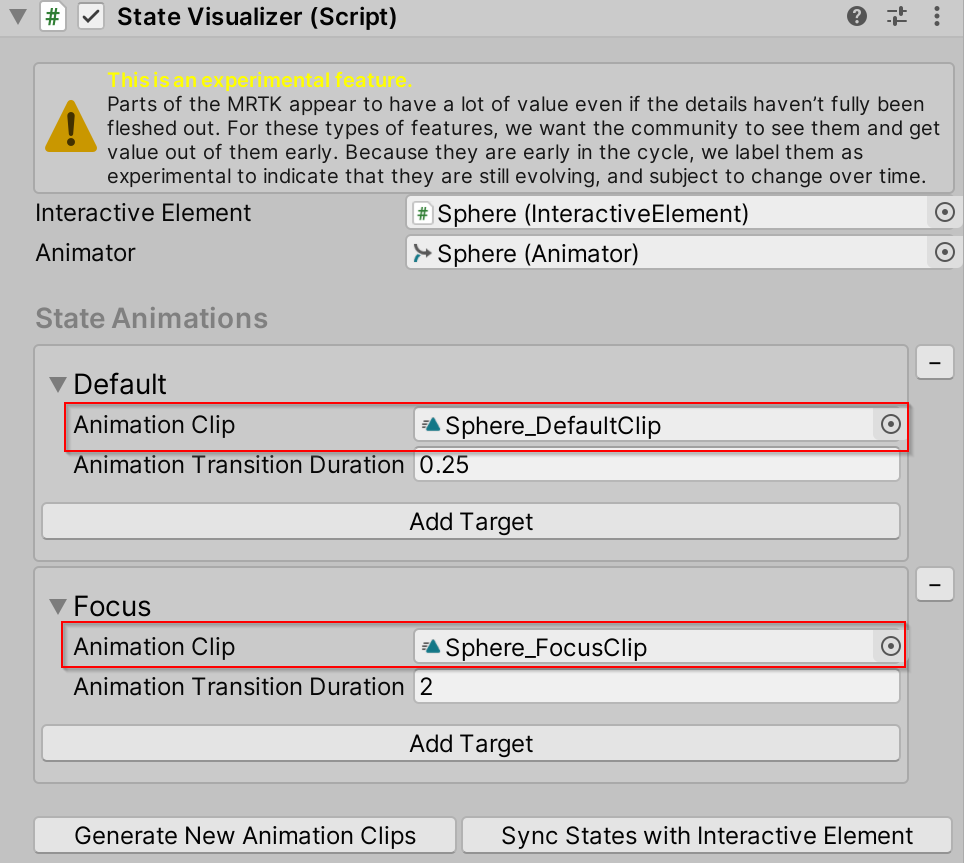

An [Animator State Machine](https://docs.unity3d.com/Manual/AnimationOverview.html) is also generated to manage smooth transitions between animation clips.  By default, the state machine utilizes the [Any State](https://docs.unity3d.com/Manual/class-State.html) to allow transitions between any state in Interactive Element. 

[Animation Parameters](https://docs.unity3d.com/Manual/AnimationParameters.html) are also generated for each state, the trigger parameters are used in the State Visualizer to trigger an animation.

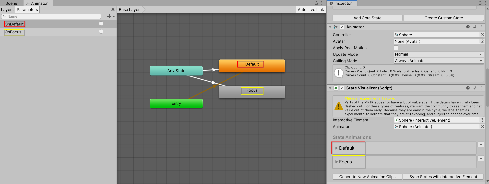

### Runtime Limitations 

The State Visualizer must be added to an object via the Inspector and cannot be added via script.  The properties that modify the AnimatorStateMachine/AnimationController are contained in an editor namespace (`UnityEditor.Animations`) which get removed when the app is built.

## How to use the State Visualizer

1. Create a Cube
1. Attach Interactive Element
1. Attach State Visualizer
1. Select **Generate New Animation Clips**

    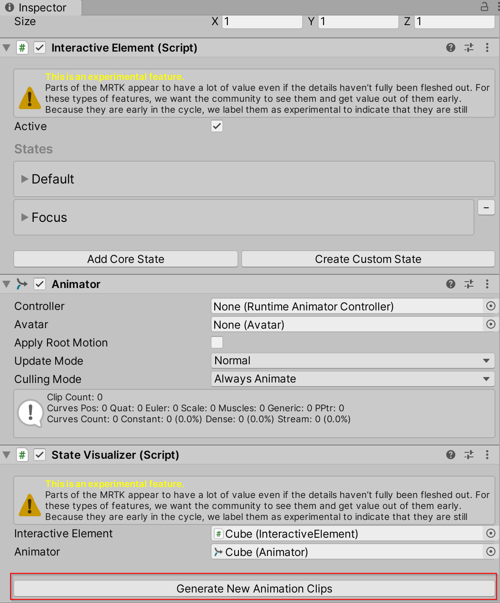

    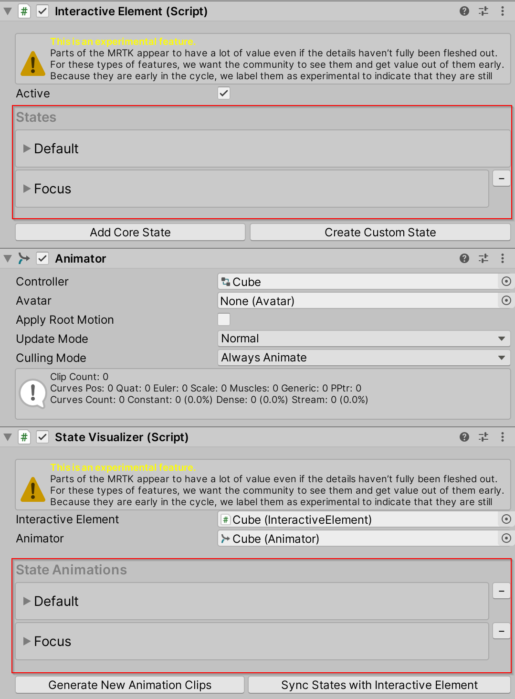

1. In the Focus state container, select **Add Target**

    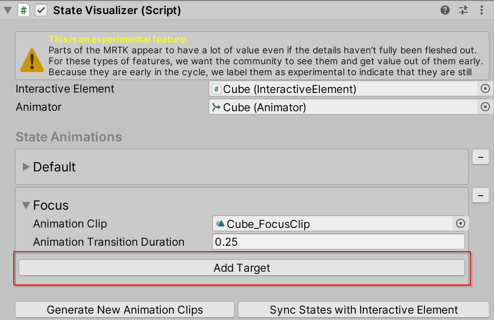

1. Drag the current game object to the target field 

    

1. Open the Cube Animatable Properties foldout
1. Select the Animatable property drop down menu and select **Color**

    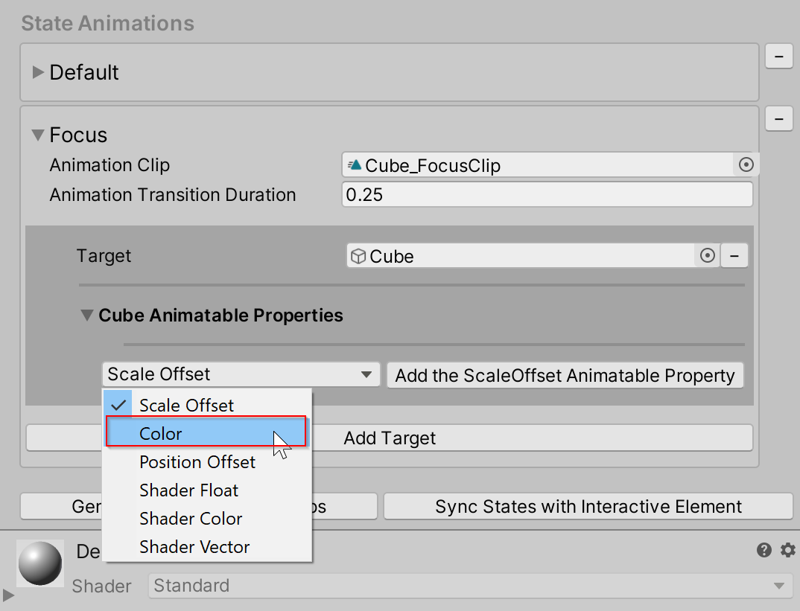

1. Select **Add the Color Animatable Property**

    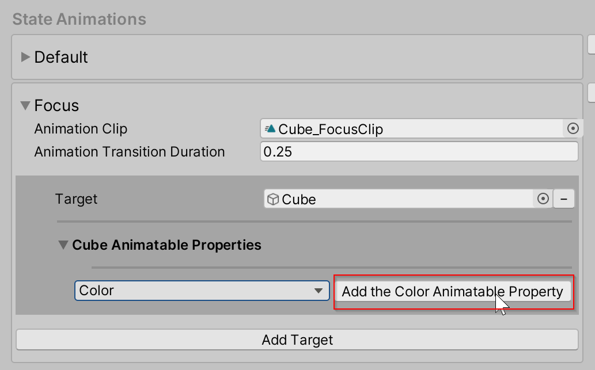

1. Choose a Color 

    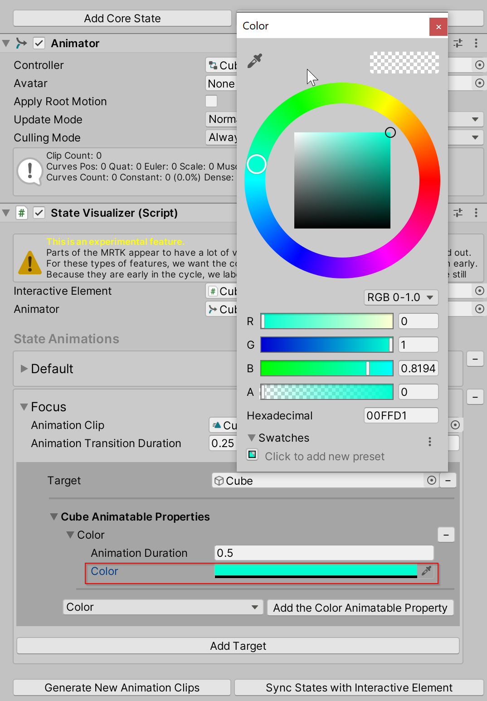

1. Press play and observe the transitional color change

    

## Animatable Properties

The primary purpose of the Animatable Properties is to simplify animation clip keyframe setting.  If a user is familiar with the Unity Animation System and would prefer to directly set keyframes on the generated animation clips, then they can simply not add Animatable properties to a target object and open the clip in Unity's Animation window (Windows > Animation > Animation). 

If using the Animatable properties for animation, the curve type is set to EaseInOut.

**Current Animatable Properties:**
- [Scale Offset](#scale-offset)
- [Position Offset](#position-offset)
- [Color](#color)
- [Shader Color](#shader-color)
- [Shader Float](#shader-float)
- [Shader Vector](#shader-vector)

### Scale Offset

The Scale Offset Animatable property takes the current scale of the object and adds the defined offset.

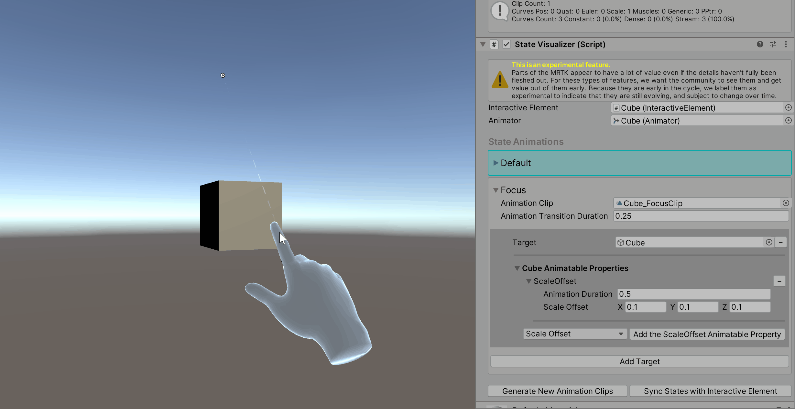

### Position Offset

The Position Offset Animatable property takes the current position of the object and adds the defined offset.


### Color

The Color Animatable property represents the main color of a material if the material has a main color property. This property animates the `material._Color` property.


### Shader Color

The Shader Color Animatable property refers to a shader property of type color. A property name is required for all shader properties. The gif below demonstrates animating a shader color property named Fill_Color that is not the main material color.  Observe the changing values in the material inspector.


### Shader Float

The Shader Float Animatable property refers to a shader property of type float. A property name is required for all shader properties. In the gif below, observe the changing values in the material inspector for the Metallic property. 

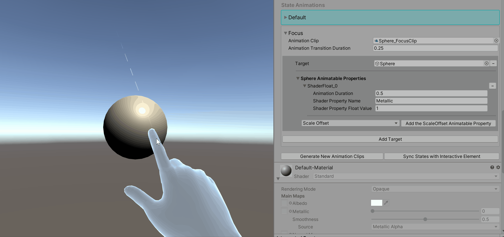

### Shader Vector

The Shader Vector Animatable property refers to a shader property of type Vector4. A property name is required for all shader properties. In the gif below, observe the changing values in the material inspector for the Tiling (Main Tex_ST) property. 


### How to Find Animatable Shader Property Names

1. Navigate to Window > Animation > Animation
1. Ensure that the object with the State Visualizer is selected in the hierarchy
1. Select any animation clip in the Animation window
1. Select **Add Property**, open the Mesh Renderer foldout 

    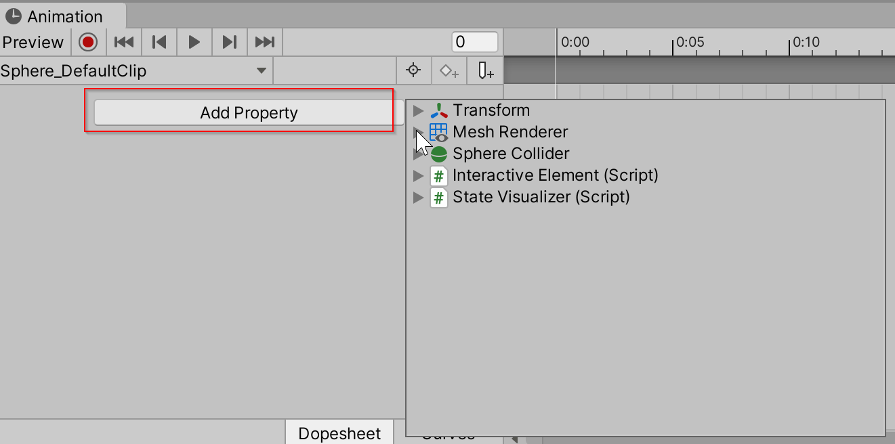

1. This list contains the names of all the Animatable property names 

    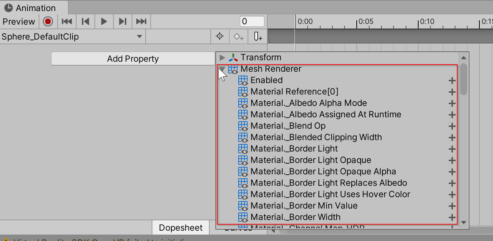

## See also

- [**Buttons**](README_Button.md)
- [**Bounds Control**](README_BoundsControl.md)
- [**Grid Object Collection**](README_ObjectCollection.md)
- [**Tap to Place**](README_TapToPlace.md)