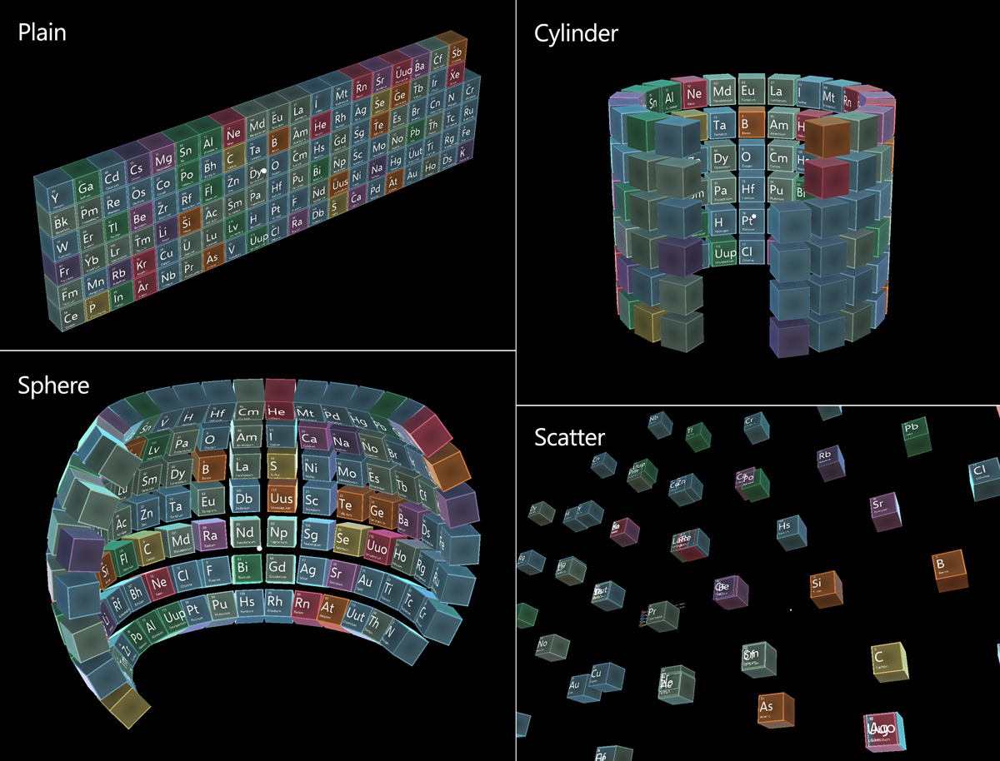

# Object collection #

Object collection is a script to help lay out an array of objects in predefined three-dimensional shapes. It supports five different surface styles - plane, cylinder, sphere, scatter, and radial. Radius, size and the space between the items can be adjusted. Since it supports any object in Unity, it can be used to layout both 2D and 3D objects.

## How to use an object collection ##

To create a collection, create an empty GameObject and assign the [`BaseObjectCollection.cs`](https://github.com/Microsoft/MixedRealityToolkit-Unity/blob/mrtk_release/Assets/MixedRealityToolkit.SDK/Features/UX/Scripts/Collections/BaseObjectCollection.cs) script to it. Any object(s) can be added as a child of the GameObject. Once finished adding child objects, click the *Update Collection* button in the inspector panel to generate the object collection. The objects will be laid out in the scene according to the selected surface type.

## Object collection examples ##

The [HandInteractionExamples.unity](https://github.com/Microsoft/MixedRealityToolkit-Unity/blob/mrtk_release/Assets/MixedRealityToolkit.Examples/Demos/HandTracking/Scenes/HandInteractionExamples.unity) example scene contains various examples of object collection types.

[Periodic table of the elements](https://github.com/Microsoft/MRDesignLabs_Unity_PeriodicTable) is an example app that demonstrates how object collections work. It uses object collection to layout the 3D element boxes in different shapes.

## Object collection types ##

**3D objects**
An object collection can be used to layout imported 3D objects. The example below shows the plane and cylindrical layouts of 3D chair model objects using a collection.

**2D Objects**

An object collection can also be crated from 2D images. For example, multiple images can be placed in a grid style.

