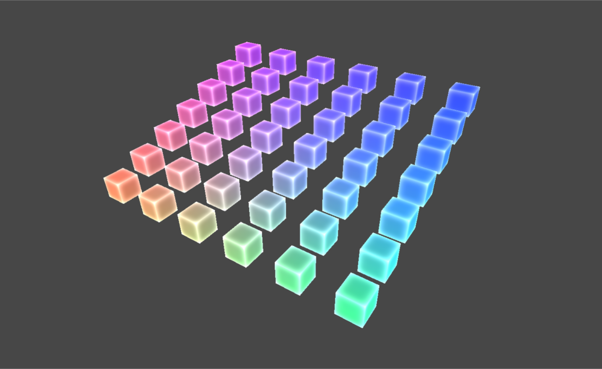
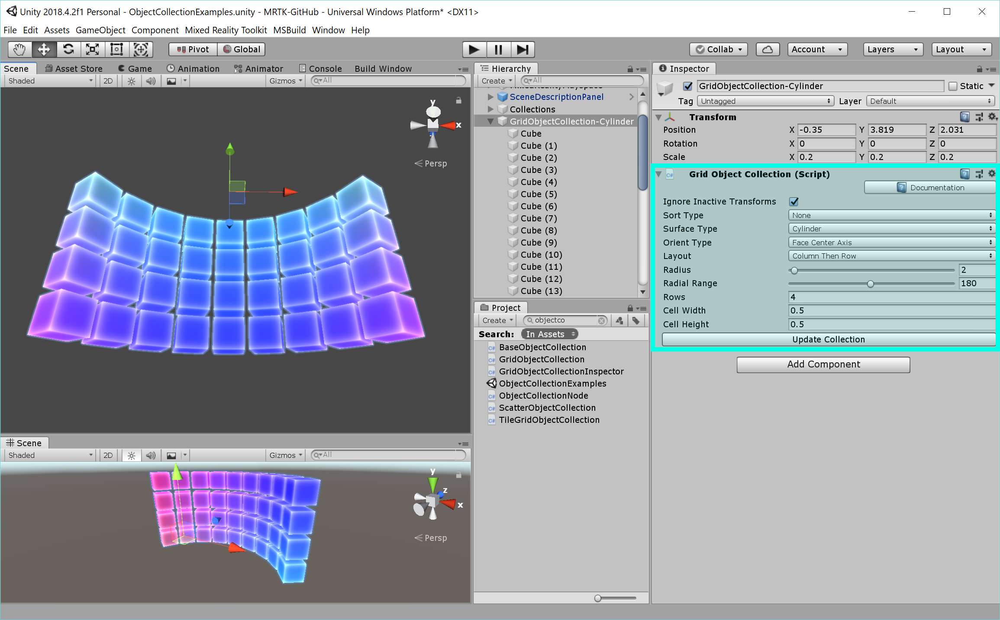

# Object collection #

Object collection is a script to help lay out an array of objects in predefined three-dimensional shapes. It supports various surface styles including plane, cylinder, sphere, and radial. Since it supports any object in Unity, it can be used to layout both 2D and 3D objects.

# Object collection scripts #
- [`GridObjectCollection`](https://github.com/Microsoft/MixedRealityToolkit-Unity/blob/mrtk_release/Assets/MixedRealityToolkit.SDK/Features/UX/Scripts/Collections/GridObjectCollection.cs) supports Cylinder, Plane, Sphere, Radial surface types
- [`ScatterObjectCollection`](https://github.com/Microsoft/MixedRealityToolkit-Unity/blob/mrtk_release/Assets/MixedRealityToolkit.SDK/Features/UX/Scripts/Collections/ScatterObjectCollection.cs) supports scattered style collection  
- [`TileGridObjectCollection`](https://github.com/Microsoft/MixedRealityToolkit-Unity/blob/mrtk_release/Assets/MixedRealityToolkit.SDK/Features/UX/Scripts/Collections/TileGridObjectCollection.cs) provides some additional options to GridObjectCollection. **Note:** TileGridObjectCollection does not extend [`GridObjectCollection`](https://github.com/Microsoft/MixedRealityToolkit-Unity/blob/mrtk_release/Assets/MixedRealityToolkit.SDK/Features/UX/Scripts/Collections/GridObjectCollection.cs), and has several bugs (see [issue 6237](https://github.com/microsoft/MixedRealityToolkit-Unity/issues/6237)). Therefore, it is recommended to use [`GridObjectCollection`](https://github.com/Microsoft/MixedRealityToolkit-Unity/blob/mrtk_release/Assets/MixedRealityToolkit.SDK/Features/UX/Scripts/Collections/GridObjectCollection.cs).

| Grid Object Collection - Cylinder |  Grid Object Collection - Sphere |
|:--- | :--- |
| Grid Object Collection - Radial |  Grid Object Collection - Plane |
| Scattered Object Collection |  Tile Grid Object Collection |

## How to use an object collection ##

To create a collection, create an empty GameObject and assign one of the Object Collection scripts to it. Any object(s) can be added as a child of the GameObject. Once finished adding child objects, click the *Update Collection* button in the inspector panel to generate the object collection. The objects will be laid out in the scene according to the collection parameters. Update Collection can be accessed through the code too.

## `GridObjectCollection` Content Alignment
The content in a GridObjectCollection can be aligned so that the parent object is anchored to the top/middle/bottom and left/center/right of the collection. Use the **anchor** property to specify content alignment.

## `GridObjectCollection` Layout Order
Use the **Layout** field to specify the row / column order that children are laid out:

**Column Then Row** - Children are first laid out by horizontally (by column), then vertically (by row). Use **Num Columns** (or Columns property in code) to specify the number of columns in the grid.

**Row Then Column** - Children are first laid out vertically (by row), then horizontally (by columns). Use **Num Rows** (or Rows property in code) to specify the number of rows in the grid.

**Horizontal** - Children are laid out in a single row using columns only

**Vertical** - Children are laid out in a single column using rows only.

## Object collection examples ##

The [ObjectCollectionExamples.unity](https://github.com/Microsoft/MixedRealityToolkit-Unity/blob/mrtk_release/Assets/MixedRealityToolkit.Examples/Demos/UX/Collections/Scenes/ObjectCollectionExamples.unity) example scene contains various examples of object collection types.

[Periodic table of the elements](https://github.com/Microsoft/MRDesignLabs_Unity_PeriodicTable) is an example app that demonstrates how object collections work. It uses object collection to layout the 3D element boxes in different shapes.

## Object collection types ##

**3D objects**
An object collection can be used to layout imported 3D objects. The example below shows the plane and cylindrical layouts of 3D chair model objects using a collection.

**2D Objects**

An object collection can also be crated from 2D images. For example, multiple images can be placed in a grid style.

