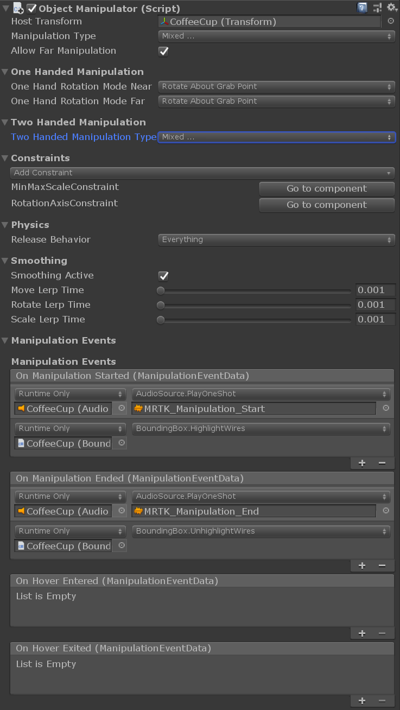
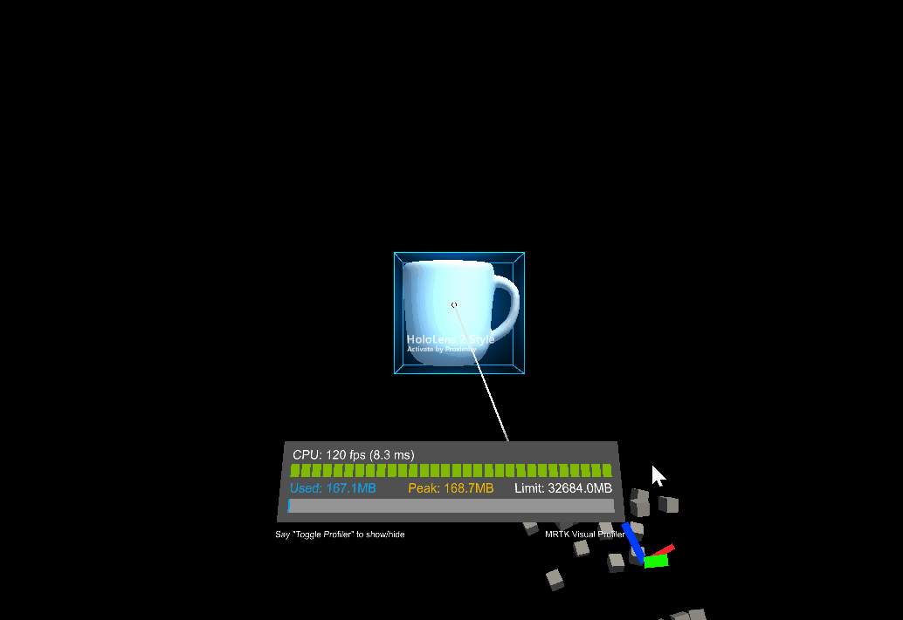
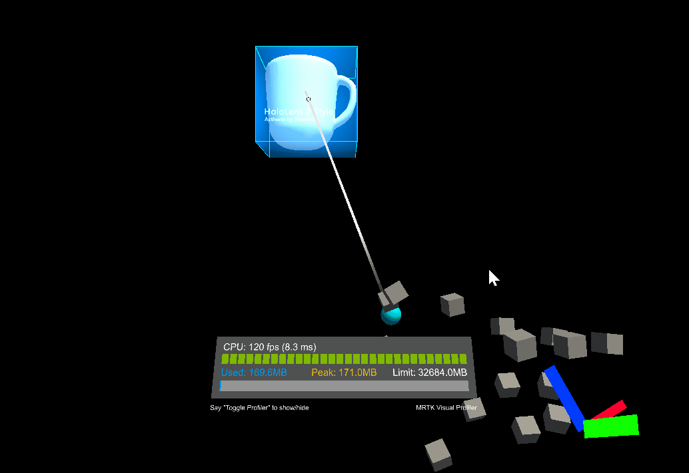
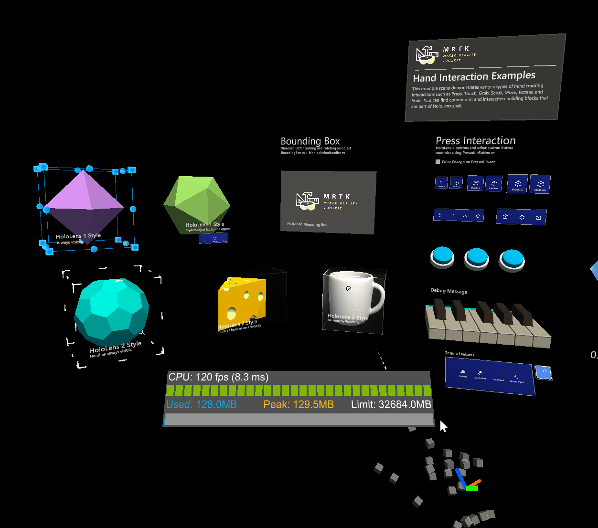

# Object manipulator

The *ObjectManipulator* is the new component for manipulation behaviour, previously found in *ManipulationHandler*. The object manipulator makes a number of improvements and simplifications. This component is a replacement for the manipulation handler, which will be deprecated.

The *ObjectManipulator* script makes an object movable, scalable, and rotatable using one or two hands. The object manipulator can be configured to control how the object will respond to various inputs. The script should work with most forms of interaction, such as HoloLens 2 articulated hand, HoloLens 2 hand rays, HoloLens 1 gaze and gestures and immersive headset motion controller input.

## How to use the object manipulator

To use the object manipulator, first add the `ObjectManipulator` script component to a GameObject. Make sure to also add a collider to the object, matching its grabbable bounds.

To make the object respond to near articulated hand input, add the `NearInteractionGrabbable` script as well.

Physics behaviour can be enabled for the object manipulator by adding a rigidbody component to the object. Physics behaviour enabled by adding this component is discussed in greater detail in [*Physics and collisions*](#physics-and-collisions).

As well as this, manipulation can be constrained by adding [manipulation constraint components](#transform-constraints) to the object. These are special components that work with manipulation and change the manipulation behaviour in some way.

## Inspector properties and fields

### General properties

#### Host transform

The object transform that will be manipulated. Defaults to the object of the component.

#### Manipulation type

Specifies whether the object can be manipulated using one hand or two hands. Because this property is a flag, both options can be selected.

- *One handed*: Enables one handed manipulation if selected.
- *Two handed*: Enables two handed manipulation if selected.

#### Allow far manipulation

Specifies whether manipulation can be done using far interaction with pointers.

### One handed manipulation properties

#### One hand rotation mode near

Specifies how the object will behave when it is being grabbed with one hand near. These options only work for articulated hands.

* *Rotate about object center*: Object rotates using rotation of the hand, but about the object center point. The object will appear to move less as it rotates, but there may be a feeling of disconnection between the hand and the object. More useful for far interaction.
* *Rotate about grab point*: Rotate object with the hand about the grab point between the thumb and index finger. It should feel as if the object is being held by the hand.

#### One hand rotation mode far

Specifies how the object will behave when it is being grabbed with one hand at distance. These options only work for articulated hands.

* *Rotate about object center*: Rotate object using rotation of the hand, but about the object center point. Useful for inspecting at a distance without the object center moving as the object rotates.
* *Rotate about grab point*: Rotate object using rotation of the hand, but about the pointer ray hit point. Useful for inspection.

### Two handed manipulation properties

#### Two handed manipulation type

Specifies how two hand manipulation can transform an object. Because this property is a flag, any number of options can be selected.

* *Move*: Moving is allowed if selected.
* *Scale*: Scaling is allowed if selected.
* *Rotate*: Rotation is allowed if selected.

### Constraints

#### Add constraint

This button allows a constraint component to be added directly from the object manipulator inspector. All constraints in a project should be visible here. See [transform constraints](#transform-constraints) for more info.

#### Go to component

All constraints found on the object wil be listed here with a *Go to component* button. This button will cause the inspector to scroll to the selected constraint component so that it can be configured.

### Physics

Settings in this section appear only when the object has a RigidBody component.

#### Release behavior

Specify which physical properties a manipulated object should keep upon release. Because this property is a flag, both options can be selected.

* *Keep Velocity*: When the object is released, if this option is selected it will keep its linear velocity.
* *Keep Angular Velocity*: When the object is released, if this option is selected it will keep its angular velocity.

#### Use forces for near manipulation

Whether physics forces are used to move the object when performing near manipulations. Setting this to *false* will make the object feel more directly connected to the users hand. Setting this to *true* will honor the mass and inertia of the object, but may feel as though the object is connected through a spring. The default is *false*. 

### Smoothing

#### Smoothing far

Whether frame-rate independent smoothing is enabled for far interactions. Far smoothing is enabled by default.

#### Smoothing near

Whether frame-rate independent smoothing is enabled for near interactions. Near smoothing is disabled by default because the effect may be perceived as being 'disconnected' from the hand.

#### Smoothing active

Obsolete and will be removed in a future version. Applications should use SmoothingFar, SmoothingNear or a combination of the two.

#### Move lerp time

Amount of smoothing to apply to the movement. Smoothing of 0 means no smoothing. Max value means no change to value.

#### Rotate lerp time

Amount of smoothing to apply to the rotation. Smoothing of 0 means no smoothing. Max value means no change to value.

#### Scale lerp time

Amount of smoothing to apply to the scale. Smoothing of 0 means no smoothing. Max value means no change to value.

### Manipulation events

Manipulation handler provides the following events:

* *OnManipulationStarted*: Fired when manipulation starts.
* *OnManipulationEnded*: Fires when the manipulation ends.
* *OnHoverStarted*: Fires when a hand / controller hovers the manipulatable, near or far.
* *OnHoverEnded*: Fires when a hand / controller un-hovers the manipulatable, near or far.

The event fire order for manipulation is:

*OnHoverStarted* -> *OnManipulationStarted* -> *OnManipulationEnded* -> *OnHoverEnded*

If there is no manipulation, you will still get hover events with the following fire order:

*OnHoverStarted* -> *OnHoverEnded*

## Transform constraints

Constraints can be used to limit manipulation in some way. For example, some applications may require rotation, but also require that the object remain upright. In this case, a `RotationAxisConstraint` can be added to the object and used to limit rotation to y-axis rotation. MRTK provides a number of constraints, all of which are described below.

It is also possible to define new constraints and use them to create unique manipulation behaviour that may be needed for some applications. To do this, create a script that inherits from [`TransformConstraint`](xref:Microsoft.MixedReality.Toolkit.UI.TransformConstraint) and implement the abstract `ConstraintType` property and the abstract `ApplyConstraint` method. Upon adding a new constraint to the object, it should constrain manipulation in the way that was defined. This new constraint should also show in the object manipulator [constraint fields](#constraints).

All of the constraints provided by MRTK share the following properties:

#### Target Transform

Transform of the manipulated object being constrained. This should be the same as the ObjectManipulator [*Host transform*](#host-transform). Defaults to the object of the component.

#### Hand Type

Specifies whether the constraint is used for one handed, two handed or both kinds of manipulation. Because this property is a flag, both options can be selected.

* *One handed*: Constraint will be used during one handed manipulation if selected.
* *Two handed*: Constraint will be used during two handed manipulation if selected.

#### Proximity Type

Specifies whether the constraint is used for near, far or both kinds of manipulation. Because this property is a flag, both options can be selected.

* *Near*: Constraint will be used during near manipulation if selected.
* *Far*: Constraint will be used during far manipulation if selected.

### FaceUserConstraint

When this constraint is attached to an object, rotation will be limited so that object will always face the user. This is useful for slates or panels. The properties for `FaceUserConstraint` are as follows:

#### Face away

Object faces away from the user if true.

### FixedDistanceConstraint

This constraint fixes the distance between the manipulated object and another object transform on manipulation start. This is useful for behaviour such as fixing the distance from the manipulated object to the head transform. The properties for `FixedDistanceConstraint` are as follows:

#### Constraint transform

This is the other transform that the manipulated object will have a fixed distance to. Defaults to the camera transform.

### FixedRotationToUserConstraint

This constraint fixes the relative rotation between the user and the manipulated object while it is being manipulated. This is useful for slates or panels as it ensures that the manipulated object always shows the same face to the user as it did at the start of manipulation. The `FixedRotationToUserConstraint` does not have any unique properties.

### FixedRotationToWorldConstraint

This constraint fixes the global rotation of the manipulated object while it is being manipulated. This can be useful in cases where no rotation should be imparted by manipulation. The `FixedRotationToWorldConstraint` does not have any unique properties:

### MaintainApparentSizeConstraint

When this constraint is attached to an object, no matter how far the object is from the user, it will maintain the same apparent size to the user (i.e. it will take up the same proportion of the user's field of view). This can be used to ensure that a slate or text panel remains readable while manipulating. The `MaintainApparentSizeConstraint` does not have any unique properties:

### MoveAxisConstraint

This constraint can be used to fix along which axes a manipulated object can be moved. This can be useful for manipulating objects over the surface of a plane, or along a line. The properties for `MoveAxisConstraint` are as follows:

#### Constraint on movement

Specifies which axes to prevent movement on. By default these axes will be global rather than local, but this can be changed below. Because this property is a flag, any number of options can be selected.

* *X Axis*: Movement along the x-axis is constrained if selected.
* *Y Axis*: Movement along the y-axis is constrained if selected.
* *Z Axis*: Movement along the z-axis is constrained if selected.

#### Use local space for constraint

Will constrain relative the manipulated object's local transform axes if true. False by default.

### RotationAxisConstraint

This constraint can be used to fix about which axes a manipulated object can be rotated. This can be useful for keeping a manipulated object upright, but still allowing y-axis rotations, for example. The properties for `RotationAxisConstraint` are as follows:

#### Constraint on rotation

Specifies which axes to prevent rotation about. By default these axes will be global rather than local, but this can be changed below. Because this property is a flag, any number of options can be selected.

* *Y Axis*: Rotation about the y-axis is constrained if selected.
* *Z Axis*: Rotation about the z-axis is constrained if selected.
* *X Axis*: Rotation about the x-axis is constrained if selected.

#### Use local space for constraint

Will constrain relative the manipulated object's local transform axes if true. False by default.

### MinMaxScaleConstraint

This constraint allows minimum and maximum values to be set for the scale of the manipulated object. This is useful for preventing users from scaling an object too small or too large. The properties for `MinMaxScaleConstraint` are as follows:

#### Scale minimum

The minimum scale value during manipulation.

#### Scale maximum

The maximum scale value during manipulation.

#### Relative to initial state

If true, the values above will be interpreted as relative to the objects initial scale. Otherwise they will be interpreted as absolute scale values.

## Physics and collisions

Physics behaviour can be enabled by adding a rigidbody component to the same object as an object manipulator. Not only does this enable configuration of [release behaviour](#release-behavior) above, it also enables collisions. Without a rigidbody component, collisions don't behave correctly during manipulation:

* Collisions between a manipulated object and a static collider (i.e. an object with a collider but no rigidbody) do not work, the manipulated object passes straight through the static collider unaffected.
* Collisions between a manipulated object and a rigidbody (i.e an object with both a collider and a rigidbody) cause the rigidbody to have a collision response, but the response is jumpy and unnatural. There is also no collision response on the manipulated object.

When a rigidbody is added, collisions should work correctly.

### Without rigidbody

### With rigidbody

