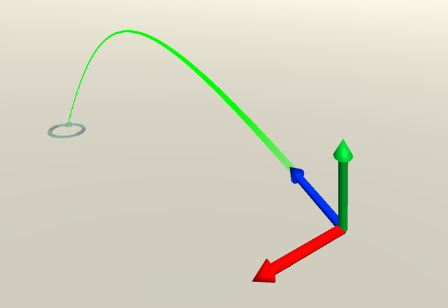

# Pointers

A pointer is something attached to a controller that gives focus and dispatches inputs to the game object it is pointing to [1](https://github.com/luis-valverde-ms/MixedRealityToolkit-Unity/blob/feature/input_docs/Documentation/Input/InputSystem.md).

For a game object to be able to receive focus it must have a collider (so it can be hit by physics raycasts) and belong to one of the layers defined in the Pointer Raycast Layer Masks in the Pointer Profile.

Pointers are instantiated automatically at runtime when a new controller is detected. The pointers that are created for each controller type are defined in the _Pointer Options_ in the _Pointer Profile_. You can have more than one pointer attached to a controller; for example, with the default pointer profile, WMR controllers get both a line and a parabolic pointer for normal selection and teleportation respectively. Pointers communicate with each other to decide which one is active.

MRTK provides a set of pointer prefabs in _Assets/MixedRealityToolkit.SDK/Features/UX/Prefabs/Pointers_. You can use your own prefabs as long as they contain one of the pointer scripts in _Assets/MixedRealityToolkit.SDK/Features/UX/Scripts/Pointers_ or any other script implementing `IMixedRealityPointer`.

## MRTK Pointer Prefabs

### Line Pointer

A line pointer is a ray attached to a controller. The line starts at the controller's base, and its pointing direction matches the pointing direction of the controller. 

Line pointers are commonly used when you have two controllers which have a position, and a pointing direction. 

For motion controllers like in Oculus, Vive, Windows Mixed Reality, the rotation will match the rotation of the controller.

For other controllers like HoloLens 2 articulated hands, the rotation matches the system-provided pointing pose of the hand.

### GGV Pointer
GGV stands for "Gaze, Gesture, Voice"[2](https://docs.microsoft.com/en-us/windows/mixed-reality/gaze). The GGV pointer's position and direction is driven by the head's position and rotation. The pointer is used to provide input that matches the HoloLens V1 input style of head gaze + airtap[3](https://docs.microsoft.com/en-us/windows/mixed-reality/gestures).

In the pointer profile you can see that the V1 HoloLens input system is provided for you via the mapping of "GGVHand" (V1 HoloLens hand) to the GGVPointer. 

You can also simulate the V1 HoloLens GGV behavior on HoloLens 2 by mapping the articulated hand to the GGVPointer.

### Grab Pointer / Sphere Pointer

Grab pointer is used for near interactions, specifically for grabbing items near the hand / controller. 

**NOTE:** Only items with _Near Interaction Grabbable_ components will respond to the sphere pointer.

#### Sphere Pointer Properties
Sphere Cast Radius - The radius for the sphere used to query for grabbable objects.
Debug Mode - If true, draw the sphere that is used to query for grabbable objects

### Poke Pointer

Poke pointer is for near interactions, specifically for touching objects via the hand / controller.

### Mouse pointer

Mouse pointer is used for interacting with the mouse.

### Teleport pointer

Teleport pointer is used for teleportation.
