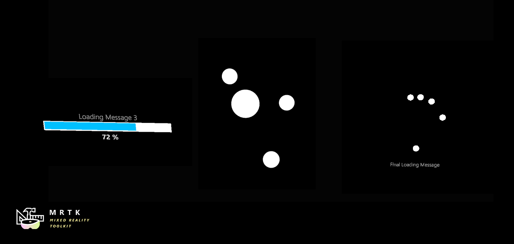

# Progress Indicators



## Example scene

Examples of how to use progress indicators can be found in the `ProgressIndicatorExamples` scene. This scene demonstrates each of the progress indicator prefabs included in the SDK.


## Example: Open, update & close a progress indicator

Progress indicators implement the [`IProgressIndicator`](xref:Microsoft.MixedReality.Toolkit.UI.IProgressIndicator) interface. This interface can be retrieved from a GameObject using `GetComponent`.

```c#
[SerializedField]
private GameObject indicatorObject;
private IProgressIndicator indicator;

private void Start()
{
    indicator = indicatorObject.GetComponent<IProgressIndicator>();
}
```

The `IProgressIndicator.OpenAsync()` and `IProgressIndicator.CloseAsync()` methods return [Tasks](xref:System.Threading.Tasks.Task). We recommend awaiting these Tasks in an async method.

Set the indicator's `Progress` property to a value from 0-1 to update its displayed progress. Set its `Message` property to update its displayed message. Different implementations may display this content in different ways.

```c#
private async void OpenProgressIndicator()
{
    await indicator.OpenAsync();

    float progress = 0;
    while (progress < 1)
    {
        progress += Time.deltaTime;
        indicator.Message = "Loading...";
        indicator.Progress = progress;
        await Task.Yield();
    }

    await indicator.CloseAsync();
}
```

## Indicator states

An indicator's `State` property determines which operations are valid. Calling an invalid method will typically cause the indicator to report an error and take no action.

State | Valid Operations
--- | ---
`ProgressIndicatorState.Opening` | `AwaitTransitionAsync()`
`ProgressIndicatorState.Open` | `CloseAsync()`
`ProgressIndicatorState.Closing` | `AwaitTransitionAsync()`
`ProgressIndicatorState.Closed` | `OpenAsync()`

`AwaitTransitionAsync()` can be used to be sure an indicator is fully opened or closed before using it.

```c#
private async void ToggleIndicator(IProgressIndicator indicator)
{
    await indicator.AwaitTransitionAsync();

    switch (indicator.State)
    {
        case ProgressIndicatorState.Closed:
            await indicator.OpenAsync();
            break;

        case ProgressIndicatorState.Open:
            await indicator.CloseAsync();
            break;
        }
    }
```
