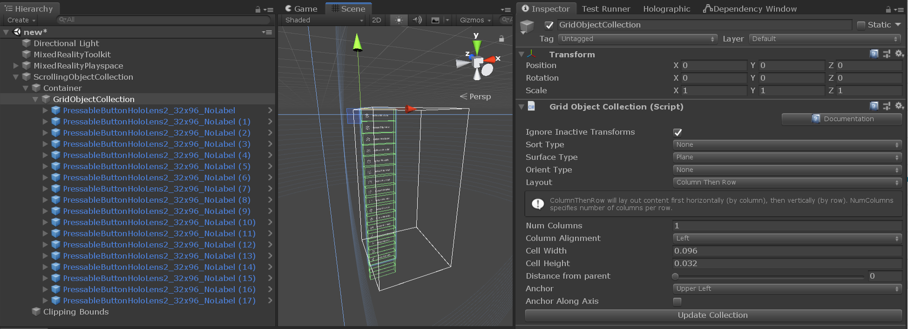
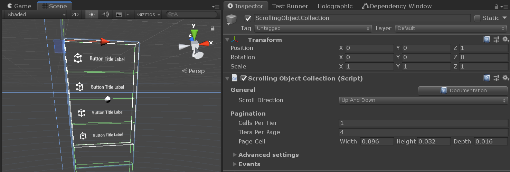
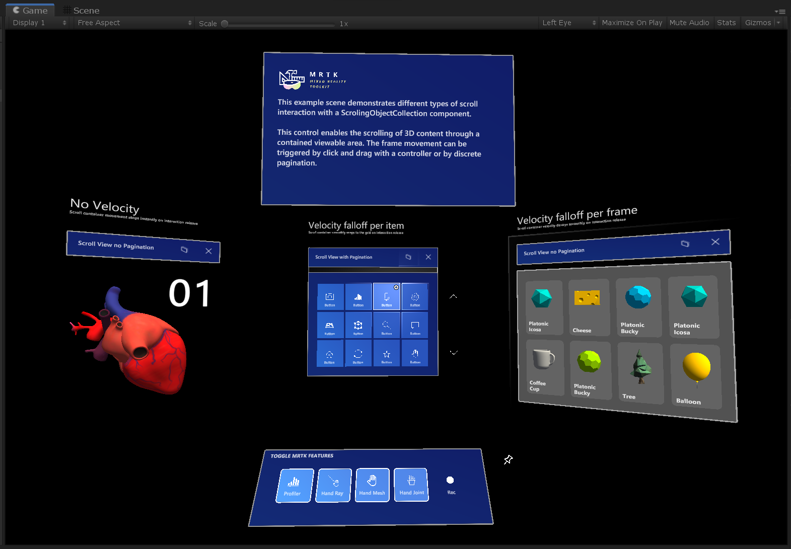

# Scrolling object collection


The MRTK scrolling object collection is an UX component that enables scrolling of 3D content through a contained viewable area. The scrolling movement can be triggered by near or far input interaction and by discrete pagination. It supports both interactive and non-interactive objects.

## Getting started with the scrolling object collection

### Setting up the scene

1. Create a new unity scene.
1. Add MRTK to the scene by navigating to the **Mixed Reality Toolkit** > **Add to Scene and Configure**.

### Setting up the scrolling object

1. Create an empty game object in the scene and change its position to (0, 0, 1).
1. Add a [scrolling object collection](xref:Microsoft.MixedReality.Toolkit.UI.ScrollingObjectCollection) component to the game object.

    When the scrolling object collection is added, a box collider and a [near interaction touchable](xref:Microsoft.MixedReality.Toolkit.Input.NearInteractionTouchable) component will be automatically attached to the root game object. These components allow the scroll object to listen to near and far interaction input events, like a pointer touch or click.  

    The MRTK scrolling object collection has two important elements that are created as child game objects under the root scrolling object hierarchy:
    * `Container` - All scrolling content objects must be children of the container game object.
    * `Clipping bounds` - If scrolling content masking is enabled, the clipping bounds element ensures that only the scrollable content inside its boundaries is visible. The clipping bounds game object has two components: a disabled box collider and a [clipping box](xref:Microsoft.MixedReality.Toolkit.Utilities.ClippingBox).

 

### Adding content to the scrolling object

The scrolling object collection can be combined with a [grid object collection](xref:Microsoft.MixedReality.Toolkit.Utilities.GridObjectCollection) to layout content in a grid of aligned elements that have uniform size and spacing.

1. Create an empty game object as a child of the scroll container.
1. Add a grid object collection component to the game object.
1. For a vertical single column scroll, in the inspector tab, configure the grid object collection as follow: 
    - **Num columns**: 1
    - **Layout**: column then row
    - **Anchor**: upper left
1. Change the **cell width** and **height** according to the dimensions of the content objects.
1. Add the content objects as children of the grid object.
1. Press **update collection**.



> [!IMPORTANT]
> Any scrolling content object material must use the [MRTK standard shader](README_MRTKStandardShader.md) in order for the clipping effect on the viewable area to work properly.
   
> [!NOTE]
> If scrolling content masking is enabled, the scrolling object collection will add a [material instance](Rendering/MaterialInstance.md) component to any content objects that have a renderer attached. This component is used to manage instanced materials lifetime and improve memory performance.

### Configuring the scrolling viewable area

1. For vertical scrolling through a single column of objects, in the inspector tab, configure the scrolling object collection as follow:
    - **Cells per tier**: 1
    - Choose the number of **tiers per page** according to the desired number of visible rows
1. Change the **page cell width**, **height** and **depth** according to the dimensions of the content objects.

Notice how the content objects lying outside the scrolling viewable area are now disabled, while objects intersecting the scroll wireframe might be partially masked by the clipping primitive.


 
### Testing the scrolling object collection in the editor

1. Press play and hold the space bar to show an input simulation hand.
1. Move the hand until the scrolling collider or any scrolling interactive content is in focus and trigger the scrolling movement by clicking and dragging up and down with the left mouse.

## Controlling the scrolling object from code

The MRTK scrolling object collection exposes a few public methods that allow moving the scrolling container by snapping its position according to the `pagination` properties configuration.

An example of how to access the scrolling object collection pagination interface is available to use under the ``MRTK/Examples/Demos/ScrollingObjectCollection/Scripts`` folder. The [scrollable pagination](xref:Microsoft.MixedReality.Toolkit.Examples.Demos.ScrollablePagination) example script can be linked to any existing scrolling object collection in the scene. The script can then be referenced by scene components exposing Unity events (e.g, [MRTK button](README_Button.md)).

```c#
public class ScrollablePagination : MonoBehaviour
{
    [SerializeField]
    private ScrollingObjectCollection scrollView;

    public void ScrollByTier(int amount)
    {
        scrollView.MoveByTiers(amount);
    }       
}
```

## Scrolling object collection properties:

| General                      |                                                                                                                                                                                                     |
|:-----------------------------|:----------------------------------------------------------------------------------------------------------------------------------------------------------------------------------------------------|
| Scroll direction             | The direction in which content should scroll.|

| Pagination                   |                                                                                                                                                                                                     |
|:-----------------------------|:----------------------------------------------------------------------------------------------------------------------------------------------------------------------------------------------------|
| Cells per tier               | Number of cells in a row on up-down scroll view or number of cells in a column on left-right scroll view.                                                                                                         |
| Tiers per page               | Number of visible tiers in the scrolling area.                                                                                                                                                                         |
| Page cell                    | Dimensions of the pagination cell.                  |

| Advanced settings            |                                                                                                                                                                                                     |
|:-----------------------------|:----------------------------------------------------------------------------------------------------------------------------------------------------------------------------------------------------|
| Mask edit mode               | Edit modes for defining the clipping box masking boundaries. Choose 'Auto' to automatically use pagination values. Choose 'Manual' for enabling direct manipulation of the clipping box object.|
| Collider edit mode           | Edit modes for defining the scroll interaction collider boundaries. Choose 'Auto' to automatically use pagination values. Choose 'Manual' for enabling direct manipulation of the collider.|
| Can scroll                   | Enables/disables scrolling with near/far interaction.                  |
| Use on pre render            | Toggles whether the scrollingObjectCollection will use the Camera OnPreRender event to manage content visibility.                  |
| Pagination curve             | Animation curve for pagination.                  |
| Animation length             | The amount of time (in seconds) the PaginationCurve will take to evaluate.                  |
| Hand delta scroll threshold  | The distance, in meters, the current pointer can travel along the scroll direction before triggering a scroll drag.                  |
| Front touch distance         | Distance, in meters, to position a local xy plane used to verify if a touch interaction started in the front of the scroll view.                  |
| Release threshold            | Withdraw amount, in meters, from the scroll boundaries needed to transition from touch engaged to released.                  |

| Velocity |                                                                                                                                                                                    |
|-------------------|------------------------------------------------------------------------------------------------------------------------------------------------------------------------------------|
| Type of velocity       | The desired type of velocity falloff for the scroller.                                                                                        |
| Velocity multiplier     | Amount of (extra) velocity to be applied to scroller.                                                                                                                                                        |
| Velocity dampen     | Amount of falloff applied to the velocity. |
| Bounce multiplier     | Multiplier to add more bounce to the overscroll of a list when using falloff per frame or falloff per item. |

| Debug options |                                                                                                                                                                                    |
|-------------------|------------------------------------------------------------------------------------------------------------------------------------------------------------------------------------|
| Mask enabled       | Visibility mode of scroll content. Default value will mask all objects outside of the scroll viewable area.                                                                                        |
| Show threshold planes     | If true, the editor will render the touch release threshold planes around the scroll boundaries.                                                                                                                                                        |
| Debug pagination     | Use this section to debug the scroll pagination during runtime. |

| Events|                                                                                                                                                                                    |
|-------------------|------------------------------------------------------------------------------------------------------------------------------------------------------------------------------------|
| On click       | Event triggered when the scroll background collider or any of its interactive content receives a click.                                                                                        |
| On touch started     | Event triggered when the scroll background collider or any of its interactive content receives a near interaction touch.                                                                                                                                                        |
| On touch ended     | Event triggered when an active touch interaction is terminated by having the near interaction pointer crossing one of the release threshold planes. |
| On momentum started     | Event triggered when the scroll container starts moving by interaction, velocity fallofff or pagination. |
| On momentum ended     | Event triggered when the scroll container stops moving by interaction, velocity fallofff or pagination. |

## Scrolling example scene

**ScrollingObjectCollection.unity** example scene consists of 3 scrollable examples, each one with a different velocity falloff configuration. The example scene can be found under the ``MRTK/Examples/Demos/ScrollingObjectCollection/Scenes`` folder.



## Scrolling example prefabs

For convenience, two scrolling object collection prefabs are available to use. The example prefabs can be found under the ``MRTK/Examples/Demos/ScrollingObjectCollection/Prefabs`` folder.


## See also

* [Clipping Primitive](Rendering/ClippingPrimitive.md)
* [Material Instance](Rendering/MaterialInstance.md)
* [Standard Shader](README_MRTKStandardShader.md)
* [Object collection](README_ObjectCollection.md)