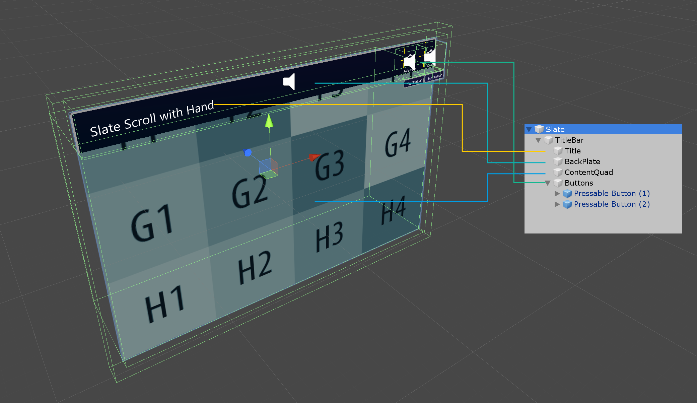

# Slate #

The [`Slate.prefab`](https://github.com/Microsoft/MixedRealityToolkit-Unity/blob/mrtk_release/Assets/MixedRealityToolkit.Examples/Demos/HandTracking/Prefabs/Slate.prefab) offers a thin window style control for displaying 2D content, for example plain text or articles including media. It offers a grabbable title bar as well as *Follow Me* and *Close* functionality. The content window can be scrolled via articulated hand input.

## How to use a slate control ##
A slate control is composed of the following elements:

* **TitleBar**: The entire title bar on top of the slate.
* **Title**: The title area on the left side of the title bar.
* **Buttons**: The button area on the right side of the title bar.
* **BackPlate**: The back side of the slate.
* **ContentQuad**: Content is assigned as material. The example uses a sample material 'PanContent'.

## Bounding Box ##
A slate control contains a bounding box script for scaling and rotating. For more information on bounding box, please see the [Bounding box](README_BoundingBox.md) page.

## Buttons ##
A standard slate offers two buttons as default on the top right of the title bar:

* **Follow Me**: Toggles an orbital solver components to make the slate object follow the user.
* **Close**: Disables the slate object.

## Scripts ##
In general, the `NearInteractionTouchable.cs` script must be attached to any object that is intended to receive touch events from the `IMixedRealityTouchHandler`.

* [`HandInteractionPan.cs`](https://github.com/Microsoft/MixedRealityToolkit-Unity/blob/mrtk_release/Assets/MixedRealityToolkit.SDK/Features/UX/Scripts/Slate/HandInteractionPan.cs): This script handles articulated hand input for touching and moving the content on the slate's *ContentQuad*.

* [`SlateEnabler.cs`](https://github.com/Microsoft/MixedRealityToolkit-Unity/blob/mrtk_release/Assets/MixedRealityToolkit.SDK/Features/UX/Scripts/Slate/SlateEnabler.cs): This script is intended to be used with DragEnabler. These two scripts allow the slate and another object - for instance a title bar - to toggle their active status so that the touch action only affects one at a time. This prevents interacting with the slate to accidentally trigger the title bar behavior and vice versa. The slate enabler script is put on the game object that is not the slate. Once attached it toggles interaction with the slate when the game object is being dragged or touched.

* [`DragEnabler.cs`](https://github.com/Microsoft/MixedRealityToolkit-Unity/blob/mrtk_release/Assets/MixedRealityToolkit.SDK/Features/UX/Scripts/Slate/DragEnabler.cs): This script is intended to be used with SlateEnabler. These two scripts allow the slate and another object - for instance a title bar - to toggle their active status so that the touch action only affects one at a time. The drag enabler script is put on the slate. Once attached, it toggles interaction with an accompanying object such as a title bar while the slate is being touched.
