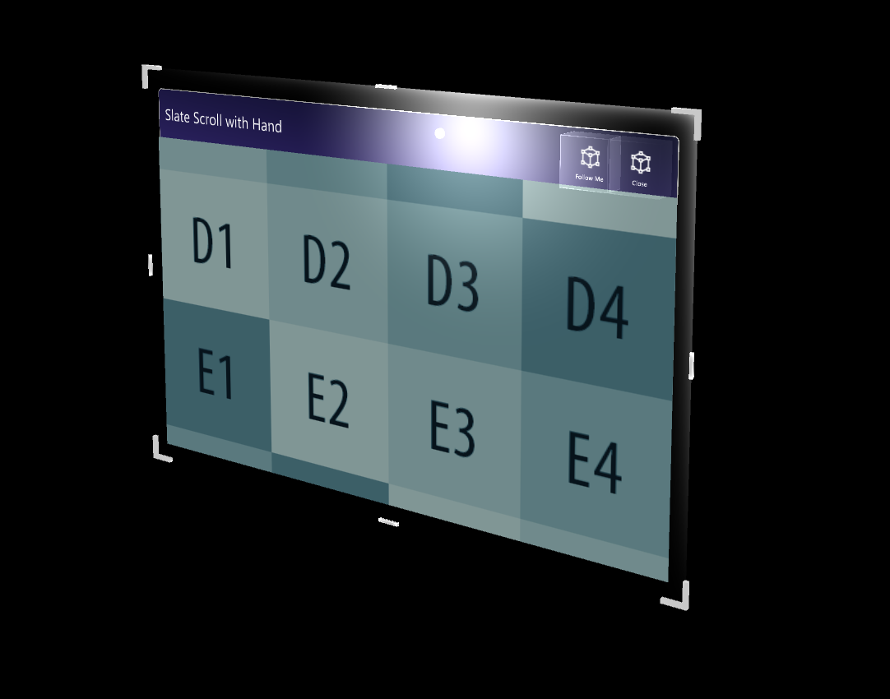
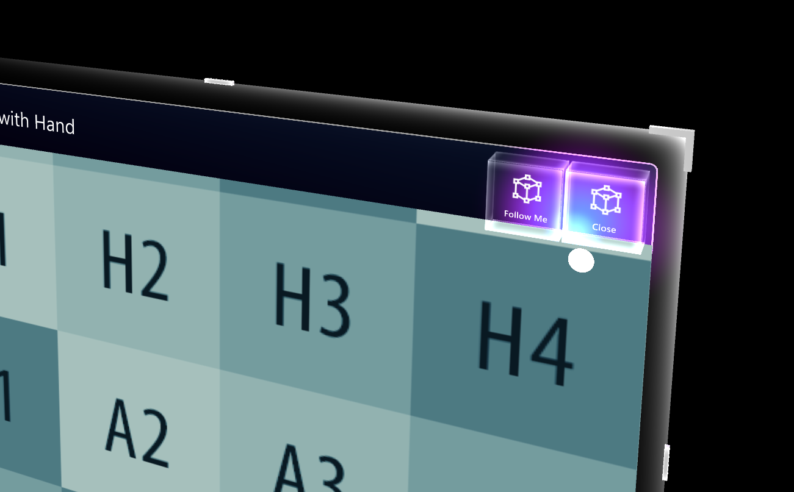

# Slate

Thin window style control for the 2D content with grabbable title bar and 'Follow Me' and 'Close' buttons. You can scroll 2D content with articulated hand.

## Structure
Slate control is composed of these elements.

- TitleBar
- Title
- BackPlate
- ContentQuad: Content is assigned as material. The example uses a sample material 'PanContent'
- Buttons

## Bounding Box

Slate control contains Bounding Box script for scaling and rotating. For more information on Bounding Box, please see [Bounding Box](README_BoundingBox.md) page.

## Buttons

- Follow Me: Toggles 'Orbital' solver components to make the Slate object follow the user.
- Close: Disables the Slate object

## Scripts

### HandInteractionPan.cs
This script handles articulated hand input for touching and moving the content on the slate's **ContentQuad**

#### SlateEnabler.cs 
This script is intended to be used with DragEnabler. These two scripts allow the Slate and another object - for instance a Title Bar - to toggle their active status so that the Touch action only affects one at a time. This prevents interacting with the Slate to accidentally trigger the Title Bar behavior and vice versa. The SlateEnabler script is put on the GameObject that is NOT the Slate. Once attached- it toggles interaction with the Slate when the GameObject is being dragged or touched.

#### DragEnabler.cs 
This script is intended to be used with SlateEnabler. These two scripts allow the Slate and another object - for instance a Title Bar - to toggle their active status so that the Touch action only affects one at a time. The DragEnabler script is put on the Slate. Once attached, it toggles interaction with an accompanying object such as a Title Bar while the Slate is being touched.

#### NearInteractionTouchable.cs
This script must be attached to any object that is intended to receive Touch events from implemented the `IMixedRealityTouchHandler`.
