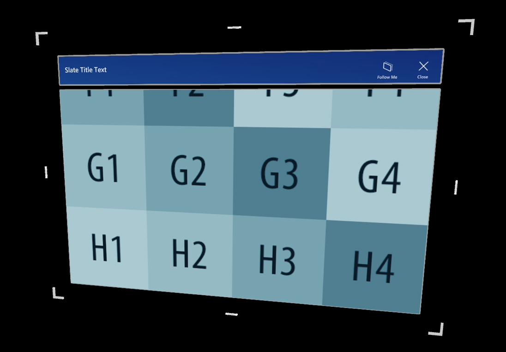

# Slate

The Slate prefab offers a thin window style control for displaying 2D content, for example plain text or articles including media. It offers a grabbable title bar as well as *Follow Me* and *Close* functionality. The content window can be scrolled via articulated hand input.

## How to use a slate control

A slate control is composed of the following elements:

* **TitleBar**: The entire title bar on top of the slate.
* **Title**: The title area on the left side of the title bar.
* **Buttons**: The button area on the right side of the title bar.
* **BackPlate**: The back side of the slate.
* **ContentQuad**: Content is assigned as material. The example uses a sample material 'PanContent'.

## Bounding box

A slate control contains a bounding box script for scaling and rotating. For more information on bounding box, please see the [Bounding box](README_BoundingBox.md) page.

## Buttons

A standard slate offers two buttons as default on the top right of the title bar:

* **Follow Me**: Toggles an orbital solver components to make the slate object follow the user.
* **Close**: Disables the slate object.

## Scripts

In general, the `NearInteractionTouchable.cs` script must be attached to any object that is intended to receive touch events from the `IMixedRealityTouchHandler`.

* `HandInteractionPan.cs` This script handles articulated hand input for touching and moving the content on the slate's *ContentQuad*.

* `HandInteractionPanZoom.cs`: In addition to the panning interaction, this script supports two-handed zooming.

