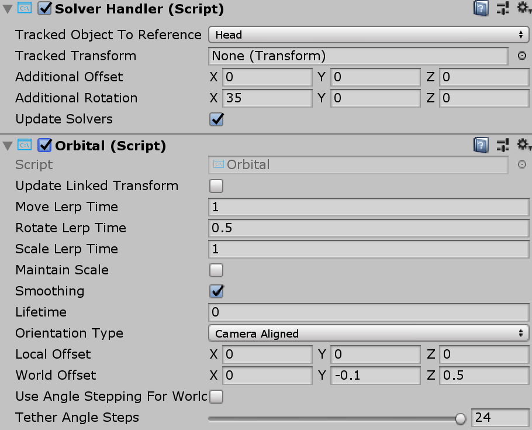

# Solver #

At this time, there is no easy, reliable way to specify the update order for Unity components. This can make it difficult to implement deterministic compound transformations. The solver system addresses this issue.

Building on this, solvers offer a range of behaviors to attach objects to other objects or systems. One example would be a tag-along object that hovers in front of the user (based on the camera). A solver could also be attached to a controller and an object to make the object tag-along the controller. All solvers can be safely stacked, for example a tag-along behavior + surface magnetism + momentum.

## How to use a solver ##
First, add the desired behavior to an object by using the respective solver type. All solvers are based on [`Solver.cs`](https://github.com/Microsoft/MixedRealityToolkit-Unity/blob/mrtk_release/Assets/MixedRealityToolkit.SDK/Features/Utilities/Solvers/Solver.cs).

The Solver system consists of three categories of scripts:

* **SolverBase**: The base abstract class that all solvers to derive from. It provides state tracking, smoothing parameters and implementation, automatic solver system integration, and update order.
* **SolverHandler**: Sets the reference object (eg, the main camera transform) and handles gathering of solver components and executes them in order.

The third category is the solver itself. The following solvers provide the building blocks for basic behavior:

* **Orbital**: Locks to a specified position * offset from the referenced object.
* **ConstantViewSize**: Scales to maintain a constant size relative to the view of the referenced object.
* **RadialView**: Keeps the object within a view cone cast by the referenced object.
* **SurfaceMagnetism**, casts rays to surfaces in the world, and align the object to that surface.
* **Momentum**: Applies acceleration/velocity/friction to simulate momentum and springiness for an object being moved by other solvers/components.
* **InBetween**: Keeps an object in between two tracked objects.

When a solver is used, the [`SolverHandler.cs`](https://github.com/Microsoft/MixedRealityToolkit-Unity/blob/mrtk_release/Assets/MixedRealityToolkit.SDK/Features/Utilities/Solvers/SolverHandler.cs) will be added automatically. It has two fields for setting the reference object. You can choose a tracked object (such as the user camera or L/R motion controllers), or instead use the **TransformTarget** field which overrides any set tracked object. This enables you to have solvers reference any scene object. That means objects can have tag alongs and cast surface magnetism as well as tracked objects.

The surface magnetism scripts rely on a *LayerMask* for raycasting. As a recommendation, create a custom layer mask (the example uses *Surface*). Note that using *default* or *everything* will result in UI components or cursors contributing to the solver. Note that this can produce weird and unexpected behavior, for example objects lurching toward the user and so on.

When *UpdateLinkedTransform* is true, the solver will calculate position & orientation, but will not apply it. This lets other components use the transform values.

*Example of using Orbital solver in the [Slate](README_Slate.md) prefab.*

## Expectations for extending or adding to the solver system ##
To create a new solver script, you will want to extend from the abstract base class, *Solver*. This will ensure your new solver will tie into the state tracking and execution from both Solver and SolverHandler. The power with solvers comes from them being modular in nature, so as you extend Solver, keep this in mind. Its better to have many small solver scripts vs. one big one.

## Known Issues ##
Sometimes solvers behave differently than one may expect based on the order in which they're executed. Previous solvers can change or even neutralize the behavior of earlier solvers. Try re-arranging their execution order if the settings on a particular solver aren't having the desired effect.
