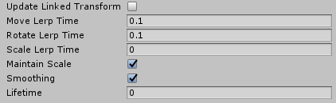
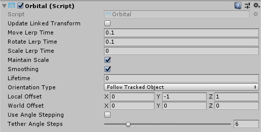

# Solvers


Solvers are components that facilitate the means of calculating an object's position & orientation according to a predefine algorithm. An example may be placing an object on the surface the user's gaze raycast currently hits.  

Furthermore, the Solver system deterministically defines an order of operations for these transform calculations as there is no reliable way to specify to Unity the update order for components.

Solvers offer a range of behaviors to attach objects to other objects or systems. One other example would be a tag-along object that hovers in front of the user (based on the camera). A solver could also be attached to a controller and an object to make the object tag-along the controller. All solvers can be safely stacked, for example a tag-along behavior + surface magnetism + momentum.

## How to use a solver

The Solver system consists of three categories of scripts:

* [`Solver`](xref:Microsoft.MixedReality.Toolkit.Utilities.Solvers.Solver): The base abstract class that all solvers derive from. It provides state tracking, smoothing parameters and implementation, automatic solver system integration, and update order.
* [`SolverHandler`](xref:Microsoft.MixedReality.Toolkit.Utilities.Solvers.SolverHandler): Sets the reference object to track against (ex: the main camera transform, hand ray, etc.), handles gathering of solver components, and executes updating them in the proper order.

The third category is the solver itself. The following solvers provide the building blocks for basic behavior:

* [`Orbital`](#orbital): Locks to a specified position and offset from the referenced object.
* [`ConstantViewSize`](xref:Microsoft.MixedReality.Toolkit.Utilities.Solvers.ConstantViewSize): Scales to maintain a constant size relative to the view of the referenced object.
* [`RadialView`](#radialview): Keeps the object within a view cone cast by the referenced object.
* [`SurfaceMagnetism`](#surfacemagnetism): casts rays to surfaces in the world, and align the object to that surface.
* [`Momentum`](xref:Microsoft.MixedReality.Toolkit.Utilities.Solvers.Momentum): Applies acceleration/velocity/friction to simulate momentum and springiness for an object being moved by other solvers/components.
* [`InBetween`](#inbetween): Keeps an object in between two tracked objects.
* [`HandConstraint`](#hand-menu-with-handconstraint-and-handconstraintpalmup): Constrains object to follow hands in a region that doesn't intersect the GameObject with the hands. Useful for hand constrained interactive content such as menus, etc. This solver is intended to work with [IMixedRealityHand](xref:Microsoft.MixedReality.Toolkit.Input.IMixedRealityHand) but also works with [IMixedRealityController](xref:Microsoft.MixedReality.Toolkit.Input.IMixedRealityController).
* [`HandConstraintPalmUp`](#hand-menu-with-handconstraint-and-handconstraintpalmup): Derives from HandConstraint but includes logic to test if the palm is facing the user before activation. This solver only works with [IMixedRealityHand](xref:Microsoft.MixedReality.Toolkit.Input.IMixedRealityHand) controllers, with other controller types this solver will behave just like its base class.

In order to use the Solver system, simply add one of the components listed above to a GameObject. Since all Solvers require a [`SolverHandler`](xref:Microsoft.MixedReality.Toolkit.Utilities.Solvers.SolverHandler), one will be created automatically by Unity.

> [!NOTE]
> Examples of how to use the Solvers system can be found in the **SolverExamples.scene** file.

## How to change tracking reference

The *Tracked Target Type* property of the [`SolverHandler`](xref:Microsoft.MixedReality.Toolkit.Utilities.Solvers.SolverHandler) component defines the point of reference all solvers will use to calculate their algorithms. For example, a value type of [`Head`](xref:Microsoft.MixedReality.Toolkit.Utilities.TrackedObjectType.Head) with a simple [`SurfaceMagnetism`](xref:Microsoft.MixedReality.Toolkit.Utilities.Solvers.SurfaceMagnetism) component will result in a raycast from the head and in the direction of the user's gaze for solving what surface is hit. Potential values for the `TrackedTargetType` property are:

* *Head* : Point of reference from the camera
* *MotionController*: Point of reference from a motion controller
    * Use the `TrackedHandedness` property to select the handedness preference (i.e Left, Right, Both)
* *HandJoint*: Point of reference from a hand
    * Use the `TrackedHandedness` property to select the handedness preference (i.e Left, Right, Both)
    * Use the  `TrackedHandJoint` property to determine the joint transform to utilize
* *CustomOverride*: Point of reference from the assigned `TransformOverride`

> [!NOTE]
> For both *MotionController* and *HandJoint* types, the solver handler will attempt to provide the left controller/hand transform first and then the right if the former is not available or unless the `TrackedHandedness` property specifies otherwise.


<br/>
*Example of various properties associated with each TrackedTargetType*

## How to chain Solvers

It is possible to add multiple `Solver` components to the same GameObject thus chaining their algorithms. The `SolverHandler` components handles updating all solvers on the same GameObject. By default the `SolverHandler` calls `GetComponents<Solver>()` on Start which will return the Solvers in the order that they appear in the inspector.

Furthermore, setting the *Updated Linked Transform* property to true will instruct that `Solver` to save it's calculated position, orientation, & scale to an intermediary variable accessible by all Solvers (i.e `GoalPosition`). When false, the `Solver` will update the GameObject's transform directly. By saving the transform properties to an intermediary location, other Solvers are able to perform their calculations starting from the intermediary variable. This is because Unity does not allow updates to gameObject.transform to stack within the same frame.

> [!NOTE]
> Developers can modify the order of execution of Solvers by setting the `SolverHandler.Solvers` property directly.

## How to create a new Solver

All solvers must inherit from the abstract base class, [`Solver`](xref:Microsoft.MixedReality.Toolkit.Utilities.Solvers.Solver). The primary requirements of a Solver extension involves overriding the `SolverUpdate` method. In this method, developers should update the inherited `GoalPosition`, `GoalRotation` and `GoalScale` properties to the desired values. Furthermore, it is generally valuable to leverage `SolverHandler.TransformTarget` as the frame of reference desired by the consumer.

The code provided below gives an example of a new Solver component called `InFront` that places the attached object 2m in front of the `SolverHandler.TransformTarget`. If the `SolverHandler.TrackedTargetType` is set by the consumer as [`Head`](xref:Microsoft.MixedReality.Toolkit.Utilities.TrackedObjectType.Head), then the `SolverHandler.TransformTarget` will be the camera transform and thus this Solver will place the attached GameObject 2m in front of the users' gaze every frame.

```csharp
/// <summary>
/// InFront solver positions an object 2m in front of the tracked transform target
/// </summary>
public class InFront : Solver
{
    ...

    public override void SolverUpdate()
    {
        if (SolverHandler != null && SolverHandler.TransformTarget != null)
        {
            var target = SolverHandler.TransformTarget;
            GoalPosition = target.position + target.forward * 2.0f;
        }
    }
}
```

## Solver implementation guides

### Common Solver properties

Every Solver component has a core-set of identical properties that control the core Solver behavior.

If *Smoothing* is enabled, then the Solver will gradually update the transform of the GameObject over time to the calculated values. The speed of this change is determined by every transform component's *LerpTime* property. For example, a higher *MoveLerpTime* value will result in slower increments in movement between frames.

If *MaintainScale* is enabled, then the Solver will utilize the GameObject's default local scale.


<br/>
*Common properties inherited by all Solver components*

### Orbital

The [`Orbital`](xref:Microsoft.MixedReality.Toolkit.Utilities.Solvers.Orbital) class is a tag-along component that behaves like planets in a solar system. This Solver will ensure the attached GameObject orbits around the tracked transform. Thus, if the *Tracked Target Type* of the [`SolverHandler`](xref:Microsoft.MixedReality.Toolkit.Utilities.Solvers.SolverHandler) is set to [`Head`](xref:Microsoft.MixedReality.Toolkit.Utilities.TrackedObjectType.Head), then the GameObject will orbit around the user's head with a fixed offset applied.

Developers can modify this fixed offset to keep menus or other scene components at eye-level or at waist level etc. around a user. This is done by modifying the *Local Offset* and *World Offset* properties. The *Orientation Type* property determines the rotation applied to the object if it should maintain it's original rotation or always face the camera or face whatever transform is driving it's position etc.


<br/>
*Orbital example*

### RadialView

The [`RadialView`](xref:Microsoft.MixedReality.Toolkit.Utilities.Solvers.RadialView) is another tag-along component that keeps a particular portion of a GameObject within the frustum of the user's view.

The *Min & Max View Degrees* properties determines how large of a portion of the GameObject must always be in view.

The *Min & Max Distance* properties determines how far the GameObject should be kept from the user. For example, walking towards the GameObject with a *Min Distance* of 1m will push the GameObject away to ensure it is never closer than 1m to the user.

Generally, the [`RadialView`](xref:Microsoft.MixedReality.Toolkit.Utilities.Solvers.RadialView) is used in conjunction with *Tracked Target Type* set to [`Head`](xref:Microsoft.MixedReality.Toolkit.Utilities.TrackedObjectType.Head) so that the component follows the user's gaze. However, this component can function to be kept in *"view"* of any *Tracked Target Type*.


<br/>
*RadialView example*

### InBetween

The [`InBetween`](xref:Microsoft.MixedReality.Toolkit.Utilities.Solvers.InBetween) class will keep the attached GameObject between two transforms. These two transform endpoints are defined by the GameObject's own [`SolverHandler`](xref:Microsoft.MixedReality.Toolkit.Utilities.Solvers.SolverHandler) *Tracked Target Type* and the [`InBetween`](xref:Microsoft.MixedReality.Toolkit.Utilities.Solvers.InBetween) component's *Second Tracked Target Type* property. Generally, both types will be set to [`CustomOverride`](xref:Microsoft.MixedReality.Toolkit.Utilities.TrackedObjectType.CustomOverride) and the resulting `SolverHandler.TransformOverride` and `InBetween.SecondTransformOverride` values set to the two tracked endpoints.

At runtime, the [`InBetween`](xref:Microsoft.MixedReality.Toolkit.Utilities.Solvers.InBetween) component will create another [`SolverHandler`](xref:Microsoft.MixedReality.Toolkit.Utilities.Solvers.SolverHandler) component based on the *Second Tracked Target Type* and *Second Transform Override* properties.

The `PartwayOffset` defines where along the line between two transforms the object shall be placed with 0.5 as halfway, 1.0 at the first transform, and 0.0 at the second transform.


<br/>
*Example of using InBetween solver to keep object between two transforms*

### SurfaceMagnetism

The [`SurfaceMagnetism`](xref:Microsoft.MixedReality.Toolkit.Utilities.Solvers.SurfaceMagnetism) works by performing a raycast against a set LayerMask of surfaces and placing the GameObject at that point of contact.

The *Surface Normal Offset* will place the GameObject a set distance in meters away from the surface in the direction of the normal at the hit point on the surface.

Conversely, the *Surface Ray Offset* will place the GameObject a set distance in meters away from the surface but in the opposite direction of the raycast performed. Thus, if the raycast is the user's gaze, then the GameObject will move closer along the line from the hit point on the surface to the camera.

The *Orientation Mode* determines the type of rotation to apply in relation to the normal on the surface.

* *None* - No rotation applied
* *TrackedTarget* - Object will face the tracked transform driving the raycast
* *SurfaceNormal* - Object will align based on normal at hit point on surface
* *Blended* - Object will align based on normal at hit point on surface AND based on facing the tracked transform.

To force the associated GameObject to stay vertical in any mode other than *None*, enable *Keep Orientation Vertical*.

> [!NOTE]
> Use the *Orientation Blend* property to control the balance between rotation factors when *Orientation Mode* is set to *Blended*. A value of 0.0 will have orientation entirely driven by *TrackedTarget* mode and a value of 1.0 will have orientation driven entirely by *SurfaceNormal*.


### Hand Menu with HandConstraint and HandConstraintPalmUp


The [`HandConstraint`](xref:Microsoft.MixedReality.Toolkit.Utilities.Solvers.HandConstraint) behavior provides a solver that constrains the tracked object to a region safe for hand constrained content (such as hand UI, menus, etc). Safe regions are considered areas that don't intersect with the hand. A derived class of [`HandConstraint`](xref:Microsoft.MixedReality.Toolkit.Utilities.Solvers.HandConstraint) called [`HandConstraintPalmUp`](xref:Microsoft.MixedReality.Toolkit.Utilities.Solvers.HandConstraintPalmUp) is also included to demonstrate a common behavior of activating the solver tracked object when the palm is facing the user. For example use of this behavior please see the HandBasedMenuExample scene under: [MixedRealityToolkit.Examples/Demos/HandTracking/Scenes/](https://github.com/microsoft/MixedRealityToolkit-Unity/tree/mrtk_release/Assets/MixedRealityToolkit.Examples/Demos/HandTracking/Scenes)

Please see the tool tips available for each [`HandConstraint`](xref:Microsoft.MixedReality.Toolkit.Utilities.Solvers.HandConstraint) property for additional documentation. A few properties are defined in more detail below.


* **Safe Zone**: The safe zone specifies where on the hand to constrain content. It is recommended that content be placed on the Ulnar Side to avoid overlap with the hand and improved interaction quality. Safe zones are calculated by taking the hands orientation projected into a plane orthogonal to the camera's view and raycasting against a bounding box around the hands. Safe zones are defined to work with [`IMixedRealityHand`](xref:Microsoft.MixedReality.Toolkit.Input.IMixedRealityHand) but also works with other controller types. It is recommended to explore what each safe zone represents on different controller types.


* **Activation Events**: Currently the [`HandConstraint`](xref:Microsoft.MixedReality.Toolkit.Utilities.Solvers.HandConstraint) triggers four activation events. These events can be used in many different combinations to create unique [`HandConstraint`](xref:Microsoft.MixedReality.Toolkit.Utilities.Solvers.HandConstraint) behaviors, please see the HandBasedMenuExample scene under: [MixedRealityToolkit.Examples/Demos/HandTracking/Scenes/](https://github.com/microsoft/MixedRealityToolkit-Unity/tree/mrtk_release/Assets/MixedRealityToolkit.Examples/Demos/HandTracking/Scenes) for examples of these behaviors.


    * OnHandActivate: triggers when a hand satisfies the IsHandActive method
    * OnHandDeactivate: triggers when the IsHandActive method is no longer satisfied. 
    * OnFirstHandDetected: occurs when the hand tracking state changes from no hands in view, to the first hand in view. 
    * OnLastHandLost: occurs when the hand tracking state changes from at least one hand in view, to no hands in view.

#### Determining what surfaces can be hit

When adding a [`SurfaceMagnetism`](xref:Microsoft.MixedReality.Toolkit.Utilities.Solvers.SurfaceMagnetism) component to a GameObject, it is important to consider the layer of the GameObject and it's children, if any have colliders. The component works by performing various types of raycasts to determine what surface to "magnet" itself against. If the Solver GameObject has a collider on one of the layers listed in the `MagneticSurfaces` property of `SurfaceMagnetism`, then the raycast will likely hit itself resulting in the GameObject attaching to it's own collider point. This odd behavior can be avoided by setting the main GameObject and all children to the *Ignore Raycast* layer or modifying the `MagneticSurfaces` LayerMask array appropriately.

Conversely, a [`SurfaceMagnetism`](xref:Microsoft.MixedReality.Toolkit.Utilities.Solvers.SurfaceMagnetism) GameObject will not collide with surfaces on a layer not listed in the `MagneticSurfaces` property. It is generally recommended to place all desired surfaces on a dedicated layer (i.e *Surfaces*) and setting the `MagneticSurfaces` property to just this layer.  Using *default* or *everything* may result in UI components or cursors contributing to the solver.

Finally, surfaces farther than the `MaxRaycastDistance` property setting will be ignored by the Surface Magnetism raycasts.
