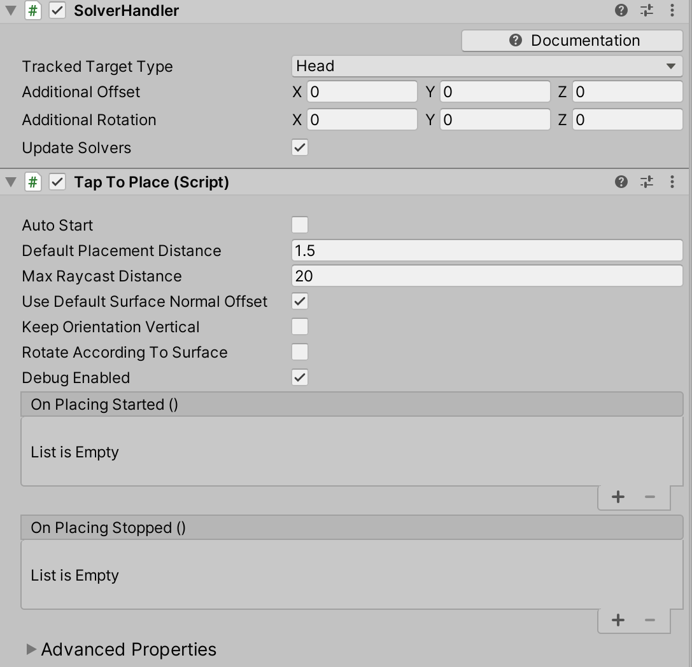

# Tap to Place


Tap to Place is a far interaction component that is used to place a game object on surface. This component is useful for placing objects on a spatial mesh. Tap to Place uses a combination of two clicks and head movement to place an object. A click to start the placement, head movement to control the position of the object and a click to place the object in the scene.

## Using Tap to Place

1. Set up the scene
    - Create a new unity scene
    - Add MRTK to the scene by navigating to the **Mixed Reality Toolkit** > **Add to Scene and Configure**
    > [!NOTE]
    > Tap to Place uses clicks driven by the MRTK Input System but it can also be controlled without clicks, see the Tap To Place Code Configurability section below.
    - Add a cube to the scene and change the scale to 0.2 and change the position to (0, 0, 0.7).
1. Attach [Tap to Place](xref:Microsoft.MixedReality.Toolkit.Utilities.Solvers.TapToPlace) to a game object with a collider

    

    - When the Tap to Place component is added, a Solver Handler will also be attached. Tap to Place derives from the [Solver](README_Solver.md) class which requires a Solver Handler. The position of a Tap to Place object is calculated relative to the `TrackedTargetType` within the Solver Handler. By default the Head is the `TrackedTargetType`, i.e. when the head moves, the object follows if it is selected.  The `TrackedTargetType` can also be set to Controller Ray which has the object follow the controller. The first group of properties in the Tap to Place inspector are the [Common Solver Properties](README_Solver.md#common-solver-properties).  
    > [!IMPORTANT]
    > Tap to Place is a stand alone Solver and cannot be chained with other Solvers. It cannot be chained because SolverHandler.UpdateSolvers is used to update the object's position while it is being placed.
    - Tap to Place Properties:
        - `Auto Start`: If true, the Tap to Place solver will start out controlling the position of the game object to be placed. The object will immediately start following the TrackedTargetType (Head or Controller Ray). This value must be modified before Start() is invoked in order to have any effect.
        - `Default Placement Distance`: The default distance (in meters) an object will be placed relative to the TrackedTargetType forward in the SolverHandler. The game object will be placed at the default placement distance if a surface is not hit by the raycast.
        - `Max Raycast Distance`: The max distance (meters) for the raycast based on the 'TrackedTargetType' origin. This raycast looks for a surface to place a selected object.
        - `UseDefaultSurfaceNormalOffset`: This property is true by default, it ensures the object being placed is aligned on a surface. If this property is true, the default surface normal offset will be applied instead of any value specified for the `SurfaceNormalOffset` property. If false, the value for `SurfaceNormalOffset` will be applied. The default surface normal offset is the collider's extents along the z axis.
        - `Surface Normal Offset`: The distance between the center of the game object to place and a surface along the surface normal, if the raycast hits a surface. This property is only applied to an object if `UseDefaultSurfaceNormalOffset` is false.
        - `Keep Orientation Vertical`: If true, the game object to place will remain upright and in line with Vector3.up.
        - `Rotate According to Surface`: If false, the game object to place will not change its rotation according to the surface hit.  The object will remain facing the camera while IsBeingPlaced is true.
        - `Magnetic Surfaces`: An array of LayerMasks to execute from highest to lowest priority. First layer mask to provide a raycast hit will be used for position calculations.
        - `Debug Enabled`: If true and in the Unity Editor, the normal of the raycast hit will be drawn in yellow. Debug enabled is useful when `RotateAccordingToSurface` is true because it draws the normal of the surface hit which visually explains why the object is set at its current orientation.
        - `On Placing Started`: This event is triggered once when the game object to place is selected.
        - `On Placing Stopped`: This event is triggered once when the game object to place is unselected, placed.

1. Testing Tap to Place behavior in editor
    - Press play and hold the space bar to show an input simulation hand.
    - Move the hand until the cube is in focus and simulate a click with the input simulation hand by clicking with the left mouse.
        - If colliders are not present in the scene, the object will follow the `TrackedTargetType` at the defined `Default Placement Distance`.
    - The object will follow the movement of the `TrackedTargetType` after selection. To simulate head movement in editor, press the WASD keys. Change head rotation by clicking and holding the right mouse.
    - To stop placing the object, click again.  The object does not need to be in focus for the stop placement click. Focus is only required for the initial click that starts the placement process.

    `TrackedTargetType`: Head (Default) |  `TrackedTargetType`: Controller Ray
    :-------------------------:|:-------------------------:
      |  

## Tap to Place Code Configurability

Tap to Place object selection timing can also be controlled via `StartPlacement()` and `StopPlacement()` instead of requiring a click event. This capability is useful for writing tests and provides an alternative method to place an object in editor without using the MRTK Input System.

1. Create an empty game object
1. Create and attach the following example script to the empty game object

    ```c#
    using UnityEngine;
    using Microsoft.MixedReality.Toolkit.Utilities.Solvers;

    public class TapToPlaceInputExample : MonoBehaviour
    {
        private GameObject cube;
        private TapToPlace tapToPlace;

        void Start()
        {
            cube = GameObject.CreatePrimitive(PrimitiveType.Cube);
            cube.transform.localScale = Vector3.one * 0.2f;
            cube.transform.position = Vector3.forward * 0.7f;

            tapToPlace = cube.AddComponent<TapToPlace>();
        }

        void Update()
        {
            if (Input.GetKeyDown(KeyCode.U))
            {
                tapToPlace.StartPlacement();
            }
            if (Input.GetKeyDown(KeyCode.I))
            {
                tapToPlace.StopPlacement();
            }
        }
    }
    ```

1. In play mode, press the *U key* to start placing the cube
1. Press the *I key* to stop the placement

## Tap to Place Example Scene

The Tap to Place example scene consists of 4 placeable objects, each with a different configuration. The example scene contains walls to show the surface placement behavior that are disabled by default in the hierarchy. The example scene can be found in the Microsoft.MixedReality.Toolkit.Unity.Examples unity package found on the [Release Page](https://github.com/Microsoft/MixedRealityToolkit-Unity/releases). The scene location is: *MRTK.Examples/Demos/Solvers/Scenes/TapToPlaceExample.unity*


## See also

* [Solvers](README_Solver.md)
* [Spatial Awareness](SpatialAwareness/SpatialAwarenessGettingStarted.md)
* [Input Simulation](InputSimulation/InputSimulationService.md)
* [Hand Tracking](Input/HandTracking.md)
* [Gaze](Input/Gaze.md)
