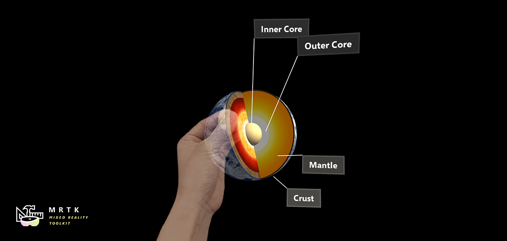

# Tooltip

This example scene demonstrates an implementation of the ToolTip user interface element. Tooltips are usually used to convey a hint or extra information upon closer inspection of an object. ToolTip can be used to explain button inputs on the motion controllers or to label objects in the physical environment.

## Demo Video
The [example scene](https://gfycat.com/WarmOblongBilby) demonstrates two ways to display a Tooltip on an object.

## Script files
[/Assets/MixedRealityToolkit.SDK/Features/UX/Scripts/Tooltips](https://github.com/Microsoft/MixedRealityToolkit-Unity/blob/mrtk_release/Assets/MixedRealityToolkit.SDK/Features/UX/Scripts/Tooltips)

## Prefabs
[/Assets/MixedRealityToolkit.SDK/Features/UX/Prefabs/Tooltips](https://github.com/Microsoft/MixedRealityToolkit-Unity/blob/mrtk_release/Assets/MixedRealityToolkit.SDK/Features/UX/Prefabs/Tooltips)

## Example Scene
[/Assets/MixedRealityToolkit.Examples/Demos/UX/Tooltips/Scenes](https://github.com/Microsoft/MixedRealityToolkit-Unity/blob/mrtk_release/Assets/MixedRealityToolkit.Examples/Demos/UX/Tooltips/Scenes)

In the scene file, you will be able to find various examples of ToolTip. First group on the left demonstrates the static ToolTip examples that are always visible. In the center, you can see the example of using multiple ToolTips on a single object. Each tooltip has different child object as a target object which works as an anchor. The group on the right shows the examples of dynamically spawning ToolTips.

## Directly adding to the scene and attaching to an object
A ToolTip can be added directly to the Hierarchy and targeted to an object. To use this method:

- Add a GameObject and a **ToolTip prefab** object to the Scene Hierarchy.
- In the ToolTip prefab's Inspector panel, expand the Tool Tip (Script). Select a TipState and set other settings. 
- Enter the ToolTip text in the Text field. 
- Expand the ToolTipConnector (Script). Drag the object that is to have the ToolTip from the Hierarchy into the field labelled Target. This attaches the ToolToolTip connector to the object. 

This use of ToolTip assumes a ToolTip that is always showing or that is shown/hid in script by changing the TipState property of the ToolTip component.

 
## Dynamically spawning
A ToolTip can be dynamically added to an object at runtime as well as pre-set to show and hide on a Tap or focus. Simply add the **ToolTipSpawner** script to any GameObject. In the script's Inspector, you can set delays for appearing and disappearing. You can also set a lifetime so that the ToolTip when spawned, will disappear after a duration. You can also set style properties such as Background in the ToolTipSpawner script. By default the ToolTip will be anchored to the object with the ToolTipSpawner script. You can override this by assigning a GameObject to the Anchor field.

## Motion controller Tooltips
The scene also includes two tooltip groups on the bottom. These ToolTips are layed out to match position of the buttons on the motion controllers. When motion controllers are detected, these ToolTips will be attached automatically to the controllers, using [`AttachToController`](xref:Microsoft.MixedReality.Toolkit.UI.Utilities.Solvers.AttachToController) script.

