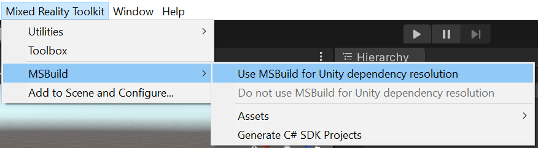
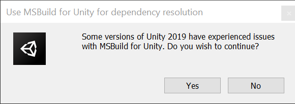

# Microsoft Mixed Reality Toolkit 2.5.0 release notes

- [What's new](#whats-new)
- [Breaking changes](#breaking-changes)
- [Updating guidance](Updating.md#upgrading-to-a-new-version-of-mrtk)
- [Known issues](#known-issues)

### What's new

**TestUtilities package**

There is now a package (Microsoft.MixedReality.Toolkit.Unity.TestUtilities.2.5.0.unitypackage) that contains the
PlayMode and TestMode test infrastructure that the MRTK uses to create end-to-end tests. This infrastructure has
been extremely handy for the MRTK team itself, and we're excited to have consumers use this to add test coverage
to their own projects.

The following code shows how to create a test hand, show it at a certain location, move it around, and then
pinch and open.

```csharp
TestHand leftHand = new TestHand(Handedness.Left);
yield return leftHand.Show(new Vector3(-0.1f, -0.1f, 0.5f));
yield return leftHand.SetGesture(ArticulatedHandPose.GestureId.Pinch);
yield return leftHand.Move(new Vector3(0.2f, 0.2f, 0));
yield return leftHand.SetGesture(ArticulatedHandPose.GestureId.Open);
```

For instructions on how to write a test using these TestUtilities, see this section on
[writing tests](Contributing/UnitTests.md#writing-tests)

For examples of existing tests that use this infrastructure, see MRTK's [PlayModeTests](https://github.com/microsoft/MixedRealityToolkit-Unity/tree/mrtk_development/Assets/MRTK/Tests/PlayModeTests)

**Enable MSBuild for Unity removed from the configuration dialog**

To prevent the MRTK configuration dialog from repeatedly displaying when `Enable MSBuild for Unity` is unchecked, it has been moved to the `Mixed Reality Toolkit' menu as shown in the following image.



This change also adds the ability to remove MSBulid for Unity.

There is a confirmation dialog that will be displayed when selecting `Use MSBuild for Unity dependency resolution`.



### Breaking changes

**Rest / Device Portal API**

The `UseSSL` static property has been moved from `Rest` to `DevicePortal`.

If you did this previously...

```csharp
Rest.UseSSL = true
```

Do this now...

```csharp
DevicePortal.UseSSL = true
```

### Known issues
