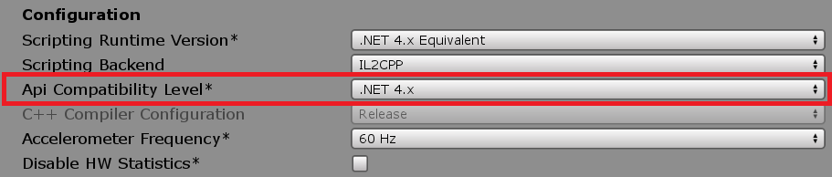
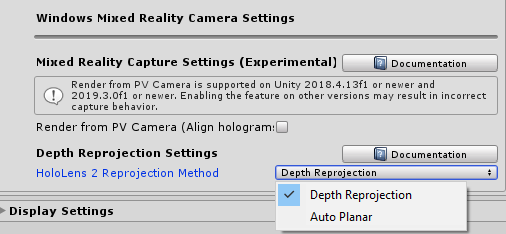

# Microsoft Mixed Reality Toolkit release notes

- [Version 2.4.0](#version-240)
- [Version 2.3.0](#version-230)
- [Version 2.2.0](#version-220)
- [Version 2.1.0](#version-210)
- [Version 2.0.1](#version-201)
- [Version 2.0.0](#version-200)

## Version 2.4.0

- [Upgrading projects](#upgrading-projects-to-240)
- [What's new](#whats-new-in-240)
- [Known issues](#known-issues-in-240)

This release of the Microsoft Mixed Reality Toolkit supports the following devices and platforms.

- Microsoft HoloLens 2
- Microsoft HoloLens (1st gen)
- Windows Mixed Reality Immersive headsets
- OpenVR
- (Experimental) Unity 2019.3 XR platform
- Mobile AR via Unity AR Foundation
  - Android
  - iOS

The following software is required.

- [Microsoft Visual Studio](https://visualstudio.microsoft.com) (2017 or 2019) Community Edition or higher
- [Windows 10 SDK](https://developer.microsoft.com/windows/downloads/windows-10-sdk) 18362 or later (installed by the Visual Studio Installer)
- [Unity](https://unity3d.com/get-unity/download) 2018.4 LTS or 2019 (2019.3 recommended)

**NuGet requirements**

If importing the [Mixed Reality Toolkit NuGet packages](MRTKNuGetPackage.md), the following software is recommended.

- [NuGet for Unity 2.0.0 or newer](https://github.com/GlitchEnzo/NuGetForUnity/releases/latest)

### Upgrading projects to 2.4.0

#### Custom controller classes

Custom controller classes previously had to define `SetupDefaultInteractions(Handedness)`. This method has been made obsolete in 2.4, as the handedness parameter was redundant with the controller class' own handedness. The new method has no parameters. Additionally, many controller classes defined this the same way (`AssignControllerMappings(DefaultInteractions);`), so the full call has been refactored down into `BaseController` and made an optional override instead of required.

### What's new in 2.4.0

*Coming soon*

### Known issues in 2.4.0

*Coming soon*

## Version 2.3.0

- [Upgrading projects](#upgrading-projects-to-230)
- [What's new](#whats-new-in-230)
- [Known issues](#known-issues-in-230)

This release of the Microsoft Mixed Reality Toolkit supports the following devices and platforms.

- Microsoft HoloLens 2
- Microsoft HoloLens (1st gen)
- Windows Mixed Reality Immersive headsets
- OpenVR
- (Experimental) Unity 2019.3 XR platform
- (Experimental) Mobile AR
  - Android
  - iOS

The following software is required.

- [Microsoft Visual Studio](https://visualstudio.microsoft.com) (2017 or 2019) Community Edition or higher
- [Windows 10 SDK](https://developer.microsoft.com/windows/downloads/windows-10-sdk) 18362 or later (installed by the Visual Studio Installer)
- [Unity](https://unity3d.com/get-unity/download) 2018.4 LTS or 2019 (2019.3 recommended)

**NuGet requirements**

If importing the [Mixed Reality Toolkit NuGet packages](MRTKNuGetPackage.md), the following software is recommended.

- [NuGet for Unity 2.0.0 or newer](https://github.com/GlitchEnzo/NuGetForUnity/releases/latest)

### Upgrading projects to 2.3.0

The 2.3.0 release has some changes that may impact application projects. Breaking change details, including mitigation guidance, can be found in the [**Updating 2.2.0 to 2.3.0**](Updating.md#updating-220-to-230) article.

> [!NOTE]
> At this time, it is not supported to switch between using .unitypackage files and NuGet.

**Updating using .unitypackage files**

For the smoothest upgrade path, please use the following steps.

1. Close Unity
1. Inside the *Assets* folder, delete most of the **MixedRealityToolkit** folders, along with their .meta files (the project may not have all listed folders)
    - MixedRealityToolkit
    - MixedRealityToolkit.Examples
    - MixedRealityToolkit.Extensions
    > [!NOTE]
    > If additional extensions have been installed, please make a backup prior to deleting these folders.
    - MixedRealityToolkit.Providers
    - MixedRealityToolkit.SDK
    - MixedRealityToolkit.Services
    - MixedRealityToolkit.Staging
    > [!NOTE]
    > The contents of the MixedRealityToolkit.Staging folder have been moved into the MixedRealityToolkit.Providers folder in MRTK 2.3.0.
    - MixedRealityToolkit.Tools
    > [!IMPORTANT]
    > Do NOT delete the **MixedRealityToolkit.Generated** folder, or its .meta file.
1. Delete the **Library** folder
1. Re-open the project in Unity
1. Import the new unity packages
    - Foundation - _Import this package first_
    - (Optional) Tools
    - (Optional) Extensions
    > [!NOTE]
    > If additional extensions had been installed, they may need to be re-imported.
    - (Optional) Examples
1. Close Unity and Delete the **Library** folder. This step is necessary to force Unity to refresh its
   asset database and reconcile existing custom profiles.
1. Launch Unity, and for each scene in the project
    - Delete **MixedRealityToolkit** and **MixedRealityPlayspace**, if present, from the hierarchy. This will delete the main camera, but it will be re-created in the next step. If any properties of the main camera have been manually changed, these will have to be re-applied manually once the new camera is created.
    - Select **MixedRealityToolkit -> Add to Scene and Configure**
    - Select **MixedRealityToolkit -> Utilities -> Update -> Controller Mapping Profiles** (only needs to be done once)
            - This will update any custom Controller Mapping Profiles with updated axes and data, while leaving your custom-assigned input actions intact

**Updating from NuGet**

If your project was created using the [Mixed Reality Toolkit NuGet packages](MRTKNuGetPackage.md), please use the following steps.

1. Select **NuGet > Manage NuGet Packages**
1. Select the **Online** tab and click **Refresh**
1. Select the **Installed** tab
1. Click the **Update** button for each installed package
    - Microsoft.MixedReality.Toolkit.Foundation
    - Microsoft.MixedReality.Toolkit.Tools
    - Microsoft.MixedReality.Toolkit.Extensions
    - Microsoft.MixedReality.Toolkit.Examples
1. Close and re-open the project in Unity

### What's new in 2.3.0

**Support for Unity 2019.3 new XR platform (Experimental)**

MRTK has added initial support for [Unity 2019.3's new XR platform](https://blogs.unity3d.com/2020/01/24/unity-xr-platform-updates/). When using the Windows XR plugin, it is recommended using version **2.0.4 (preview.3)** or newer.

Please see [Known issues](#known-issues-in-230) for details on known limitations.

**Assets/Dependencies folder**

After MSBuild for Unity is enabled, a Dependencies folder will be created in the project. This folder contains the plugins (ex: DotNetWinRT) that are imported, by MRTK.

This folder is created by MSBuild for Unity and will be recreated when packages are restored. When using source control, such as GitHub, it can be safely added to exclude / ignore lists (ex: .gitignore).

You can also add the .bin and .obj folders in MixedRealityToolkit.Providers / WindowsMixedReality / Shared / DotNetAdapter to your ignore list. These represent staging folders for individual csproj package resolution but are hidden from Unity's Asset view. The root Dependencies folder is the central location where the used copies are placed.

**<project>.Dependencies.msb4u**

MSBuild for Unity creates two files in the project's Assets folder; NuGet.config and <project>.Dependencies.msb4u.csproj. These files are used by MSBuild for Unity and will be recreated as needed.

When using source control, such as GitHub, these files can be safely added to exclude / ignore lists (ex: .gitignore).

After MRTK has enabled MSBuild for Unity, additional custom NuGet dependencies can be declared and resolved as well. This process is described in [MSBuild for Unity's documentation](https://github.com/microsoft/MSBuildForUnity/blob/master/Documentation/CoreScenarios.md#scenario-1-adding-nuget-dependency-to-unity-project).

**Hand physics extension service**

A hand physics extension service has been added to allow for using physics interactions with the HoloLens 2 articulated hands ([#6573](https://github.com/microsoft/MixedRealityToolkit-Unity/pull/6573)).


**Non-native keyboard (Experimental)**

A keyboard that can be used on platforms which do not provide native keyboard support.
([#6492](https://github.com/microsoft/MixedRealityToolkit-Unity/pull/6573))


**Hand coach (Experimental)**

Hand animations that can give helpful hints for gestures users should perform.
([#6493](https://github.com/microsoft/MixedRealityToolkit-Unity/pull/1493))


**Follow solver (Experimental)**
A solver that matches HoloLens 2 shell behavior. ([#6981](https://github.com/microsoft/MixedRealityToolkit-Unity/pull/1493))


**Pinch Slider orientation**

The Pinch Slider has been updated to orient TrackVisuals, TickMarks and ThumbRoot based on the sliderAxis orientation ([#6858](https://github.com/microsoft/MixedRealityToolkit-Unity/pull/6858))


**ObjectManipulator and BoundsControl (Experimental)**

ObjectManipulator and BoundsControl are refactored versions of ManipulationHandler and BoundingBox, respectively. They are designed to be simpler to configure, use and maintain. They also include a few new behavior changes:

ObjectManipulator correctly responds to physics.


Improved ability to configure constraints for object manipulation.


We are hoping to eventually deprecate ManipulationHandler and BoundingBox in favor of these more robust components. ([#6294](https://github.com/microsoft/MixedRealityToolkit-Unity/pull/6924))

**UnityAR package contents moved into Foundation**

There is no longer the separate UnityAR package for Android and iOS support.  The contents have been moved to the Foundation package.

### Known issues in 2.3.0

**Unity 2019.3 infinite loop when switching build target**

There is a known issue ([#7299](https://github.com/microsoft/MixedRealityToolkit-Unity/issues/7299)) with switching build targets after entering and exiting play mode in Unity 2019.3.

If this issue is encountered, please:

- Terminate the process
- Restart Unity and load the project
- Do not enter / edit play mode
- Change the build target

**NuGet packages are not supported with Unity 2019**

The current MRTK packages distributed via NuGet.org are precompiled with Unity 2018.4 and are not intended for use with Unity 2019. A future release of MRTK will provide Unity 2019 supported NuGet packages.

**CS0579: Duplicate 'AssemblyVersion' attribute**

After enabling MSBuild for Unity, if Player Settings > Other Settings > API Compatibility Level is changed, Unity may report a large number of errors in project script files. Notably, there will be one or more CS0579 errors stating that there is a duplicate AssemblyVersion attribute.

This is caused by an issue in MSBuild for Unity ([#133](https://github.com/microsoft/MSBuildForUnity/issues/133)) where it is not properly removing dependency packages before restoring.

To resolve these errors:

- In the **Project** window, expand **Dependencies**
- Open **Edit** > **Project Settings** > **Player**
- Expand **Other Settings**
- Examine the value of **Api Compatibility Level**

    

- If set to **.NET Standard 2.0**, delete the **Dependencies\net46** folder
- If set to **.NET 4.x**, delete the **Dependencies\netstandard20** folder

    

**NU1101: Unable to find package MSBuildForUnity**

When using NuGet for Unity, applying MRTK configuration settings after switching the platform to UWP may generate an NU1101 error. This is due to an issue with MSBuild for Unity, where it is not correctly adding its package source.

To resolve this error:

- Open **Editor** > **Preferences**
- Navigate to **NuGet for Unity**
- Click **Add New Source**
- Replace **New Source** with **MSBuild for Unity**
- Replace **source_path** with **https://pkgs.dev.azure.com/UnityDeveloperTools/MSBuildForUnity/_packaging/UnityDeveloperTools/nuget/v3/index.json**
- Click **Save**, at the bottom of the window
- In the Project window expand **Assets** and select **<projectname>.Dependencies.msb4u**
- In the Inspector window, click **Rebuild**

**MRTK Configurator dialog does not show 'Enable MSBuild for Unity' in Unity 2019.3**

An issue exists where enabling MSBuild for Unity in 2019.3 may result in an infinite loop restoring packages ([#7239](https://github.com/microsoft/MixedRealityToolkit-Unity/issues/7239)).

As a workaround, the Microsoft.Windows.DotNetWinRT package can be imported using [NuGet for Unity](https://github.com/GlitchEnzo/NuGetForUnity/releases/latest).

**Issues with the Unity 2019.3 new XR platform on Windows Mixed Reality**

The following issues are known when using the new XR platform and version **2.0.4 (preview.3)** of the Windows XR Plugin:

- AirTap does not work on HoloLens (HoloLens 2 and 1st generation)
- Pointers are using the wrong coordinate system on HoloLens 2 and immersive devices

It is recommended to periodically check **Window** > **Package Manager** for newer versions of the Windows XR plugin.

**Windows Mixed Reality gesture support on Unity 2019.3 when using the new XR platform**

This release of MRTK does not contain an implementation for Windows Mixed Reality gestures using the new XR platform. It will be added in a future version of MRTK.

**Specifying the Depth Reprojection mode in the Windows Mixed Reality Camera Settings Provider is not supported on Unity 2019.3 and Windows XR plugin**

This issue is expected to be fixed with upcoming releases of MRTK and the Windows XR plugin.

**Mixed Reality Capture setting**

This feature is currently not working correctly on Unity 2019.3.0f6. This issue impacts both the legacy and the new XR platform.

**Long paths**

When building on Windows, there is a MAX_PATH limit of 255 characters. Unity is affected by these limits and may fail to build a binary if its resolved output path is longer than 255 characters.

This can manifest as CS0006 errors in Visual Studio that look like:

> CS0006: Metadata file 'C:\path\to\longer\file\that\is\longer\than\255\characters\mrtk.long.binary.name.dll' could not be found.

This can be worked around by moving the Unity project folder closer to the root of the drive, for example:

> C:\src\project

Please see [this issue](https://github.com/microsoft/MixedRealityToolkit-Unity/issues/5469) for more background information.

**Runtime profile swapping**

MRTK does not fully support profile swapping at runtime. This feature is being investigated for a future release. Please see issues [4289](https://github.com/microsoft/MixedRealityToolkit-Unity/issues/4289),
[5465](https://github.com/microsoft/MixedRealityToolkit-Unity/issues/5465) and
[5466](https://github.com/microsoft/MixedRealityToolkit-Unity/issues/5466) for more information.

**Unity 2018: .NET Backend and AR Foundation**

There is an issue in Unity 2018 where, building a Universal Windows Platform project using the .NET scripting backend, the Unity AR Foundation package will fail.

To work around this issue, please perform one of the following steps:

- Switch the scripting backend to IL2CPP
- In the Build Settings window, uncheck **Unity C# Projects"

## Version 2.2.0

- [How to upgrade projects](#how-to-upgrade-projects-to-220)
- [What's new](#whats-new-in-220)
- [Known issues](#known-issues-in-220)

This release of the Microsoft Mixed Reality Toolkit supports the following devices and platforms.

- Microsoft HoloLens 2
- Microsoft HoloLens (1st gen)
- Windows Mixed Reality Immersive headsets
- OpenVR
- (Experimental) Mobile AR
  - Android
  - iOS

The following software is required.

- [Microsoft Visual Studio](https://visualstudio.microsoft.com) (2017 or 2019) Community Edition or higher
- [Windows 10 SDK](https://developer.microsoft.com/windows/downloads/windows-10-sdk) 18362 or later (installed by the Visual Studio Installer)
- [Unity](https://unity3d.com/get-unity/download) 2018.4 LTS, 2019.1 or 2019.2

**NuGet requirements**

If importing the [Mixed Reality Toolkit NuGet packages](MRTKNuGetPackage.md), the following software is recommended.

- [NuGet for Unity 2.0.0 or newer](https://github.com/GlitchEnzo/NuGetForUnity/releases/latest)

### How to upgrade projects to 2.2.0

The 2.2.0 release has some changes that may impact application projects. Breaking change details, including mitigation guidance, can be found in the [**Updating 2.1.0 to 2.2.0**](Updating.md#updating-210-to-220) article.

**Updating using .unitypackage files**

For the smoothest upgrade path, please use the following steps.

1. Close Unity
1. Inside the *Assets* folder, delete most of the **MixedRealityToolkit** folders, along with their .meta files (the project may not have all listed folders)
    - MixedRealityToolkit
    - MixedRealityToolkit.Examples
    - MixedRealityToolkit.Extensions
    > [!NOTE]
    > If additional extensions have been installed, please make a backup prior to deleting these folders.
    - MixedRealityToolkit.Providers
    - MixedRealityToolkit.SDK
    - MixedRealityToolkit.Services
    - MixedRealityToolkit.Tools
    > [!IMPORTANT]
    > Do NOT delete the **MixedRealityToolkit.Generated** folder, or its .meta file.
1. Delete the **Library** folder
1. Re-open the project in Unity
1. Import the new unity packages
    - Foundation - _Import this package first_
    - (Optional) Tools
    - (Optional) Extensions
    > [!NOTE]
    > If additional extensions had been installed, they may need to be re-imported.
    - (Optional) Examples
1. Close Unity and Delete the **Library** folder. This step is necessary to force Unity to refresh its
   asset database and reconcile existing custom profiles.
1. Launch Unity, and for each scene in the project
    - Delete **MixedRealityToolkit** and **MixedRealityPlayspace**, if present, from the hierarchy. This will delete the main camera, but it will be re-created in the next step. If any properties of the main camera have been manually changed, these will have to be re-applied manually once the new camera is created.
    - Select **MixedRealityToolkit -> Add to Scene and Configure**
    - Select **MixedRealityToolkit -> Utilities -> Update -> Controller Mapping Profiles** (only needs to be done once)
            - This will update any custom Controller Mapping Profiles with updated axes and data, while leaving your custom-assigned input actions intact

**Updating from NuGet**

If your project was created using the [Mixed Reality Toolkit NuGet packages](MRTKNuGetPackage.md), please use the following steps.

1. Select **NuGet > Manage NuGet Packages**
1. Select the **Online** tab and click **Refresh**
1. Select the **Installed** tab
1. Click the **Update** button for each installed package
    - Microsoft.MixedReality.Toolkit.Foundation
    - Microsoft.MixedReality.Toolkit.Tools
    - Microsoft.MixedReality.Toolkit.Extensions
    - Microsoft.MixedReality.Toolkit.Examples
1. Close and re-open the project in Unity

### What's new in 2.2.0

**Camera Settings Providers**

MRTK has added settings providers to the camera system. These components enable customization of the camera system on a per-platform basis. Shipping in version 2.2.0 are providers for

- Windows Mixed Reality (Foundation package)
- (Experimental) UnityAR for Android and iOS (Providers.UnityAR package)

> [!Note]
> If no camera settings provider is configured for the current platform, the behavior from MRTK v2.1.0 will be used.

**Cursor resizing**

The DefaultCursor prefab now dynamically resizes based on the distance (to the raycast hit point) and uses angular scale to account for platform differences.

**Directional Indicator Solver**

The HoloToolkit directional indicator component has been re-introduced as a solver.


**Fingertip cursor translation and alignment**

The fingertip cursor's translation and alignment have been updated to better match the HoloLens 2 shell behavior.


**GridObjectCollection supports content alignment**

The [GridObjectCollection UX control](README_ObjectCollection.md) now supports aligning content to combinations of

- Left
- Center
- Right

and

- Top
- Middle
- Bottom


**Fixing LayoutDirection in GridObjectCollection**
In MRTK 2.1 and below [`GridObjectCollection`](README_ObjectCollection.md) would always lay out its content first vertically, then horizontally, regardless of whether its layout was `RowsThenColumns` or `ColumnsThenRows`. In MRTK 2.2, if the layout is `ColumnsThenRows` then the content will lay out first horizontally (by columns), then vertically (by rows). If a collections layout is `RowsThenColumns` it will lay out first vertically, then horizontally as before.

Below: `RowsThenColumns` layout, with Rows = 3.


Below: `ColumnsThenRows` layout, with Columns = 3.


All assets being upgraded from 2.1 to 2.2 that have `ColumnsThenRows` layout will be changed to have `RowsThenColumns` layout to ensure that layout behavior stays the same. This is because all GridObjectCollection assets prior to 2.2 were actually performing vertical, then horizontal layout.

**InteractableToggleCollection improvements**

InteractableToggleCollection now properly updates the toggle states within groups. A new InteractableToggleCollection inspector has also been added.


**Mixed Reality Capture setting (Experimental)**

The Windows Mixed Reality camera settings provider provides an experimental setting to [better align holograms in mixed reality capture (MRC) recordings](https://docs.microsoft.com/windows/mixed-reality/mixed-reality-capture-for-developers#render-from-the-pv-camera-opt-in).


> [!Note]
> This feature is supported on Unity versions 2018.4 (.13f1 and newer) and 2019.3 (.0f1 and newer). With other Unity versions, the recording behavior may not work as expected.

**Mobile AR (Android and iOS) support (Experimental)**

An experimental camera settings provider has been added to support mobile AR on Android and iOS phones and tablets. This provider requires Unity's AR Foundation as well as AR Core or AR Kit packages to be installed into the project.

The provider is distributed via the Microsoft.MixedReality.Providers.UnityAR package on GitHub and NuGet.

**MSBuild for Unity**

MRTK now supports MSBuild for Unity to enable automatic acquisition of NuGet dependencies (for example, [Microsoft.Windows.MixedReality.DotNetWinRT](https://www.nuget.org/packages/Microsoft.Windows.MixedReality.DotNetWinRT/)).

This is an optional install that can be performed with the **Mixed Reality Toolkit** > **Utilities** > **Configure Unity Project** menu item and at project load time.

> [!Note]
> Some new MRTK features (ex: HoloLens 2 hand and eye remoting) require installing MSBuild for Unity.

**New audio clips for HoloLens 2 style bounding boxes**

The HoloLens 2 style bounding box UX control uses new audio clips to better match the shell experience.

**PressableButtonHoloLens2 icon lift on focus**

The PressableButtonHoloLens2 UX control now has improved parity with the HoloLens shell experience.


**Pulse shaders for spatial mesh and hand mesh (Experimental)**

Experimental shaders have been added for the spatial mesh and hand mesh to replicate the HoloLens 2 shell behavior.

Spatial mesh


Hand mesh

> [!Note]
> On HoloLens 2, the experience does not show an offset from the hands.


**Scrolling Object Collection (Experimental)**

An experimental scrolling object collection UX control has been added to MRTK. This control was originally built for the HoloLens 2 initial (out of box) experience.


**Search MRTK profiles for keywords**

MRTK profiles now support searching by keyword.


**Surface Magnetism Solver and Hand Ray example scene**

A new example scene has been added, which demonstrates surface magnetism and the spatial awareness mesh.


**Support for hand and eye tracking remoting for Microsoft HoloLens 2**

MRTK adds support for articulated hands and eye tracking when running an application via Holographic Remoting on a HoloLens 2.

Please refer to the [Holographic Remoting](Tools/HolographicRemoting.md) article for details on how to configure and use remoting.

> [!Note]
> This feature requires installing MSBuild for Unity, which will install the [Microsoft.Windows.MixedReality.DotNetWinRT](https://www.nuget.org/packages/Microsoft.Windows.MixedReality.DotNetWinRT/) package from NuGet.

**Windows Mixed Reality Depth Reprojection Settings**

Developer customers can now specify the desired depth reprojection method for their Microsoft HoloLens 2 applications. Select between `Depth Reprojection` and `Auto Planar` in the `Windows Mixed Reality Camera Settings` as shown in the following image.



### Known issues in 2.2.0

The sections below highlight some of the known issues in the Microsoft Mixed Reality Toolkit.

**Long paths**

When building on Windows, there is a MAX_PATH limit of 255 characters. Unity is affected by these limits and may fail to build a binary if its resolved output path is longer than 255 characters.

This can manifest as CS0006 errors in Visual Studio that look like:

> CS0006: Metadata file 'C:\path\to\longer\file\that\is\longer\than\255\characters\mrtk.long.binary.name.dll' could not be found.

This can be worked around by moving the Unity project folder closer to the root of the drive, for example:

> C:\src\project

Please see [this issue](https://github.com/microsoft/MixedRealityToolkit-Unity/issues/5469) for more background information.

**Runtime profile swapping**

MRTK does not fully support profile swapping at runtime. This feature is being investigated for a future release. Please see issues [4289](https://github.com/microsoft/MixedRealityToolkit-Unity/issues/4289),
[5465](https://github.com/microsoft/MixedRealityToolkit-Unity/issues/5465) and
[5466](https://github.com/microsoft/MixedRealityToolkit-Unity/issues/5466) for more information.

**Unity 2018: .NET Backend and AR Foundation**

There is an issue in Unity 2018 where, when building a Universal Windows Platform project using the .NET scripting backend, the Unity AR Foundation package will fail to install.

To work around this issue, please perform one of the following steps:

- Switch the scripting backend to IL2CPP
- In the Build Settings window, uncheck **Unity C# Projects"

**Hang when using Holographic Remoting**

There is a known issue with some versions of Unity where the editor may hang upon entering play mode during a remoting session. This issue may manifest if the Holographic window is open when the project is loaded.

To work around the issue, please perform the following steps:

1. With the project open, close the Holographic dialog.
1. Close Unity
1. Reopen Unity and open the project.

**Failed to get IHolographicCameraRenderingParameters from main camera for updating rendering parameter**

When remoting, the Unity Console window may display a message stating "Failed to get IHolographicCameraRenderingParameters from main camera for updating rendering parameter".

This error most commonly occurs when a hand comes into view. There is no functional impact on the application and this issue is being tracked on [GitHub](https://github.com/microsoft/MixedRealityToolkit-Unity/issues/6807).

**Assembly has reference to non-existent assembly 'Unity.XR.ARFoundation'**

If the Providers.UnityAR package is installed, the following error indicates that Unity's AR Foundation package has not been installed. Please review the [How to configure MRTK for iOS and Android](CrossPlatform/UsingARFoundation.md) article for requirements and instructions.

If the project is not intended to be run on Android or iOS devices, it is safe to delete the MixedRealityToolkit.Staging folder from the project.

**Mixed Reality Capture settings (Experimental)**

The Windows Mixed Reality camera settings provider's experimental Mixed Reality Capture settings are disabled in the default profiles. This is due to some versions of Unity not properly supporting the feature of using the HoloLens photo video camera when recording captures.

It is recommended to only enable this option on versions of Unity in the following list:

- 2018.4 (.13f1 and later)
- 2019.3.0f1 and later

Enabling this feature on other versions of Unity may result in incorrect captures (ex: missing holograms).

**MRTK Configurator dialog**

When loading an MRTK based project, the MRTK Configurator dialog may display multiple times. This is related to MRTK detecting multiple loads of the project. This issue will be investigated and addressed in a future version of the MRTK.

**The type or namespace name 'TrackedPoseDriver' could not be found**

If the Providers.UnityAR package is installed in a project created in Unity 2019.2 or newer, the following error indicates that the assembly definition file (Microsoft.MixedReality.Toolkit.Providers.UnityAR.asmdef) needs to be updated to include a reference to **UnityEngine.SpatialTracking**. Please review the [How to configure MRTK for iOS and Android](CrossPlatform/UsingARFoundation.md) article for requirements and instructions.

If the project is not intended to be run on Android or iOS devices, it is safe to delete the MixedRealityToolkit.Staging folder from the project.

## Version 2.1.0

- [How to upgrade projects](#how-to-upgrade-projects-to-210)
- [What's new](#whats-new-in-210)
- [Known issues](#known-issues-in-210)

This release of the Microsoft Mixed Reality Toolkit supports the following devices and platforms.

- Microsoft HoloLens 2
- Microsoft HoloLens (1st gen)
- Windows Mixed Reality Immersive headsets
- OpenVR

The following software is required.

- Microsoft Visual Studio (2017 or 2019) Community Edition or higher
- Windows 10 SDK 18362 or later (installed by the Visual Studio Installer)
- Unity 2018.4, 2019.1 or 2019.2

**NuGet requirements**

If importing the [Mixed Reality Toolkit NuGet packages](MRTKNuGetPackage.md), the following software is recommended..

- [NuGet for Unity](https://github.com/GlitchEnzo/NuGetForUnity)

### How to upgrade projects to 2.1.0

**Updating using .unitypackage files**

The 2.1.0 release has some changes that may impact application projects, including some files moving to new folder locations.
Breaking change details, including mitigation guidance, can be found in the [**Updating 2.0.0 to 2.1.0**](Updating.md#updating-200-to-210) article.

For the smoothest upgrade path, please use the following steps.

1. Close Unity
1. Inside the *Assets* folder, delete most of the **MixedRealityToolkit** folders, along with their .meta files (the project may not have all listed folders)
    - MixedRealityToolkit
    - MixedRealityToolkit.Examples
    - MixedRealityToolkit.Extensions
    > [!NOTE]
    > If additional extensions have been installed, please make a backup prior to deleting this folder.
    - MixedRealityToolkit.Providers
    - MixedRealityToolkit.SDK
    - MixedRealityToolkit.Services
    - MixedRealityToolkit.Tools
    > [!IMPORTANT]
    > Do NOT delete the **MixedRealityToolkit.Generated** folder, or its .meta file.
1. Delete the **Library** folder
1. Re-open the project in Unity
1. Import the new unity packages
    - Foundation - _Import this package first_
    - (Optional) Tools
    - (Optional) Extensions
    > [!NOTE]
    > If additional extensions had been installed, they may need to be re-imported.
    - (Optional) Examples
1. Close Unity and Delete the **Library** folder. This step is necessary to force Unity to refresh its
   asset database and reconcile existing custom profiles.
1. Launch Unity, and for each scene in the project
    - Delete **MixedRealityToolkit** and **MixedRealityPlayspace**, if present, from the hierarchy. This will delete the main camera, but it will be re-created in the next step. If any properties of the main camera have been manually changed, these will have to be re-applied manually once the new camera is created.
    - Select **MixedRealityToolkit -> Add to Scene and Configure**
    - Select **MixedRealityToolkit -> Utilities -> Update -> Controller Mapping Profiles** (only needs to be done once)
            - This will update any custom Controller Mapping Profiles with updated axes and data, while leaving your custom-assigned input actions intact

Related to [issue #6144](https://github.com/microsoft/MixedRealityToolkit-Unity/issues/6144): after upgrading, if you have a custom input simulation profile, the input playback service data provider may have a missing class. Click the "Try Repair" button in the profile window to fix the missing reference.

**Updating from NuGet**

If your project was created using the Mixed Reality Toolkit NuGet packages, please use the following steps.

1. Select **NuGet > Manage NuGet Packages**
1. Select the **Online** tab and click **Refresh**
1. Select the **Installed** tab
1. Click the **Update** button for each installed package
    - Microsoft.MixedReality.Toolkit.Foundation
    - Microsoft.MixedReality.Toolkit.Tools
    - Microsoft.MixedReality.Toolkit.Extensions
    - Microsoft.MixedReality.Toolkit.Examples
1. Re-open the project in Unity

After updating the packages, you may see messages similar to the following:

```cmd
Failed to unload 'Assets/Packages/Microsoft.MixedReality.Toolkit.Examples.2.1.0/MRTK/StandardAssets/Models/Materials/Material_56.mat'
```

The step to re-open the project in Unity resolves the issue.

### What's new in 2.1.0

**NuGet package distribution**

MRTK 2.1.0 now ships packages on NuGet.org. The following steps can be used to import the desired packages.

1. Install [NuGet for Unity](https://github.com/GlitchEnzo/NuGetForUnity/releases)
1. Select **NuGet > Manage NuGet Packages**
1. In the search field, enter "MixedReality.Toolkit"
1. Click **Search**
1. Click **Install** for each desired package
    - Microsoft.MixedReality.Toolkit.Foundation
    - (Optional) Microsoft.MixedReality.Toolkit.Tools
    - (Optional) Microsoft.MixedReality.Toolkit.Extensions
    - (Optional) Microsoft.MixedReality.Toolkit.Examples

**Dwell interaction (Experimental)**

MRTK has added experimental support for dwell interactions. Dwell interactions enable applications to respond to a user focusing their gaze or motion controller on an interactable object for a predefined period of time.

Please refer to [change 5594](https://github.com/microsoft/MixedRealityToolkit-Unity/pull/5594) for details.

**Hand menu example updates**

The hand menu example has received visual updates (no code changes).

**MRTK Examples Hub (Experimental)**

The MRTK Examples Hub is now part of the MixedRealityToolkit.Examples package, in the Experimental folder. For information on how to build and use the sample, please see the [examples hub](README_ExampleHub.md) article.

**Near menu control**

Near Menu is a UX control which provides a collection of buttons or other UI components. It is floating around the user's body and easily accessible anytime. Since it is loosely coupled with the user, it does not disturb the user's interaction with the target content. The user can use the 'Pin' button to world-lock/unlock the menu. The menu can be grabbed and placed at a specific position.

Please see [Near Menu](README_NearMenu.md) for more information.

**Pressable button for Unity UI**

Support for pressable buttons on Unity UI canvases has been added. The HandInteractionExamples demo scene, in the MixedRealityToolkit.Examples package, demonstrates this feature.

**Speech command confirmation label**

A new speech command confirmation label (SpeechConfirmationTooltip.prefab) has been added to provide functionality that matches the Microsoft HoloLens 2 shell.  Please see the [speech input](Input/Speech.md) article for more information.

**Mesh Outlining**

A component `MeshOutline` and `MeshOutlineHierarchy` to outline meshes without utilizing post processing effects, which can be costly on mobile mixed reality devices.

See [change 5562](https://github.com/microsoft/MixedRealityToolkit-Unity/pull/5562) for more details

**Ability to turn off hand rays and other pointers (gaze, grab, poke) from code**

We have had many requests for how to disable the far interaction (line pointer, hand rays, etc) at runtime. We now provide a one-line command to turn pointers on and off.

```c#
// Turn off all hand rays
PointerUtils.SetHandRayPointerBehavior(PointerBehavior.AlwaysOff);

// Turn hand rays back on
PointerUtils.SetHandRayPointerBehavior(PointerBehavior.Default);

// Turn off hand rays for the right hand only
PointerUtils.SetHandRayPointerBehavior(PointerBehavior.AlwaysOff, Handedness.Right);

// Turn off the gaze pointer
PointerUtils.SetGazePointerBehavior(PointerBehavior.AlwaysOff);
```

Please see [change 5920](https://github.com/microsoft/MixedRealityToolkit-Unity/pull/5920) for more details.

**Easily access hand, head, eye position, rotation from code**

We had feedback that it's difficult to find out where the hand is pointing, or where eyes / head is looking. This change adds methods to make it easy for application code to acquire the position and rotation of head, hands, eyes, and motion controllers.

Please see [change 5944](https://github.com/microsoft/MixedRealityToolkit-Unity/pull/5944) for details.

```c#
// Get the head ray
var headRay = InputRayUtils.GetHeadGazeRay();

// Get the right hand ray
Ray rightHandRay;
if(InputRayUtils.TryGetHandRay(Handedness.right, rightHandRay))
{
    // Right hand ray is available
}
```

**Interactable can be instantiated, configured from code**

This release we focused a lot of energy on making `Interactable` configurable from code.

It's now possible to instantiate and configure interactable from code. See [change 5967](https://github.com/microsoft/MixedRealityToolkit-Unity/pull/5967) and [Interactable](README_Interactable.md) for more information

It's now easier to add event listeners from code. Here's an example of how to add focus enter/exit events:

```c#
public static void AddFocusEvents(Interactable interactable)
{
    var onFocusReceiver = interactable.AddReceiver<InteractableOnFocusReceiver>();
    onFocusReceiver.OnFocusOn.AddListener(() => Debug.Log("Focus on"));
    onFocusReceiver.OnFocusOff.AddListener(() => Debug.Log("Focus off"));
}
```

**Input simulation: Instead of Q/E, hold ctrl to rotate hands**

Keys for rotating hands have been removed, hand rotation is now controlled by the mouse as well. Holding `HandRotateButton` (Ctrl) together with the left/right hand manipulation key (LShift/Space) will enable hand rotation.

**Layer Masks for Grabbable objects**

We received feedback that hand rays would turn off / stick to objects when near surface reconstruction or any any other non-grabbable collider. As part of this fix, we added the ability to specify layer masks for near grabbable objects, similar to touchable objects.

An object must both be on a Grabbable Layer as well as have a NearInteractionGrabbable component in order for hand rays to turn off. The Grabbable Layer is by default set to everything except Ignore Raycast and Spatial Awareness.

See [change 5823](https://github.com/microsoft/MixedRealityToolkit-Unity/pull/5823) for more details.

### Breaking changes in 2.1.0

**Input simulation profile**

The input simulation system has been upgraded, which changes a few settings in the input simulation profile. Some changes can not be migrated automatically and users may find that profiles are using default values.

1. All KeyCode and mouse button bindings in the profile have been replaced with a generic KeyBinding struct, which stores the type of binding (key or mouse) as well as the actual binding code (KeyCode or mouse button number respectively). The struct has its own inspector, which allows unified display and offers an "auto-bind" tool to quickly set key bindings by pressing the respective key instead of selecting from a huge dropdown list.

    - FastControlKey
    - ToggleLeftHandKey
    - ToggleRightHandKey
    - LeftHandManipulationKey
    - RightHandManipulationKey

1. `MouseLookToggle` was previously included in the 1MouseLookButton1 enum as `InputSimulationMouseButton.Focused`, it is now a separate option. When enabled, the camera will keep rotating with the mouse after releasing the button, until the escape key is pressed.

1. `HandDepthMultiplier` default value has been lowered from 0.1 to 0.03 to accommodate some changes to the input simulation. If the camera moves too fast when scrolling, try lowering this value.

1. Keys for rotating hands have been removed, hand rotation is now controlled by the mouse as well. Holding `HandRotateButton` (Ctrl) together with the left/right hand manipulation key (LShift/Space) will enable hand rotation.

A new axis "UpDown" has been introduced to the input axis list. This controls camera movement in the vertical and defaults to Q/E keys as well as the controller trigger buttons.

For more information on these changes, please see the [input simulation service](https://github.com/microsoft/MixedRealityToolkit-Unity/blob/mrtk_development/Documentation/InputSimulation/InputSimulationService.md) article.

Related to [issue #6144](https://github.com/microsoft/MixedRealityToolkit-Unity/issues/6144): after upgrading, if you have a custom input simulation profile, the input playback service data provider may have a missing class. Click the "Try Repair" button in the profile window to fix the missing reference.

### Replace ColliderNearInteractionTouchable with BaseNearInteractionTouchable

The `CollierNearInteractionTouchable` class is now obsolete. Replace all usages of `ColliderNearInteractionTouchable` with `BaseNearInteractionTouchable`.

### Interactable: deprecated methods

Interactable has been upgraded to be configurable from code. The following methods in `Interactable` are now marked Obsolete:

```c#
public void ResetBaseStates()
public int GetDimensionIndex()
public void SetDimensionIndex(int index)
public void ForceUpdateThemes()
public bool FocusEnabled
public bool IsToggleButton
public bool Enabled
public bool RequiresFocus
public bool IsDisabled
public State[] GetStates()
public virtual void SetFocus(bool focus)
public virtual void SetPress(bool press)
public virtual void SetDisabled(bool disabled)
public virtual void SetTargeted(bool targeted)
public virtual void SetInteractive(bool interactive)
public virtual void SetObservationTargeted(bool targeted)
public virtual void SetObservation(bool observation)
public virtual void SetVisited(bool visited)
public virtual void SetToggled(bool toggled)
public virtual void SetGesture(bool gesture)
public virtual void SetGestureMax(bool gesture)
public virtual void SetCollision(bool collision)
public virtual void SetCustom(bool custom)
public virtual void SetVoiceCommand(bool voice)
public virtual void SetPhysicalTouch(bool touch)
public virtual void SetGrab(bool grab)
```

Please see [change 6104](https://github.com/microsoft/MixedRealityToolkit-Unity/pull/6104) for more details.

### Known issues in 2.1.0

The sections below highlight some of the known issues in the Microsoft Mixed Reality Toolkit.

**Long paths**

When building on Windows, there is a MAX_PATH limit of 255 characters. Unity is affected by these limits and may fail to build a binary if its resolved output path is longer than 255 characters.

This can manifest as CS0006 errors in Visual Studio that look like:

> CS0006: Metadata file 'C:\path\to\longer\file\that\is\longer\than\255\characters\mrtk.long.binary.name.dll' could not be found.

This can be worked around by moving the Unity project folder closer to the root of the drive, for example:

> C:\src\project

Please see [this issue](https://github.com/microsoft/MixedRealityToolkit-Unity/issues/5469) for more background information.

**Runtime profile swapping**

MRTK does not fully support profile swapping at runtime. This feature is being investigated for a future release. Please see issues [4289](https://github.com/microsoft/MixedRealityToolkit-Unity/issues/4289),
[5465](https://github.com/microsoft/MixedRealityToolkit-Unity/issues/5465) and
[5466](https://github.com/microsoft/MixedRealityToolkit-Unity/issues/5466) for more information.

**Unity 2019: Could not copy the file HolographicAppRemoting.dll**

There is a known issue with version 3.0.0 of the Windows Mixed Reality package for Unity 2019. If
the project has this version installed, the following error will be encountered when compiling in Microsoft
Visual Studio.

To work around the issues, please update to a newer version using Window > Package Manager in the Unity editor.

**VR/Immersive devices: Content in some demo scenes is placed below the user**

Some demo scenes contained in the Examples package are optimized for HoloLens device's (headset's y position is 0). These scenes
may place objects below the user when run on VR/Immersive device's (headset's Y position is the distance from the floor). To work around this issue, select the **Scene Content** object, in the Hierarchy, and set the Transform's Position Y value to **1.5** (1.5 meters, or the preferred headset height).


## Version 2.0.1

- [How to upgrade projects](#how-to-upgrade-projects-to-201)
- [What's new](#whats-new-in-201)

This hotfix release of Mixed Reality Toolkit fixes a couple of small bugs when consuming Mixed Reality Toolkit in NuGet package form. In addition, this release introduce the NuGet package as a release mechanism for Mixed Reality Toolkit.

### How to upgrade projects to 2.0.1

For non-NuGet package cases, the upgrade from 2.0.0 should not have an effect when consuming Mixed Reality Toolkit as .unitypackages or source. To upgrade your Unity project to 2.0.1 from before 2.0.0, follow the same instructions as:

- [How to upgrade projects](#how-to-upgrade-projects-to-200)

Currently, the upgrade path from non-NuGet package to NuGet package version of Mixed Reality Toolkit is not officially supported. Look out for that in the coming releases.

To add Mixed Reality Toolkit to your project in the form of a NuGet package, do the following:

1. Download the latest [NuGet For Unity](https://github.com/GlitchEnzo/NuGetForUnity/releases) .unitypackage
1. Import the .unitypackage into your Unity Project.
1. Click on the `NuGet > Manage NuGet Packages` menu.
1. Search for `Microsoft.MixedReality.Toolkit`, and press `Install` on the packages you wish to bring-in:
    - **Microsoft.MixedReality.Toolkit.Foundation:** This package contains everything needed to work with Mixed Reality Toolkit.
    - **Microsoft.MixedReality.Toolkit.Examples:** This package contains example scenes of Mixed Reality Toolkit functionality.
    - **Microsoft.MixedReality.Toolkit.Extensions:** This package contains extensions to Mixed Reality Toolkit.
    - **Microsoft.MixedReality.Toolkit.Tools:** This package contains useful tooling for Unity.

### What's new in 2.0.1

Consuming Mixed Reality Toolkit as a NuGet package will reduce compilation time, the amount of .csproj files when editing code, and allow for a simple update mechanism for future versions.

## Version 2.0.0

- [How to upgrade projects](#how-to-upgrade-projects-to-200)
- [What's new](#whats-new-in-200)
- [Known issues](#known-issues-in-200)

This release of the Microsoft Mixed Reality Toolkit supports the following devices and platforms.

- Microsoft HoloLens 2
- Microsoft HoloLens (1st gen)
- Windows Mixed Reality Immersive headsets
- OpenVR

The following software is required.

- Microsoft Visual Studio (2017 or 2019) Community Edition or higher
- Windows 10 SDK 18362 or later (installed by the Visual Studio Installer)
- Unity 2018.4, 2019.1 or 2019.2

### How to upgrade projects to 2.0.0

Since the RC2 release, there have been several changes that may impact application projects,
including some files moving to new folder locations. Breaking change details, including mitigation guidance, can be found in the [**Updating RC2 to 2.0.0**](Updating.md#updating-rc2-to-200) article.

For the smoothest upgrade path, please use the following steps.

1. Close Unity
1. Inside the *Assets* folder, delete most of the **MixedRealityToolkit** folders, along with their .meta files (the project may not have all listed folders)
    - MixedRealityToolkit
    - MixedRealityToolkit.Examples
    - MixedRealityToolkit.Extensions
    > [!NOTE]
    > If additional extensions have been installed, please make a backup prior to deleting this folder.
    - MixedRealityToolkit.Providers
    - MixedRealityToolkit.SDK
    - MixedRealityToolkit.Services
    - MixedRealityToolkit.Tools
    > [!IMPORTANT]
    > Do NOT delete the **MixedRealityToolkit.Generated** folder, or its .meta file.
1. Delete the **Library** folder
1. Re-open the project in Unity
1. Import the new unity packages
    - Foundation - _Import this package first_
    - (Optional) Tools
    - (Optional) Extensions
    > [!NOTE]
    > If additional extensions had been installed, they may need to be re-imported.
    - (Optional) Examples
1. Close Unity and Delete the **Library** folder. This step is necessary to force Unity to refresh its
   asset database and reconcile existing custom profiles.
1. Launch Unity, and for each scene in the project
    - Delete **MixedRealityToolkit** and **MixedRealityPlayspace**, if present, from the hierarchy. This will delete the main camera, but it will be re-created in the next step. If any properties of the main camera have been manually changed, these will have to be re-applied manually once the new camera is created.
    - Select **MixedRealityToolkit -> Add to Scene and Configure**

> [!IMPORTANT]
> Some profiles have been changed (properties have been added) in this release. If the project has custom
profiles, please open them to verify that all of the updated properties are correctly configured.

### What's new in 2.0.0

**BoundingBox**

- Improvements
  - Normalized the handle asset size and scaling logic
  - The handle asset is now sized to 1-meter
  - Default values and examples are updated
- New features
  - Animated handle by proximity
  - Match the HoloLens 2 shell behavior
  - Handles can be configured to appear only when a hand is close to them
- New example scene
  - The BoundingBoxExample scene, in the Examples package (Demos\UX\BoundingBox\Scenes\BoundingBoxExamples.unity), shows various types of configurations

> [!IMPORTANT]
> Normalized asset handle size and scaling logic require updated handle scale values. With this change, the existing bounding box
handle will be displayed in a very large size. Please refer to the **Bounding box handle styles** section in the [Bounding Box](README_BoundingBox.md)
documentation for updated recommended values for the handle size. Handle configuration examples can be found in the **BoundingBoxExamples** scene.


**Clipping Example**

The ClippingExamples scene, in the Examples package (Demos\StandardShader\Scenes\ClippingExamples.unity), demonstrates using the MRTK
Standard Shader’s new clipping feature.

**CoreServices**

The [CoreServices](xref:Microsoft.MixedReality.Toolkit.CoreServices) static class works in conjunction with the
MixedRealityServiceRegistry to provide applications with a fast and convenient mechanism to acquire instances of core
services (ex: Input System).

**Default HoloLens (1st gen) profile**

We have added a new profile for HoloLens (1st gen) development that includes some of the
recommended MRTK configurations for best performance.

To configure the application for HoloLens (1st gen) optimized settings, set the
Mixed Reality Toolkit's **Active Profile** to **DefaultHoloLens1ConfigurationProfile**.


**Dependency window**

A [dependency window](Tools/DependencyWindow.md) has been added which displays how assets reference and depend on each other.
This tool can be used to easily determine which assets within a project are not being used.

**Example: Launch applications from within a Unity app**

See the HandInteractionExamples scene, in the Examples package (Demos\HandInteraction\Scenes\HandInteractionDemos.unity), for a
demonstration of using the LaunchUri script to start an external application.

**Extension Service Creation Wizard**

Making the transition from singletons to services can be difficult. The [Extension Service Creation Wizard](Tools/ExtensionServiceCreationWizard.md)
supplements documentation and sample code by enabling devs to create new services easily

**Fingertip Cursor**

The fingertip cursor has been updated to better match the HoloLens 2 shell.

**Hand Menu Graduated from Experimental**

The [HandConstraint](xref:Microsoft.MixedReality.Toolkit.Utilities.Solvers.HandConstraint) and [HandConstraintPalmUp](xref:Microsoft.MixedReality.Toolkit.Utilities.Solvers.HandConstraintPalmUp)
solvers are now an official feature (no longer experimental) and have improved documentation.

The HandConstraintPalmUp solver now has a toggle to enforce the hand’s fingers are coplanar before activating.

**HoloLens 2 Button**

- Improved many visual details to match the HoloLens 2 shell including
  - Compressing visuals
  - Far interaction support
  - Focus highlight
  - Shader effects
- HoloLens 2 style Round Button has been added

**HoloLens 2 Shell Parity**

This release updates the MRTK to better mirror the features. behaviors and visuals of the HoloLens 2 shell experience. This [GitHub](https://github.com/microsoft/MixedRealityToolkit-Unity/issues/4200) issue describes the changes.

**IMixedRealityRaycastProvider**

The input system was updated to allow for raycast customization, via custom implementations of [`IMixedRealityRaycastProvider`](xref:Microsoft.MixedReality.Toolkit.Input.IMixedRealityRaycastProvider).

Specify the desired raycast provider in the Input System's configuration profile.


**Improved solvers**

Solvers can now be controlled by the first available hand/controller instead of being locked to left or right handedness. Old value types of *Tracked Target Type* need to be updated to the new non-obsolete values.


Please review the **solvers** section of [Updating from RC2 to 2.0.0](Updating.md) for additional changes and mitigation details.

**Input animation recording**

MRTK features a [recording system](InputSimulation/InputAnimationRecording.md) by which head movement and hand tracking
data can be stored in animation files. The recorded data can then be played back using the [input simulation system](InputSimulation/InputSimulationService.md).

**MRTK Standard Shader**

The [MRTK Standard Shader](README_MRTKStandardShader.md) now supports Unity's Lightweight Scriptable render pipeline.

Additional improvements

- A warning and "Fix Now" button is now displayed on materials which are in a project that has depth buffer
sharing enabled and do not write depth
- Proximity lights now have per material color overrides and a "Subtractive Light" option to mimic proximity
shadows
- Clipping primitives can now be toggled on/off at runtime without requiring shader permutations to be known
at (player) build time
- Additive and transparent materials are now clipped correctly. A new property for non-opaque or cutout materials
called “Blended Clipping Width” allows developers to set the width of the clip blend region
- Lighting of back face triangles is now correct

**Optimize Window**

The MRTK [Optimize Window](Tools/OptimizeWindow.md) is a utility to help automate and inform in the process of
configuring a mixed reality project for best performance in Unity.

**Radial Solver**

There have been improvements on vertical positioning. Check ‘Use Fixed Vertical Position’ to lock the vertical movement
to achieve shell-style tag-along behavior. An example of lazy-following tag-along behavior can be seen in the
‘ToggleFeaturesPanel’ prefab (SDK\Features\UX\Prefabs\ToggleFeaturesPanel.prefab).

**SceneSystem**

The [Scene System](SceneSystem/SceneSystemGettingStarted.md) has been added to help with
applications that contain more than once scene.

**Service managers (experimental)**

This release adds service managers to enable the light-weight addition of specific Microsoft
Mixed Reality Toolkit features, such as the Spatial Awareness system, individually.

These service managers are imported as part of the Foundation package and are located in the
MixedRealityToolkit.SDK\Experimental\Features folder and are a work in progress.

Service manager prefabs are provided for the following services.

- BoundarySystem
- CameraSystem
- DiagnosticsSystem
- InputSystem
- SpatialAwarenessSystem
- TeleportSystem (requires the Input System)

To use, drag and drop the desired prefab into the hierarchy and select the configuration
profile.

> [!NOTE]
> These service managers are currently experimental, may have issues and
are subject to change. Please file any and all issues that are encountered on GitHub

**Slate**

- Improved
  - Usability of slates by adding the shadow based on the finger proximity
  - ‘Follow Me’ behavior to match the HoloLens 2 shell behavior, using Radial Solver.
- Fixed
  - Border thickness issue fixed on flattened Bounding Box

**SpatialObjectMeshObserver**

We have added the SpatialObjectMeshObserver to improve developer productivity when working
with the Spatial Awareness system. This observer reads mesh data from imported 3D models
and uses them to simulate environmental data from devices such as Microsoft HoloLens 2.

SpatialObjectMeshObserver is not enabled in the default profiles, please see the
[Spatial Awareness Getting Started](SpatialAwareness/SpatialAwarenessGettingStarted.md) article
for more information on how to use this feature.

**Take Screenshot**

A Take Screenshot utility menu item (Mixed Reality Toolkit > Utilities > Take Screenshot) has been added
to capture high resolution screenshots within the editor. Screenshots can be captured with a transparent
clear color for use in easy post compositing of images for documentation or media.

**UX controls**

The following UX controls in the following list can now be instantiated and configured from code.

- BoundingBox
- ManipulationHandler
- HandInteractionPanZoom
- Interactable (basic features)

**Updated architecture documentation**

The [architecture documentation](Architecture/Overview.md) is all new for this version.

### Known issues in 2.0.0

The sections below highlight some of the known issues in the Microsoft Mixed Reality Toolkit.

**Extension service wizard**

When using the extension service wizard,  *Generate Inspector* and/or *Generate Profile* are not actually optional. Trying to create an extension service with either of these deselected will result in an error on the following page. Furthermore, the extension service created for the user will create a property for the ScriptableObject profile that was not actually created. This results in a compiler error until the property line is removed.

Current workaround steps:

1. Ignore error message in extension service wizard
1. Open up the *ExtensionService.cs file created and remove reference to the non-existent profile.

Issue [#5654](https://github.com/microsoft/MixedRealityToolkit-Unity/issues/5654) is tracking this problem.

**Long paths**

When building on Windows, there is a MAX_PATH limit of 255 characters. Unity is affected by these limits and may fail to build a binary if its resolved output path is longer than 255 characters.

This can manifest as CS0006 errors in Visual Studio that look like:

> CS0006: Metadata file 'C:\path\to\longer\file\that\is\longer\than\255\characters\mrtk.long.binary.name.dll' could not be found.

This can be worked around by moving the Unity project folder closer to the root of the drive, for example:

> C:\src\project

Please see [this issue](https://github.com/microsoft/MixedRealityToolkit-Unity/issues/5469) for more background information.

**Runtime profile swapping**

MRTK does not fully support profile swapping at runtime. This feature is being investigated for a future release. Please see issues [4289](https://github.com/microsoft/MixedRealityToolkit-Unity/issues/4289),
[5465](https://github.com/microsoft/MixedRealityToolkit-Unity/issues/5465) and
[5466](https://github.com/microsoft/MixedRealityToolkit-Unity/issues/5466) for more information.

**Text overflow in the some of the scroll view example when deployed with 16-bit depth buffer**

Examples made with Unity's scroll view show text overflow on the device when it is built with 16-bit depth buffer. (e.g. EyeTrackingDemo-03-Navigation.unity scene) Use 24-bit depth to build these example scenes.

**Unity 2019: Could not copy the file HolographicAppRemoting.dll**

There is a known issue with version 3.0.0 of the Windows Mixed Reality package for Unity 2019. If
the project has this version installed, the following error will be encountered when compiling in Microsoft
Visual Studio.

To work around the issues, please check for a newer version or roll back to version 3.0.2 using Window > Package Manager in the Unity editor.

**VR/Immersive devices: Content in some demo scenes is placed below the user**

Some demo scenes contained in the Examples package are optimized for HoloLens device's (headset's y position is 0). These scenes
may place objects below the user when run on VR/Immersive device's (headset's Y position is the distance from the floor). To work around this issue, select the **Scene Content** object, in the Hierarchy, and set the Transform's Position Y value to **1.5** (1.5 meters, or the preferred headset height).


