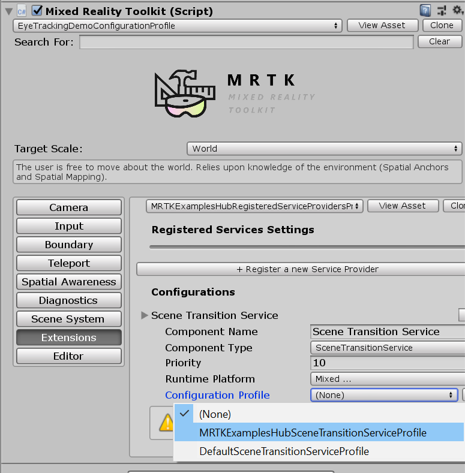

# Microsoft Mixed Reality Toolkit 2.6.0 release notes

- [What's new](#whats-new)
- [Breaking changes](#breaking-changes)
- [Updating guidance](Updating.md#upgrading-to-a-new-version-of-mrtk)
- [Known issues](#known-issues)

> [!IMPORTANT]
> There is a known compiler issue that impacts applications built for Microsoft HoloLens 2 using
> ARM64. This issue is addressed in the forthcoming 16.8 update for Visual Studio 2019. Until the 
> update is available, please import the `com.microsoft.mixedreality.toolkit.tools` package to apply 
> a workaround.

## What's new

## Breaking changes

## Known issues

### Some Mixed Reality Toolkit Standard Shader features require the Foundation package

When imported via the Unity Package Manager, the MRTK Standard Shader utilities scripts (ex: HoverLight.cs) are not co-located with the shader in the Standard Assets package. To access this functionality, applications will require the Foundation package to be imported.

### CameraCache may create a new camera on shutdown

In some situations (e.g. when using the LeapMotion provider in the Unity Editor), it is possible for the CameraCache to re-create the MainCamera on shutdown. Please see [this issue](https://github.com/microsoft/MixedRealityToolkit-Unity/issues/8459) for more information.

### FileNotFoundException when examples are imported via Unity Package Manager

Depending on the length of the project path, importing examples via Unity Package Manager may generate FileNotFoundException messages in the Unity Console. The
cause of this is the path to the "missing" file being longer than MAX_PATH (256 characters). To resolve, please shorten the length of the project path.

### No spatializer was specified. The application will not support Spatial Sound.

A "No spatializer was specified" warning will appear if an audio spatializer is not configured. This can occur if no XR package is installed, as Unity includes spatializers in these pacakges.

To resolve, please ensure that:

- **Window** > **Package Manager** has one or more XR packages installed
- **Mixed Reality Toolkit** > **Utilities** > **Configure Unity Project** and make a selection for **Audio Spatializer**

  

### NullReferenceException: Object reference not set to an instance of an object (SceneTransitionService.Initialize)

In some situations, opening `EyeTrackingDemo-00-RootScene` may cause a NullReferenceException in the Initialize method of the SceneTransitionService class.
This error is due to the Scene Transition Service's configuration profile being unset. To resolve, please use the following steps:

- Navigate to the `MixedRealityToolkit` object in the Hierarchy
- In the Inspector window, select `Extensions`
- If not expanded, expand `Scene Transition Service`
- Set the value of `Configuration Profile` to **MRTKExamplesHubSceneTransitionServiceProfile**

### Oculus Quest

There is currently a known issue for using the [Oculus XR plugin with when targeting Standalone platforms](https://forum.unity.com/threads/unable-to-start-oculus-xr-plugin.913883/).  Check the Oculus bug tracker/forums/release notes for updates.

The bug is signified with this set of 3 errors:

### UnityUI and TextMeshPro

There's a known issue for newer versions of TextMeshPro (1.5.0+ or 2.1.1+), where the default font size for dropdowns and bold font character spacing has been altered.

This can be worked around by downgrading to an earlier version of TextMeshPro. See [issue #8556](https://github.com/microsoft/MixedRealityToolkit-Unity/issues/8556)
for more details.
