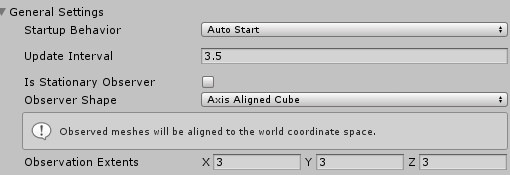
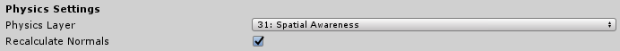
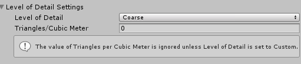
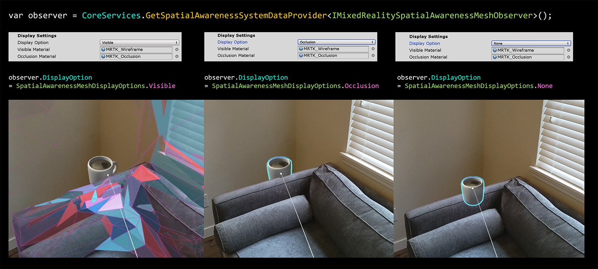

# Configuring mesh observers for device

This guide will walk through configuring the out-of-box Spatial Mesh Observer in MRTK which supports the Windows Mixed Reality platform (i.e HoloLens). The default implementation provided by the Mixed Reality Toolkit is the [WindowsMixedRealitySpatialMeshObserver](xref:Microsoft.MixedReality.Toolkit.WindowsMixedReality.SpatialAwareness.WindowsMixedRealitySpatialMeshObserver) class. Many of the properties in this article though apply for other [custom Observer implementations](CreateDataProvider.md).

## Profile settings

The following two items must be defined first when configuring a Spatial Mesh Observer profile for the [Spatial Awareness system](SpatialAwarenessGettingStarted.md).

1. The concrete observer type implementation
1. list of supported platform(s) to run this observer

> [!NOTE]
> All observers must extend the [IMixedRealitySpatialAwarenessObserver](xref:Microsoft.MixedReality.Toolkit.SpatialAwareness.IMixedRealitySpatialAwarenessObserver) interface.

### General settings

**Startup Behavior**

The startup behavior specifies whether the observer will begin running when first instantiated. The two options are:

* *Auto Start* - The default value whereby the observer will begin operation after initialization
* *Manual Start* - The Observer will wait to be directed to start

If using *Manual Start*, one must [resume and suspend them at runtime via code](UsageGuide.md#starting-and-stopping-mesh-observation).

**Update Interval**

The time, in seconds, between requests to the platform to update spatial mesh data. Typical values fall in the range of 0.1 and 5.0 seconds.

**Is Stationary Observer**

Indicates whether or not the observer is to remain stationary or to move and update with the user. If true, the *Observer Shape* with volume defined by *Observation Extents* will remain at the origin on startup. If false, the Observer space will follow the user's head as the shape's origin.

There will be no mesh data calculated for any physical area outside of the Observer space as defined by these properties: *Is Stationary Observer*, *Observer Shape**, and *Observation Extents*.

**Observer Shape**

The observer shape defines the type of volume that the mesh observer will use when observing meshes. The supported options are:

* *Axis Aligned Cube* - Rectangular shape that stays aligned with the axes of the world coordinate system, as determined at application startup.
* *User Aligned Cube* - Rectangular shape that rotates to align with the users local coordinate system.
* *Sphere* - A spherical volume with a center at the world space origin. The X value of the *Observation Extents* property will be used as the radius of the sphere.

**Observation Extents**

The observation extents define the distance from the observation point that meshes will be observed.

### Physics settings

**Physics Layer**

The physics layer on which spatial mesh objects will be placed in order to interact with the Unity Physics and RayCast systems.

> [!NOTE]
> The Mixed Reality Toolkit reserves *layer 31* by default for use by Spatial Awareness observers.

**Recalculate Normals**

Specifies whether or not the mesh observer will recalculate the normals of the mesh following observation. This setting is available to ensure applications receive meshes that contain valid normals data on platforms that do not return them with meshes.

### Level of detail settings

**Level of Detail**

Specifies the level of detail (LOD) of the spatial mesh data. Currently defined values are Coarse, Fine and Custom.

* *Coarse* - Places a smaller impact on application performance and is an excellent choice for navigation/plane finding.

* *Medium* - Balanced setting often useful for experiences that continually scan the environment for both large features, floors and walls, as well as occlusion details.

* *Fine* - Generally exacts a higher impact on application performance and is a great option for occlusion meshes.

* *Custom* - Requires the application to specify the *Triangles / Cubic Meter* property and allows applications to tune the accuracy vs. performance impact of the spatial mesh observer.

> [!NOTE]
> It is not guaranteed that all *Triangles/Cubic Meter* values are honored by all platforms. Experimentation and profiling is highly recommended when using a custom LOD.

**Triangles per Cubic Meter**

Valid when using the *Custom* setting for the **Level of Detail** property and specifies the triangle density for the spatial mesh.

### Display settings

**Display Option**

Specifies how spatial meshes are to be displayed by the observer. Supported values are:

* *None* - Observer will not render the mesh
* *Visible* - Mesh data will be visible using the *Visible Material*
* *Occlusion* - Mesh data will be occlude items in scene using the *Occlusion Material*

Spatial Observers can be [resumed/suspended at runtime via code.](UsageGuide.md#starting-and-stopping-mesh-observation)

> [!WARNING]
> Setting *Display Option* to *None* does **NOT** stop the observer from running. If you wish to stop all observers, applications will need to suspend all observers via [`CoreServices.SpatialAwareness.SuspendObservers()`](xref:Microsoft.MixedReality.Toolkit.SpatialAwareness.IMixedRealitySpatialAwarenessSystem.SuspendObservers)

**Visible Material**

Indicates the material to be used when visualizing the spatial mesh.

**Occlusion Material**

Indicates the material to be used to cause the spatial mesh to occlude holograms.

## See also

- [Spatial Awareness System](SpatialAwarenessGettingStarted.md)
- [Configuring Spatial Awareness system via Code](UsageGuide.md)
- [IMixedRealitySpatialAwarenessObserver API documentation](xref:Microsoft.MixedReality.Toolkit.SpatialAwareness.IMixedRealitySpatialAwarenessObserver)
- [IMixedRealitySpatialAwarenessMeshObserver API documentation](xref:Microsoft.MixedReality.Toolkit.SpatialAwareness.IMixedRealitySpatialAwarenessMeshObserver)
- [BaseSpatialObserver API documentation](xref:Microsoft.MixedReality.Toolkit.SpatialAwareness.BaseSpatialObserver)
