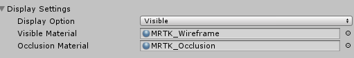

# Configuring the Spatial Awareness Mesh Observer

The spatial awareness mesh observer profile provides options for configuring:
- [General Settings](#general-settings)
- [Physics Settings](#physics-settings)
- [Level of Detail Settings](#level-of-detail-settings)
- [Display Settings](#display-settings)

## General Settings

### Startup Behavior

The startup behavior specifies the behavior of the observer when it is first instantiated. The options are Auto Start and Manual Start. When set to Manual Start, applications will need to call one of the following IMixedRealitySpatialAwarenessSystem methods:

- ResumeObserver<T>(string name)
- ResumeObservers()
- ResumeObservers<T>()

The default value is Auto Start.

### Update Interval

The time, in seconds, between requests to the platform to update spatial mesh data. Typical values fall in the range of 0.1 and 5.0 seconds. 

### Is Stationary Observer

Indicates whether or not the observer is to remain stationary or to move and update with the user.

> When stationary, if user moves further than the [Observation Extents](#observation-extents) away from the origin. In this instance, there would be no mesh data around the user until they moved closer to the origin.

### Observer Shape

The observer shape defines the type of volume that the mesh observer will use when observing meshes. The supported options are:

- [Axis Aligned Cube](#axis-aligned-cube)
- [User Aligned Cube](#user-aligned-cube)
- Sphere

#### Axis Aligned Cube

An axis aligned cube volume is a rectangular shape that stays aligned with the axes of the world coordinate system, as determined at application startup.

#### User Aligned Cube

A user aligned cube volume is a rectangular shape that rotates to align with the users local coordinate system.

### Observation Extents

The observation extents define the distance from the observation point that meshes will be observed. When the [Observer Shape](#observer-shape) is set to sphere, the X value of the extents will be used as the radius of the sphere.

## Physics Settings

### Physics Layer

The physics layer specifies which layer on which the spatial mesh objects will be placed in order to interact with the Unity Physics and RayCast systems. The Mixed Reality Toolkit reserves layer 31 by default for use by Spatial Awareness observers.

#### Recalculate Normals

Specifies whether or not the mesh observer will recalculate the normals of the mesh following observation. This setting is available to ensure applications receive meshes that contain valid normals data on platforms that do not return them with meshes. 

## Level of Detail Settings

### Level of Detail

Specifies the level of detail (LOD) of the spatial mesh data. Currently defined values are Coarse, Fine and Custom.

The Coarse LOD generally places a smaller impact on application performance and are an excellent choice for navigation and plane finding.

The Fine LOD generally exacts a higher performance impact on application performance and are a great option for occlusion meshes.

The Custom LOD requires the application to specify the [Triangles / Cubic Meter](#triangles-per-cubic-meter) value and allows applications to tune the accuracy vs. performance impact of the spatial mesh observer.

> Note: It is not guaranteed that all Triangles/Cubic Meter values are honored by all platforms. Experimentation and profiling is highly recommended when using a custom LOD. 

### Triangles per Cubic Meter

When using the custom [Level of Detail](#level-of-detail), specifies the requested value for the triangle density for the spatial mesh.

## Display Settings

*Mesh Observer Display Settings*

### Display Option

Specifies how spatial meshes are to be displayed by the observer. Supported values are None, Visible and Occlusion. Setting Visible or Occlusion instructs the observer to select the appropriate material. Specifying None causes the observer to not render the mesh.

> Note: Setting Display Option to None does _not_ stop the observer from running. If you wish to stop the observer, applications will need to call one of the following IMixedRealitySpatialAwarenessSystem methods:
> - SuspendObserver<T>(string name)
> - SuspendObservers()
> - SuspendObservers<T>()

### Visible Material

Indicates the material to be used when visualizing the spatial mesh.

### Occlusion Material

Indicates the material to be used to cause the spatial mesh to occlude holograms.

## See Also

- [IMixedRealitySpatialAwarenessObserver API documentation](xref:Microsoft.MixedReality.Toolkit.SpatialAwareness.IMixedRealitySpatialAwarenessObserver)
- [IMixedRealitySpatialAwarenessMeshObserver API documentation](xref:Microsoft.MixedReality.Toolkit.SpatialAwareness.IMixedRealitySpatialAwarenessMeshObserver)
- [BaseSpatialObserver API documentation](xref:Microsoft.MixedReality.Toolkit.SpatialAwareness.BaseSpatialObserver)
- [Spatial Awareness System](SpatialAwarenessGettingStarted.md)
- [Using Spatial Awareness in an Application](../TODO.md)