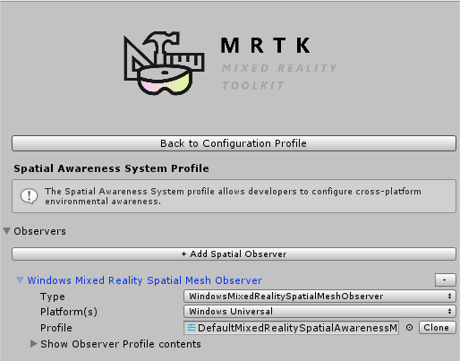
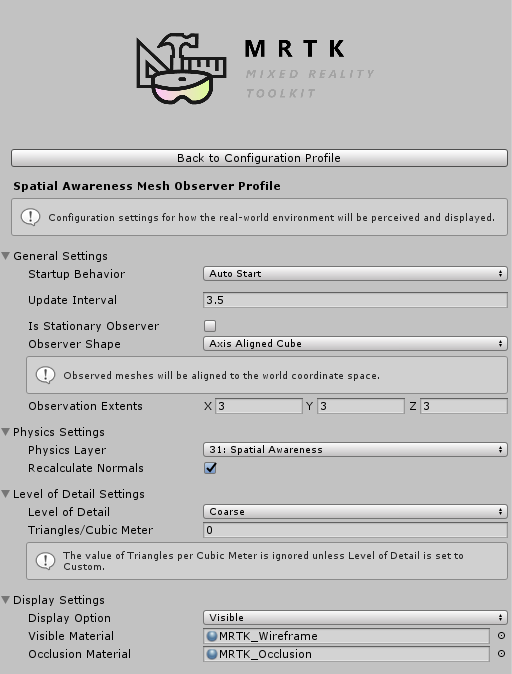

# Spatial Awareness

The Spatial Awareness system provides real-world environmental awareness in mixed reality 
applications. When introduced on Microsoft HoloLens, spatial awareness provided a collection 
of meshes, representing the geometry of the environment, which allowed for compelling interactions 
between holograms and the real-world.

## Getting Started

Adding support for spatial awareness requires two key components of the Mixed Reality Toolkit: the 
spatial awareness system and a supported platform provider.

1. [Enable](#enable-spatial-awareness) the spatial awareness system
2. [Register](#register-observers) and [configure](#configure-observers) one or more spatial observers
3. [Build and deploy](#build-and-deploy) to a platform that supports spatial awareness

### Enable Spatial Awareness

The spatial awareness system is managed by the MixedRealityToolkit object (or another 
[service registrar](xref:Microsoft.MixedReality.Toolkit.IMixedRealityServiceRegistrar) component). 

> The following steps presume use of the MixedRealityToolkit object. Steps required for other service registrars may be different.

1. Select the MixedRealityToolkit object in the scene hierarchy.

2. Navigate the Inspector panel to the Spatial Awareness System section and check Enable

3. Select the Spatial Awareness System implementation

> Users of the default profile (DefaultMixedRealityToolkitConfigurationProfile) will have the spatial awareness system pre-configured to use the MixedRealitySpatialAwarenessSystem from the Mixed Reality 
Toolkit Spatial Awareness Service package.

### Register observers

Before the spatial awareness system can provide applications with data about the real-world, at least 
one spatial observer must be registered. Spatial observers are generally platform specific components 
that may vary in the type(s) of data (ex: meshes) provided.

1. Open or expand the Spatial Awareness System profile

2. Click "Add Spatial Observer"
3. Select the Spatial Observer implementation

> Users of the default profile (DefaultMixedRealitSpatialAwarenessSystemProfile) will have the spatial awareness system pre-configured to use the WindowsMixedRealitySpatialMeshObserver from the Mixed Reality 
Toolkit Windows Mixed Reality Provider package.

#### Configure observers

Once the spatial observer(s) have been registered with the system, they can be configured to provide 
the desired data.

> When configuring a spatial observer, many implementations will auto-populate the observer's configuration profile with common default values.

1. Open or expand the Spatial Observer profile

2. Configure the desired options

The illustration in the previous step shows the configuration profile for a spatial mesh observer. 
Please see [Configuring the Spatial Awareness Mesh Observer](ConfiguringSpatialAwarenessMeshObserver.md) for more information pertaining to the specific 
settings available to mesh observers. Other observers may have similar settings.

### Build and Deploy

Once the spatial awareness system is configured with the desired observer(s), the project can be built 
and deployed to the target platform.

> Some platforms, including Microsoft HoloLens, provide support for remote execution from within Unity. 
This feature enables rapid development and testing without requiring the build and deploy step. Be sure 
to do final acceptance testing using a built and deployed version of the application, running on the target 
hardware and platform.

## See Also

- [Spatial Awareness API documentation](xref:Microsoft.MixedReality.Toolkit.SpatialAwareness)
- [Configuring the Spatial Awareness Mesh Observer](ConfiguringSpatialAwarenessMeshObserver.md)
- [Using Spatial Awareness in an Application](../TODO.md)

