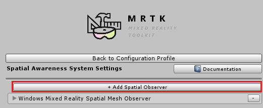
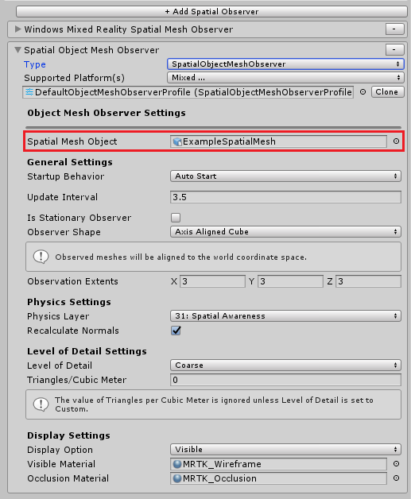

# Configuring mesh observers for the editor

A convenient way to provide environment mesh data in the Unity editor is to use the [`SpatialObjectMeshObserver`](xref:Microsoft.MixedReality.Toolkit.SpatialObjectMeshObserver.SpatialObjectMeshObserver) class. The *Spatial Object Mesh Observer* is an editor-only data provider for the [Spatial Awareness system](SpatialAwarenessGettingStarted.md) that enables importing 3D model data to represent a spatial mesh. One common use of the *Spatial Object Mesh Observer* is to import data scanned via a Microsoft HoloLens to test how an
experience adapts to different environments from within Unity.

## Getting started

This guide will walk through setting up a *Spatial Object Mesh Observer*. There are three key steps to enable this feature.

1. Add a *Spatial Object Mesh Observer* to the Spatial Awareness system profile
1. Set the Environment Mesh Data object
1. [Configure rest of the Mesh Observer profile properties](ConfiguringSpatialAwarenessMeshObserver.md)

### Set up a *spatial object mesh observer* profile

1. Select the desired *Mixed Reality Toolkit* configuration profile or select the *Mixed Reality Toolkit* object in scene
1. Open or expand the *Spatial Awareness System* tab
1. Click on *"Add Spatial Observer"* button

    

1. Select the *SpatialObjectMeshObserver* type

    

1. Select the desired *Spatial Mesh Object*. By default, the observer is configured with an example model. This model was created using a Microsoft HoloLens but it is possible to [create a new scan mesh object](#acquiring-environment-scans).
1. [Configure rest of the Mesh Observer profile properties](ConfiguringSpatialAwarenessMeshObserver.md)

    

### Spatial object mesh observer profile notes

Since the *Spatial Object Mesh Observer* loads data from a 3D model, it does not honor some of the standard mesh
observer settings which are outlined below.

**Update Interval**

The  *Spatial Object Mesh Observer* sends all meshes to an application when the model is loaded. It does not
simulate time deltas between updates. An application can re-receive the mesh events by calling [`myObserver.ClearObservation()`](xref:Microsoft.MixedReality.Toolkit.SpatialAwareness.IMixedRealitySpatialAwarenessObserver.ClearObservations) and [`myObserver.Resume()`](xref:Microsoft.MixedReality.Toolkit.SpatialAwareness.IMixedRealitySpatialAwarenessObserver.Resume).

**Is Stationary Observer**

The *Spatial Object Mesh Observer* considers all 3D mesh objects to be stationary and disregards origin.

**Observer Shape and Extents**

The  *Spatial Object Mesh Observer* sends the entire 3D mesh to the application. Observer shape and extents are not considered.

**Level of Detail and Triangles / Cubic Meter**

The Observer does not attempt to find 3D model LODs when sending the meshes to the application.

## Acquiring environment scans

This section outlines additional information to create and gather *Spatial Mesh Object* files for use with the *Spatial Object Mesh Observer*.

### Windows Device Portal

The [Windows Device Portal](https://docs.microsoft.com/windows/mixed-reality/using-the-windows-device-portal) can be used to download the spatial mesh, as a .obj file, from a Microsoft HoloLens device.

1. Scan by simply walking and viewing the desired environment with a HoloLens
1. Connect to the HoloLens using the Windows Device Portal
1. Navigate to the *3D View* page
1. Click the *Update* button under *Spatial Mapping* section
1. Click the *Save* button under *Spatial Mapping* section to save the obj file to PC

> [!NOTE]
> **HoloToolkit .room files**
>
> Many developers will have previously used HoloToolkit to scan environments and create .room files. The Mixed Reality Toolkit now supports importing these files as GameObjects in Unity and use them as *Spatial Mesh Objects* in the observer.

## See also

- [Profiles](../Profiles/Profiles.md)
- [Mixed Reality Toolkit Profile configuration guide](../MixedRealityConfigurationGuide.md)
- [Spatial Awareness Getting started](SpatialAwarenessGettingStarted.md)
- [Configuring Mesh Observers on Device](ConfiguringSpatialAwarenessMeshObserver.md)
- [Configuring Mesh Observers via code](UsageGuide.md)
- [Using the Windows Device Portal](https://docs.microsoft.com/windows/mixed-reality/using-the-windows-device-portal)
