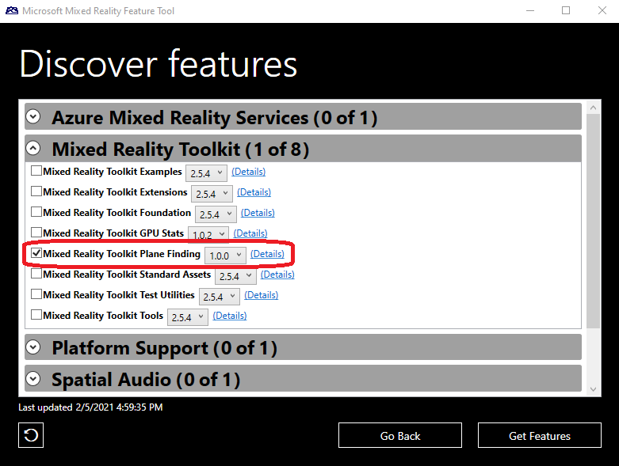
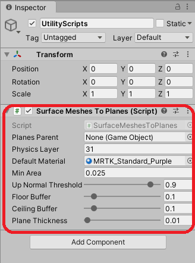

# SurfaceMeshesToPlanes

`SurfaceMeshesToPlanes.cs` is a new script that enables simple plane finding applications in MRTK. This script processes mesh data from the Spatial Awareness system and builds planes for Floors, Ceilings, Walls and Platforms in a scene. This script is fully compatible with HoloLens 1 and 2.

## Import PlaneFinding package

The `PlaneFinding.dll` is not included as part of the Mixed Reality Toolkit Foundation. To add the required components, please use the [Mixed Reality Feature Tool](https://docs.microsoft.com/windows/mixed-reality/develop/unity/welcome-to-mr-feature-tool) to import the Mixed Reality Toolkit Plane Finding package.

## Setup

Create a new Unity GameObject in your scene and attach the `SurfaceMeshesToPlanes.cs` script as a component.

## Example

To see an example of using `SurfaceMeshesToPlanes`, the Spatial Awareness demo scene (`Examples`/`Demos`/`SpatialAwareness`/`Scenes`/`SpatialAwarenessDemo.unity`) has added a voice command to display planes from the spatial mesh.

To enable the plane finding feature of the demo, please import the Mixed Reality Toolkit Plane Finding package, using the Mixed Reality Feature Tool. Once imported, the demo will enable the **Make Planes** voice command.

## See Also

- [Spatial awareness](SpatialAwarenessGettingStarted.md)
